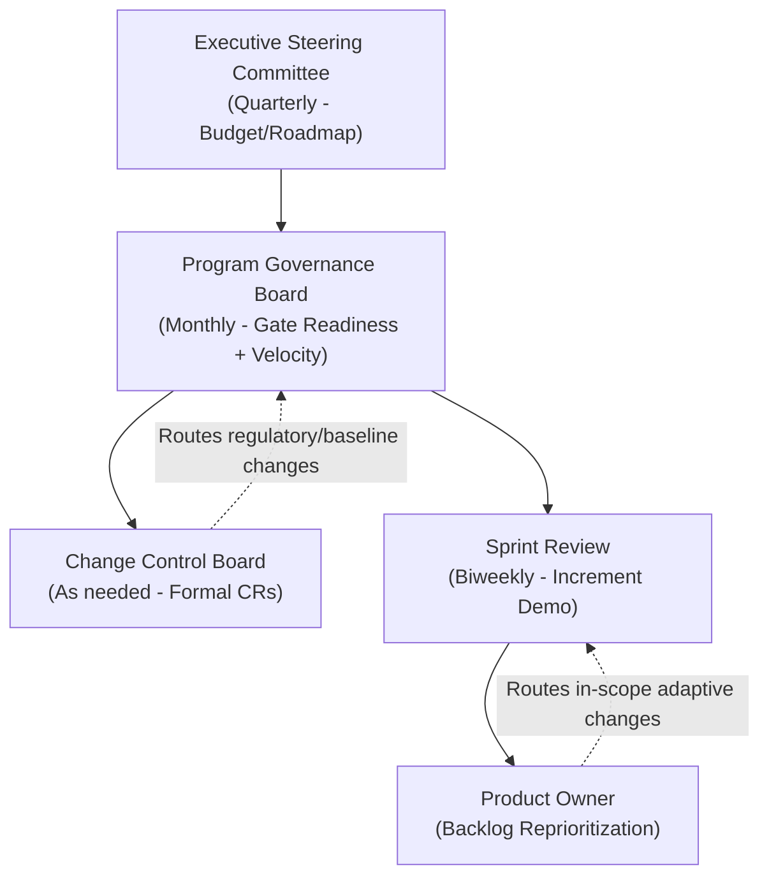

## Hybrid Governance Models

### Overview

Hybrid governance refers to the structures, decision rights, reporting mechanisms, and control processes used to oversee projects that blend predictive and adaptive delivery approaches. Because hybrid projects run predictive and adaptive components simultaneously, governance cannot rely purely on either traditional stage-gate oversight or purely on agile self-organization — it must integrate both, defining clearly which decisions are made where, by whom, and against what criteria.

Governance in this context spans three interlocking dimensions: **oversight structure** (who approves what), **reporting and information flow** (how progress is communicated upward and across), and **change control** (how scope, schedule, and cost changes are authorized).

### Governance Layers in Hybrid Projects

| Layer | Predictive Characteristics | Adaptive Characteristics | Hybrid Integration Point |
| --- | --- | --- | --- |
| **Portfolio/Executive** | Annual budgeting, capital approval, strategic roadmaps | Value-stream funding, incremental investment decisions | Executive steering committees reviewing both roadmap milestones and iterative delivery metrics |
| **Program/Project** | Phase gates, formal sign-offs, baseline schedules | Release planning, sprint/iteration reviews | Governance boards accepting both milestone completion and increment demos as evidence of progress |
| **Team/Delivery** | Detailed task-level Gantt tracking (if used) | Sprint backlogs, Kanban boards, Daily Scrums | Team-level tracking tools feeding both agile boards and predictive status reports |

### Steering Committee and Governance Board Design

**Key Points**

- **Composition**: Hybrid governance boards typically include both traditional project sponsors/executives (focused on budget, timeline, and business case) and product-side representation (Product Owners or similar, focused on value delivered and adaptive priorities).
- **Meeting cadence**: Often two-tiered — frequent, lightweight touchpoints aligned to sprint/iteration boundaries (for adaptive components) and less frequent, formal gate reviews aligned to major milestones (for predictive components).
- **Decision rights matrix**: A hybrid governance model should explicitly document which decisions require formal steering committee approval (e.g., budget increases, scope changes affecting fixed regulatory deliverables) versus which are delegated to the Product Owner or delivery team (e.g., backlog reprioritization within an agreed budget/scope envelope).
- **Escalation paths**: Distinguishing between issues that can be resolved at the team/Scrum Master level, those requiring program-level intervention, and those requiring executive/steering committee involvement — mirroring escalation patterns seen in frameworks like Scrum at Scale's Executive Action Team, but explicitly designed to also handle predictive-side escalations (e.g., vendor contract issues, capital budget overruns).

### Reporting Structures for Hybrid Projects

Hybrid governance typically requires **dual reporting streams** that are reconciled for a unified view:

- **Predictive-side reporting**: Percent-complete against baseline schedule, Earned Value Management metrics (Planned Value, Earned Value, Actual Cost, Schedule/Cost Performance Index), milestone/gate status.
- **Adaptive-side reporting**: Velocity trends, burndown/burnup charts, cycle time, cumulative flow diagrams, sprint/release burndown.
- **Reconciliation approaches**:
  - Mapping completed story points or features to overall project percent-complete, often via a "translation" formula agreed upon at project initiation (e.g., total scope expressed in story points, converted to a percent-complete based on story points delivered vs. total estimated).
  - Reporting predictive and adaptive metrics side-by-side in a single dashboard rather than forcing full reconciliation into one number, preserving the integrity of each metric type for its intended audience.
  - Using milestone-based "synthetic gates" within an agile delivery stream, where a milestone is marked complete once a defined set of increments/features has been accepted, bridging gate-based predictive reporting with incremental agile delivery.

### Change Control in Hybrid Governance

Because predictive and adaptive components handle change differently, hybrid governance must define **which change process applies to which type of change**:

- **Formal Change Request (CR) process** — typically retained for changes affecting: fixed regulatory/compliance deliverables, approved budget/schedule baselines, contractual scope commitments, and cross-project/program dependencies.
- **Backlog reprioritization** — used for changes within an agreed scope/budget envelope for adaptive work, handled by the Product Owner without requiring formal CR approval, as in standard Scrum backlog management.
- **Threshold-based routing** — many hybrid governance models define quantitative or qualitative thresholds (e.g., budget impact greater than a defined percentage, or any change affecting a regulatory deliverable) that automatically route a change into the formal CR process regardless of which component it originates from.

### Example: Hybrid Governance Structure for an Enterprise IT Program

**Example**

An enterprise IT program modernizing a claims-processing platform establishes the following governance structure:

- **Executive Steering Committee** meets quarterly, reviewing overall budget/schedule status (predictive) alongside a summary of delivered increments and customer satisfaction metrics (adaptive), with authority over budget changes exceeding 10%.
- **Program Governance Board** (program manager, lead Product Owner, delivery leads) meets monthly, reviewing phase-gate readiness for upcoming compliance milestones and release-level velocity/burndown trends; authority over scope trade-offs within the approved budget envelope.
- **Sprint Review** occurs every two weeks at the team level, where stakeholders see working increments directly; no formal governance approval is required here, as this is adaptive-level inspection and feedback, not a go/no-go decision point.
- A **Change Control Board (CCB)** convenes as needed for any change affecting the regulatory compliance deliverable set (a fixed, predictively-managed component), while backlog reprioritization for the customer-facing UI (adaptive component) is handled directly by the Product Owner without CCB involvement.

### Governance Roles Comparison

| Role | Predictive Responsibility | Adaptive Responsibility |
| --- | --- | --- |
| Project/Program Sponsor | Approves budget, business case, major scope changes | Reviews increment value delivered, participates in release planning |
| Project Manager / Program Manager | Maintains baseline schedule, manages formal CRs, tracks EVM | Coordinates cross-team dependencies, may facilitate Scrum-of-Scrums-style syncs |
| Product Owner | Provides input to business case and roadmap | Owns and prioritizes backlog, accepts completed work each sprint |
| Change Control Board | Approves formal change requests against baseline | Not typically involved in day-to-day backlog changes |

### Common Governance Pitfalls

- **Governance mismatch/friction** — applying full formal CR process to routine backlog reprioritization slows adaptive delivery unnecessarily; conversely, allowing regulatory deliverables to be reprioritized informally through a backlog risks compliance failures.
- **Reporting overload** — requiring teams to produce both full EVM reporting and full agile metrics without a clear reconciliation approach doubles reporting burden without adding proportional insight.
- **Unclear decision rights** — ambiguity about which body approves what (steering committee vs. Product Owner vs. Change Control Board) creates delays and conflict, especially when a change touches both predictive and adaptive components simultaneously.
- **Governance cadence mismatch** — quarterly steering committee reviews may be too infrequent to provide meaningful oversight of adaptive delivery risks that emerge and resolve within a two-week sprint, requiring an intermediate reporting layer.
- [Inference] Establishing a written decision-rights matrix and change-routing criteria at project initiation, rather than resolving ambiguity case-by-case as changes arise, likely reduces governance friction over the life of a hybrid project, though the degree of benefit depends on how well the matrix anticipates the actual types of changes the project will encounter.

### Diagram: Hybrid Governance Structure

### Related Topics

- Blending Predictive and Adaptive Approaches (foundational continuum concept)
- Earned Value Management (EVM) integration with agile metrics
- Change Control Board (CCB) design and operation
- Decision rights matrices (RACI/RAPID) for project governance
- Stage-gate / phase-gate models in hybrid contexts
- Portfolio governance for mixed-method project portfolios
- Escalation path design (team → program → executive)
- Cumulative flow diagrams and other adaptive reporting techniques