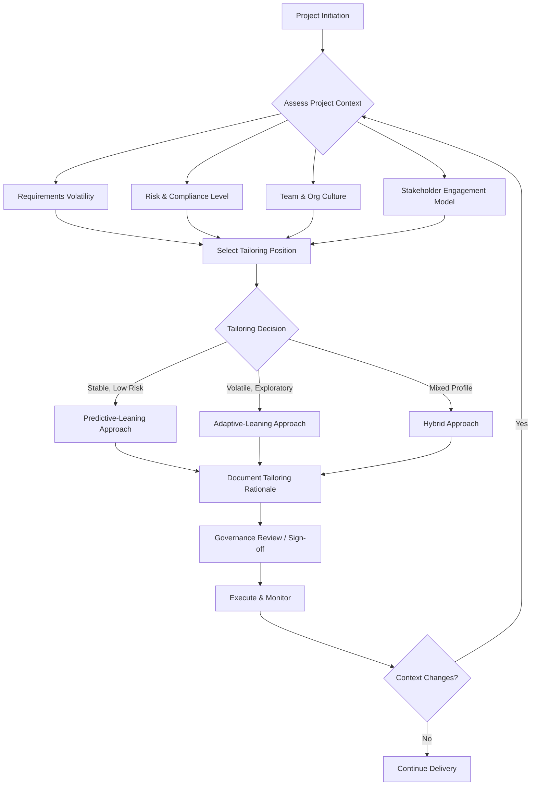

## Tailoring Frameworks to Project Context

### Definition

Tailoring is the deliberate, structured adaptation of a project management approach — its processes, tools, techniques, deliverables, ceremonies, and level of formality — to fit the specific characteristics of a project, its organization, and its environment. In hybrid project management, tailoring is the mechanism by which predictive (plan-driven) and adaptive (agile) elements are combined and calibrated rather than applied as rigid, off-the-shelf packages.

Tailoring is distinct from mere non-compliance. It is a conscious, justified decision-making process, typically documented, that answers the question: "Given this project's context, which parts of which framework(s) add value, and which parts should be scaled up, scaled down, or omitted?"

### Why Tailoring Matters

**Key Points**

- No single framework (Waterfall, Scrum, Kanban, PRINCE2, SAFe, etc.) is universally optimal; each embeds assumptions about requirements stability, team structure, governance needs, and risk tolerance.
- Over-application of process (excessive ceremony, documentation, or control for a low-risk, small project) wastes resources and slows delivery — a failure mode often called "process for process's sake."
- Under-application of process (too little governance or predictability for a high-risk, regulated, or large multi-team project) increases the likelihood of scope, schedule, or compliance failure.
- The PMBOK® Guide (7th Edition) elevates tailoring to a core principle, explicitly stating that project management approaches should be tailored based on context rather than applied uniformly. [Unverified: exact wording may vary by edition printing]

### Core Dimensions Along Which Frameworks Are Tailored

#### 1. Project Characteristics

- **Requirements volatility**: Stable, well-understood requirements favor predictive elements; volatile or emergent requirements favor adaptive elements.
- **Project size and duration**: Larger, longer projects often need more formal governance layers even within an agile core.
- **Complexity and novelty**: Novel technical domains benefit from iterative discovery (spikes, prototypes); well-understood domains tolerate detailed upfront planning.
- **Risk and safety profile**: Life-safety, financial-regulatory, or contractual-penalty contexts require more rigorous documentation, traceability, and approval gates.

#### 2. Team Characteristics

- Team size, co-location vs. distribution, experience level with agile or predictive methods, and cross-functional completeness all affect how much ceremony (e.g., daily standups, formal status reports) is sustainable and useful.

#### 3. Organizational Characteristics

- **Culture**: Command-and-control cultures may resist self-organizing teams; consensus-driven cultures may resist rigid top-down gates.
- **Governance and compliance requirements**: Regulated industries (pharmaceuticals, aerospace, finance) often mandate specific audit trails, stage-gate approvals, or documentation that must be layered onto any adaptive practice.
- **Organizational Process Assets (OPAs)** and **Enterprise Environmental Factors (EEFs)**: Existing templates, tools, and policies constrain what tailoring is feasible without additional organizational change effort.

#### 4. Stakeholder and Contract Characteristics

- Fixed-price contracts with a client unfamiliar with agile delivery may require predictive-style milestone billing wrapped around an internally agile delivery team — a common hybrid pattern.
- Stakeholder availability for frequent feedback (a prerequisite for agile effectiveness) may be limited, pushing the approach toward more predictive planning with periodic checkpoints instead of continuous engagement.

### Common Hybrid Tailoring Patterns

**Example**

| Pattern | Structure | Typical Use Case |
| --- | --- | --- |
| Predictive wrapper, agile core | Phase-gate structure (initiation, planning, execution, closure) governs overall milestones and budget approval; delivery teams inside each phase use Scrum or Kanban sprints | Large programs with external stakeholders needing predictable milestone reporting, but with software components benefiting from iterative delivery |
| Agile wrapper, predictive components | Product backlog and sprints drive most work, but specific deliverables (e.g., regulatory submission documents, hardware procurement) follow a linear, gated sub-process | Products combining software (fast-changing) with hardware or compliance artifacts (slow-changing) |
| Phased hybrid (Water-Scrum-Fall) | Requirements and design done predictively upfront; build phase uses Scrum sprints; final testing, deployment, and release follow a predictive, gated release process | Enterprise IT projects with legacy release management processes that cannot yet support continuous deployment |
| Risk-based tailoring | High-risk/high-uncertainty work packages managed adaptively (short iterations, frequent reprioritization); low-risk/well-understood work packages managed predictively (fixed scope, fixed schedule) | Programs with mixed component maturity, e.g., a new feature alongside a stable maintenance stream |

### A Structured Tailoring Process

#### Step 1: Assess Context

Use structured assessment tools rather than intuition alone:

- **PMI's tailoring questions** (from the PMBOK Guide's tailoring content and the Agile Practice Guide) prompt evaluation across dimensions like team size, criticality, industry, and organizational maturity.
- **Suitability filters**, such as those in the Agile Practice Guide's agile suitability filter tools, score a project on axes like culture, team, and project characteristics to indicate whether agile, predictive, or hybrid approaches fit best. [Inference: specific scoring thresholds vary by tool version and are not universally standardized]

#### Step 2: Select a Baseline Framework or Combination

Choose a dominant framework (e.g., Scrum for the delivery core) and identify which predictive elements must be layered in (e.g., a project charter, a stage-gate budget approval, a formal risk register) to satisfy governance needs.

#### Step 3: Tailor Specific Components

Common components subject to tailoring:

- **Ceremonies/meetings**: frequency and formality of standups, reviews, retrospectives, steering committee reviews.
- **Artifacts**: level of detail in requirements documents, whether a full WBS is produced or a lightweight backlog suffices.
- **Roles**: whether a formal Project Manager, Scrum Master, and Product Owner coexist, or roles are merged.
- **Cadence**: sprint length, release frequency, reporting periodicity.
- **Metrics**: earned value metrics (SPI, CPI) for predictive components; velocity, burn-down/burn-up for adaptive components.
- **Change control**: formal Change Control Board vs. backlog reprioritization by the Product Owner.

#### Step 4: Document and Validate

- Record tailoring decisions and their rationale, often in a **Project Management Plan** or a dedicated **Tailoring Log**, so decisions are auditable and revisitable.
- Validate with key stakeholders and governance bodies, especially where tailoring reduces standard controls (e.g., skipping a formal sign-off gate).

#### Step 5: Monitor and Re-Tailor

Tailoring is not a one-time decision. As the project progresses, context can shift (e.g., a stable component becomes volatile due to a new regulatory requirement), requiring the tailoring position to be revisited — reflected as the feedback loop in the diagram above.

### Frameworks With Built-In Tailoring Guidance

**Key Points**

- **PRINCE2**: Explicitly requires tailoring to project scale, complexity, importance, capability, and risk as one of its seven core principles; PRINCE2 project boards are expected to justify how the method's themes and processes were adapted. [Unverified: specific manual wording depends on edition]
- **PMBOK Guide 7th Edition**: Frames tailoring as a cross-cutting principle applied to the twelve project management principles and eight performance domains, rather than prescribing a single process flow.
- **Disciplined Agile (DA)**: Built around a "choose your way of working" (WoW) toolkit, offering decision tables and goal diagrams that explicitly guide teams through selecting practices based on context — arguably the framework most purpose-built for tailoring.
- **SAFe (Scaled Agile Framework)**: Offers configurations (Essential, Large Solution, Portfolio, Full) that are themselves a form of pre-packaged tailoring based on organizational scale.
- **Scrum Guide**: Explicitly minimalist; tailoring beyond its core roles/events/artifacts is expected but not prescribed, leaving hybridization patterns to be defined by the adopting organization.

### Risks and Anti-Patterns of Poor Tailoring

#### "Frankenstein" Hybrids

Combining framework elements without a coherent rationale — e.g., daily standups plus a full waterfall change control board plus ad hoc backlogs — can create more overhead than either pure approach, because teams must satisfy both sets of expectations without gaining either framework's core benefits.

#### Cargo-Culting

Adopting agile ceremonies (standups, sprints) without adopting the underlying principles (empowered teams, iterative value delivery, inspect-and-adapt) results in "ScrumFall" — agile terminology wrapped around fundamentally predictive, command-driven execution.

#### Governance Mismatch

Applying heavyweight predictive governance (e.g., formal change requests requiring multi-committee approval) to fast-moving, exploratory work strangles the adaptive benefits the team was meant to gain.

#### Under-Governance in High-Risk Contexts

Applying pure agile informality to safety-critical or heavily regulated deliverables can create compliance and audit failures; regulatory bodies typically expect traceable documentation regardless of delivery methodology. [Inference: specific regulatory requirements are domain- and jurisdiction-dependent]

### Illustrative Decision Framework (SVG)

<svg xmlns="http://www.w3.org/2000/svg" viewBox="0 0 800 480" font-family="Helvetica, Arial, sans-serif">
<text x="400" y="30" text-anchor="middle" font-size="18" font-weight="bold" fill="#1a1a1a">Tailoring Position Spectrum (svg_diagram)</text>

<line x1="80" y1="240" x2="720" y2="240" stroke="#333" stroke-width="2" />
<polygon points="720,240 705,232 705,248" fill="#333" />

<text x="120" y="270" font-size="13" fill="#333">Predictive</text>

<text x="640" y="270" font-size="13" fill="#333">Adaptive</text>

<rect x="80" y="180" width="180" height="40" fill="#c9dcf0" opacity="0.7" />
<rect x="260" y="180" width="280" height="40" fill="#d7e8d4" opacity="0.7" />
<rect x="540" y="180" width="180" height="40" fill="#f0dcc9" opacity="0.7" />

<text x="170" y="205" text-anchor="middle" font-size="12" fill="`#1a1a1a`">Stable Scope</text>

<text x="400" y="205" text-anchor="middle" font-size="12" fill="`#1a1a1a`">Hybrid Zone</text>

<text x="630" y="205" text-anchor="middle" font-size="12" fill="`#1a1a1a`">High Volatility</text>

<circle cx="170" cy="240" r="7" fill="#2c5c9e" />
<text x="170" y="330" text-anchor="middle" font-size="11" fill="#1a1a1a">Fixed-price</text>
<text x="170" y="345" text-anchor="middle" font-size="11" fill="#1a1a1a">construction</text>
<circle cx="400" cy="240" r="7" fill="#4a8a44" />
<text x="400" y="330" text-anchor="middle" font-size="11" fill="#1a1a1a">Enterprise IT</text>
<text x="400" y="345" text-anchor="middle" font-size="11" fill="#1a1a1a">platform build</text>
<circle cx="630" cy="240" r="7" fill="#c07a2c" />
<text x="630" y="330" text-anchor="middle" font-size="11" fill="#1a1a1a">Early-stage</text>
<text x="630" y="345" text-anchor="middle" font-size="11" fill="#1a1a1a">product discovery</text>

<line x1="170" y1="240" x2="170" y2="315" stroke="#2c5c9e" stroke-width="1" stroke-dasharray="3,3" />
<line x1="400" y1="240" x2="400" y2="315" stroke="#4a8a44" stroke-width="1" stroke-dasharray="3,3" />
<line x1="630" y1="240" x2="630" y2="315" stroke="#c07a2c" stroke-width="1" stroke-dasharray="3,3" />

<text x="400" y="410" text-anchor="middle" font-size="12" fill="#555">Tailoring is not binary — it is a position along a continuum, per work package, revisited over time.</text>

</svg>

### Practical Checklist for Applying Tailoring

**Next Steps**

- Assess requirements volatility, risk profile, and stakeholder engagement capacity before selecting a baseline framework.
- Identify regulatory, contractual, or organizational governance requirements that must be preserved regardless of methodology.
- Select a dominant framework and explicitly list which components (roles, ceremonies, artifacts, metrics) will be added, removed, or modified.
- Document tailoring rationale in the project management plan or a tailoring log for auditability.
- Pilot the tailored approach on a subset of work if feasible before full rollout.
- Establish a cadence (e.g., each retrospective or phase gate) to revisit whether the tailoring position still fits the evolving context.
- Train the team and stakeholders explicitly on what has been changed from "textbook" framework guidance and why.

**Related Topics**

- Water-Scrum-Fall and other named hybrid delivery models
- PMI Agile Practice Guide suitability filters and tailoring tools
- Disciplined Agile's "Choose Your WoW" decision framework
- Governance design in hybrid programs (steering committees, change control boards)
- Earned Value Management (EVM) integration with agile velocity metrics
- Organizational Process Assets and their influence on tailoring latitude
- Scaling frameworks (SAFe, LeSS, Nexus) as pre-tailored hybrid patterns
- Risk-based work package classification for mixed predictive/adaptive portfolios