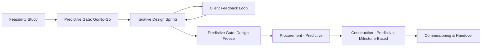

## Common Hybrid Patterns by Industry

### Definition

Common hybrid patterns by industry refers to the recurring, empirically observed ways that organizations in specific sectors combine predictive and adaptive project management elements to fit the constraints particular to that sector — regulatory regimes, capital intensity, safety criticality, contract structures, and the physical vs. digital nature of deliverables. While the general tailoring principles are sector-agnostic, the *specific shape* a hybrid takes (which components stay predictive, which become adaptive, and where the boundary sits) is heavily conditioned by industry norms.

### Why Hybrid Patterns Cluster by Industry

**Key Points**

- Regulatory and contractual environments vary enormously in how much documentation, traceability, and sign-off is mandated, which fixes a "predictive floor" beneath which a project cannot go.
- The proportion of physical vs. digital deliverables affects how much iterative change is economically feasible — a database schema is cheap to iterate on, a poured concrete foundation is not.
- Capital intensity and reversibility of decisions shape risk tolerance: low-reversibility, high-capital decisions favor upfront predictive planning; low-cost, reversible decisions favor adaptive experimentation.
- Talent pool familiarity with agile practices differs by sector, affecting how much cultural change is required to adopt adaptive elements.

### IT and Software Development

#### Pattern: Water-Scrum-Fall

- **Predictive front-end**: enterprise architecture review, high-level requirements, budget approval, vendor contracting.
- **Adaptive middle**: Scrum or Kanban sprints for feature development, with a product backlog and iterative releases.
- **Predictive back-end**: formal UAT (User Acceptance Testing), change advisory board (CAB) approval, and scheduled release windows, especially in enterprises with ITIL-based change management.
- **Rationale**: Enterprise IT departments often retain legacy release management and governance processes (e.g., mandated CAB sign-off) that cannot be replaced overnight, even as development teams adopt agile practices internally.

#### Pattern: Agile Core with Compliance Overlay

- Common in fintech and healthtech: sprints drive feature work, but specific artifacts (security review documentation, SOC 2 or HIPAA compliance evidence) follow a fixed, gated sub-process attached to each release.

### Construction and Engineering

#### Pattern: Predictive Structure, Adaptive Design/Procurement Sub-Processes

- **Predictive core**: overall project follows a stage-gated lifecycle (feasibility, design, permitting, procurement, construction, commissioning) because physical construction is largely irreversible, capital-intensive, and safety-regulated.
- **Adaptive pockets**: architectural and interior design phases increasingly use iterative client feedback loops (rapid prototyping via BIM models, short review cycles) before designs are locked and frozen for construction.
- **Design-Build and Integrated Project Delivery (IPD)** models blend traditionally sequential design and construction phases into more overlapping, collaborative arrangements, which is itself a hybridization of the classic predictive stage-gate.

### Pharmaceutical and Life Sciences

#### Pattern: Regulatory Stage-Gate with Adaptive R&D Exploration

- **Predictive skeleton**: mandated by regulatory bodies (e.g., FDA, EMA) — preclinical, Phase I/II/III trials, submission, and approval follow strict, largely non-negotiable sequential gates with heavy documentation and audit trail requirements. [Unverified: exact phase requirements vary by jurisdiction, drug class, and regulatory pathway]
- **Adaptive core**: within early-stage R&D and drug discovery, iterative experimentation, rapid hypothesis testing, and short feedback cycles (e.g., high-throughput screening iterations) resemble agile discovery work.
- **Adaptive trial designs**: some clinical trials use adaptive trial design methodologies, allowing pre-specified modifications (sample size, dosage arms) based on interim data, which represents an emerging adaptive practice embedded within an otherwise strictly predictive regulatory framework. [Inference: adoption levels vary significantly by regulatory jurisdiction and therapeutic area]

### Aerospace and Defense

#### Pattern: Systems Engineering V-Model with Agile Software Sub-Teams

- **Predictive backbone**: overall program follows systems engineering lifecycle models (often V-model or waterfall-derived) due to extreme safety criticality, long lead times for hardware, and contractual milestone-based government funding (e.g., Earned Value Management is frequently contractually mandated).
- **Adaptive pockets**: embedded software and avionics teams increasingly use Scrum or SAFe within the constraints of the larger predictive program structure, syncing sprint outputs to formal program milestones and configuration control boards.
- **SAFe adoption**: large defense and aerospace programs have adopted SAFe specifically because it provides a scaled structure (Program Increments, ARTs) that can interface with traditional program management milestones while allowing agile teams to operate underneath.

### Financial Services and Banking

#### Pattern: Agile Delivery with Regulatory and Risk Gating

- **Adaptive core**: digital banking, trading platform, and customer-facing feature teams commonly run Scrum or Kanban.
- **Predictive overlay**: model risk management, regulatory capital calculations, and audit-sensitive systems (e.g., anti-money laundering, core ledger changes) require formal change control, independent validation, and sign-off before release, layered on top of the sprint cadence.
- **Common friction point**: sprint-based delivery cadence (e.g., two-week sprints) often does not align cleanly with quarterly or annual regulatory reporting or model validation cycles, requiring an explicit "release train" that bundles several sprints' output into a single, formally validated release.

### Manufacturing

#### Pattern: Lean/Predictive Production with Agile Product Development

- **Predictive production**: manufacturing execution itself (production scheduling, supply chain, quality control) typically follows Lean and Six Sigma predictive optimization principles, since physical production lines have high change costs.
- **Adaptive product development**: new product introduction (NPI) teams increasingly borrow agile practices (short design sprints, rapid prototyping, iterative customer testing) before designs are frozen and handed to predictive production planning.
- **Hybrid handoff point**: the "design freeze" milestone functions as the boundary where adaptive iteration stops and predictive execution (tooling, supply chain commitments) begins — analogous to the construction industry's design-freeze gate.

### Government and Public Sector

#### Pattern: Predictive Procurement with Agile Delivery Contracts

- **Predictive procurement layer**: public sector procurement regulations typically require fixed-scope RFPs, competitive bidding, and milestone-based contracts, which are structurally predictive.
- **Adaptive delivery layer**: once awarded, some governments (e.g., through digital service frameworks like the U.S. Digital Services Playbook or UK Government Digital Service standards) mandate or encourage agile delivery practices within the contract, requiring vendors to demonstrate iterative delivery, user research, and sprint-based reporting even though the contract itself is fixed-price and fixed-scope.
- **Tension**: fixed-price contracts inherently resist the scope flexibility that makes agile effective, so many government hybrids use fixed budget/fixed team ("time and materials capped") structures with agile backlogs to reconcile procurement law with iterative delivery.

### Comparative Summary Table

**Example**

| Industry | Predictive Element(s) | Adaptive Element(s) | Primary Driver of Hybridization |
| --- | --- | --- | --- |
| IT/Software | Release gates, CAB approval, UAT | Sprints, backlog, iterative releases | Legacy governance vs. need for speed |
| Construction | Stage-gates, permitting, procurement | Design iteration, IPD collaboration | Physical irreversibility vs. client feedback needs |
| Pharma/Life Sciences | Regulatory trial phases, submission gates | Early R&D discovery cycles, adaptive trial designs | Regulatory mandate vs. scientific uncertainty |
| Aerospace/Defense | V-model systems engineering, EVM | Embedded software Scrum/SAFe teams | Safety/contract milestones vs. software complexity |
| Financial Services | Model risk validation, compliance sign-off | Sprint-based feature delivery | Regulatory risk vs. competitive delivery speed |
| Manufacturing | Production scheduling, Lean/Six Sigma | NPI design sprints, rapid prototyping | Production change cost vs. innovation speed |
| Government | Fixed-scope procurement, RFP milestones | Agile delivery frameworks, sprint reporting | Procurement law vs. digital service modernization |

### Cross-Industry Structural Commonality

Despite surface differences, most industry hybrids share a common structural logic, illustrated below: a predictive "shell" governs milestones, funding, and compliance, while an adaptive "core" governs the actual work content within each milestone window.

<svg xmlns="http://www.w3.org/2000/svg" viewBox="0 0 760 420" font-family="Helvetica, Arial, sans-serif">
<text x="380" y="30" text-anchor="middle" font-size="18" font-weight="bold" fill="#1a1a1a">Predictive Shell / Adaptive Core Pattern (svg_diagram)</text>

<rect x="60" y="70" width="640" height="300" rx="14" fill="none" stroke="#2c5c9e" stroke-width="3" />
<text x="80" y="95" font-size="13" fill="#2c5c9e" font-weight="bold">Predictive Shell: Milestones, Budget, Compliance, Governance Gates</text>

<line x1="220" y1="70" x2="220" y2="370" stroke="#2c5c9e" stroke-width="2" stroke-dasharray="6,4" />
<line x1="540" y1="70" x2="540" y2="370" stroke="#2c5c9e" stroke-width="2" stroke-dasharray="6,4" />
<text x="140" y="360" text-anchor="middle" font-size="11" fill="#2c5c9e">Gate 0</text>
<text x="380" y="360" text-anchor="middle" font-size="11" fill="#2c5c9e">Gate 1</text>
<text x="620" y="360" text-anchor="middle" font-size="11" fill="#2c5c9e">Gate 2</text>

<rect x="250" y="130" width="260" height="180" rx="10" fill="#d7e8d4" opacity="0.8" stroke="#4a8a44" stroke-width="2" />
<text x="380" y="155" text-anchor="middle" font-size="13" font-weight="bold" fill="#2f5c2a">Adaptive Core</text>
<text x="380" y="180" text-anchor="middle" font-size="11" fill="#2f5c2a">Sprints / Iterations</text>
<text x="380" y="200" text-anchor="middle" font-size="11" fill="#2f5c2a">Backlog Reprioritization</text>
<text x="380" y="220" text-anchor="middle" font-size="11" fill="#2f5c2a">Frequent Feedback Loops</text>

<path d="M 300 260 A 40 40 0 1 0 300 280" stroke="#4a8a44" stroke-width="2" fill="none" marker-end="url(#arrow)" />
<text x="380" y="400" text-anchor="middle" font-size="12" fill="#555">The shell fixes what industry compliance requires; the core fixes how the work gets done day to day.</text>

</svg>

### Selection Guidance by Context

**Next Steps**

- When advising or designing a hybrid for a given industry, first identify the sector's non-negotiable predictive floor (regulatory, contractual, or safety-driven) before deciding where adaptive practices can be layered in.
- Map the physical-vs-digital ratio of deliverables: the higher the physical/irreversible component, the earlier the "design freeze" boundary should sit.
- Identify the industry's dominant scaling framework (e.g., SAFe in aerospace/defense, Water-Scrum-Fall in enterprise IT) as a starting reference rather than designing from scratch.
- Watch for cadence mismatches between sprint-based delivery and industry-standard reporting cycles (regulatory, fiscal, or audit periods), and design a release-train or batching mechanism to reconcile them.

**Related Topics**

- Water-Scrum-Fall as a named enterprise IT hybrid model
- Design-Build and Integrated Project Delivery (IPD) in construction
- Adaptive clinical trial design methodologies
- SAFe Program Increments in regulated/defense contexts
- Model risk management and agile release trains in banking
- Fixed-price vs. time-and-materials contracting in agile government procurement
- Design freeze and NPI (New Product Introduction) handoff points in manufacturing