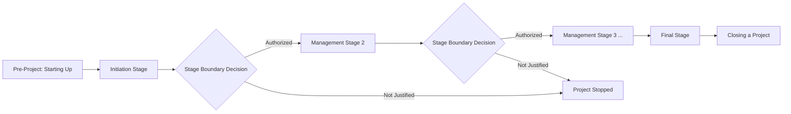

## PRINCE2 Principles

### Definition

The PRINCE2 (PRojects IN Controlled Environments) principles are the seven foundational obligations that underpin every PRINCE2 project. They are described in the PRINCE2 manual as universal, self-validating, and empowering — meaning they apply to every project regardless of scale or environment, are proven through decades of project experience, and give practitioners confidence to shape how the method is applied. A project is only considered a genuine PRINCE2 project if it adheres to all seven principles; picking and choosing which principles to follow is explicitly discouraged, in contrast to the themes and processes, which are meant to be tailored.

### The Seven Principles

#### 1. Continued Business Justification

**Key Points**

- Every PRINCE2 project must have a justifiable reason to start, and that justification must remain valid throughout the project's life.
- This is documented and maintained in the **Business Case**, which is reviewed at each stage boundary and whenever a significant deviation occurs.
- If at any point the business justification is no longer valid — for example, projected benefits no longer outweigh cost and risk — the project should be stopped or redirected, regardless of how much work has already been invested (avoiding the sunk-cost fallacy).
- Responsibility for maintaining the Business Case typically sits with the Executive role on the Project Board.

#### 2. Learn from Experience

**Key Points**

- PRINCE2 projects must actively seek, record, and act on lessons — from previous projects, throughout the current project, and passing lessons onward to future projects.
- At project start, teams should review lessons logged from comparable past projects. During execution, a **Lessons Log** captures issues and useful insights as they happen. At closure, a **Lessons Report** consolidates learning for future use.
- This principle counters organizational tendencies to repeat avoidable mistakes because knowledge was never captured or was captured but never consulted.

#### 3. Defined Roles and Responsibilities

**Key Points**

- A PRINCE2 project must have a clearly defined and agreed organizational structure that engages business, user, and supplier stakeholder interests.
- This is realized primarily through the **Project Board** (Executive, Senior User, Senior Supplier) and the **Project Manager**, **Team Manager(s)**, and **Project Assurance** roles.
- Every role has explicit accountability; ambiguity about who decides what is treated as a project risk in itself.
- Roles are distinct from job titles — one person may hold multiple PRINCE2 roles (except where independence is required, such as Project Assurance being independent of the Project Manager), and roles can be shared among several people if a single role's workload is too large for one person.

#### 4. Manage by Stages

**Key Points**

- PRINCE2 projects are planned, monitored, and controlled on a stage-by-stage basis, dividing the project into **management stages**, each ending in a decision point (a stage boundary).
- At the end of each stage, the Project Board reviews progress, the current Business Case, and the plan for the next stage before authorizing continuation — this is the practical mechanism through which "Continued Business Justification" is enforced at defined checkpoints.
- The number and length of stages is tailored to the level of risk and uncertainty: higher-risk or longer projects typically have more, shorter stages to increase control frequency; well-understood, lower-risk projects can use fewer, longer stages.
- This principle gives the Project Board go/no-go authority without requiring them to manage day-to-day project activity, which remains delegated to the Project Manager within each stage.

#### 5. Manage by Exception

**Key Points**

- PRINCE2 establishes **tolerances** for each of six performance targets — time, cost, quality, scope, risk, and benefits — at each management level (Corporate/Programme, Project Board, Project Manager, Team Manager).
- As long as work remains within the agreed tolerance, the higher management level does not need to be involved, which reduces unnecessary oversight meetings and empowers lower levels to manage day-to-day work autonomously.
- If a tolerance is forecast to be exceeded, this is raised as an **exception**, typically documented in an **Exception Report**, escalated to the next management level for a decision.
- This principle is the core mechanism that makes PRINCE2 efficient for senior management: the Project Board's attention is reserved for genuine deviations rather than routine progress updates.

#### 6. Focus on Products

**Key Points**

- PRINCE2 is fundamentally output/product-oriented rather than activity-oriented: the project's purpose is to deliver a defined set of products (deliverables) that meet quality expectations, not simply to complete a schedule of tasks.
- This is operationalized through **Product Descriptions**, which specify purpose, composition, derivation, format, and quality criteria for each product, and the **Product Breakdown Structure (PBS)**, which decomposes the overall deliverable into its constituent products.
- Planning in PRINCE2 (via **Product-Based Planning**) starts from identifying what products are needed, then works backward to determine the activities, resources, and dependencies required to create them — this is a deliberate contrast to activity-first planning approaches.
- Clear product focus reduces scope ambiguity and provides an objective basis for quality review and acceptance.

#### 7. Tailor to Suit the Project

**Key Points**

- PRINCE2 must be adapted to the project's environment, size, complexity, importance, capability, and risk — the method explicitly warns against "PRINCE2 by the book" applied identically regardless of context.
- Tailoring applies to the **themes, processes, and management products** (e.g., a small internal project might combine several PRINCE2 documents into one lightweight artifact, while a large regulated program might expand documentation and formality).
- Tailoring decisions should be documented, typically within the **Project Initiation Documentation (PID)**, so that the project's approach and rationale for deviating from default guidance is transparent and auditable.
- This principle is what allows PRINCE2 to function as a genuine hybrid-compatible framework: predictive at its governance core (stages, tolerances, business case) but adaptable in how its themes and processes are implemented, which can include embedding agile delivery techniques within PRINCE2's stage and control structure (formalized further in the **PRINCE2 Agile** extension).

### How the Principles Interrelate

**Example**

| Principle | Primarily Answers | Key Supporting Mechanism |
| --- | --- | --- |
| Continued Business Justification | "Why are we still doing this?" | Business Case |
| Learn from Experience | "What do we know from before, and what are we learning now?" | Lessons Log / Lessons Report |
| Defined Roles and Responsibilities | "Who decides, who does, who checks?" | Project Board, Project Manager, Project Assurance |
| Manage by Stages | "When do we formally check in?" | Stage boundaries |
| Manage by Exception | "When does senior management need to get involved?" | Tolerances, Exception Reports |
| Focus on Products | "What exactly are we delivering?" | Product Descriptions, PBS |
| Tailor to Suit the Project | "How much process do we actually need here?" | PID tailoring rationale |

The principles are mutually reinforcing rather than independent: for instance, Manage by Stages provides the checkpoints at which Continued Business Justification is formally re-evaluated, and Manage by Exception determines what triggers an out-of-cycle re-evaluation between those checkpoints. Focus on Products gives the Business Case and stage plans an objective basis (deliverables and quality criteria) rather than vague activity descriptions.

### Governance Relationship Diagram (SVG)

<svg viewBox="0 0 780 460" xmlns="http://www.w3.org/2000/svg" font-family="Helvetica, Arial, sans-serif">
<text x="390" y="28" text-anchor="middle" font-size="18" font-weight="bold" fill="#1a1a1a">PRINCE2 Principles Interrelationship (svg_diagram)</text>
<!-- Central hub -->
<circle cx="390" cy="230" r="70" fill="#2c5c9e" opacity="0.9"/>
<text x="390" y="225" text-anchor="middle" font-size="13" fill="white" font-weight="bold">Continued</text>
<text x="390" y="242" text-anchor="middle" font-size="13" fill="white" font-weight="bold">Business</text>
<text x="390" y="259" text-anchor="middle" font-size="13" fill="white" font-weight="bold">Justification</text>
<!-- surrounding principles -->
<g>
<circle cx="150" cy="100" r="60" fill="#4a8a44" opacity="0.85"/>
<text x="150" y="95" text-anchor="middle" font-size="11" fill="white" font-weight="bold">Defined Roles &</text>
<text x="150" y="110" text-anchor="middle" font-size="11" fill="white" font-weight="bold">Responsibilities</text>
</g>
<g>
<circle cx="630" cy="100" r="60" fill="#4a8a44" opacity="0.85"/>
<text x="630" y="95" text-anchor="middle" font-size="11" fill="white" font-weight="bold">Manage by</text>
<text x="630" y="110" text-anchor="middle" font-size="11" fill="white" font-weight="bold">Stages</text>
</g>
<g>
<circle cx="120" cy="330" r="60" fill="#c07a2c" opacity="0.85"/>
<text x="120" y="325" text-anchor="middle" font-size="11" fill="white" font-weight="bold">Learn from</text>
<text x="120" y="340" text-anchor="middle" font-size="11" fill="white" font-weight="bold">Experience</text>
</g>
<g>
<circle cx="660" cy="330" r="60" fill="#c07a2c" opacity="0.85"/>
<text x="660" y="325" text-anchor="middle" font-size="11" fill="white" font-weight="bold">Manage by</text>
<text x="660" y="340" text-anchor="middle" font-size="11" fill="white" font-weight="bold">Exception</text>
</g>
<g>
<circle cx="270" cy="420" r="55" fill="#8a4ac0" opacity="0.85"/>
<text x="270" y="415" text-anchor="middle" font-size="11" fill="white" font-weight="bold">Focus on</text>
<text x="270" y="430" text-anchor="middle" font-size="11" fill="white" font-weight="bold">Products</text>
</g>
<g>
<circle cx="510" cy="420" r="55" fill="#8a4ac0" opacity="0.85"/>
<text x="510" y="415" text-anchor="middle" font-size="11" fill="white" font-weight="bold">Tailor to Suit</text>
<text x="510" y="430" text-anchor="middle" font-size="11" fill="white" font-weight="bold">the Project</text>
</g>
<!-- connecting lines -->
<line x1="200" y1="140" x2="340" y2="200" stroke="#999" stroke-width="1.5"/>
<line x1="580" y1="140" x2="440" y2="200" stroke="#999" stroke-width="1.5"/>
<line x1="170" y1="280" x2="330" y2="255" stroke="#999" stroke-width="1.5"/>
<line x1="610" y1="280" x2="450" y2="255" stroke="#999" stroke-width="1.5"/>
<line x1="310" y1="380" x2="360" y2="290" stroke="#999" stroke-width="1.5"/>
<line x1="470" y1="380" x2="420" y2="290" stroke="#999" stroke-width="1.5"/>
</svg>

### Common Misapplications

**Key Points**

- Treating principles as optional or negotiable — PRINCE2 explicitly states all seven must be present; a project missing one or more is "PRINCE2-informed" at best, not a compliant PRINCE2 project. [Unverified: exact certification/compliance terminology may differ across PeopleCert materials and manual editions]
- Confusing principles with themes: principles are *why* the method behaves as it does; themes (e.g., Business Case, Organization, Plans) are the *knowledge areas* through which principles are applied in practice.
- Over-tailoring to the point of removing genuine control (e.g., eliminating stage boundaries entirely) violates Manage by Stages even while nominally invoking the Tailor to Suit the Project principle — tailoring the *degree* of formality is legitimate; removing the underlying control mechanism is not.

### Practical Application Checklist

**Next Steps**

- Confirm a valid, current Business Case exists before initiation and at every stage boundary.
- Establish a Lessons Log at project start and review comparable past-project lessons before planning.
- Populate the Project Board with distinct Executive, Senior User, and Senior Supplier representation, and assign Project Assurance independently of the Project Manager.
- Define management stage boundaries proportional to project risk and duration.
- Set explicit tolerances (time, cost, quality, scope, risk, benefits) at each management level before delegating work.
- Build a Product Breakdown Structure and Product Descriptions before detailed activity planning.
- Document tailoring decisions and rationale explicitly within the PID.

**Related Topics**

- PRINCE2 Themes (Business Case, Organization, Quality, Plans, Risk, Change, Progress)
- PRINCE2 Processes (Starting Up a Project through Closing a Project)
- Project Board roles and Project Assurance independence
- Product-Based Planning and Product Breakdown Structures
- Exception Reports and tolerance-setting techniques
- PRINCE2 Agile as a formal hybrid extension
- Stage boundary management and end-stage reports