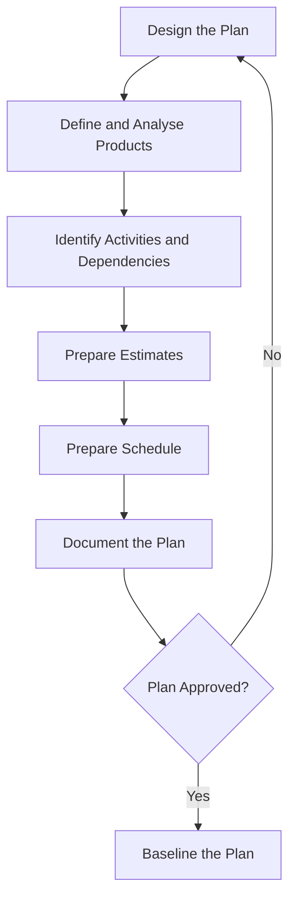

## PRINCE2 Themes


### Definition

The PRINCE2 themes are the seven knowledge areas that describe aspects of project management that must be continually addressed throughout the project lifecycle. Where the principles establish *why* PRINCE2 behaves as it does and the processes describe *when* and *in what sequence* activities occur, the themes describe *what* must be considered and managed at every point — providing the specific guidance, techniques, and management products needed to apply the principles in practice.

Each theme has a defined purpose statement in the PRINCE2 manual, and each is meant to be tailored in depth and formality according to the project's scale, complexity, and risk, per the Tailor to Suit the Project principle.

### The Seven Themes

#### 1. Business Case

**Key Points**

- Purpose: to establish mechanisms to judge whether the project is (and remains) desirable, viable, and achievable as a means to support decision-making in its (continued) investment.
- Directly operationalizes the Continued Business Justification principle.
- Core management product: the **Business Case**, which typically documents the reasons for the project, business options considered, expected benefits and dis-benefits, timescale, costs, investment appraisal, and major risks.
- Distinguishes between the **Outline Business Case** (developed during Starting Up a Project) and the **Detailed Business Case** (refined during Initiation), which is then verified at each stage boundary and updated if circumstances change.
- Benefits are typically tracked using a **Benefits Review Plan**, which may extend beyond the project's formal closure since many benefits are only realized after the project delivers its outputs.

#### 2. Organization

**Key Points**

- Purpose: to define and establish the project's structure of accountability and responsibilities — answering who is responsible for what.
- PRINCE2 recognizes four levels of management: Corporate/Programme Management (outside the project), Direction (the Project Board), Management (the Project Manager), and Delivery (Team Manager(s)).
- The **Project Board** comprises three roles representing distinct stakeholder interests: **Executive** (represents business interests, ultimate decision-maker, owns the Business Case), **Senior User** (represents those who will use the products), and **Senior Supplier** (represents those providing the specialist resources/skills to create products).
- **Project Assurance** monitors the project on behalf of the Project Board across business, user, and supplier perspectives, and must be independent of the Project Manager.
- **Change Authority** may be delegated by the Project Board to review and approve/reject requests for change within set limits.

#### 3. Quality

**Key Points**

- Purpose: to define and implement the means by which the project will create and verify products that are fit for purpose.
- Central concept: **quality criteria** are defined for each product within its **Product Description**, distinguishing PRINCE2's quality approach from generic notions of "good work" — quality is defined against explicit, agreed criteria.
- The **Quality Management Approach** (or Quality Management Strategy in some editions) documents the quality techniques and standards to be applied and the responsibilities for achieving the required quality levels.
- **Quality Register** tracks planned and completed quality activities (reviews, tests, inspections) throughout the project.
- Distinguishes **quality planning** (defining what "done and correct" means before work starts) from **quality control** (the actual review, inspection, and testing activities that verify products meet their criteria).

#### 4. Plans

**Key Points**

- Purpose: to facilitate communication and control by defining the means of delivering the products (the where and how, by whom, and estimating the when and how much).
- PRINCE2 uses three levels of plan: the **Project Plan** (overall, Project Board-level, covering the whole project), **Stage Plans** (detailed, one per management stage, used by the Project Manager for day-to-day control), and optionally **Team Plans** (used by Team Managers, may not need to be formal/separate documents for small teams).
- An **Exception Plan** may be created to replace a Stage or Project Plan when a tolerance has been (or is forecast to be) exceeded and the Project Board requests a revised plan.
- Planning follows **Product-Based Planning**, directly implementing the Focus on Products principle: identify required products first (via a Product Breakdown Structure and Product Descriptions), sequence them (Product Flow Diagram), then derive the activities, resources, and schedule needed to create them.



#### 5. Risk

**Key Points**

- Purpose: to identify, assess, and control uncertainty, thereby improving the project's ability to succeed.
- PRINCE2 uses a defined **risk management procedure**: Identify (context and specific risks), Assess (estimate and evaluate probability/impact/proximity), Plan (identify responses), Implement (carry out planned responses), and Communicate (throughout, to stakeholders).
- Standard risk response categories for **threats**: Avoid, Reduce, Fallback, Transfer, Share, Accept. For **opportunities**: Exploit, Enhance, Share, Reject/Accept the possibility of not realizing it.
- **Risk Register** records identified risks, their assessment, and status. **Risk Management Approach** documents the specific techniques, standards, and responsibilities for managing risk on the project.
- Risk tolerance thresholds (e.g., maximum acceptable financial exposure) are typically set by Corporate/Programme Management and cascaded into the project's risk management approach.

#### 6. Change

**Key Points**

- Purpose: to identify, assess, and control any potential and approved changes to baselined products.
- Recognizes that baselines (agreed, fixed versions of products, plans, or the Business Case) will inevitably face pressure to change, and that uncontrolled change ("scope creep") is a major project failure driver.
- Uses **Issue and Change Control Procedure**: capture the issue, examine it, propose a course of action, decide, and implement.
- Distinguishes three issue types: **Request for Change** (a proposal to alter a baseline), **Off-Specification** (a product that fails to meet its specification), and **Problem/Concern** (any other issue requiring management attention, not fitting the other two categories).
- **Issue Register** logs and tracks all formal issues; **Configuration Management** (via a Configuration Management Strategy) ensures baselined products are version-controlled, tracked, and that the status of every product is known at any time.
- **Change Authority** and delegated **change budget** allow minor changes to be approved without escalating every request to the full Project Board.

#### 7. Progress

**Key Points**

- Purpose: to establish mechanisms to monitor and compare actual achievements against those planned, provide a forecast for project objectives and continued viability, and control any unacceptable deviations.
- Directly operationalizes both Manage by Stages and Manage by Exception principles.
- Uses **tolerances** across six targets (time, cost, quality, scope, risk, benefits) at each management level; breaches or forecast breaches trigger **Exception Reports** escalated upward.
- Key control mechanisms include **Checkpoint Reports** (regular, e.g., weekly, team-level progress updates), **Highlight Reports** (periodic Project Manager-to-Project Board summaries), **End Stage Reports** (comprehensive review at stage boundaries), and **End Project Report** (final review at closure).
- **Daily Log** and **Lessons Log** support ongoing progress tracking and issue capture at an informal level before items are formally registered.

### Themes-to-Principles Traceability

**Example**

| Theme | Primary Principle(s) Supported | Core Management Product(s) |
| --- | --- | --- |
| Business Case | Continued Business Justification | Business Case, Benefits Review Plan |
| Organization | Defined Roles and Responsibilities | Project Board structure, role descriptions |
| Quality | Focus on Products | Quality Management Approach, Quality Register |
| Plans | Focus on Products, Manage by Stages | Project Plan, Stage Plan, Product Descriptions |
| Risk | Continued Business Justification (risk vs. benefit) | Risk Register, Risk Management Approach |
| Change | Focus on Products (baseline integrity) | Issue Register, Configuration Management Strategy |
| Progress | Manage by Stages, Manage by Exception | Highlight Report, Exception Report, Checkpoint Report |

### Themes Across the Project Lifecycle (SVG)

<svg xmlns="http://www.w3.org/2000/svg" viewBox="0 0 800 440" font-family="Helvetica, Arial, sans-serif">
<text x="400" y="28" text-anchor="middle" font-size="18" font-weight="bold" fill="#1a1a1a">PRINCE2 Themes Applied Across Stages (svg_diagram)</text>

<rect x="60" y="60" width="680" height="40" fill="#2c5c9e" opacity="0.15" stroke="#2c5c9e" stroke-width="1.5" />
<text x="150" y="85" text-anchor="middle" font-size="12" fill="#2c5c9e">Initiation</text>
<text x="400" y="85" text-anchor="middle" font-size="12" fill="#2c5c9e">Delivery Stage(s)</text>
<text x="650" y="85" text-anchor="middle" font-size="12" fill="#2c5c9e">Closure</text>

<g font-size="11" fill="#333">
<rect x="60" y="120" width="680" height="28" fill="#f0f4f8" />
<text x="70" y="139">Business Case: Outline → Detailed Business Case → Verify at each gate → Confirm benefits</text>



```
<rect x="60" y="150" width="680" height="28" fill="#ffffff" />
<text x="70" y="169">Organization: Appoint Executive/PM → Appoint Board/Team → Assurance ongoing → Disband team</text>

<rect x="60" y="180" width="680" height="28" fill="#f0f4f8" />
<text x="70" y="199">Quality: Define criteria &amp; approach → Execute quality control activities → Confirm acceptance</text>

<rect x="60" y="210" width="680" height="28" fill="#ffffff" />
<text x="70" y="229">Plans: Project Plan → Stage Plans (iterative) → Final plan review</text>

<rect x="60" y="240" width="680" height="28" fill="#f0f4f8" />
<text x="70" y="259">Risk: Establish approach → Continuous identify/assess/respond → Close out residual risks</text>

<rect x="60" y="270" width="680" height="28" fill="#ffffff" />
<text x="70" y="289">Change: Establish config. mgmt → Handle issues/changes → Final configuration audit</text>

<rect x="60" y="300" width="680" height="28" fill="#f0f4f8" />
<text x="70" y="319">Progress: Set tolerances → Checkpoint/Highlight/Exception reports → End Project Report</text>
```

</g>

<text x="400" y="360" text-anchor="middle" font-size="12" fill="#555">All seven themes are addressed continuously — none is confined to a single lifecycle phase.</text>

</svg>

### Common Pitfalls in Applying Themes

**Key Points**

- Treating a theme's management product as a one-time document rather than a living artifact — Business Cases, Risk Registers, and Quality Registers must be actively maintained, not just created once at initiation.
- Conflating the Change theme purely with "change requests" while neglecting Off-Specifications and general Problems/Concerns, which use the same procedure but represent different issue types.
- Under-tailoring documentation for small projects (e.g., producing seven separate heavyweight documents for a two-week internal project) — PRINCE2 explicitly permits combining or simplifying management products under the Tailor to Suit the Project principle.
- Neglecting the Organization theme's independence requirement for Project Assurance, which undermines the objectivity the role is meant to provide. [Inference: severity of this pitfall's impact depends on organizational culture and project risk profile]

### Practical Application Checklist

**Next Steps**

- Draft an Outline Business Case during Starting Up a Project and refine it into a Detailed Business Case during Initiation.
- Populate all three Project Board roles and confirm Project Assurance independence before work begins.
- Define quality criteria within each Product Description before planning detailed activities.
- Build Stage Plans only after the Project Plan and Product Breakdown Structure are established.
- Establish the Risk Management Approach and populate an initial Risk Register during Initiation.
- Set up the Issue Register and Configuration Management Strategy before baselining any products.
- Agree tolerances at each management level and configure Highlight/Checkpoint reporting cadence accordingly.

**Related Topics**

- PRINCE2 Principles (the seven underpinning obligations)
- PRINCE2 Processes (Starting Up a Project through Closing a Project)
- Product-Based Planning and Product Breakdown Structures
- Configuration Management and baseline control
- Exception Reports and tolerance management
- PRINCE2 Agile theme adaptations for iterative delivery
- Benefits Review Plans and post-project benefits realization