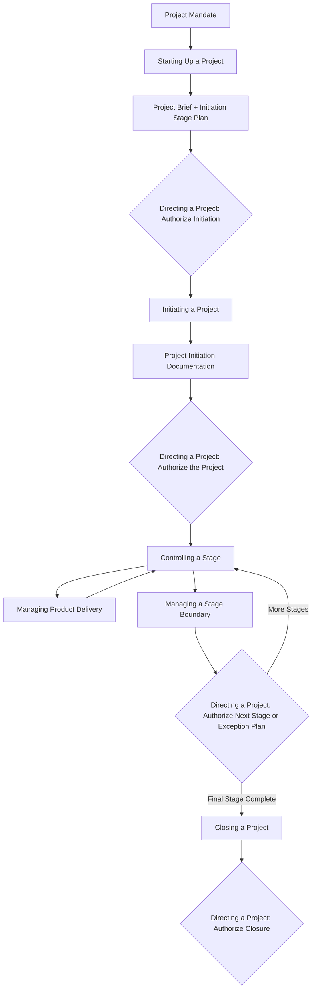

## PRINCE2 Processes

### Definition

The PRINCE2 processes describe the sequential activity model that governs a project from before it formally begins through to closure. Where principles define *why* PRINCE2 behaves as it does and themes define *what* aspects must be managed, the processes define *who does what, and when* — providing a chronological set of activities that produce and use the management products described by the themes. PRINCE2 defines seven processes, each composed of specific activities, that collectively move a project through its lifecycle.

### The Seven Processes

#### 1. Starting Up a Project (SU)

**Key Points**

- Pre-project process, triggered by a **Project Mandate** from Corporate/Programme Management; the shortest possible activity to establish whether a project is worth formally initiating.
- Key activities: appoint the Executive and Project Manager, capture previous lessons, design and appoint the project management team, prepare the Outline Business Case, select the project approach, and assemble the Project Brief.
- Output: a **Project Brief** and a recommendation to the Project Board on whether to proceed to Initiation — this decision point is captured in the **Initiation Stage Plan**, which the Project Board must approve to authorize the Initiation Stage.
- This process deliberately avoids detailed planning; its purpose is to confirm the project is worth planning in detail, not to plan it.

#### 2. Directing a Project (DP)

**Key Points**

- Runs from Initiation through Closure and is the process used exclusively by the **Project Board** to exercise governance without becoming involved in day-to-day management.
- Key activities: authorize initiation, authorize the project (approve the PID), authorize a stage or exception plan, give ad hoc direction (in response to Highlight Reports, Exception Reports, or other requests), and authorize project closure.
- This process is the direct enactment of the Manage by Exception principle: the Project Board only actively engages at these defined decision points or when an exception is escalated, rather than continuously monitoring operational detail.
- Runs in parallel with all other processes throughout the project's life — it is not a discrete phase but a continuous oversight thread.

#### 3. Initiating a Project (IP)

**Key Points**

- Occurs during the Initiation Stage (the project's first formal management stage) and establishes solid foundations before significant resources are committed.
- Key activities: prepare the Risk Management Approach, Quality Management Approach, Change Control Approach, and Communication Management Approach; set up project controls; create the Project Plan; refine the Business Case (Outline → Detailed); and assemble the **Project Initiation Documentation (PID)**.
- The PID is the master reference document baselined at the end of this process and used by the Project Board to authorize the project as a whole (via Directing a Project).
- This process operationalizes most of the Plans, Risk, Quality, and Change themes simultaneously, since it is where each theme's initial management approach is documented.

#### 4. Controlling a Stage (CS)

**Key Points**

- The day-to-day management process used by the **Project Manager** within each management stage; the most frequently repeated process across the project's life.
- Key activities: authorize work packages, review work package status, receive completed work packages, review stage status, report highlights (via Highlight Reports to the Project Board), capture and examine issues and risks, take corrective action, and escalate issues/risks as exceptions when tolerances are threatened.
- This process is where Manage by Exception is applied at the Project Manager level: as long as work stays within Stage Plan tolerances, the Project Manager manages independently; breaches trigger escalation to Directing a Project via an Exception Report.
- Operates continuously and cyclically throughout each stage until the stage's products are complete.

#### 5. Managing Product Delivery (MP)

**Key Points**

- Used by **Team Manager(s)** (or the Project Manager directly, in smaller projects without a formal Team Manager) to control the interface between the Project Manager and the teams creating products.
- Key activities: accept a work package (confirming it is understood and agreed), execute the work package (managing the actual specialist work outside PRINCE2's direct scope), and deliver the work package (returning completed, quality-checked products to the Project Manager).
- This process exists to formalize handoffs and accountability at the team level without PRINCE2 prescribing *how* the specialist work itself is done — the specialist method (e.g., a particular engineering or software development approach, including agile sprints under PRINCE2 Agile) operates inside the "execute" activity.
- Provides the natural seam through which adaptive/agile delivery techniques are commonly integrated into an otherwise predictive PRINCE2 structure.

#### 6. Managing a Stage Boundary (SB)

**Key Points**

- Triggered near the end of each management stage (or when an Exception Plan is requested) to provide the Project Board with enough information to decide whether to authorize the next stage.
- Key activities: plan the next stage, update the Project Plan, update the Business Case, report on stage performance (via an **End Stage Report**), and produce an Exception Plan if requested.
- This process is the formal mechanism through which Manage by Stages and Continued Business Justification are jointly enforced: the project cannot proceed to the next stage without the Project Board reviewing updated business justification and approving a new Stage Plan.
- If a stage-level tolerance has been or is forecast to be exceeded, this process (or an ad hoc invocation of it) produces an **Exception Plan** instead of a normal next-Stage Plan, for Project Board approval.

#### 7. Closing a Project (CP)

**Key Points**

- Occurs near or at the end of the final management stage to provide a controlled, deliberate close rather than an abrupt stop — can also be invoked prematurely if the Project Board decides to close the project early.
- Key activities: prepare planned closure (or premature closure), hand over products and confirm acceptance, evaluate the project (comparing outcomes against the PID baseline), recommend project closure, and produce the **End Project Report**, updated **Lessons Report**, and **Benefits Review Plan** (for post-project benefits tracking).
- Confirms that all products have been accepted by the customer/users and that follow-on action recommendations (e.g., outstanding issues, unrealized risks) are documented for whoever inherits operational ownership.
- Formally releases project resources and disbands the temporary project management team.

### Process-to-Theme-to-Principle Mapping

**Example**

| Process | Primary Role(s) Involved | Themes Most Engaged | Key Output(s) |
| --- | --- | --- | --- |
| Starting Up a Project | Executive, Project Manager | Business Case, Organization | Project Brief, Outline Business Case |
| Directing a Project | Project Board | Progress, Business Case | Authorization decisions |
| Initiating a Project | Project Manager | Plans, Risk, Quality, Change | Project Initiation Documentation |
| Controlling a Stage | Project Manager | Progress, Change, Risk | Work Package authorizations, Highlight Reports |
| Managing Product Delivery | Team Manager | Quality, Plans | Completed, quality-checked products |
| Managing a Stage Boundary | Project Manager | Plans, Business Case, Progress | End Stage Report, next Stage Plan |
| Closing a Project | Project Manager, Project Board | Business Case, Progress | End Project Report, Benefits Review Plan |

### Full Process Flow Across the Project Lifecycle (SVG)

<svg xmlns="http://www.w3.org/2000/svg" viewBox="0 0 820 500" font-family="Helvetica, Arial, sans-serif">
<text x="410" y="28" text-anchor="middle" font-size="18" font-weight="bold" fill="#1a1a1a">PRINCE2 Process Model (svg_diagram)</text>

<rect x="60" y="55" width="700" height="40" rx="8" fill="#2c5c9e" opacity="0.85" />
<text x="410" y="80" text-anchor="middle" font-size="13" fill="white" font-weight="bold">Directing a Project (continuous, Project Board)</text>

<rect x="60" y="120" width="130" height="60" rx="8" fill="#4a8a44" opacity="0.85" />
<text x="125" y="145" text-anchor="middle" font-size="11" fill="white" font-weight="bold">Starting Up</text>
<text x="125" y="160" text-anchor="middle" font-size="11" fill="white" font-weight="bold">a Project</text>

<rect x="230" y="120" width="130" height="60" rx="8" fill="#4a8a44" opacity="0.85" />
<text x="295" y="145" text-anchor="middle" font-size="11" fill="white" font-weight="bold">Initiating a</text>
<text x="295" y="160" text-anchor="middle" font-size="11" fill="white" font-weight="bold">Project</text>

<rect x="400" y="120" width="130" height="60" rx="8" fill="#c07a2c" opacity="0.85" />
<text x="465" y="145" text-anchor="middle" font-size="11" fill="white" font-weight="bold">Controlling</text>
<text x="465" y="160" text-anchor="middle" font-size="11" fill="white" font-weight="bold">a Stage</text>

<rect x="570" y="120" width="130" height="60" rx="8" fill="#c07a2c" opacity="0.85" />
<text x="635" y="145" text-anchor="middle" font-size="11" fill="white" font-weight="bold">Managing a</text>
<text x="635" y="160" text-anchor="middle" font-size="11" fill="white" font-weight="bold">Stage Boundary</text>

<rect x="400" y="220" width="130" height="60" rx="8" fill="#8a4ac0" opacity="0.85" />
<text x="465" y="245" text-anchor="middle" font-size="11" fill="white" font-weight="bold">Managing</text>
<text x="465" y="260" text-anchor="middle" font-size="11" fill="white" font-weight="bold">Product Delivery</text>

<rect x="570" y="330" width="180" height="60" rx="8" fill="#2c5c9e" opacity="0.85" />
<text x="660" y="355" text-anchor="middle" font-size="11" fill="white" font-weight="bold">Closing a</text>
<text x="660" y="370" text-anchor="middle" font-size="11" fill="white" font-weight="bold">Project</text>

<line x1="190" y1="150" x2="230" y2="150" stroke="#333" stroke-width="2" marker-end="url(#arrow2)" />
<line x1="360" y1="150" x2="400" y2="150" stroke="#333" stroke-width="2" marker-end="url(#arrow2)" />
<line x1="530" y1="150" x2="570" y2="150" stroke="#333" stroke-width="2" marker-end="url(#arrow2)" />
<line x1="465" y1="180" x2="465" y2="220" stroke="#333" stroke-width="2" marker-end="url(#arrow2)" />
<line x1="530" y1="250" x2="580" y2="180" stroke="#333" stroke-width="1.5" stroke-dasharray="4,3" />
<line x1="635" y1="180" x2="660" y2="330" stroke="#333" stroke-width="2" marker-end="url(#arrow2)" />
<text x="410" y="440" text-anchor="middle" font-size="11" fill="#555">Controlling a Stage and Managing Product Delivery cycle repeatedly within each stage;</text>

<text x="410" y="458" text-anchor="middle" font-size="11" fill="#555">Managing a Stage Boundary repeats once per stage transition until the final stage completes.</text>

</svg>

### Common Pitfalls in Applying Processes

**Key Points**

- Skipping Starting Up a Project's brevity intent by turning it into a full planning exercise — its purpose is a fast go/no-go filter, with detailed planning deliberately deferred to Initiating a Project.
- Allowing the Project Board to bypass Directing a Project's defined decision points and get pulled into operational detail that belongs in Controlling a Stage, undermining Manage by Exception.
- Treating Managing a Stage Boundary as a formality rather than a genuine re-evaluation point — the Business Case and Project Plan must be substantively updated, not just rubber-stamped.
- Neglecting Managing Product Delivery's formal work package acceptance step, which can cause ambiguity about whether a Team Manager has actually agreed to scope, effort, and quality expectations before work begins. [Inference: prevalence of this pitfall likely correlates with informal team-PM relationships in smaller projects]

### Practical Application Checklist

**Next Steps**

- Confirm a Project Mandate exists before invoking Starting Up a Project.
- Keep Starting Up a Project activities lightweight; escalate detailed planning to Initiating a Project only after Project Board authorization.
- Ensure the Project Board's involvement is structured strictly through Directing a Project's defined decision points (authorize initiation, project, stage/exception, closure, ad hoc direction).
- Baseline the PID at the end of Initiating a Project before committing significant stage resources.
- Use Controlling a Stage's work package authorization and review cycle consistently to maintain traceability between planned and delivered work.
- Formalize work package acceptance criteria in Managing Product Delivery, even for informal or co-located teams.
- Treat each Managing a Stage Boundary cycle as a genuine re-justification point, updating the Business Case and Project Plan with real data.
- Complete Closing a Project's evaluation and Lessons Report activities even for prematurely closed projects, not only planned closures.

**Related Topics**

- PRINCE2 Principles (the seven underpinning obligations)
- PRINCE2 Themes (the seven knowledge areas applied within these processes)
- Work Package structure and authorization mechanics
- Exception Plans and tolerance escalation paths
- End Stage Reports and End Project Reports
- PRINCE2 Agile integration points within Managing Product Delivery
- Project Initiation Documentation (PID) structure and contents