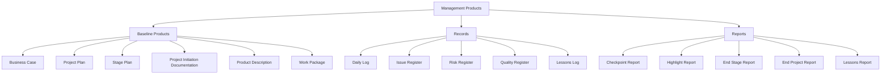
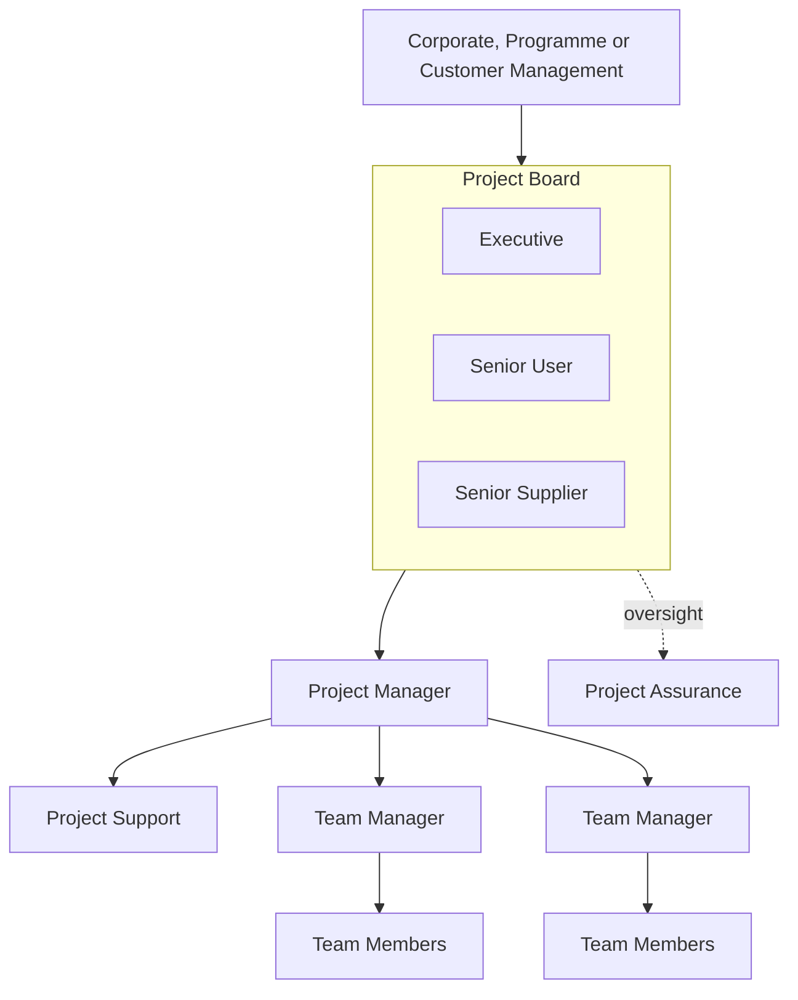

## Management Products and Roles

### Overview

PRINCE2 (PRojects IN Controlled Environments) organizes project governance around two tightly linked pillars: **Management Products** — the standardized documents/records that capture plans, decisions, and status — and **Roles** — the defined project management team structure that creates, approves, and consumes those products. Together they operationalize PRINCE2's principle of "defined roles and responsibilities" and "manage by stages," ensuring that every decision point has both a documented basis and an accountable owner.

### Categories of Management Products

PRINCE2 classifies management products into three categories based on their purpose and lifespan.

1. **Baseline Products** — Define aspects of the project and, once approved, are subject to change control (e.g., Project Plan, Product Descriptions).
2. **Records** — Dynamic products that maintain information regarding project progress and issues (e.g., Issue Register, Risk Register, Daily Log).
3. **Reports** — Provide a snapshot of status for a given period or event (e.g., Highlight Report, End Stage Report, Lessons Report).

### Core Baseline Products

**Business Case**

Justifies the project on the grounds of desirability, viability, and achievability. Owned by the Executive and reviewed at every stage boundary to confirm the project remains worthwhile; a PRINCE2 project may be legitimately closed early if the Business Case no longer holds.

**Project Initiation Documentation (PID)**

The master reference document assembled at the end of the Initiating a Project process, consolidating the Project Plan, Business Case, Project Approach, project controls, quality management approach, and the project management team structure. It is baselined and used by the Project Board to authorize the project and by later stages as the basis for measuring performance.

**Project Plan and Stage Plan**

The Project Plan is a high-level plan covering the whole project, used by the Project Board for overall control; Stage Plans provide the detailed, granular plan for each management stage, refreshed at each stage boundary since PRINCE2 assumes that near-term planning should be detailed and far-term planning should remain high-level (a practice PRINCE2 calls "planning horizon").

**Product Description**

Defines a specific product's purpose, composition, derivation, format, and quality criteria. Created for each major deliverable during planning, and used as the basis for quality reviews of that product.

**Work Package**

The mechanism by which the Project Manager delegates work to a Team Manager (or team member), containing the relevant Product Descriptions, constraints (time, cost, dependencies), reporting arrangements, and tolerances for that piece of work.

### Core Records

**Daily Log**

An informal record kept by the Project Manager to capture actions, decisions, and informal notes not significant enough to warrant a formal register entry.

**Issue Register**

A formal log of all issues (requests for change, off-specifications, and general problems/concerns) raised during the project, each tracked with a status, priority, and owner.

**Risk Register**

Captures identified risks along with their probability, impact, proximity, and planned responses, reviewed continually throughout the project rather than at fixed points only.

**Quality Register**

Summarizes all planned and completed quality activities (e.g., quality reviews, testing), used to track whether products have met their quality criteria as defined in their Product Descriptions.

**Lessons Log**

An ongoing record of lessons learned or observations that could benefit the current project or future projects, feeding into the formal Lessons Report at closure.

### Core Reports

**Checkpoint Report**

A team-level, time-driven progress report produced by a Team Manager to the Project Manager on a Work Package, at a frequency set in the Work Package itself.

**Highlight Report**

A time-driven report from the Project Manager to the Project Board summarizing stage progress, providing early visibility of issues so the Board can act before problems escalate, with frequency set by the Project Board at project initiation.

**End Stage Report**

Produced at the end of each management stage, summarizing performance against the Stage Plan and updating the Business Case, forming the basis on which the Project Board authorizes (or halts) the next stage.

**End Project Report**

Produced at project closure, comparing actual project performance against the original Project Initiation Documentation baseline.

**Lessons Report**

Formally captures lessons that should be actioned by other projects or by corporate/programme management, distinct from the ongoing informal Lessons Log.

### PRINCE2 Project Management Team Structure

PRINCE2 defines a four-layer organizational structure, reflecting a fundamental separation between corporate/programme oversight, project direction, project management, and delivery-level team management.

**Project Board**

The Project Board holds overall accountability for the project's success and provides unified direction, composed of three roles:

- **Executive** — Chairs the Board and holds ultimate accountability for the project, owning the Business Case and ensuring the project delivers value for money. There is only one Executive.
- **Senior User(s)** — Represents those who will use the project's products, specifies benefits, and is accountable for realizing them post-project.
- **Senior Supplier(s)** — Represents those designing, developing, procuring, or supplying the project's products, accountable for the quality of deliverables from the supplier side.

**Project Manager**

Runs the project on a day-to-day basis on behalf of the Project Board, within the constraints (time, cost, scope, risk, quality, benefits tolerances) delegated by the Board. Responsible for planning, monitoring, and controlling the project, and for escalating exceptions when tolerances are forecast to be breached.

**Team Manager**

Optional role (used mainly on larger projects) responsible for delivering a Work Package to the Project Manager's specification, managing the team members executing that work.

**Project Assurance**

An independent check, on behalf of the Project Board, that the project remains on track from business, user, and supplier perspectives; distinct from Project Support and typically not delegated to the Project Manager, since assurance must remain independent of the person being assured.

**Project Support**

An optional administrative role providing services such as configuration management, planning tools administration, and filing, which can be a dedicated function (e.g., a Project Management Office) or absorbed into the Project Manager's own duties on smaller projects.

**Change Authority**

An optional role, delegated by the Project Board, with authority to approve or reject requests for change within defined limits, relieving the Board of reviewing every minor change request.

### Role-to-Product Ownership Matrix

| Management Product | Primary Owner/Author | Primary Approver |
| --- | --- | --- |
| Business Case | Executive (owns) / Project Manager (drafts) | Project Board |
| Project Initiation Documentation | Project Manager | Project Board |
| Project Plan | Project Manager | Project Board |
| Stage Plan | Project Manager | Project Board |
| Work Package | Project Manager (issues) | Team Manager (accepts) |
| Checkpoint Report | Team Manager | Project Manager |
| Highlight Report | Project Manager | Project Board |
| End Stage Report | Project Manager | Project Board |
| End Project Report | Project Manager | Project Board |
| Risk Register | Project Manager (maintains) | Project Board (informed) |
| Issue Register | Project Manager (maintains) | Change Authority/Project Board |
| Lessons Report | Project Manager | Project Board / Corporate body |

### Practical Example

**Example**

A mid-sized IT infrastructure project is initiated under PRINCE2. The Executive (a business unit VP) chairs a Project Board with a Senior User (Head of Operations) and Senior Supplier (IT Delivery Director). During Initiation, the Project Manager compiles the PID, incorporating a Project Plan divided into three management stages and a Business Case showing expected annual cost savings.

At the end of Stage 1, the Project Manager submits an End Stage Report showing the stage delivered on time but $8\%$ over the stage budget tolerance. Because this breaches the Project Manager's delegated cost tolerance, it is escalated to the Project Board as an exception rather than absorbed silently — triggering an Exception Report and, if approved, an Exception Plan replacing the remainder of the original Stage Plan. Throughout the stage, the Project Manager also issued two Work Packages to a Team Manager, who returned weekly Checkpoint Reports feeding into the Project Manager's own Highlight Reports to the Board.

### Common Pitfalls

- Conflating Project Assurance with Project Support, undermining assurance's required independence
- Allowing the Project Manager to informally absorb Executive-level Business Case ownership, weakening accountability for benefits realization
- Treating the PID as a one-time document rather than the baseline against which the End Project Report is formally compared
- Skipping formal Highlight Reports on the assumption that informal updates are sufficient, removing the Project Board's early-warning mechanism
- Failing to tailor the management product set to project scale, producing excessive bureaucracy on small projects (PRINCE2 explicitly requires tailoring, not blind template application)

### Related Topics

- PRINCE2 Processes: Starting Up, Initiating, Controlling a Stage, Managing Product Delivery
- PRINCE2 Themes: Business Case, Organization, Quality, Plans, Risk, Change, Progress
- Tolerances and the Exception Management Mechanism
- Tailoring PRINCE2 to Project Scale and Environment
- Configuration Management in PRINCE2
- Comparing PRINCE2 Governance to PMBOK Guide Knowledge Areas
- Stage Boundaries and Go/No-Go Decision Points