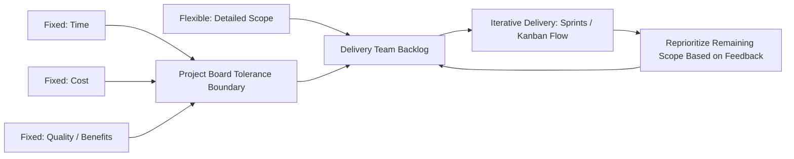

## PRINCE2 Agile

### Definition

PRINCE2 Agile is an extension guidance published by AXELOS (now owned by PeopleCert) that combines the governance structure of PRINCE2 with the concepts, values, and techniques of popular agile approaches such as Scrum, Kanban, and Lean Startup. It is not a separate methodology or a replacement for PRINCE2's principles, themes, and processes; rather, it provides guidance on how to tailor and blend PRINCE2's predictive governance framework with adaptive delivery techniques, addressing the practical question of "how much agile, and where."

### Core Philosophy: Fixed and Flexible Elements

**Key Points**

- PRINCE2 Agile's foundational concept is that some elements of a project must remain fixed (non-negotiable, corporate/governance-level) while others should be flexible (adaptable at the delivery level) to gain agile's benefits.
- The default recommendation is to **fix time, cost, and (approximate) scope** at a high level while allowing **detailed scope to flex**, delivered progressively and reprioritized based on feedback — this mirrors the classic agile "fixed budget/timebox, variable scope" model layered onto PRINCE2's stage and tolerance structure.
- Quality expectations and overall benefits are generally treated as fixed (non-negotiable minimums), since lowering quality or benefit expectations to hit a deadline is explicitly discouraged.
- This fixed/flexible split is formalized through an extension to PRINCE2's tolerance concept: rather than symmetric tolerances on all six targets, PRINCE2 Agile recommends asymmetric tolerances, particularly allowing scope tolerance to flex downward (deliver less of the "nice to have" backlog) while holding time and cost tolerance tight.

### The Agilometer

**Key Points**

- The **Agilometer** is a diagnostic tool introduced by PRINCE2 Agile to assess how suitable a project's context is for applying agile concepts more heavily versus more lightly, informing the tailoring decision.
- It evaluates the project across several sliders/dimensions, commonly including: flexibility on requirements, level of collaboration achievable with stakeholders, ease of communication, ability to work iteratively/incrementally, and the acceptance level of the environment/culture toward agile ways of working. [Unverified: exact slider count and naming vary slightly by manual edition/source]
- Lower scores on these dimensions suggest a project should lean more heavily on PRINCE2's predictive structure with only lightweight agile elements; higher scores suggest agile techniques can be applied more extensively within the PRINCE2 governance wrapper.
- The tool is intended as a facilitation aid for a tailoring conversation among the Project Manager, Project Board, and delivery team, not a rigid scoring gate.

### Behaviors, Values, and the PRINCE2 Agile "Hexagon"

**Key Points**

- PRINCE2 Agile emphasizes five target behaviors it expects teams to demonstrate: transparency, collaboration, rich communication (favoring face-to-face/visual communication over heavy documentation), self-organization, and exploration. [Unverified: exact behavior list phrasing varies by source]
- These behaviors are intended to permeate how the PRINCE2 processes are executed, particularly Managing Product Delivery and Controlling a Stage, without altering the formal process structure itself.
- The guidance draws explicitly on the Agile Manifesto's values and principles, translating them into PRINCE2-compatible language (e.g., "working software" style outcomes become "focus on products," aligning with PRINCE2's existing Focus on Products principle rather than introducing a conflicting concept).

### Mapping PRINCE2 Roles to Agile Roles

**Example**

| PRINCE2 Role | Agile Equivalent / Interaction | Notes |
| --- | --- | --- |
| Executive | No direct Scrum equivalent | Retains ultimate accountability for the Business Case; typically stays removed from daily delivery |
| Senior User | Overlaps with Product Owner interests | May delegate day-to-day prioritization authority to an empowered Product Owner-like role |
| Project Manager | Sits above the team, similar to a "servant leader" at the project level | Does not replace a Scrum Master; may work alongside one, focusing on stage-level control while the Scrum Master facilitates team-level process |
| Team Manager | Analogous to a Scrum Master/Team Lead | Manages Work Package delivery; may run sprints internally as the delivery mechanism |
| Project Assurance | No direct agile equivalent | Retains independent oversight function; can review agile artifacts (burn-down charts, sprint reviews) as evidence |

PRINCE2 Agile explicitly avoids prescribing a single role-mapping, since the "right" blend depends on team maturity and the Agilometer assessment; the table above reflects commonly observed practice patterns rather than a mandated structure. [Inference: exact role blending varies significantly by organization and is not standardized in the guidance]

### Integrating Agile Techniques into PRINCE2 Processes

#### Starting Up a Project / Initiating a Project

- Agile techniques such as **user story mapping**, **MoSCoW prioritization**, and early **Definition of Done** discussions can inform the Outline/Detailed Business Case and Product Descriptions, without changing the formal process structure.
- The Project Approach (defined in Starting Up a Project) is where the decision to use agile delivery techniques is formally recorded.

#### Managing a Stage Boundary

- Stage boundaries can be aligned with a cluster of sprints (a "release" or Program Increment-style boundary), so the End Stage Report synthesizes accumulated sprint outcomes (velocity trends, burn-down data) rather than requiring separate parallel reporting mechanisms.

#### Controlling a Stage

- **Work Packages** can be scoped to align with sprints or a Kanban work-in-progress limit, allowing the Project Manager to authorize a Work Package that internally is executed via sprint planning, daily standups, and sprint review, with the Highlight Report incorporating agile metrics (velocity, burn-down/burn-up) alongside traditional progress indicators.

#### Managing Product Delivery

- This process is identified as PRINCE2 Agile's primary integration seam: the "accept, execute, deliver" work package cycle maps naturally onto a sprint's "sprint planning, sprint execution, sprint review/retrospective" cycle, with the Team Manager or Scrum Master managing the agile mechanics inside the "execute" activity.

### Adapted Management Products

**Key Points**

- **Product Descriptions**: quality criteria may be expressed as **acceptance criteria** and **Definition of Done**, directly compatible with agile practice while satisfying PRINCE2's Focus on Products principle.
- **Highlight Reports**: commonly augmented with agile-specific visuals such as burn-down/burn-up charts or sprint velocity trends, in addition to traditional RAG (Red-Amber-Green) status indicators.
- **Quality Register**: can incorporate sprint review outcomes and retrospective action items as evidence of ongoing quality control activity.
- **Communication Management Approach**: often shifts emphasis toward face-to-face and visual management (e.g., information radiators, task boards) consistent with PRINCE2 Agile's "rich communication" target behavior.

### PRINCE2 Agile Governance Structure (SVG)

<svg xmlns="http://www.w3.org/2000/svg" viewBox="0 0 800 460" font-family="Helvetica, Arial, sans-serif">
<text x="400" y="28" text-anchor="middle" font-size="18" font-weight="bold" fill="#1a1a1a">PRINCE2 Agile Layered Structure (svg_diagram)</text>

<rect x="60" y="60" width="680" height="360" rx="14" fill="none" stroke="#2c5c9e" stroke-width="3" />
<text x="80" y="85" font-size="13" fill="#2c5c9e" font-weight="bold">PRINCE2 Governance: Principles, Themes, Processes (unchanged)</text>

<rect x="90" y="100" width="620" height="50" rx="8" fill="#2c5c9e" opacity="0.15" stroke="#2c5c9e" stroke-width="1" />
<text x="400" y="130" text-anchor="middle" font-size="12" fill="#2c5c9e">Directing a Project — Fixed Time/Cost/Quality Tolerances Set by Project Board</text>

<rect x="90" y="165" width="620" height="60" rx="8" fill="#c07a2c" opacity="0.15" stroke="#c07a2c" stroke-width="1" />
<text x="400" y="190" text-anchor="middle" font-size="12" fill="#c07a2c">Controlling a Stage — Work Packages Scoped to Sprints/Kanban Flow</text>
<text x="400" y="210" text-anchor="middle" font-size="11" fill="#c07a2c">Highlight Reports incorporate velocity / burn-down data</text>

<rect x="150" y="245" width="500" height="150" rx="12" fill="#4a8a44" opacity="0.85" />
<text x="400" y="275" text-anchor="middle" font-size="13" fill="white" font-weight="bold">Managing Product Delivery</text>
<text x="400" y="300" text-anchor="middle" font-size="11" fill="white">Sprint Planning → Daily Standup → Sprint Review → Retrospective</text>
<text x="400" y="325" text-anchor="middle" font-size="11" fill="white">Flexible detailed scope, reprioritized backlog</text>
<text x="400" y="350" text-anchor="middle" font-size="11" fill="white">Team Manager / Scrum Master facilitation</text>
<text x="400" y="375" text-anchor="middle" font-size="11" fill="white">Definition of Done = Product Description acceptance criteria</text>

<text x="400" y="440" text-anchor="middle" font-size="12" fill="#555">Agile techniques operate inside the PRINCE2 structure; they do not replace its governance layer.</text>

</svg>

### When PRINCE2 Agile Is (and Isn't) an Appropriate Fit

**Key Points**

- Well suited to environments where corporate governance mandates PRINCE2-style stage-gate reporting and Business Case justification (common in the public sector, regulated industries, or large enterprises), but where the delivery team's actual work (typically software) benefits from iterative, feedback-driven development.
- Less suited to contexts requiring pure agile team autonomy without a governance layer, since PRINCE2's Project Board authorization points and formal role structure add overhead that may be unnecessary for small, low-risk, co-located product teams that would be well served by plain Scrum or Kanban alone.
- Not intended for projects with extremely high scope uncertainty at the corporate/budget level (e.g., genuine Lean Startup-style discovery where even the overall investment case is unclear) — PRINCE2 Agile still requires enough definition to establish a viable Business Case and set of tolerances, which presumes a baseline product vision exists.

### Common Misapplications

**Key Points**

- Treating PRINCE2 Agile as "PRINCE2 with Scrum ceremonies bolted on" without genuinely adjusting tolerance-setting behavior (i.e., still fixing detailed scope rigidly) reproduces the "ScrumFall" anti-pattern rather than achieving the intended fixed/flexible split.
- Assuming PRINCE2 Agile eliminates the Project Board's formal authorization points — it does not; Directing a Project's decision gates remain intact, only the internal delivery mechanics inside Controlling a Stage and Managing Product Delivery change.
- Skipping the Agilometer-style suitability assessment and defaulting to a fixed, heavy blend of agile techniques regardless of team maturity or stakeholder collaboration capacity, which can create friction if the environment genuinely does not support agile behaviors (e.g., distant, infrequent stakeholder access). [Inference: correlation between this pitfall and project distress is plausible but not independently quantified in the source guidance]

### Practical Application Checklist

**Next Steps**

- Use an Agilometer-style assessment early in Starting Up a Project to gauge how heavily agile techniques should be blended in.
- Explicitly document the fixed vs. flexible split (time, cost, quality, scope, risk, benefits) in the Project Approach and PID rather than leaving it implicit.
- Align Work Package boundaries with sprint or Kanban flow units so Controlling a Stage's authorization cycle matches the team's actual delivery cadence.
- Extend Highlight Reports and the Quality Register to include agile-specific evidence (velocity, burn-down, Definition of Done compliance).
- Preserve all Project Board authorization points from Directing a Project; do not treat agile adoption as a reason to bypass governance gates.
- Clarify role blending (Project Manager vs. Scrum Master vs. Team Manager) explicitly at project start to avoid accountability gaps.

**Related Topics**

- PRINCE2 Principles, Themes, and Processes (the base structure PRINCE2 Agile extends)
- Scrum and Kanban core practices
- Tolerance-setting and the Manage by Exception principle
- Work Package design for iterative delivery
- Water-Scrum-Fall and other named hybrid delivery patterns
- Agile suitability filters (PMI Agile Practice Guide) as a comparative diagnostic approach
- Servant leadership and role blending in hybrid governance structures