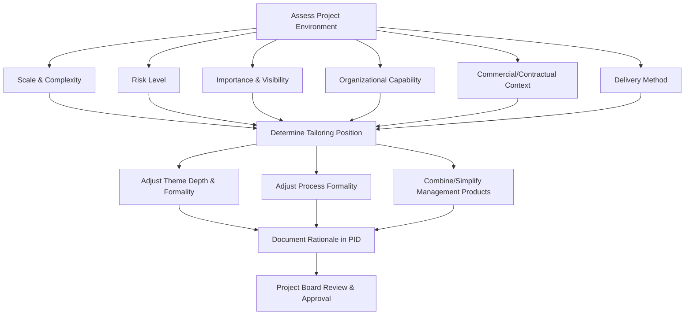

## Tailoring PRINCE2 to the Project Environment

### Definition

Tailoring PRINCE2 to the project environment is the disciplined adaptation of PRINCE2's themes, processes, and management products to fit a specific project's scale, complexity, importance, capability, and risk — while preserving all seven principles intact, since principles are explicitly non-negotiable. This is the direct operationalization of the seventh principle, Tailor to Suit the Project, and is treated in the PRINCE2 manual as an integral discipline requiring documented justification rather than an informal, ad hoc simplification exercise.

### What Can and Cannot Be Tailored

**Key Points**

- **Cannot be tailored (must always be present)**: the seven principles — Continued Business Justification, Learn from Experience, Defined Roles and Responsibilities, Manage by Stages, Manage by Exception, Focus on Products, and Tailor to Suit the Project itself.
- **Can be tailored**: the seven themes (depth, formality, and specific techniques used within each), the seven processes (which activities are performed formally vs. informally, and how much documentation surrounds them), and the format/combination of management products (e.g., merging several registers into one document, or using a whiteboard instead of a formal log for a small team).
- **Cannot be omitted, only adapted**: every theme must still be addressed in some form — for example, a small project cannot skip risk management entirely, but it can manage risk via a single shared spreadsheet rather than a formal Risk Management Approach document plus a separate Risk Register.
- A common misunderstanding is treating tailoring as license to drop themes or processes altogether; PRINCE2 explicitly frames tailoring as adjusting *how much* and *in what form*, not *whether*.

### Factors Driving Tailoring Decisions

#### Project Scale and Complexity

- Small, low-complexity projects can combine management products (e.g., a single "Project Approach" document covering quality, risk, and communication in outline form) and may not require formal Team Manager roles, with the Project Manager directly managing Work Packages.
- Large, complex, multi-team, or multi-organization projects typically need fuller formality: separate Team Managers, more granular Work Packages, more frequent stage boundaries, and fully elaborated management approaches for each theme.

#### Risk Level

- Higher-risk projects justify more frequent management stages (shorter stages increase the frequency of formal re-evaluation), more rigorous Risk Register maintenance, and tighter tolerances.
- Lower-risk, well-understood projects can use fewer, longer stages and lighter risk documentation.

#### Importance and Visibility

- High-visibility or high-value projects (e.g., those with significant reputational, financial, or regulatory exposure) typically warrant more formal reporting (detailed Highlight Reports, more Project Board engagement) even if the underlying work itself is not technically complex.

#### Organizational Capability and Culture

- Organizations with mature project management capability and existing PRINCE2 familiarity can operate with less explanatory documentation, since roles and processes are already well understood.
- Organizations new to PRINCE2, or with high staff turnover, benefit from more explicit documentation of roles, responsibilities, and processes to reduce reliance on tacit/informal knowledge.

#### Commercial/Contractual Context

- Projects delivered under external contracts (e.g., a supplier delivering to a customer) typically require more formal, auditable documentation to support contractual accountability and potential dispute resolution than purely internal projects.

#### Delivery Method

- The **Project Approach** (defined during Starting Up a Project) records whether the project will use a predominantly plan-driven, agile, or hybrid delivery method, which then shapes how Managing Product Delivery and Controlling a Stage are tailored (see PRINCE2 Agile for the specific hybrid extension guidance).

### Tailoring the Themes: Illustrative Spectrum

**Example**

| Theme | Light-Touch Tailoring (Small/Low-Risk Project) | Full-Formality Tailoring (Large/High-Risk Project) |
| --- | --- | --- |
| Business Case | One-page summary embedded in the Project Brief | Full Business Case document with detailed investment appraisal, updated at every stage boundary |
| Organization | Project Manager doubles as Team Manager; informal Project Assurance by a peer | Distinct Executive, Senior User(s), Senior Supplier(s), dedicated Project Assurance, multiple Team Managers |
| Quality | Quality criteria noted directly on Product Descriptions; no separate Quality Register | Formal Quality Management Approach, dedicated Quality Register, independent quality reviews |
| Plans | Single combined Project/Stage Plan; Team Plans informal or absent | Separate Project Plan, multiple Stage Plans, formal Team Plans per work stream |
| Risk | Shared risk list reviewed informally at team meetings | Formal Risk Management Approach, dedicated Risk Register, quantitative risk assessment techniques |
| Change | Issues logged informally and resolved by the Project Manager directly | Formal Issue Register, Configuration Management Strategy, delegated Change Authority with change budget |
| Progress | Brief verbal or email status updates to the Project Board | Formal Highlight Reports, Checkpoint Reports, End Stage Reports on a fixed cadence |

### Tailoring the Processes: Illustrative Spectrum

**Key Points**

- **Starting Up a Project**: for a small, well-understood project, this may take hours and produce a lightweight Project Brief; for a large, novel program, it may take weeks and involve substantial feasibility analysis before an Outline Business Case is even drafted.
- **Initiating a Project**: the Initiation Stage itself can be a few days for a small project (minimal separate management approaches) versus a multi-week stage for a complex program producing fully elaborated Risk, Quality, Change, and Communication Management Approaches.
- **Controlling a Stage**: Work Package authorization can be a brief verbal instruction for a small, trusted team, or a formal written Work Package document with detailed constraints, tolerances, and reporting requirements for a large or externally contracted team.
- **Managing a Stage Boundary**: for a low-risk project, this may be a short End Stage Report reviewed informally; for a high-risk or high-value project, it typically involves a formal Project Board meeting with detailed Business Case re-justification.
- **Closing a Project**: a small internal project may complete closure activities in a single short meeting; a large or contractually complex project may require formal handover documentation, acceptance sign-off, and a detailed Lessons Report.

### Documenting Tailoring Decisions

**Key Points**

- Tailoring decisions and their rationale are recorded primarily within the **Project Initiation Documentation (PID)**, specifically often within or alongside the **Project Approach** and the management approach documents for each theme (Quality Management Approach, Risk Management Approach, Change Control Approach, Communication Management Approach).
- Good practice is to explicitly state *what standard PRINCE2 guidance is being deviated from* and *why*, so that Project Assurance and the Project Board can evaluate whether the tailoring is appropriate rather than an unexamined shortcut.
- Tailoring should be revisited at stage boundaries if the project's risk profile, scale, or context materially changes — for example, a project that starts as low-risk and later encounters significant technical uncertainty may need to shift toward more formal risk and progress reporting mid-project.

### Common Pitfalls in Tailoring

**Key Points**

- **Under-tailoring for genuine complexity**: applying a lightweight approach borrowed from a previous small project to a larger, higher-risk project without reassessing formality needs, leading to insufficient governance and control.
- **Over-tailoring into bureaucracy**: applying full documentation formality to a small, low-risk project "because that's how PRINCE2 is done here," creating unnecessary overhead disproportionate to the actual risk.
- **Tailoring principles instead of themes/processes**: for example, skipping a stage boundary review entirely (violating Manage by Stages) rather than simply shortening or simplifying the End Stage Report format.
- **Undocumented tailoring**: making informal tailoring decisions without recording rationale, which undermines auditability and makes it difficult for Project Assurance or external reviewers to confirm principles remain intact. [Inference: audit and compliance impact of undocumented tailoring likely varies by industry and regulatory context]
- **One-time tailoring**: setting a tailoring position at Initiation and never revisiting it, even as project risk or scale materially shifts during delivery.

### Tailoring Decision Visualization (SVG)

<svg xmlns="http://www.w3.org/2000/svg" viewBox="0 0 780 420" font-family="Helvetica, Arial, sans-serif">
<text x="390" y="28" text-anchor="middle" font-size="18" font-weight="bold" fill="#1a1a1a">PRINCE2 Tailoring Spectrum (svg_diagram)</text>

<line x1="80" y1="220" x2="700" y2="220" stroke="#333" stroke-width="2" />
<polygon points="700,220 685,212 685,228" fill="#333" />

<text x="130" y="250" font-size="13" fill="#333">Light-Touch</text>

<text x="600" y="250" font-size="13" fill="#333">Full Formality</text>

<rect x="80" y="160" width="200" height="40" fill="#d7e8d4" opacity="0.7" />
<rect x="280" y="160" width="220" height="40" fill="#f5f0c9" opacity="0.7" />
<rect x="500" y="160" width="200" height="40" fill="#f0c9c9" opacity="0.7" />

<text x="180" y="185" text-anchor="middle" font-size="11" fill="`#1a1a1a`">Small, Low-Risk</text>

<text x="390" y="185" text-anchor="middle" font-size="11" fill="`#1a1a1a`">Medium Scale/Risk</text>

<text x="600" y="185" text-anchor="middle" font-size="11" fill="`#1a1a1a`">Large, High-Risk</text>

<circle cx="150" cy="220" r="7" fill="#2f5c2a" />
<text x="150" y="300" text-anchor="middle" font-size="11" fill="#1a1a1a">Internal process</text>
<text x="150" y="315" text-anchor="middle" font-size="11" fill="#1a1a1a">improvement project</text>
<circle cx="390" cy="220" r="7" fill="#a8933a" />
<text x="390" y="300" text-anchor="middle" font-size="11" fill="#1a1a1a">Departmental system</text>
<text x="390" y="315" text-anchor="middle" font-size="11" fill="#1a1a1a">implementation</text>
<circle cx="620" cy="220" r="7" fill="#9e3a3a" />
<text x="620" y="300" text-anchor="middle" font-size="11" fill="#1a1a1a">Regulated, multi-supplier</text>
<text x="620" y="315" text-anchor="middle" font-size="11" fill="#1a1a1a">government program</text>
<line x1="150" y1="220" x2="150" y2="290" stroke="#2f5c2a" stroke-width="1" stroke-dasharray="3,3" />
<line x1="390" y1="220" x2="390" y2="290" stroke="#a8933a" stroke-width="1" stroke-dasharray="3,3" />
<line x1="620" y1="220" x2="620" y2="290" stroke="#9e3a3a" stroke-width="1" stroke-dasharray="3,3" />

<text x="390" y="370" text-anchor="middle" font-size="12" fill="#555">All seven principles remain fully intact at every point along this spectrum.</text>

</svg>

### Practical Application Checklist

**Next Steps**

- Assess scale, complexity, risk, visibility, organizational capability, and contractual context before deciding on tailoring depth — do this explicitly during Starting Up a Project.
- Confirm every one of the seven principles remains fully intact regardless of how lightly themes and processes are tailored.
- Decide, per theme, which management products can be combined or simplified versus which require full formality, and record this in the PID.
- Document tailoring rationale explicitly (what standard guidance is being adapted, and why) rather than leaving it implicit or undocumented.
- Revisit the tailoring position at each Managing a Stage Boundary review if the project's risk or scale profile has materially changed.
- Where delivery uses agile techniques, reference PRINCE2 Agile's Agilometer-style assessment as a specific input to the tailoring decision.

**Related Topics**

- PRINCE2 Principles (the seven non-tailorable obligations)
- PRINCE2 Themes and their associated management products
- PRINCE2 Processes and their formality spectrum
- PRINCE2 Agile as a specific tailoring extension for adaptive delivery
- Project Initiation Documentation (PID) structure
- Project Assurance's role in validating tailoring decisions
- Stage boundary reviews as tailoring re-evaluation points