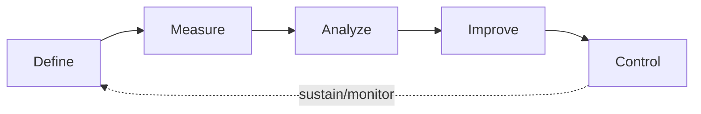
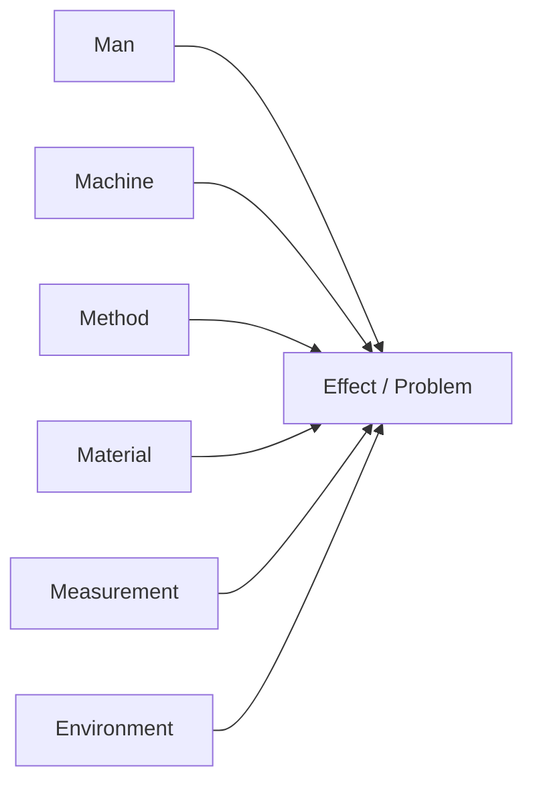

## DMAIC Methodology

### Overview

DMAIC (Define, Measure, Analyze, Improve, Control) is the core data-driven improvement cycle of Six Sigma, used to improve an existing process that is underperforming against customer or business requirements. It is a closed-loop, sequential methodology in which each phase has defined tollgate deliverables that must be completed before advancing, ensuring root causes are validated with data before solutions are implemented and locked in with control mechanisms.

### The Five Phases

### Define Phase

**Purpose**

Establishes the problem statement, project scope, goals, and stakeholder expectations before any data collection begins.

**Key Activities and Tools**

- **Project Charter**: Formal document capturing the business case, problem statement, goal statement, scope, timeline, and team roles (Champion, Black Belt/Green Belt, team members).
- **Voice of the Customer (VOC)**: Structured collection of customer requirements via surveys, interviews, or complaint data, translated into measurable Critical-to-Quality (CTQ) characteristics.
- **SIPOC Diagram**: A high-level process map identifying Suppliers, Inputs, Process, Outputs, and Customers, used to establish process boundaries before detailed mapping.
- **Stakeholder Analysis**: Identifies who is affected by and who can influence the improvement effort.

**Tollgate Deliverable**: An approved Project Charter with a validated problem/goal statement and defined scope.

### Measure Phase

**Purpose**

Establishes a reliable, quantitative baseline of current process performance and confirms that the measurement system itself is trustworthy before drawing conclusions from the data.

**Key Activities and Tools**

- **Data Collection Plan**: Specifies what to measure, operational definitions, sampling strategy, and data sources.
- **Measurement System Analysis (MSA) / Gage R&R**: Validates that variation observed in the data reflects true process variation rather than measurement error, decomposing total observed variance into repeatability (equipment) and reproducibility (operator) components.
- **Process Capability Analysis**: Establishes baseline capability indices comparing process spread to specification limits.
- **Detailed Process Mapping**: A more granular value-stream or flowchart-level map than the SIPOC, identifying value-add versus non-value-add steps.

**Process Capability Indices**

$$C_p = \frac{USL - LSL}{6\sigma}$$

$$C_{pk} = \min\left(\frac{USL - \mu}{3\sigma}, \frac{\mu - LSL}{3\sigma}\right)$$

where $USL$ and $LSL$ are the upper and lower specification limits, $\mu$ is the process mean, and $\sigma$ is the process standard deviation. $C_p$ measures potential capability assuming perfect centering; $C_{pk}$ accounts for actual centering and is always less than or equal to $C_p$.

**Sigma Level and Defects Per Million Opportunities**

$$DPMO = \frac{\text{Number of Defects}}{\text{Number of Units} \times \text{Opportunities per Unit}} \times 1{,}000{,}000$$

A process operating at "Six Sigma" quality corresponds to approximately 3.4 DPMO, though this figure conventionally incorporates a 1.5-sigma long-term process shift assumption. [Unverified] The exact DPMO-to-sigma mapping and the standard 1.5-sigma shift convention are widely cited in Six Sigma literature but originate from empirical/practical convention rather than a universal statistical law, so context-specific application should be verified against the organization's own quality standards.

**Tollgate Deliverable**: A validated measurement system and a statistically credible baseline capability/performance metric.

### Analyze Phase

**Purpose**

Identifies and statistically validates the root cause(s) of the problem, distinguishing correlation from causation before moving to solution design.

**Key Activities and Tools**

- **Cause-and-Effect (Fishbone/Ishikawa) Diagram**: Organizes potential causes into categories (commonly Man, Machine, Method, Material, Measurement, Environment) to structure brainstorming.
- **5 Whys**: Iteratively asks "why" to drill from a symptom toward a root cause.
- **Pareto Analysis**: Applies the 80/20 principle to rank causes or defect types by frequency/impact, focusing improvement effort on the vital few.
- **Hypothesis Testing**: Statistical tests (t-tests, ANOVA, chi-square) used to confirm whether a suspected factor has a statistically significant effect on the outcome, typically evaluated against a significance threshold such as $\alpha = 0.05$.
- **Regression Analysis**: Quantifies the relationship strength between input variables (X's) and the output (Y) to prioritize which X's to address.
- **Failure Mode and Effects Analysis (FMEA)**: Scores potential failure modes by severity, occurrence, and detection to prioritize risk.

**Fishbone Diagram Structure**

**Tollgate Deliverable**: One or more validated root causes, supported by statistical evidence rather than opinion.

### Improve Phase

**Purpose**

Generates, evaluates, selects, tests, and implements solutions that address the validated root causes.

**Key Activities and Tools**

- **Brainstorming and Solution Selection Matrices**: Generate candidate solutions and score them against criteria such as cost, impact, and feasibility (e.g., an Impact/Effort matrix).
- **Design of Experiments (DOE)**: Systematically varies multiple input factors simultaneously to efficiently identify optimal factor settings and interaction effects, more efficient than one-factor-at-a-time testing.
- **Piloting**: Small-scale implementation of the proposed solution to validate effectiveness before full rollout.
- **Poka-Yoke (Error-Proofing)**: Designs the process so that errors are physically prevented or immediately detected, borrowed from Lean.

**Tollgate Deliverable**: A piloted, data-validated solution with demonstrated improvement against the baseline established in Measure.

### Control Phase

**Purpose**

Ensures the improvement is sustained over time by institutionalizing the new process and establishing ongoing monitoring, preventing regression to the prior state.

**Key Activities and Tools**

- **Control Plan**: Documents the process steps, control points, measurement methods, and response plans if a metric goes out of control.
- **Statistical Process Control (SPC) Charts**: Control charts (e.g., X-bar/R charts, p-charts) plot process metrics over time against upper and lower control limits to distinguish common-cause from special-cause variation.
- **Standard Operating Procedures (SOPs)**: Updated documentation and training to embed the new process as the default way of working.
- **Response/Reaction Plan**: Predefined corrective actions if control chart signals indicate the process has drifted out of control.

**Control Chart Limits (X-bar chart, general form)**

$$UCL = \bar{X} + 3\sigma_{\bar{X}}, \quad LCL = \bar{X} - 3\sigma_{\bar{X}}$$

**Tollgate Deliverable**: A signed-off Control Plan, updated SOPs, and evidence of sustained performance over a defined monitoring period.

### DMAIC Roles

| Role | Responsibility |
| --- | --- |
| Champion/Sponsor | Provides resources, removes organizational barriers, owns the business outcome |
| Master Black Belt | Coaches Black Belts, provides deep statistical expertise across projects |
| Black Belt | Leads complex DMAIC projects full-time, applies advanced statistical tools |
| Green Belt | Leads smaller DMAIC projects part-time alongside regular job duties |
| Process Owner | Owns the process post-project, accountable for sustaining the Control Plan |
| Team Members | Provide process knowledge, execute data collection and pilot activities |

### Practical Example

**Example**

A call center's average handle time (AHT) has crept above the target SLA. Applying DMAIC:

- **Define**: Charter states the problem — AHT is 9.2 minutes against a target of 7 minutes — with scope limited to the billing-inquiry call type.
- **Measure**: Team collects 4 weeks of call data, validates the timing system via MSA, and confirms baseline $C_{pk}$ is well below 1.0, indicating poor capability against the target.
- **Analyze**: A Pareto chart shows that 62% of long calls involve agents manually looking up account history in a second system; a hypothesis test confirms a statistically significant difference in handle time between agents with dual-monitor setups and those without ($p < 0.05$).
- **Improve**: The team pilots a screen-integration solution eliminating the manual lookup step, along with dual-monitor rollout, and measures a reduction in average AHT to 7.4 minutes during the pilot.
- **Control**: An SPC chart is established to track daily AHT going forward, with a reaction plan requiring supervisor review if AHT exceeds the upper control limit for two consecutive days, and the new workflow is codified into the training SOP.

### Common Pitfalls

- Skipping the Measure phase's MSA step and drawing conclusions from an unvalidated measurement system
- Jumping to solutions during Define or Measure before root causes are statistically confirmed in Analyze
- Treating brainstormed causes from the fishbone diagram as validated without hypothesis testing or regression evidence
- Declaring victory after the Improve phase pilot without establishing a durable Control Plan, allowing the process to regress
- Scoping DMAIC projects too broadly, causing them to stall without a tightly bounded problem statement

### Related Topics

- Design for Six Sigma (DFSS) and the DMADV Methodology
- Statistical Process Control and Control Chart Selection
- Measurement System Analysis (Gage R&R) in Depth
- Design of Experiments (DOE): Factorial and Fractional Factorial Designs
- Lean Six Sigma Integration (Value Stream Mapping, Waste Elimination)
- Hypothesis Testing Fundamentals for Process Improvement
- FMEA (Failure Mode and Effects Analysis) Scoring and Prioritization
- Six Sigma Belt Certification Structure and Governance