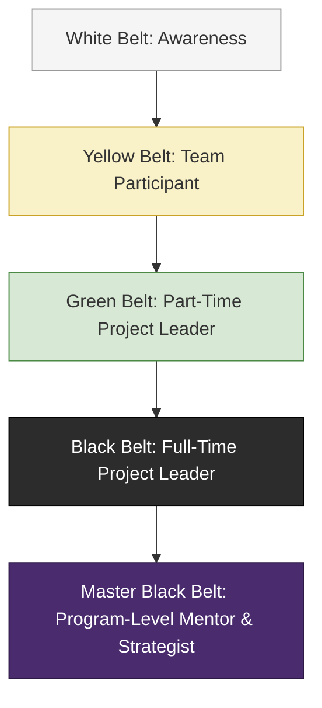

## Six Sigma Belts and Roles

### Definition

Six Sigma belts and roles refer to the hierarchical certification and organizational structure used to designate levels of Six Sigma training, expertise, and responsibility within an organization's process improvement initiatives. Borrowed metaphorically from martial arts ranking systems, the belt structure (White, Yellow, Green, Black, Master Black) denotes progressively deeper statistical and methodological competency, while accompanying organizational roles (Champion, Process Owner, Sponsor) define governance and accountability outside the belt hierarchy itself.

### The Belt Hierarchy

#### White Belt

**Key Points**

- Represents the most basic level of Six Sigma awareness, typically covering foundational concepts (what Six Sigma is, basic terminology, the general DMAIC structure) without deep statistical training.
- White Belts are usually general employees who need enough familiarity to participate in or support improvement projects (e.g., providing input, following new standardized processes) without leading them.
- Training duration is typically very short (a few hours to one day). [Unverified: exact duration varies significantly by training provider, as no single global certifying body enforces a standard]

#### Yellow Belt

**Key Points**

- Provides a working knowledge of Six Sigma tools and the DMAIC framework, enabling participation as a project team member with some analytical contribution (e.g., basic data collection, simple process mapping, basic control charts).
- Yellow Belts often serve as part-time contributors to Green Belt or Black Belt-led projects within their own work area, providing subject matter expertise on the process under study.
- Training typically covers basic statistical concepts (mean, variation, basic charting) without requiring deep hypothesis testing or advanced statistical software competency.

#### Green Belt

**Key Points**

- Represents a substantive, working-level competency: Green Belts can lead smaller-scope improvement projects independently or serve as core team members on larger Black Belt-led initiatives.
- Curriculum typically includes the full DMAIC methodology, basic to intermediate statistical tools (hypothesis testing, regression, basic Design of Experiments concepts, process capability analysis, control charts) and root cause analysis techniques (Fishbone/Ishikawa diagrams, 5 Whys, Pareto analysis).
- Green Belts typically retain their regular job function and apply Six Sigma part-time (commonly cited as roughly 25% of their time, though this varies by organization) alongside project leadership responsibilities. [Inference: the specific time-allocation figure is a common organizational convention rather than a universally mandated standard]
- Certification typically requires completing a real improvement project demonstrating measurable results, in addition to passing a written exam, though exact requirements vary by certifying body (e.g., ASQ, IASSC) or internal corporate program.

#### Black Belt

**Key Points**

- Represents advanced, typically full-time expertise: Black Belts lead complex, cross-functional improvement projects, mentor Green Belts, and apply advanced statistical methods.
- Curriculum extends into advanced statistical techniques: full Design of Experiments (DOE), advanced regression and ANOVA, measurement systems analysis (Gage R&R), advanced control chart selection, and often basic Lean tools (value stream mapping, kanban systems) where Lean Six Sigma integration is taught.
- Black Belts often function as internal change agents and project leaders, dedicating most or all of their working time to improvement initiatives rather than a traditional operational role, and are frequently a required project resource for larger-scope, higher-financial-impact initiatives.
- Certification bodies (ASQ, IASSC, and various corporate/proprietary programs) each define their own exam content and project requirements; there is no single universally recognized global standard, which means Black Belt certifications are not perfectly interchangeable across providers. [Unverified: relative rigor comparisons between certifying bodies are a matter of some debate and not objectively settled]

#### Master Black Belt

**Key Points**

- The most advanced practitioner level: Master Black Belts typically have several years of experience successfully leading Black Belt-level projects before progressing to this designation.
- Responsibilities center on organizational-level program management: training and mentoring Black Belts and Green Belts, developing internal Six Sigma curriculum and standards, selecting and prioritizing the portfolio of improvement projects, and often acting as an internal statistical/methodological consultant for the most complex or ambiguous problems.
- Master Black Belts frequently report to or work closely with senior leadership (Champions/Sponsors) to align the improvement project portfolio with strategic business objectives.
- This is generally a career-level designation reached through demonstrated project success and depth of technical mastery rather than a fixed-duration training course. [Inference: exact progression criteria vary by organization and certifying body]

### Belt Comparison Table

**Example**

| Belt | Typical Time Commitment | Statistical Depth | Typical Project Role | Certification Basis |
| --- | --- | --- | --- | --- |
| White Belt | Minimal, informal awareness | Basic terminology only | Informed employee/supporter | Short course; rarely formally certified |
| Yellow Belt | Part-time, occasional | Basic charts, simple data collection | Team member | Course completion; sometimes a short exam |
| Green Belt | Part-time (commonly ~25% of role) | Intermediate (hypothesis testing, capability analysis) | Project leader (smaller scope) or core team member | Exam plus a completed improvement project (varies by body) |
| Black Belt | Full-time or near full-time | Advanced (DOE, ANOVA, MSA) | Project leader (complex, cross-functional) | Exam plus multiple completed projects (varies by body) |
| Master Black Belt | Full-time, program-level | Expert; teaches and mentors others | Trainer, mentor, portfolio strategist | Extensive project history plus organizational endorsement |

### Governance and Sponsorship Roles (Outside the Belt Hierarchy)

#### Champion

**Key Points**

- A senior leader (often a department head, director, or VP) who sponsors Six Sigma initiatives at the organizational or business-unit level, secures resources, and removes organizational barriers for project teams.
- Champions typically do not perform the technical/statistical work themselves; their role is strategic alignment and organizational support, ensuring projects target business-critical problems and have leadership backing to implement recommended changes.
- Champions commonly select and prioritize which projects Black Belts and Green Belts pursue, in coordination with Master Black Belts.

#### Process Owner

**Key Points**

- The individual accountable for the ongoing performance of the specific process being improved, both before and after the Six Sigma project concludes.
- Process Owners are critical to the Control phase of DMAIC, since they are responsible for sustaining improvements after the project team disbands — a project's technical success is only durable if the Process Owner maintains the new controls (e.g., updated Standard Operating Procedures, control charts, monitoring plans).
- Often serves as a key stakeholder and information source during the Define and Measure phases, since they typically have the deepest operational knowledge of the process's current state.

#### Sponsor

**Key Points**

- Sometimes used interchangeably with "Champion" depending on organizational terminology, though some organizations distinguish a Sponsor as a more project-specific executive backer versus a Champion's broader program-level role. [Unverified: terminology and role boundaries between Sponsor and Champion vary significantly and are not standardized across organizations or certifying bodies]
- Provides project-level resources, removes escalated obstacles, and reviews project progress at key DMAIC phase gates, similar in function to a PRINCE2 Executive's relationship to a specific project.

### Role Interaction Across a Typical Project

**Example**

| Phase | Primary Belt-Level Actor | Supporting Governance Role |
| --- | --- | --- |
| Define | Green Belt or Black Belt drafts project charter | Champion/Sponsor approves charter and scope |
| Measure | Belt leader collects data; Yellow Belts assist | Process Owner provides process knowledge |
| Analyze | Belt leader performs root cause analysis | Master Black Belt consults on complex statistical methods |
| Improve | Belt leader designs and tests solutions | Champion removes implementation barriers |
| Control | Belt leader hands off control plan | Process Owner assumes ongoing monitoring responsibility |

### Organizational Structure Visualization (SVG)

<svg xmlns="http://www.w3.org/2000/svg" viewBox="0 0 780 460" font-family="Helvetica, Arial, sans-serif">

<text x="390" y="28" text-anchor="middle" font-size="18" font-weight="bold" fill="#1a1a1a">Six Sigma Roles: Belts vs. Governance (svg_diagram)</text>

<text x="200" y="60" text-anchor="middle" font-size="13" font-weight="bold" fill="#2c5c9e">Technical/Delivery Track</text>

<polygon points="200,80 260,120 140,120" fill="#4a2c6e" />

<text x="200" y="108" text-anchor="middle" font-size="10" fill="white">MBB</text>

<polygon points="200,120 300,170 100,170" fill="#2c2c2c" />

<text x="200" y="150" text-anchor="middle" font-size="10" fill="white">Black Belt</text>

<polygon points="200,170 340,230 60,230" fill="#4a8a44" />

<text x="200" y="205" text-anchor="middle" font-size="11" fill="white">Green Belt</text>

<polygon points="200,230 380,290 20,290" fill="#c9a227" />

<text x="200" y="265" text-anchor="middle" font-size="11" fill="white">Yellow Belt</text>

<polygon points="200,290 420,350 -20,350" fill="#e0e0e0" stroke="#999" />

<text x="200" y="325" text-anchor="middle" font-size="11" fill="#333">White Belt</text>

<text x="600" y="60" text-anchor="middle" font-size="13" font-weight="bold" fill="#c07a2c">Governance/Sponsorship Track</text>

<rect x="520" y="80" width="160" height="50" rx="8" fill="#c07a2c" opacity="0.85" />

<text x="600" y="110" text-anchor="middle" font-size="12" fill="white" font-weight="bold">Champion / Sponsor</text>

<rect x="520" y="160" width="160" height="50" rx="8" fill="#c07a2c" opacity="0.6" />

<text x="600" y="190" text-anchor="middle" font-size="12" fill="white" font-weight="bold">Process Owner</text>

<line x1="520" y1="105" x2="300" y2="150" stroke="#999" stroke-width="1.5" stroke-dasharray="4,3" />

<line x1="520" y1="185" x2="340" y2="230" stroke="#999" stroke-width="1.5" stroke-dasharray="4,3" />

<text x="390" y="420" text-anchor="middle" font-size="12" fill="#555">Belts execute the technical methodology; Champions and Process Owners provide organizational authority and sustainment.</text>

</svg>

### Common Pitfalls in Belt/Role Structuring

**Key Points**

- Treating belt certification as a purely credentialing exercise disconnected from actual project outcomes — since certification requirements and rigor vary substantially across providers, an organization's internal project-success criteria matter more than the belt title alone. [Inference: this concern is widely discussed in practitioner literature but not empirically settled across all industries]
- Assigning Black Belt-level projects to Green Belts without adequate Master Black Belt mentoring support, risking technically unsound analysis on high-impact initiatives.
- Neglecting the Process Owner role, resulting in "project success, then regression" — a technically successful improvement that erodes after the project team disbands because no one owns ongoing control.
- Overloading Champions with too many simultaneous project sponsorships, diluting the organizational support and barrier-removal function the role is meant to provide.

### Practical Application Checklist

**Next Steps**

- Match project complexity and cross-functional scope to the appropriate belt level (Green Belt for contained, single-department problems; Black Belt for complex, cross-functional, higher-financial-impact initiatives).
- Ensure every project has an identified Process Owner engaged from the Define phase onward, not just introduced at Control.
- Secure explicit Champion/Sponsor commitment (charter approval, resource allocation) before project kickoff.
- Provide Master Black Belt mentoring access for Black Belt-led projects involving advanced statistical methods (DOE, complex regression).
- Verify the specific certifying body's (ASQ, IASSC, or internal corporate) requirements before assuming equivalence with belts earned elsewhere.
- Build a belt-level training pipeline (Yellow → Green → Black) aligned with the organization's actual project portfolio needs rather than certifying broadly without project deployment plans.

**Related Topics**

- DMAIC methodology (Define, Measure, Analyze, Improve, Control)
- Lean Six Sigma integration and Lean tool sets
- Design of Experiments (DOE) and statistical hypothesis testing
- Measurement Systems Analysis (Gage R&R)
- Project charter development and phase-gate reviews
- ASQ and IASSC certification body comparisons
- Control plans and sustaining process improvements post-project