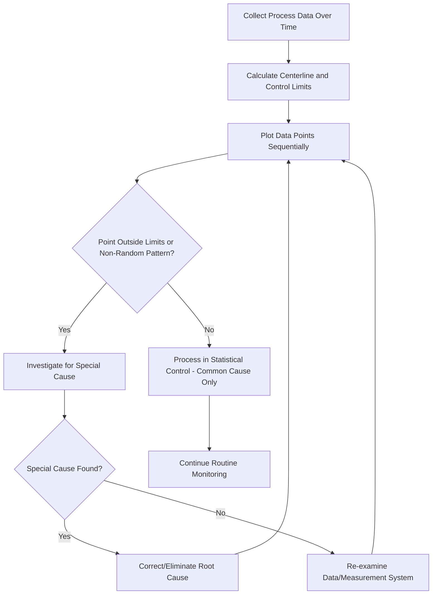

## Statistical Process Control Basics

### Definition

Statistical Process Control (SPC) is a methodology that uses statistical methods to monitor, control, and improve process performance by distinguishing between natural, inherent process variation and variation caused by identifiable, correctable factors. Developed originally by Walter Shewhart in the 1920s and later expanded by W. Edwards Deming, SPC provides the quantitative foundation for the Control phase of DMAIC and for ongoing process monitoring after an improvement project concludes.

### Common Cause vs. Special Cause Variation

**Key Points**

- **Common cause variation** (also called natural or chance variation) is the inherent, expected variability present in any process due to the cumulative effect of many small, unavoidable factors (minor equipment wear, ambient temperature fluctuation, normal human variability). A process exhibiting only common cause variation is said to be in **statistical control**.
- **Special cause variation** (also called assignable cause variation) arises from specific, identifiable factors that are not part of the process's normal operation (a tool failure, an operator error, a raw material defect, an equipment malfunction). These causes are, in principle, identifiable and correctable.
- The central purpose of SPC is to distinguish these two variation types using statistical signals, so that special causes are investigated and eliminated while common cause variation is addressed only through fundamental process redesign (since reacting to normal common-cause fluctuation as if it were a special cause — a phenomenon Deming termed "tampering" — actually increases variation rather than reducing it).
- A process in statistical control is predictable (future output will fall within the established statistical limits) but not necessarily capable of meeting customer specifications — control and capability are distinct concepts (see Process Capability below).

### Control Charts: Core Concept

**Key Points**

- A **control chart** plots a process metric over time against three reference lines: the **centerline** (typically the process mean), the **Upper Control Limit (UCL)**, and the **Lower Control Limit (LCL)**.
- Control limits are calculated from the process's own observed variation (commonly set at ±3 standard deviations from the centerline for many chart types), not from customer specification limits — this distinction is a frequent point of confusion for those new to SPC.
- Points falling outside the control limits, or exhibiting certain non-random patterns within the limits (see Western Electric/Nelson rules below), signal the likely presence of a special cause requiring investigation.
- Control charts serve a dual purpose: prospectively monitoring a process in real time (detecting emerging special causes as they occur) and retrospectively confirming whether a process was in control during a historical period (useful for validating baseline data during the Measure phase of DMAIC).

### Types of Control Charts

#### Variable (Continuous) Data Charts

**Key Points**

- **X-bar and R chart**: monitors the process mean (X-bar) and range (R) of subgroups over time; commonly used when subgroup sizes are small (typically 2–10 units) and data is measured on a continuous scale (e.g., dimensions, weight, temperature).
- **X-bar and S chart**: similar to X-bar and R, but uses the subgroup standard deviation (S) instead of range; generally preferred over X-bar and R for larger subgroup sizes since standard deviation is a more statistically efficient variability estimator than range at larger sample sizes. [Unverified: the specific subgroup-size threshold where S is preferred over R varies slightly across statistical references]
- **Individuals and Moving Range (I-MR) chart**: used when data cannot be meaningfully grouped into subgroups (e.g., one measurement per batch, infrequent sampling), plotting individual observations and the moving range between consecutive points.

#### Attribute (Discrete/Count) Data Charts

**Key Points**

- **p-chart**: monitors the proportion of defective units in a sample, used when subgroup sizes may vary and each unit is classified as defective or not defective.
- **np-chart**: monitors the count (not proportion) of defective units, used when subgroup size is constant.
- **c-chart**: monitors the count of defects (not defective units — a single unit can have multiple defects) within a sample of constant size.
- **u-chart**: monitors the rate of defects per unit, used when subgroup size varies and multiple defects per unit are possible.

### Selecting the Correct Control Chart

**Example**

| Data Type | Subgroup Size | Recommended Chart |
| --- | --- | --- |
| Continuous, subgrouped | 2–10 (small) | X-bar and R |
| Continuous, subgrouped | Larger subgroups | X-bar and S |
| Continuous, individual measurements | 1 (no subgrouping) | Individuals and Moving Range (I-MR) |
| Attribute (defective/not defective), variable sample size | Varies | p-chart |
| Attribute (defective/not defective), constant sample size | Constant | np-chart |
| Attribute (count of defects per unit), constant sample size | Constant | c-chart |
| Attribute (count of defects per unit), variable sample size | Varies | u-chart |

### Detecting Special Causes: Pattern Rules

**Key Points**

- Beyond points falling outside the ±3 sigma control limits, several widely used rule sets (commonly referenced as **Western Electric Rules** or the related **Nelson Rules**) flag non-random patterns within the control limits as likely special-cause signals.
- Common examples include: a single point beyond 3 sigma; two out of three consecutive points beyond 2 sigma on the same side of the centerline; four out of five consecutive points beyond 1 sigma on the same side; eight or more consecutive points on the same side of the centerline (indicating a process shift); and a run of consecutive points steadily trending in one direction (indicating gradual drift, e.g., tool wear).
- Applying multiple pattern rules increases sensitivity to detecting real special causes but also increases the false-alarm rate, so most practitioners apply a specific, agreed-upon subset of rules rather than every possible rule simultaneously. [Inference: the exact trade-off point between sensitivity and false-alarm rate is context- and industry-dependent, not universally fixed]

### Process Capability: A Related but Distinct Concept

**Key Points**

- **Process capability** measures how well a process, once in statistical control, meets customer specification limits — this is conceptually separate from control, since a stable, predictable process can still be incapable of meeting specifications if its natural variation is too wide relative to the tolerance band.
- **Cp** (process capability index) compares the specification width to the process's natural variation (6 standard deviations), assuming the process is centered; **Cpk** adjusts for actual process centering, penalizing capability when the process mean is off-target even if variation itself is narrow.
- A commonly cited threshold is Cpk ≥ 1.33 as indicating an acceptably capable process for many industries, though required thresholds vary considerably by industry, criticality, and specific customer or regulatory requirements. [Unverified: specific numeric thresholds are conventions that vary by industry and are not a fixed universal standard]
- Process capability analysis should only be performed once a process is confirmed to be in statistical control; calculating capability indices on an out-of-control process produces misleading or invalid results, since the underlying variation estimate is not stable.

$$C_{pk} = \min\left(\frac{USL - \mu}{3\sigma}, \frac{\mu - LSL}{3\sigma}\right)$$

where $USL$ and $LSL$ are the upper and lower specification limits, $\mu$ is the process mean, and $\sigma$ is the process standard deviation.

### SPC in the DMAIC Cycle

**Key Points**

- **Measure phase**: control charts are often used to establish a baseline understanding of current process stability and variation before improvement work begins, distinguishing whether existing performance issues stem from common cause (requiring process redesign) or special cause (requiring targeted correction) variation.
- **Control phase**: control charts are the primary tool for the **Control Plan**, providing ongoing monitoring to confirm that process improvements are sustained and that the process does not regress to its prior state after the project team disbands — this directly supports the Process Owner's sustainment responsibility.
- Choosing the correct chart type and subgroup strategy during the Measure phase is important because chart selection errors (e.g., using a p-chart when data is actually continuous) can produce misleading control limits and false signals throughout the project.

### Control Chart Structure (SVG)

<svg xmlns="http://www.w3.org/2000/svg" viewBox="0 0 780 400" font-family="Helvetica, Arial, sans-serif">
<text x="390" y="28" text-anchor="middle" font-size="18" font-weight="bold" fill="#1a1a1a">Control Chart Structure (svg_diagram)</text>

<line x1="70" y1="330" x2="720" y2="330" stroke="#333" stroke-width="1.5" />
<line x1="70" y1="60" x2="70" y2="330" stroke="#333" stroke-width="1.5" />
<text x="400" y="365" text-anchor="middle" font-size="12" fill="#333">Sample / Time Sequence</text>
<text x="30" y="200" text-anchor="middle" font-size="12" fill="#333" transform="rotate(-90 30 200)">Measured Value</text>

<line x1="70" y1="110" x2="720" y2="110" stroke="#9e3a3a" stroke-width="1.5" stroke-dasharray="6,4" />
<text x="725" y="114" font-size="11" fill="#9e3a3a">UCL</text>
<line x1="70" y1="200" x2="720" y2="200" stroke="#2c5c9e" stroke-width="1.5" />
<text x="725" y="204" font-size="11" fill="#2c5c9e">CL</text>
<line x1="70" y1="290" x2="720" y2="290" stroke="#9e3a3a" stroke-width="1.5" stroke-dasharray="6,4" />
<text x="725" y="294" font-size="11" fill="#9e3a3a">LCL</text>

<polyline points="100,190 140,210 180,195 220,205 260,185 300,215" fill="none" stroke="#4a8a44" stroke-width="2" />
<circle cx="100" cy="190" r="4" fill="#4a8a44" />
<circle cx="140" cy="210" r="4" fill="#4a8a44" />
<circle cx="180" cy="195" r="4" fill="#4a8a44" />
<circle cx="220" cy="205" r="4" fill="#4a8a44" />
<circle cx="260" cy="185" r="4" fill="#4a8a44" />
<circle cx="300" cy="215" r="4" fill="#4a8a44" />

<polyline points="300,215 340,190 380,150 420,100 460,95" fill="none" stroke="#c07a2c" stroke-width="2" />
<circle cx="340" cy="190" r="4" fill="#c07a2c" />
<circle cx="380" cy="150" r="4" fill="#c07a2c" />
<circle cx="420" cy="100" r="5" fill="#9e3a3a" />
<circle cx="460" cy="95" r="5" fill="#9e3a3a" />
<text x="420" y="80" text-anchor="middle" font-size="10" fill="#9e3a3a">Out of control</text>

<polyline points="460,95 500,200 540,195 580,205 620,190 660,200 700,195" fill="none" stroke="#4a8a44" stroke-width="2" />
<circle cx="500" cy="200" r="4" fill="#4a8a44" />
<circle cx="540" cy="195" r="4" fill="#4a8a44" />
<circle cx="580" cy="205" r="4" fill="#4a8a44" />
<circle cx="620" cy="190" r="4" fill="#4a8a44" />
<circle cx="660" cy="200" r="4" fill="#4a8a44" />
<circle cx="700" cy="195" r="4" fill="#4a8a44" />
</svg>

### Common Pitfalls in Applying SPC

**Key Points**

- Confusing control limits with specification limits — control limits describe what the process actually does, while specification limits describe what the customer requires; conflating the two leads to incorrect conclusions about whether a process needs intervention.
- **Tampering**: adjusting a process in response to normal common-cause variation as if each fluctuation were a special cause, which Deming demonstrated actually increases overall variation (the well-known "funnel experiment" illustrates this effect).
- Using an inappropriate chart type for the data (e.g., treating count data as continuous), which produces invalid control limits and unreliable signals.
- Calculating process capability indices before confirming the process is in statistical control, yielding a capability estimate that does not reflect genuine, stable process behavior.
- Insufficient subgroup sampling frequency or size, reducing the statistical power to detect real special causes in a timely manner. [Inference: appropriate sampling frequency is highly context-dependent and not governed by a single universal rule]

### Practical Application Checklist

**Next Steps**

- Identify whether process data is continuous (variable) or count-based (attribute) before selecting a chart type.
- Confirm subgroup size and sampling strategy align with the chosen chart type (e.g., X-bar/R for small subgroups, I-MR for individual measurements).
- Establish control limits from a stable baseline period, then hold limits fixed while monitoring ongoing production — recalculate only after a confirmed, deliberate process change.
- Apply a consistent, pre-agreed subset of pattern rules (not every possible rule) to balance sensitivity against false-alarm rate.
- Investigate every out-of-control signal for a genuine special cause before taking corrective action; avoid reacting to normal common-cause fluctuation.
- Perform process capability analysis (Cp/Cpk) only after confirming statistical control, and compare against the specific customer or regulatory specification limits relevant to the process.
- Embed control charts into the formal Control Plan so the Process Owner has an ongoing, actionable monitoring mechanism after project closure.

**Related Topics**

- DMAIC methodology, particularly the Measure and Control phases
- Process Capability Analysis (Cp, Cpk, Pp, Ppk)
- Measurement Systems Analysis (Gage R&R)
- Western Electric Rules and Nelson Rules for control chart interpretation
- Deming's theory of variation and the funnel experiment
- Control Plans and process sustainment post-improvement
- Design of Experiments (DOE) for addressing common cause variation