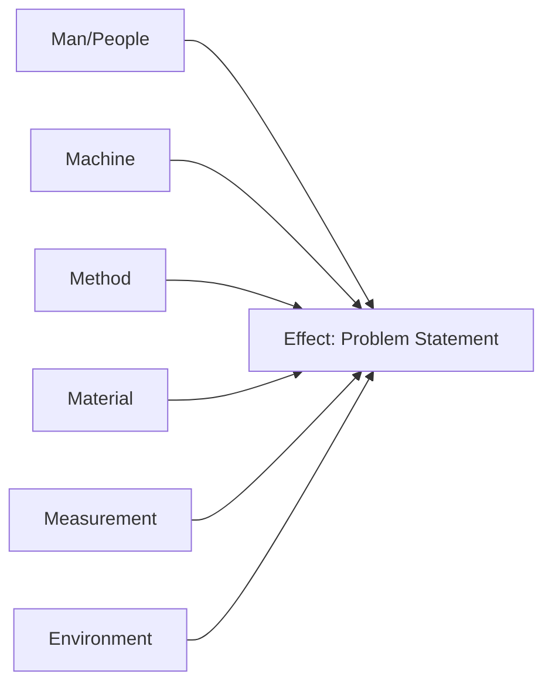
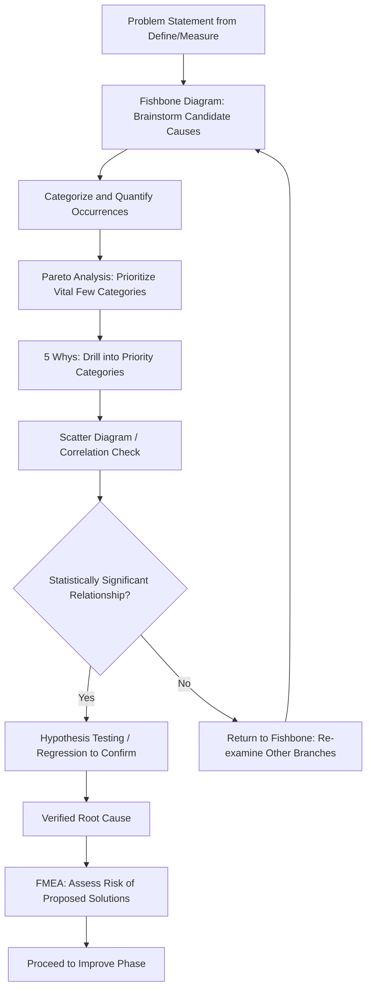

## Root Cause Analysis Tools

### Definition

Root Cause Analysis (RCA) tools are structured techniques used to identify the underlying, fundamental cause(s) of a problem or defect rather than merely addressing its surface symptoms. Within Six Sigma, these tools are used predominantly during the Analyze phase of DMAIC to move from observed effects (identified during Measure) to verified causal factors, which then inform the solutions developed during Improve. Effective RCA distinguishes correlation from causation and prioritizes root causes by their actual contribution to the problem, rather than by assumption or anecdote.

### Fishbone (Ishikawa) Diagram

**Key Points**

- Developed by Kaoru Ishikawa, the Fishbone Diagram (also called a Cause-and-Effect Diagram) visually organizes potential causes of a problem into major categories branching off a central "spine" leading to the effect (the problem statement) at the head of the fish.
- Common category frameworks include the **6M's** for manufacturing contexts (Man/People, Machine, Method, Material, Measurement, Mother Nature/Environment) or the **4P's/8P's** for process/service contexts (Policies, Procedures, People, Plant/Equipment, and extensions such as Price, Promotion, Place, Product). [Unverified: category framework naming and exact letter/word choices vary across sources and industries]
- The diagram is typically built through a facilitated brainstorming session, where a cross-functional team populates each branch with potential contributing causes, then sub-branches to capture deeper contributing factors.
- Primary value is comprehensiveness and cross-functional perspective-gathering; the Fishbone Diagram identifies candidate causes but does not itself statistically verify which candidates are the actual, dominant root cause(s) — it is typically a precursor to further validation (e.g., via Pareto analysis, hypothesis testing, or DOE).

### 5 Whys

**Key Points**

- A simple, iterative questioning technique that repeatedly asks "why" (conventionally five times, though the actual number of iterations needed varies by problem complexity) to peel back layers of symptoms until an underlying root cause is reached.
- Each answer becomes the basis for the next "why" question, forming a causal chain: Problem → Why? → Immediate cause → Why? → Deeper cause → Why? → Root cause.
- Strengths: fast, requires no specialized statistical tools, accessible to any team member, and effective for straightforward, single-path causal chains.
- Limitations: prone to confirmation bias and stopping prematurely at a convenient or politically comfortable answer rather than the true root cause; poorly suited to problems with multiple interacting or parallel causes, since the technique assumes a single linear causal chain. [Inference: susceptibility to premature stopping is widely discussed in practitioner literature but depends heavily on facilitator discipline]
- Often more effective when combined with a Fishbone Diagram (using 5 Whys to drill into specific Fishbone branches) or validated afterward with data-driven techniques.

### Pareto Analysis

**Key Points**

- Based on the Pareto Principle (the "80/20 rule"), which observes that in many real-world distributions, a small proportion of causes (often approximated as 20%) account for a large proportion of the effects (often approximated as 80%). [Unverified: the specific 80/20 ratio is a general heuristic and rarely holds exactly in any given dataset]
- A **Pareto Chart** is a bar chart displaying the frequency or cost impact of different cause/defect categories in descending order, typically overlaid with a cumulative percentage line, allowing the team to visually identify which few categories account for the majority of the problem.
- This tool helps prioritize which root causes to investigate and address first, focusing limited improvement resources on the "vital few" causes rather than spreading effort evenly across all identified candidates (the "trivial many").
- Requires categorized, quantified defect or occurrence data as an input — typically sourced from the Measure phase's data collection plan — making it a bridge between quantitative measurement and qualitative root cause investigation.

### Scatter Diagrams and Correlation Analysis

**Key Points**

- A **Scatter Diagram** plots two variables against each other (e.g., a suspected causal factor on the x-axis, the outcome measure on the y-axis) to visually assess whether a relationship exists between them.
- Useful for testing hypotheses generated by the Fishbone Diagram or 5 Whys — for example, if "machine temperature" is suspected as a root cause of defect rate, a scatter diagram of temperature vs. defect rate across many observations can visually reveal whether a relationship is present.
- A visible pattern (linear, curvilinear) suggests a potential relationship warranting further statistical testing (e.g., correlation coefficient calculation, regression analysis), but a scatter diagram alone does not establish causation — a well-known statistical caution, since two variables can be correlated due to a shared underlying cause (a confounding variable) rather than one directly causing the other.
- Commonly used in conjunction with formal hypothesis testing during Analyze to move from a visually suggestive pattern to a statistically validated conclusion.

### Failure Mode and Effects Analysis (FMEA)

**Key Points**

- A structured, proactive risk-analysis tool that systematically identifies potential failure modes within a process or product, their potential effects, and their root causes, then prioritizes them for action.
- Each failure mode is typically scored across three dimensions — **Severity** (how serious the consequence is), **Occurrence** (how frequently the failure mode is likely to occur), and **Detection** (how likely existing controls are to catch the failure before it causes harm) — commonly on a 1–10 scale, multiplied together to produce a **Risk Priority Number (RPN)**.
- Failure modes with the highest RPN are prioritized for corrective action, mirroring the prioritization logic of Pareto Analysis but applied prospectively (before failures occur) rather than retrospectively (after defects have already been observed).
- Distinct from the other tools in this list in that it is often used proactively during process design or Improve-phase solution validation (assessing whether a proposed fix might introduce new failure modes), in addition to its retrospective use in diagnosing existing problems.

### Comparison of RCA Tools

**Example**

| Tool | Best Suited For | Data Requirement | Key Limitation |
| --- | --- | --- | --- |
| Fishbone Diagram | Broad, cross-functional cause brainstorming | None (qualitative) | Generates candidates; does not verify or quantify |
| 5 Whys | Simple, linear causal chains | None (qualitative) | Prone to confirmation bias; weak for multi-causal problems |
| Pareto Analysis | Prioritizing among multiple quantified cause categories | Categorized frequency/cost data | Assumes causes are already correctly categorized |
| Scatter Diagram | Testing a suspected relationship between two variables | Paired numeric observations | Shows correlation, not causation; confounding risk |
| FMEA | Proactive risk prioritization across many failure modes | Structured scoring (Severity/Occurrence/Detection) | Scoring is subjective/team-dependent; RPN math has known statistical criticisms [Unverified: extent of criticism validity varies by source] |

### Integrated RCA Workflow

**Key Points**

- Most robust root cause analyses combine multiple tools sequentially rather than relying on a single technique: broad cause identification (Fishbone) narrows into prioritized categories (Pareto), specific causal chains are then interrogated (5 Whys), and suspected relationships are statistically tested (Scatter Diagrams, hypothesis testing, or regression) before a cause is declared "verified."
- FMEA often runs in parallel or as a follow-up step, particularly when evaluating whether a proposed Improve-phase solution might introduce new risks.
- The overall sequence supports the Analyze phase's core requirement: root causes must be **verified with data**, not merely hypothesized, before resources are committed to the Improve phase.

### FMEA Scoring Illustration (SVG)

<svg xmlns="http://www.w3.org/2000/svg" viewBox="0 0 760 380" font-family="Helvetica, Arial, sans-serif">
<text x="380" y="28" text-anchor="middle" font-size="18" font-weight="bold" fill="#1a1a1a">FMEA Risk Priority Number Structure (svg_diagram)</text>

<rect x="60" y="70" width="180" height="70" rx="8" fill="#9e3a3a" opacity="0.85" />
<text x="150" y="100" text-anchor="middle" font-size="13" fill="white" font-weight="bold">Severity</text>
<text x="150" y="120" text-anchor="middle" font-size="11" fill="white">(1-10 scale)</text>
<rect x="290" y="70" width="180" height="70" rx="8" fill="#c07a2c" opacity="0.85" />
<text x="380" y="100" text-anchor="middle" font-size="13" fill="white" font-weight="bold">Occurrence</text>
<text x="380" y="120" text-anchor="middle" font-size="11" fill="white">(1-10 scale)</text>
<rect x="520" y="70" width="180" height="70" rx="8" fill="#2c5c9e" opacity="0.85" />
<text x="610" y="100" text-anchor="middle" font-size="13" fill="white" font-weight="bold">Detection</text>
<text x="610" y="120" text-anchor="middle" font-size="11" fill="white">(1-10 scale)</text>

<line x1="150" y1="140" x2="370" y2="220" stroke="#333" stroke-width="1.5" />
<line x1="380" y1="140" x2="380" y2="220" stroke="#333" stroke-width="1.5" />
<line x1="610" y1="140" x2="390" y2="220" stroke="#333" stroke-width="1.5" />

<rect x="280" y="230" width="200" height="60" rx="8" fill="#4a2c6e" />
<text x="380" y="255" text-anchor="middle" font-size="13" fill="white" font-weight="bold">RPN =</text>
<text x="380" y="275" text-anchor="middle" font-size="12" fill="white">Severity × Occurrence × Detection</text>

<text x="380" y="340" text-anchor="middle" font-size="12" fill="#555">Highest RPN values are prioritized first for corrective or preventive action.</text>

</svg>

### Common Pitfalls in Root Cause Analysis

**Key Points**

- Stopping at the first plausible-sounding cause (especially common with 5 Whys) without validating it against actual process data, resulting in solutions that address a symptom rather than the true root cause.
- Treating a Fishbone Diagram's brainstormed list as final conclusions rather than as a set of hypotheses requiring further data-driven verification.
- Confusing correlation shown in a Scatter Diagram with proven causation, potentially leading to a costly "fix" targeting a variable that is merely correlated with, not causally responsible for, the defect.
- Using RCA tools in isolation without following through to statistical confirmation (hypothesis testing, regression, or DOE), leaving root causes as unverified assumptions when Improve-phase solutions are selected.
- Scoring FMEA dimensions inconsistently across team members or projects, reducing the comparability and reliability of RPN-based prioritization. [Inference: consistency issues in subjective scoring are a commonly cited critique but their practical impact varies by team calibration and training]

### Practical Application Checklist

**Next Steps**

- Begin with a Fishbone Diagram to gather a comprehensive, cross-functional list of candidate causes before narrowing focus.
- Quantify and categorize occurrence data, then apply Pareto Analysis to identify the vital few categories deserving deeper investigation.
- Use 5 Whys to drill into each priority category, but require supporting data or evidence at each "why" step rather than accepting an assumption.
- Test suspected causal relationships with Scatter Diagrams and follow up with formal statistical testing (hypothesis tests, regression) before declaring a cause verified.
- Apply FMEA both retrospectively (diagnosing why failures occurred) and prospectively (assessing risk in proposed Improve-phase solutions).
- Calibrate FMEA scoring criteria (Severity, Occurrence, Detection scales) across the team before scoring to improve consistency and comparability of RPN values.

**Related Topics**

- DMAIC methodology, particularly the Analyze phase
- Hypothesis testing and statistical significance
- Design of Experiments (DOE) for isolating causal factors
- Statistical Process Control and common vs. special cause variation
- Control Plans and FMEA's role in proactive risk mitigation
- Regression analysis for quantifying causal relationships
- Process mapping and Value Stream Mapping as complementary diagnostic tools