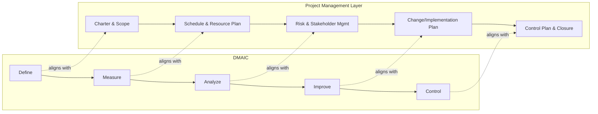

## Integrating Six Sigma with Project Management

### Definition

Integrating Six Sigma with project management refers to the structural and procedural alignment of Six Sigma's DMAIC (Define, Measure, Analyze, Improve, Control) improvement methodology with formal project management disciplines (scope, schedule, cost, stakeholder, risk, and governance management), so that process improvement initiatives are executed with the same rigor, accountability, and organizational oversight as any other managed project. This integration matters because DMAIC alone specifies a technical/analytical workflow but does not inherently define project governance, resource authorization, or stakeholder management — gaps that standard project management frameworks are designed to fill.

### Why Integration Is Necessary

**Key Points**

- DMAIC is fundamentally a problem-solving and analytical framework; it prescribes *what analytical steps to take* but says relatively little about *how to plan, staff, fund, schedule, or govern the effort* as an organizational undertaking.
- Six Sigma projects, particularly Black Belt-led initiatives, frequently involve significant time commitments, cross-functional resource needs, and multi-week or multi-month timelines — characteristics that benefit from formal project management practices such as chartering, scheduling, risk management, and stakeholder communication.
- Without project management discipline, Six Sigma initiatives risk common project failure modes: unclear scope boundaries, inadequate resource commitment, stalled momentum without milestone accountability, and insufficient stakeholder buy-in for implementing Improve-phase changes.
- Conversely, project management frameworks (PMBOK, PRINCE2) provide governance and control structures but do not inherently supply the statistical and root-cause analysis rigor that DMAIC contributes — the two disciplines are complementary rather than competing.

### Mapping DMAIC to Project Management Process Groups

**Example**

| DMAIC Phase | Project Management Process Group Analogy | Key Project Management Artifacts Typically Layered In |
| --- | --- | --- |
| Define | Initiating | Project Charter, stakeholder register, high-level scope statement |
| Measure | Planning (partial) | Data collection plan, measurement system validation, baseline schedule |
| Analyze | Planning (partial) / Executing | Risk register updates, resource allocation for analysis activities |
| Improve | Executing | Change management plan, pilot implementation plan, updated schedule/budget |
| Control | Monitoring & Controlling / Closing | Control Plan, handover documentation, lessons learned, project closure report |

This mapping is illustrative rather than a strict one-to-one correspondence: DMAIC phases are iterative and analytically driven, while project management process groups often overlap and recur throughout a project's life rather than occurring strictly once each. [Inference: the degree of overlap and iteration varies by organization and specific project complexity]

### The Six Sigma Project Charter as an Integration Point

**Key Points**

- The **Project Charter**, developed during the Define phase, is the primary artifact where Six Sigma and formal project management converge: it typically documents the problem statement, business case/goal statement, scope boundaries, project team and roles (including belt-level assignments), high-level timeline, and expected financial or operational benefit.
- This charter functions analogously to a PMBOK Project Charter or a PRINCE2 Project Brief, and is commonly approved by the Champion/Sponsor in a manner similar to Executive/Sponsor sign-off in other frameworks.
- A well-integrated charter explicitly ties the Six Sigma problem statement to the organization's strategic objectives, ensuring the project competes appropriately for resources and leadership attention alongside other portfolio initiatives.
- Scope creep is a recognized risk in Six Sigma projects just as in any other project type; the charter's defined scope boundary is the primary control point invoked to manage change requests during Measure and Analyze, when analytical findings sometimes tempt teams to broaden investigation beyond the original problem statement.

### Governance Roles: Six Sigma and Project Management Correspondence

**Key Points**

- **Champion/Sponsor** (Six Sigma) functions similarly to a **Project Sponsor** or PRINCE2 **Executive**: securing resources, providing strategic alignment, and removing organizational barriers, though typically with less direct day-to-day involvement than a Project Manager.
- **Black Belt or Green Belt (project leader)** functions similarly to a **Project Manager**: responsible for planning, executing, and controlling the specific initiative, though with an emphasis on statistical/analytical leadership in addition to general project coordination.
- **Process Owner** has a distinctive role not directly mirrored in generic project management frameworks — accountable for the process's ongoing operation both before and after the project, which parallels but is not identical to a PRINCE2 Senior User's operational interest.
- **Master Black Belt**, when present, functions somewhat like a program-level advisor or a PMO (Project Management Office) resource, providing methodological governance and mentoring across multiple concurrent Six Sigma initiatives.

### Scheduling and Milestone Structuring

**Key Points**

- Six Sigma projects benefit from being scheduled with DMAIC phase-gate reviews functioning as formal milestones, analogous to stage boundaries in PRINCE2 or phase gates in a predictive project lifecycle — each phase's completion is typically reviewed and approved (often by the Champion or a project review board) before the team proceeds to the next phase.
- **Work Breakdown Structure (WBS)** techniques can be applied within each DMAIC phase to decompose analytical and implementation activities into schedulable, resource-assignable tasks (e.g., breaking "Measure" into data collection plan development, measurement system validation, and baseline data gathering as distinct scheduled activities).
- Realistic scheduling must account for the inherently iterative nature of Analyze (root cause investigation may require multiple cycles of hypothesis generation and testing) — treating DMAIC phases as strictly linear, fixed-duration blocks in a schedule can create unrealistic milestone pressure that undermines analytical rigor.

### Risk Management Integration

**Key Points**

- Formal project risk management practices (risk identification, qualitative/quantitative assessment, response planning) can be layered onto Six Sigma projects to manage risks distinct from the process risks being studied — for example, risk of stakeholder resistance to Improve-phase changes, risk of inadequate data availability during Measure, or risk of key team member unavailability.
- FMEA (Failure Mode and Effects Analysis), while a Six Sigma analytical tool in its own right, can also feed a project's broader risk register, particularly when assessing risks introduced by a proposed Improve-phase solution.
- Change management risk deserves particular attention in Six Sigma-project management integration: even a statistically well-validated improvement can fail to deliver sustained benefit if the organizational change management (training, communication, incentive alignment) needed to embed the new process is inadequately planned. [Inference: the relative weight of change-management risk versus technical/analytical risk varies significantly by organizational culture and change history]

### Financial and Benefits Tracking

**Key Points**

- Six Sigma projects are typically expected to demonstrate quantified financial benefit (cost savings, revenue protection, or avoided cost), which parallels a project management Business Case's expected benefits, but with an added expectation of rigorous, often finance-department-validated calculation methodology.
- Benefits are commonly tracked in categories such as "hard" savings (directly reducible costs, verifiable in financial statements) versus "soft" savings (efficiency gains, risk reduction, or customer satisfaction improvements that are harder to directly quantify) — a distinction that should be made explicit and agreed upon with the Champion/Sponsor and finance stakeholders early in Define.
- Post-implementation financial validation (confirming the Control phase's sustained benefit matches the Business Case projection) parallels a project management Benefits Review Plan, and is often a required closure activity before a Six Sigma project is considered formally complete.

### Integration Governance Structure (SVG)

<svg xmlns="http://www.w3.org/2000/svg" viewBox="0 0 800 440" font-family="Helvetica, Arial, sans-serif">
<text x="400" y="28" text-anchor="middle" font-size="18" font-weight="bold" fill="#1a1a1a">Six Sigma / Project Management Integration (svg_diagram)</text>

<rect x="60" y="55" width="680" height="60" rx="10" fill="#2c5c9e" opacity="0.85" />
<text x="400" y="80" text-anchor="middle" font-size="13" fill="white" font-weight="bold">Champion / Sponsor</text>
<text x="400" y="100" text-anchor="middle" font-size="11" fill="white">Strategic alignment, resource authorization, charter approval</text>

<rect x="60" y="140" width="680" height="60" rx="10" fill="#4a8a44" opacity="0.85" />
<text x="400" y="165" text-anchor="middle" font-size="13" fill="white" font-weight="bold">Black Belt / Green Belt (Project Leader)</text>
<text x="400" y="185" text-anchor="middle" font-size="11" fill="white">Schedule, scope, risk, and stakeholder management + DMAIC execution</text>

<rect x="60" y="225" width="680" height="60" rx="10" fill="#c07a2c" opacity="0.85" />
<text x="400" y="250" text-anchor="middle" font-size="13" fill="white" font-weight="bold">DMAIC Execution</text>
<text x="400" y="270" text-anchor="middle" font-size="11" fill="white">Define → Measure → Analyze → Improve → Control</text>

<rect x="60" y="310" width="680" height="60" rx="10" fill="#8a4ac0" opacity="0.85" />
<text x="400" y="335" text-anchor="middle" font-size="13" fill="white" font-weight="bold">Process Owner</text>
<text x="400" y="355" text-anchor="middle" font-size="11" fill="white">Ongoing process accountability post-Control, sustains benefit realization</text>

<line x1="400" y1="115" x2="400" y2="140" stroke="#333" stroke-width="2" />
<line x1="400" y1="200" x2="400" y2="225" stroke="#333" stroke-width="2" />
<line x1="400" y1="285" x2="400" y2="310" stroke="#333" stroke-width="2" />

<text x="400" y="410" text-anchor="middle" font-size="12" fill="#555">Governance and delivery layers mirror generic project management structures with Six Sigma-specific roles.</text>

</svg>

### Common Pitfalls in Integration

**Key Points**

- Treating DMAIC as self-sufficient and neglecting formal chartering, scheduling, or risk management, which increases the likelihood of scope drift, stalled momentum, or inadequate stakeholder buy-in for Improve-phase changes.
- Imposing rigid, fixed-duration schedules onto DMAIC phases (particularly Analyze) without accounting for the iterative, sometimes unpredictable nature of root cause investigation, creating artificial milestone pressure that can compromise analytical rigor.
- Failing to formally hand off Control-phase monitoring responsibility to the Process Owner, resulting in benefit erosion after the Six Sigma project team disbands and organizational attention shifts elsewhere.
- Neglecting change management planning for Improve-phase implementation, assuming a statistically validated solution will be adopted automatically without dedicated communication, training, or incentive alignment effort.
- Conflating "hard" and "soft" savings without agreement from finance stakeholders, leading to disputed benefit claims during project closure. [Inference: the frequency and severity of this specific dispute varies by organizational financial governance maturity]

### Practical Application Checklist

**Next Steps**

- Develop a Six Sigma Project Charter during Define that explicitly incorporates project management elements: scope statement, stakeholder register, high-level schedule, and expected financial benefit categorized as hard or soft savings.
- Use DMAIC phase-gate reviews as formal project milestones, with defined approval authority (typically the Champion/Sponsor) before proceeding to the next phase.
- Apply WBS decomposition within each DMAIC phase to support realistic scheduling and resource assignment, allowing extra flexibility for Analyze's iterative nature.
- Maintain a project risk register covering both process-improvement risks (e.g., data availability, measurement system reliability) and general project risks (e.g., stakeholder resistance, resource availability).
- Plan and resource change management activities explicitly for Improve-phase implementation, rather than assuming automatic adoption of a validated solution.
- Formally transfer Control-phase monitoring accountability to the Process Owner as part of project closure, with documented control plans and escalation procedures.
- Validate financial benefit claims with finance stakeholders before project closure to ensure hard/soft savings distinctions are agreed upon and defensible.

**Related Topics**

- DMAIC methodology structure and phase objectives
- Six Sigma Belts and organizational roles
- Project Charter development and stakeholder alignment
- Change management and organizational adoption of process improvements
- Control Plans and Process Owner sustainment responsibilities
- Benefits realization and financial validation practices
- PRINCE2 and PMBOK governance structures as comparative frameworks