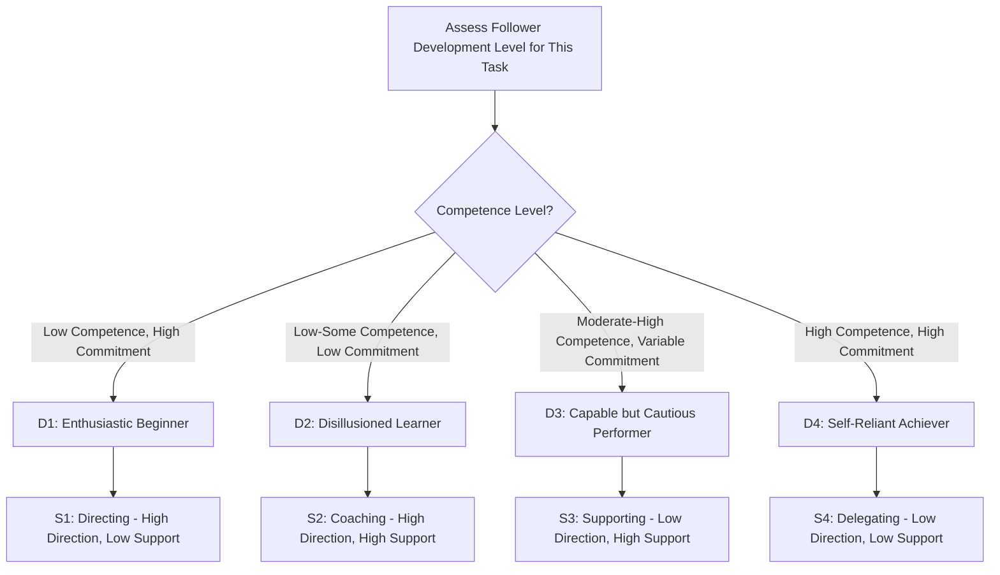

## Leadership Styles and Situational Leadership

### Definition

Leadership styles and situational leadership refer to the recognized patterns of leader behavior and decision-making approach, and the theory that effective leadership requires adapting the chosen style to the specific readiness, competence, and commitment level of followers (team members) rather than relying on a single fixed style across all circumstances. For project managers, this matters because a project team's composition, task maturity, and motivation shift throughout a project's life, and across different individuals on the same team, requiring the project manager to flex their leadership approach accordingly rather than defaulting to one comfortable mode.

### Classic Leadership Style Frameworks

#### Autocratic (Directive) Leadership

**Key Points**

- The leader makes decisions unilaterally with minimal team input, providing clear, specific instructions and close supervision.
- Effective in situations requiring rapid decisions, low team experience with the task at hand, or crisis/high-risk conditions where ambiguity could cause harm (e.g., safety-critical construction activities, incident response).
- Overuse can suppress team engagement, innovation, and ownership, particularly with experienced or highly skilled team members who may disengage if consistently micromanaged.

#### Democratic (Participative) Leadership

**Key Points**

- The leader actively involves team members in decision-making, gathering input before deciding, though final authority may still rest with the leader.
- Effective for building team buy-in, leveraging diverse expertise, and situations where the problem is complex enough to benefit from multiple perspectives (e.g., solution design, requirements gathering).
- Can slow decision-making in time-critical situations and may create ambiguity about final accountability if not managed carefully.

#### Laissez-Faire (Delegative) Leadership

**Key Points**

- The leader provides minimal direct oversight, delegating significant autonomy and decision-making authority to the team.
- Effective with highly skilled, self-motivated, and experienced teams capable of independent execution (e.g., senior specialist engineers on a well-understood task).
- Can result in a lack of direction, coordination gaps, or missed deadlines if applied to teams lacking sufficient experience, motivation, or role clarity.

#### Transactional Leadership

**Key Points**

- Based on a structured exchange between leader and follower: clear expectations, defined rewards for meeting targets, and corrective action or penalties for underperformance.
- Effective for well-defined, routine, or compliance-driven work where clear metrics and consistent processes matter (e.g., maintaining quality standards, meeting fixed contractual milestones).
- Tends to produce reliable, predictable performance within defined parameters but is less effective at inspiring discretionary effort, innovation, or commitment beyond the specified exchange terms.

#### Transformational Leadership

**Key Points**

- The leader inspires and motivates followers toward a shared vision, emphasizing intellectual stimulation, individualized consideration, and idealized influence (role-modeling) rather than transactional exchange alone.
- Effective for driving significant change initiatives, motivating discretionary effort, and building long-term commitment, particularly in ambiguous, innovation-dependent, or transformation-heavy projects.
- Requires sustained leader credibility and communication effort; can be less effective in purely routine, low-ambiguity operational work where transactional clarity may be more efficient.

#### Servant Leadership

**Key Points**

- The leader prioritizes the growth, well-being, and empowerment of team members, viewing their role as removing obstacles and enabling team success rather than directing from above.
- Particularly emphasized in agile project environments (e.g., the Scrum Master role is explicitly framed as a servant leader), where team self-organization is a core operating principle.
- Effective for building trust, psychological safety, and sustainable team performance; can be perceived as insufficiently directive in crisis situations or with teams needing more explicit structure. [Inference: perception of servant leadership's directiveness varies by organizational and cultural context]

### Situational Leadership Theory

**Key Points**

- Developed originally by Paul Hersey and Ken Blanchard, Situational Leadership Theory posits that no single leadership style is universally optimal; instead, the appropriate style depends on the follower's **readiness** or **development level** for a specific task — a combination of their competence (skill/knowledge) and commitment (confidence/motivation).
- The model (in its most widely referenced form) identifies four leadership styles matched to four follower development levels, commonly labeled: **Directing** (S1), **Coaching** (S2), **Supporting** (S3), and **Delegating** (S4).
- Critically, situational leadership is applied per-task and per-individual, not as a single fixed label for an entire team — the same team member may require a Directing style for an unfamiliar task while warranting a Delegating style for a task they've mastered.
- The theory has undergone revisions since its original formulation (e.g., Hersey and Blanchard later developed divergent versions of the model, and the terminology and matrix details differ somewhat between the Situational Leadership I and Situational Leadership II frameworks). [Unverified: specific differences between competing proprietary versions of the model are a matter of some disagreement among practitioners and are not the subject of this content's further detail]

### The Four Situational Leadership Styles in Detail

**Example**

| Style | Follower Profile | Leader Behavior | Typical Project Scenario |
| --- | --- | --- | --- |
| S1: Directing | Low competence, often high initial commitment/enthusiasm | Provides specific instructions, closely supervises task completion | Onboarding a new team member to an unfamiliar process or tool |
| S2: Coaching | Some competence developed, but commitment may waver (frustration setting in) | Continues to direct but also explains rationale, solicits input, provides encouragement | A team member struggling with a moderately complex task after initial training |
| S3: Supporting | Competence is solid, but confidence or motivation may be inconsistent | Facilitates and encourages, shares decision-making, provides support without heavy direction | An experienced team member handling a task well but hesitant to make independent calls |
| S4: Delegating | High competence and high commitment | Delegates authority and responsibility, monitors from a distance | A senior specialist handling a task type they've successfully completed many times before |

### Applying Situational Leadership Across a Project Lifecycle

**Key Points**

- Early project stages often require more Directing/Coaching styles as team members onboard to project-specific processes, tools, and stakeholder expectations, even if they are individually experienced professionals in their discipline.
- As the team matures and establishes working rhythms (particularly evident in agile team development, paralleling Tuckman's Forming-Storming-Norming-Performing stages), a shift toward Supporting and Delegating styles is often appropriate and expected.
- Project managers should reassess development level per task, not just per team member or per project phase — a team member fully capable of routine execution tasks may need renewed Directing or Coaching support when assigned an unfamiliar or higher-stakes task later in the project.
- Applying a mismatched style — over-directing a highly capable team member, or under-directing an inexperienced one — is a commonly cited driver of team disengagement or execution failure. [Inference: the relative frequency of over-directing versus under-directing mismatches likely varies by organizational culture and management training]

### Integrating Leadership Style with Project Governance Frameworks

**Key Points**

- In predictive (PRINCE2/PMBOK-style) governance structures, the Project Manager's authority and reporting lines are more formally defined, which can create a natural pull toward transactional or directive styles by default — situational leadership theory suggests this default should still flex based on individual team member and task readiness, not governance structure alone.
- In adaptive/agile environments, servant leadership is explicitly favored as the cultural default (particularly for Scrum Masters), but situational leadership principles still apply: a newly formed agile team or a team member new to agile ways of working may initially need more Directing/Coaching support before full self-organization (Delegating-style facilitation) becomes appropriate.
- Hybrid project environments (see PRINCE2 Agile) often require project managers to consciously blend styles: more directive/transactional behavior when interfacing with governance bodies and fixed milestones, paired with more coaching/supporting/delegating behavior when working directly with the delivery team.

### Leadership Style Selection Framework (SVG)

<svg xmlns="http://www.w3.org/2000/svg" viewBox="0 0 780 420" font-family="Helvetica, Arial, sans-serif">
<text x="390" y="28" text-anchor="middle" font-size="18" font-weight="bold" fill="#1a1a1a">Situational Leadership Matrix (svg_diagram)</text>

<line x1="100" y1="350" x2="680" y2="350" stroke="#333" stroke-width="1.5" />
<line x1="100" y1="350" x2="100" y2="60" stroke="#333" stroke-width="1.5" />
<text x="390" y="385" text-anchor="middle" font-size="12" fill="#333">Follower Competence →</text>
<text x="40" y="205" text-anchor="middle" font-size="12" fill="#333" transform="rotate(-90 40 205)">Leader Directive Behavior →</text>

<rect x="100" y="200" width="290" height="150" fill="#f0c9c9" opacity="0.6" />
<text x="245" y="230" text-anchor="middle" font-size="12" fill="#7a2c2c" font-weight="bold">S1: Directing</text>
<text x="245" y="250" text-anchor="middle" font-size="10" fill="#7a2c2c">High direction, low support</text>
<rect x="390" y="200" width="290" height="150" fill="#f5e0c9" opacity="0.6" />
<text x="535" y="230" text-anchor="middle" font-size="12" fill="#a8641c" font-weight="bold">S2: Coaching</text>
<text x="535" y="250" text-anchor="middle" font-size="10" fill="#a8641c">High direction, high support</text>
<rect x="100" y="60" width="290" height="140" fill="#d7e8d4" opacity="0.6" />
<text x="245" y="90" text-anchor="middle" font-size="12" fill="#2f5c2a" font-weight="bold">S4: Delegating</text>
<text x="245" y="110" text-anchor="middle" font-size="10" fill="#2f5c2a">Low direction, low support</text>
<rect x="390" y="60" width="290" height="140" fill="#c9d7f0" opacity="0.6" />
<text x="535" y="90" text-anchor="middle" font-size="12" fill="#2c4a7a" font-weight="bold">S3: Supporting</text>
<text x="535" y="110" text-anchor="middle" font-size="10" fill="#2c4a7a">Low direction, high support</text>

<text x="390" y="405" text-anchor="middle" font-size="11" fill="#555">Style selection depends jointly on follower competence and commitment for the specific task at hand.</text>

</svg>

### Common Pitfalls in Applying Leadership Styles

**Key Points**

- Applying a single default leadership style uniformly across all team members and tasks, rather than adapting per individual and per task-specific development level.
- Assuming development level is static once assessed — an individual's readiness for a specific task type can regress (e.g., after a role change, a difficult failure, or reduced motivation) or advance over time, requiring reassessment.
- Over-relying on transactional or autocratic styles in agile/adaptive environments where team self-organization is a stated operating principle, undermining the psychological safety and ownership those environments depend on.
- Under-directing genuinely inexperienced team members in the name of fostering autonomy, resulting in avoidable errors, missed expectations, or team member anxiety from insufficient guidance.
- Confusing situational leadership's task-specific focus with a general personality-based leadership style label, treating "I am a Delegating leader" as a fixed identity rather than a deliberate, context-dependent choice. [Inference: this conflation is commonly observed in informal leadership discussions but not a documented empirical finding]

### Practical Application Checklist

**Next Steps**

- Assess each team member's competence and commitment level for the specific task being assigned, not as a general personality trait.
- Match leadership style to that specific assessment: Directing for low competence, Coaching for developing competence with wavering commitment, Supporting for solid competence with variable confidence, Delegating for high competence and commitment.
- Reassess development level periodically and per new task type, particularly when team composition changes or new project phases introduce unfamiliar work.
- In agile/hybrid environments, default toward servant leadership and Supporting/Delegating styles for team-level work, while flexing toward more directive styles when interfacing with fixed governance milestones or onboarding new team members.
- Combine leadership style flexibility with clear communication of rationale, particularly when shifting from a more directive to a more delegating style, to avoid team members perceiving reduced support as disengagement.
- Solicit direct feedback from team members about the level of direction and support they find helpful for specific task types, rather than relying solely on the leader's own assessment.

**Related Topics**

- Tuckman's stages of team development (Forming, Storming, Norming, Performing, Adjourning)
- Servant leadership and the Scrum Master role
- Emotional intelligence in project leadership
- Conflict resolution styles for project managers
- Stakeholder engagement and influence without direct authority
- Team motivation theories (Herzberg, Maslow, Self-Determination Theory)
- Change management leadership during Improve-phase or transformation initiatives