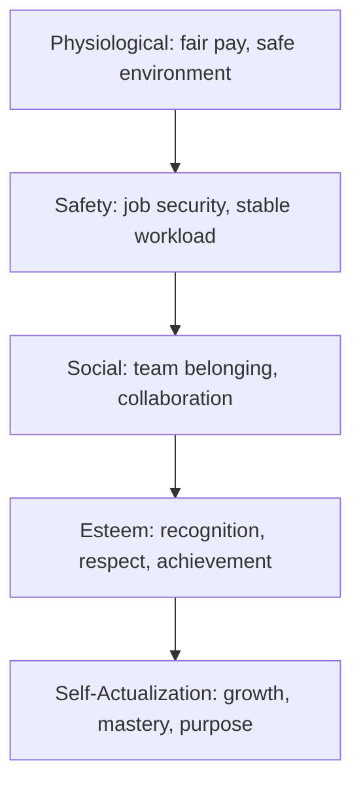

## Motivating Project Teams

### Definition and Importance

Motivation, in the project management context, refers to the internal and external drivers that influence a team member's willingness to direct effort toward project goals. Sustained team motivation directly affects productivity, quality, retention, and the likelihood of on-time, on-budget delivery. Because project teams are frequently temporary, cross-functional, and matrixed (with team members reporting to functional managers rather than the PM), motivation must often be achieved through influence rather than positional authority.

### Foundational Motivation Theories

**Maslow's Hierarchy of Needs**

Abraham Maslow's model proposes that human needs are arranged in a hierarchy, and lower-level needs must be substantially met before higher-level needs become motivating.

**Key Points**

- On projects: physiological/safety needs map to fair compensation and reasonable workload; esteem needs map to public recognition of contributions; self-actualization maps to challenging, meaningful work

**Herzberg's Two-Factor Theory**

Frederick Herzberg distinguished between **hygiene factors** (which prevent dissatisfaction but do not motivate) and **motivators** (which drive genuine engagement).

| Hygiene Factors (Dissatisfiers if absent) | Motivators (Drive engagement) |
| --- | --- |
| Salary and compensation | Achievement |
| Company policy/administration | Recognition |
| Working conditions | The work itself |
| Job security | Responsibility |
| Relationship with supervisor | Advancement/growth |

**Key Points**

- Improving hygiene factors (e.g., better tooling, fair pay) reduces dissatisfaction but does NOT increase motivation
- Only motivators drive genuine engagement and discretionary effort
- Implication for PMs: fix hygiene issues first (they're blockers), then invest in motivators (they're multipliers)

**McClelland's Theory of Needs**

David McClelland proposed that individuals are driven by three dominant needs in varying proportions:

- **Need for Achievement (nAch)**: Desire to excel, set challenging goals, and receive feedback on performance
- **Need for Affiliation (nAff)**: Desire for harmonious relationships and social acceptance
- **Need for Power (nPow)**: Desire to influence, lead, or control outcomes

[Inference] PMs can tailor motivational approaches based on which need dominates for each individual — achievement-driven members respond to stretch goals and metrics, affiliation-driven members respond to team cohesion activities, and power-driven members respond to leadership opportunities.

**Self-Determination Theory (SDT)**

Deci and Ryan's Self-Determination Theory identifies three innate psychological needs that drive intrinsic motivation:

- **Autonomy**: The sense of control over one's own work and decisions
- **Competence**: The feeling of being effective and capable
- **Relatedness**: The sense of connection to others

This theory underpins much of modern Agile practice (self-organizing teams, T-shaped skill growth, retrospectives) and is widely cited as more predictive of sustained engagement than purely extrinsic reward models.

**Vroom's Expectancy Theory**

Victor Vroom's model states that motivation is a function of three perceived relationships, often expressed as:

$$Motivation = Expectancy \times Instrumentality \times Valence$$

- **Expectancy**: Belief that effort will lead to the desired performance
- **Instrumentality**: Belief that performance will lead to a specific outcome/reward
- **Valence**: The value the individual places on that outcome

**Key Points**

- If any of the three factors is zero (e.g., the person doesn't believe effort will improve performance, or doesn't value the reward), total motivation collapses to zero
- Practical implication: goals must be achievable (expectancy), rewards must be clearly tied to performance (instrumentality), and rewards must matter to the individual (valence)

### Intrinsic vs. Extrinsic Motivation

| Type | Description | Project Examples |
| --- | --- | --- |
| Intrinsic | Motivation from internal satisfaction/interest | Interesting problems, autonomy, mastery, purpose |
| Extrinsic | Motivation from external rewards/consequences | Bonuses, promotions, public recognition, deadlines |

[Inference] Research broadly associated with Deci and Ryan's work suggests that over-reliance on extrinsic rewards for tasks that are already intrinsically interesting can reduce intrinsic motivation over time (the "overjustification effect"), so PMs should use extrinsic rewards deliberately rather than as a default lever.

### Practical Motivational Techniques for Project Managers

**Key Points**

- **Goal clarity**: Use SMART goals (Specific, Measurable, Achievable, Relevant, Time-bound) so team members clearly see the path from effort to outcome (supports Expectancy Theory)
- **Autonomy-supportive delegation**: Assign outcomes and boundaries, not just tasks; let team members choose their approach
- **Visible recognition**: Public acknowledgment in stand-ups, retrospectives, or stakeholder updates (Herzberg's motivator: recognition)
- **Skill-stretch assignments**: Pair task assignment with slightly-above-current-skill challenges to trigger flow states and growth (Maslow's self-actualization, McClelland's nAch)
- **Transparent purpose-setting**: Continually connect daily tasks to the larger project/organizational mission
- **Psychological safety**: Create an environment where mistakes are treated as learning opportunities, not punishment triggers
- **Fair and transparent reward systems**: Ensure that perceived instrumentality (performance → reward) is credible and consistent
- **Protect against burnout**: Monitor workload distribution; sustained overwork undermines both hygiene factors and long-term intrinsic motivation

### Motivational Diagnostic Framework (svg_diagram)

<svg xmlns="http://www.w3.org/2000/svg" viewBox="0 0 800 420" font-family="Arial, sans-serif">
<rect x="0" y="0" width="800" height="420" fill="#ffffff" />
<text x="400" y="28" text-anchor="middle" font-size="17" font-weight="bold" fill="#1a1a1a">Motivational Diagnostic Framework (svg_diagram)</text>
<rect x="40" y="60" width="340" height="140" rx="8" fill="#e8f0f7" stroke="#2c5f8a" stroke-width="1.5" />
<text x="210" y="85" text-anchor="middle" font-size="14" font-weight="bold" fill="#2c5f8a">Symptom: Low Effort/Engagement</text>
<text x="60" y="110" font-size="12" fill="#333">1. Check hygiene factors first</text>
<text x="60" y="130" font-size="12" fill="#333"> (pay, workload, tools, security)</text>
<text x="60" y="155" font-size="12" fill="#333">2. If hygiene is fine, diagnose</text>
<text x="60" y="175" font-size="12" fill="#333"> missing motivator (SDT: A/C/R)</text>
<rect x="420" y="60" width="340" height="140" rx="8" fill="#eef7e8" stroke="#4a8a2c" stroke-width="1.5" />
<text x="590" y="85" text-anchor="middle" font-size="14" font-weight="bold" fill="#4a8a2c">Symptom: Present but Unfulfilled</text>
<text x="440" y="110" font-size="12" fill="#333">1. Assess dominant need</text>
<text x="440" y="130" font-size="12" fill="#333"> (McClelland: nAch/nAff/nPow)</text>
<text x="440" y="155" font-size="12" fill="#333">2. Tailor task/reward to</text>
<text x="440" y="175" font-size="12" fill="#333"> match dominant driver</text>
<rect x="230" y="250" width="340" height="140" rx="8" fill="#f7efe8" stroke="#8a5a2c" stroke-width="1.5" />
<text x="400" y="275" text-anchor="middle" font-size="14" font-weight="bold" fill="#8a5a2c">Validate via Expectancy Theory</text>
<text x="250" y="300" font-size="12" fill="#333">Expectancy: Can they succeed?</text>
<text x="250" y="320" font-size="12" fill="#333">Instrumentality: Is reward certain?</text>
<text x="250" y="340" font-size="12" fill="#333">Valence: Do they value the reward?</text>
<text x="250" y="365" font-size="11" font-style="italic" fill="#555">All three required for motivation</text>
<line x1="210" y1="200" x2="350" y2="250" stroke="#888" stroke-width="1.5" />
<line x1="590" y1="200" x2="450" y2="250" stroke="#888" stroke-width="1.5" />
</svg>

### Team Motivation Across the Project Life Cycle

| Phase | Common Motivational Risk | Recommended Technique |
| --- | --- | --- |
| Initiation | Ambiguity about role/purpose | Clarify vision, involve team in goal-setting |
| Planning | Disengagement from perceived over-planning | Involve team in estimation and task breakdown |
| Execution | Fatigue, monotony, scope creep frustration | Celebrate milestones, rotate challenging work, protect focus time |
| Monitoring/Controlling | Demoralization from visible slippage | Transparent status reporting, reframe setbacks as learning |
| Closing | Anticlimax, uncertainty about next assignment | Formal recognition, retrospectives, career-path conversations |

### Motivation in Virtual and Distributed Teams

**Key Points**

- Relatedness (SDT) is harder to sustain remotely — deliberate virtual social touchpoints matter more, not less
- Recognition must be made explicitly visible (e.g., in written channels) since informal in-person praise doesn't occur naturally
- Autonomy support requires clear asynchronous communication of outcomes/boundaries versus synchronous micromanagement
- Time zone and cultural differences affect which extrinsic rewards (e.g., public recognition norms) are appropriate — cultural sensitivity is necessary when applying Western-derived motivation models globally [Unverified] as their applicability outside the cultural contexts in which they were developed varies

### Common Pitfalls

**Key Points**

- Assuming one-size-fits-all rewards work for a diverse team (ignoring individual differences per McClelland/SDT)
- Overusing extrinsic rewards for intrinsically interesting work, risking the overjustification effect
- Addressing motivators while hygiene factors remain broken (Herzberg) — this generally fails, since dissatisfaction dominates
- Setting goals that are too easy (no achievement value) or unrealistically difficult (destroys expectancy)
- Treating recognition as a one-time event rather than an ongoing practice
- Neglecting to adjust motivational tactics as team members' needs shift across project phases

### Related Topics

- Servant Leadership and Coaching
- Emotional Intelligence in Project Leadership
- Conflict Resolution and Negotiation Techniques
- Building High-Performing and Self-Organizing Teams
- Reward and Recognition Program Design
- Remote/Distributed Team Management
- Stakeholder Engagement vs. Team Engagement
- Organizational Behavior Fundamentals for PMs