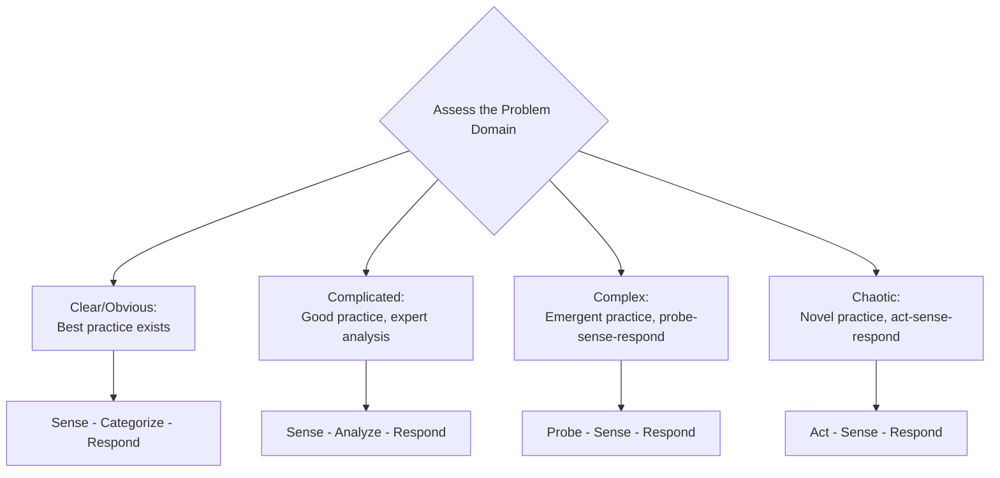
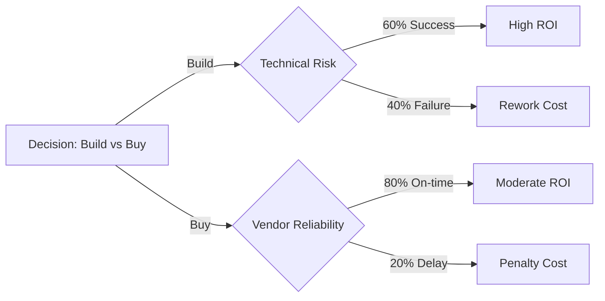

## Decision Making Under Uncertainty

### Definition and Scope

Decision making under uncertainty refers to the process of selecting a course of action when the outcomes of available options, their probabilities, or both are not fully known. This differs from decision making under **risk**, where probabilities of outcomes are known or estimable, and decision making under **certainty**, where outcomes are fully predictable. In project management, uncertainty pervades estimation, scheduling, resourcing, vendor selection, scope trade-offs, and stakeholder conflict resolution.

### Certainty, Risk, and Uncertainty: A Spectrum

| Condition | Outcome Knowledge | Probability Knowledge | Example |
| --- | --- | --- | --- |
| Certainty | Fully known | N/A (100%) | Fixed-price contract with defined deliverables |
| Risk | Known set of outcomes | Estimable probabilities | Historical defect rates inform QA planning |
| Uncertainty | Outcomes partially known | Probabilities unknown/unreliable | Novel technology adoption, unprecedented market conditions |
| Ambiguity | Outcomes not even fully identifiable | Not applicable | Undefined regulatory response to a new product category |

### The Cynefin Framework

Developed by Dave Snowden, the Cynefin framework helps leaders classify problems into domains that call for fundamentally different decision-making approaches.

**Key Points**

- **Clear domain**: Cause-and-effect relationships are obvious; apply established best practices (e.g., standard change request process)
- **Complicated domain**: Cause-and-effect requires expert analysis; apply good practices (e.g., technical architecture decisions requiring SME input)
- **Complex domain**: Cause-and-effect only clear in retrospect; run small experiments and adapt (e.g., adopting a new methodology, uncertain market response)
- **Chaotic domain**: No clear cause-and-effect; act first to stabilize, then sense and respond (e.g., critical production outage, crisis response)
- Most novel or innovative projects operate partly in the Complex domain, which is why Agile's iterative "probe-sense-respond" approach is well suited to uncertainty

### Decision-Making Models

**Rational/Classical Decision Model**

A sequential model assuming full information: (1) Define the problem, (2) Identify criteria, (3) Weight criteria, (4) Generate alternatives, (5) Evaluate alternatives, (6) Select best option, (7) Implement, (8) Review. [Inference] This model works well in the Clear/Complicated Cynefin domains but breaks down under genuine uncertainty because step 2–5 assume information that may not exist.

**Bounded Rationality (Herbert Simon)**

Herbert Simon's model recognizes that decision-makers have limited time, information, and cognitive capacity, leading them to **satisfice** (choose an acceptable option) rather than optimize (choose the theoretically best option). This is highly applicable to time-boxed project decisions where perfect information gathering is infeasible.

**Recognition-Primed Decision Model (Gary Klein)**

Klein's naturalistic decision-making model describes how experienced practitioners under time pressure match a situation to prior patterns and mentally simulate a single plausible course of action rather than comparing multiple options exhaustively. [Inference] This model is descriptive of how experienced PMs often make fast calls during incidents, though it depends on the PM having sufficiently relevant prior experience to pattern-match correctly.

**OODA Loop (Observe-Orient-Decide-Act)**

Developed by military strategist John Boyd, the OODA loop is a continuous decision cycle suited to fast-changing, adversarial, or crisis conditions:

- **Observe**: Gather current data on the situation
- **Orient**: Interpret data through the lens of experience, culture, and current context
- **Decide**: Select a course of action
- **Act**: Execute, then immediately re-observe

This loop emphasizes speed and iteration over exhaustive analysis, useful when uncertainty is compounded by a rapidly evolving situation (e.g., vendor failure mid-delivery, security incident).

### Decision-Making Tools for Quantifiable Uncertainty

**Expected Monetary Value (EMV)**

EMV is used in decision tree analysis to quantify the value of uncertain outcomes:

$$EMV = \sum_{i=1}^{n} P_i \times I_i$$

Where $P_i$ is the probability of outcome $i$ and $I_i$ is the monetary impact of outcome $i$.

**Example**

> A PM is deciding whether to use a new but unproven framework (Option A) or a proven legacy stack (Option B).
>
> - Option A: 40% chance of saving $50,000 in schedule cost, 60% chance of costing an extra $30,000 in rework
>
>
>
>   $$EMV_A = (0.40 \times 50000) + (0.60 \times -30000) = 20000 - 18000 = 2000$$
> - Option B: 100% chance of a known $5,000 cost
>
>
>
>   $$EMV_B = 1.00 \times -5000 = -5000$$
>
> Option A has a higher EMV ($2,000 vs. -$5,000), suggesting it may be the better statistical choice — but EMV does not capture risk tolerance, and a risk-averse organization might still choose Option B for its certainty.

**Decision Tree Analysis**

Decision trees visually map sequential decisions and their probabilistic outcomes, commonly used for go/no-go decisions, vendor selection, and phased-investment (real options) analysis.

**Monte Carlo Simulation**

For projects with multiple interacting uncertain variables (e.g., schedule, cost, resource availability), Monte Carlo simulation runs thousands of randomized iterations across probability distributions to produce a range of likely outcomes (e.g., "there is an 80% probability the project completes within 14 weeks"), rather than a single-point estimate. This is standard practice in quantitative schedule and cost risk analysis (per PMI's Practice Standard for Risk Management).

### Heuristics and Cognitive Biases Affecting Decisions

**Key Points**

- **Anchoring bias**: Over-relying on the first piece of information encountered (e.g., an initial vendor quote)
- **Confirmation bias**: Favoring information that confirms pre-existing beliefs about a chosen course of action
- **Availability heuristic**: Overweighting risks that are recent or vivid (e.g., a recent outage skewing future risk assessment)
- **Optimism bias**: Systematic underestimation of task duration/cost, well documented in project estimation research
- **Sunk cost fallacy**: Continuing a failing course of action because of prior investment rather than future value
- **Groupthink**: Suppression of dissenting views in pursuit of team consensus, especially dangerous in high-uncertainty decisions requiring diverse perspectives

[Inference] Structured techniques such as pre-mortems (imagining the decision has already failed and working backward to identify causes) and devil's advocacy roles are commonly recommended to counteract these biases, though their effectiveness varies by team culture and facilitation quality.

### Group Decision-Making Techniques

| Technique | Description | Best Suited For |
| --- | --- | --- |
| Delphi Technique | Anonymous, iterative expert surveys converging on consensus | Long-range forecasting, expert-heavy uncertain domains |
| Nominal Group Technique | Structured individual idea generation, then group ranking | Balancing dominant voices in group settings |
| Multi-Voting/Dot Voting | Team members allocate limited votes across options | Quick prioritization among many options |
| RACI-Informed Decision Rights | Clarifies who decides, who's consulted, who's informed | Reducing ambiguity in decision authority |
| Consent-Based Decision Making | Proceed unless there is a reasoned, substantial objection | Agile/self-organizing teams under moderate uncertainty |

### Decision-Making Framework Selection Guide (svg_diagram)

<svg xmlns="http://www.w3.org/2000/svg" viewBox="0 0 800 400" font-family="Arial, sans-serif">
<rect x="0" y="0" width="800" height="400" fill="#ffffff" />
<text x="400" y="28" text-anchor="middle" font-size="17" font-weight="bold" fill="#1a1a1a">Decision Framework Selection Guide (svg_diagram)</text>
<rect x="30" y="60" width="220" height="100" rx="8" fill="#e8f0f7" stroke="#2c5f8a" stroke-width="1.5" />
<text x="140" y="85" text-anchor="middle" font-size="13" font-weight="bold" fill="#2c5f8a">Low Uncertainty</text>
<text x="140" y="110" text-anchor="middle" font-size="11" fill="#333">Rational Model</text>
<text x="140" y="130" text-anchor="middle" font-size="11" fill="#333">EMV / Decision Trees</text>
<rect x="290" y="60" width="220" height="100" rx="8" fill="#eef7e8" stroke="#4a8a2c" stroke-width="1.5" />
<text x="400" y="85" text-anchor="middle" font-size="13" font-weight="bold" fill="#4a8a2c">Moderate Uncertainty</text>
<text x="400" y="110" text-anchor="middle" font-size="11" fill="#333">Bounded Rationality</text>
<text x="400" y="130" text-anchor="middle" font-size="11" fill="#333">Monte Carlo Simulation</text>
<rect x="550" y="60" width="220" height="100" rx="8" fill="#f7efe8" stroke="#8a5a2c" stroke-width="1.5" />
<text x="660" y="85" text-anchor="middle" font-size="13" font-weight="bold" fill="#8a5a2c">High Uncertainty</text>
<text x="660" y="110" text-anchor="middle" font-size="11" fill="#333">Cynefin Probe-Sense-Respond</text>
<text x="660" y="130" text-anchor="middle" font-size="11" fill="#333">RPD Model</text>
<rect x="290" y="220" width="220" height="100" rx="8" fill="#f7e8ec" stroke="#8a2c4a" stroke-width="1.5" />
<text x="400" y="245" text-anchor="middle" font-size="13" font-weight="bold" fill="#8a2c4a">Crisis / Time-Critical</text>
<text x="400" y="270" text-anchor="middle" font-size="11" fill="#333">OODA Loop</text>
<text x="400" y="290" text-anchor="middle" font-size="11" fill="#333">Cynefin Act-Sense-Respond</text>
<line x1="140" y1="160" x2="140" y2="360" stroke="#ccc" stroke-width="1" />
<line x1="660" y1="160" x2="660" y2="360" stroke="#ccc" stroke-width="1" />
<text x="400" y="370" text-anchor="middle" font-size="11" font-style="italic" fill="#555">Framework choice shifts with both uncertainty level and time pressure</text>
</svg>

### Practical Techniques for PMs

**Key Points**

- **Rolling wave planning**: Plan near-term work in detail; keep distant work at a high level, refined as uncertainty resolves
- **Timeboxed experiments/spikes**: Use short, bounded investigations to convert unknowns into knowns before committing resources
- **Reserve analysis**: Maintain contingency reserves (known-unknowns) and management reserves (unknown-unknowns) sized to the uncertainty level
- **Decision logs**: Document the context, options considered, and rationale for key decisions to support traceability and organizational learning
- **Pre-mortems**: Before finalizing a major decision, have the team imagine it failed and identify plausible causes
- **Scenario planning**: Develop multiple plausible future scenarios (best case, worst case, most likely) and stress-test decisions against each

### Common Pitfalls

**Key Points**

- Applying rational/analytical decision models to Complex or Chaotic domain problems, leading to analysis paralysis
- Treating all uncertainty as quantifiable risk when some is genuinely unknowable in advance (true "unknown-unknowns")
- Ignoring cognitive biases by assuming expert judgment is automatically objective
- Failing to revisit decisions as new information emerges (anchoring on the original decision)
- Over-centralizing decision authority in high-uncertainty situations where distributed, fast local decisions would perform better
- Under-communicating the rationale behind decisions, undermining stakeholder trust during ambiguous periods

### Related Topics

- Servant Leadership and Coaching
- Risk Management Planning and Risk Response Strategies
- Quantitative Risk Analysis (Monte Carlo, Sensitivity Analysis)
- Agile and Adaptive Life Cycle Approaches
- Stakeholder Communication During Ambiguity
- Conflict Resolution and Negotiation Techniques
- Change Management and Organizational Resilience