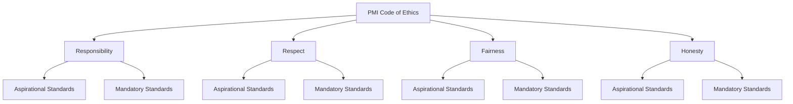
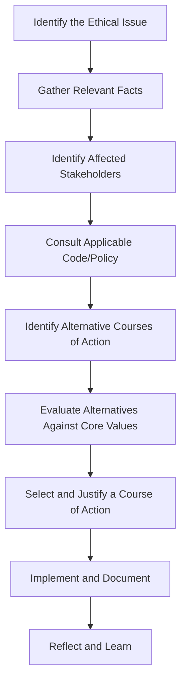

## Ethics and Professional Responsibility

### Definition and Scope

Ethics in project management refers to the application of moral principles to guide decision-making and conduct in professional practice. Professional responsibility encompasses the obligations a project manager holds toward the profession, stakeholders, society, and the environment — extending beyond legal compliance to encompass values-based conduct even when no law explicitly mandates it. Ethical practice is foundational to sustaining trust, credibility, and the legitimacy of the project management profession as a whole.

### PMI Code of Ethics and Professional Conduct

The Project Management Institute (PMI) Code of Ethics and Professional Conduct is the primary formal ethical framework referenced in the field, built around four core values, each with both **aspirational standards** (what practitioners should strive for) and **mandatory standards** (enforceable requirements for PMI members and credential holders).

**The Four Core Values**

1. **Responsibility** — Taking ownership of decisions made and not made, the actions taken and not taken, and the consequences that result
2. **Respect** — Showing high regard for oneself, others, and the resources entrusted to one's care (people, money, reputation, environment)
3. **Fairness** — Making decisions and acting impartially, without favoritism, bias, or conflicts of interest
4. **Honesty** — Understanding the truth and acting in a truthful manner, both in communications and conduct

**Key Points**

- Aspirational standards describe the conduct practitioners *strive to* uphold; violations are not typically subject to disciplinary action
- Mandatory standards establish firm requirements; violations *can* result in disciplinary procedures, including revocation of PMI credentials
- The Code applies to PMI members, credential holders (including PMP holders), volunteers, and those who apply to obtain a PMI credential

### Responsibility in Practice

| Aspirational Behavior | Mandatory Behavior |
| --- | --- |
| Make decisions based on the best interests of society, public safety, and the environment | Comply with all organizational policies, laws, and regulations |
| Accept only assignments consistent with background, experience, and qualifications | Report unethical/illegal conduct to appropriate management or authorities |
| Fulfill commitments made in good faith | Take responsibility for one's own errors and correct them promptly |
| Take ownership for mistakes and correct them promptly | Maintain and respect confidential/proprietary information |

### Respect in Practice

**Key Points**

- Listen to others' perspectives, seeking to understand them
- Approach direct/harsh feedback in a manner that preserves dignity
- Conduct oneself professionally, even when others do not reciprocate
- Do not use power (positional, informational, or expert) to compel others inappropriately
- Negotiate in good faith

### Fairness in Practice

**Key Points**

- Demonstrate transparency in decision-making
- Constantly reexamine impartiality and objectivity, taking corrective action when bias is identified
- Provide equal access to information to all authorized parties
- Disclose real or potential conflicts of interest to stakeholders and affected parties
- Do not engage in favoritism or discrimination based on gender, race, age, religion, disability, nationality, or sexual orientation

**Conflict of Interest** is a recurring focus area: a situation is a conflict of interest when a project manager's personal, financial, or professional interests could improperly influence their professional judgment or actions. PMI's mandatory standards require proactive disclosure of actual or potential conflicts to the appropriate stakeholders as soon as the practitioner becomes aware of them.

### Honesty in Practice

**Key Points**

- Earnestly seek to understand the truth
- Be truthful in communications and in conduct, including non-verbal communication (body language, omission)
- Provide accurate information in a timely manner
- Do not engage in dishonest behavior to secure personal advantage or advantage for others (e.g., inflating status reports, hiding schedule slippage)
- Create an environment where others feel safe to tell the truth

### Common Ethical Dilemmas in Project Management

| Dilemma Type | Example Scenario | Relevant Value(s) |
| --- | --- | --- |
| Reporting pressure | Sponsor pressures PM to report "green" status despite known risk of slippage | Honesty, Responsibility |
| Resource allocation | Favoring a preferred vendor/team member without documented justification | Fairness |
| Confidentiality breach | Sharing proprietary client data with a competing project stakeholder | Respect, Responsibility |
| Scope/quality trade-off | Cutting corners on testing to meet a deadline without informing stakeholders | Honesty, Responsibility |
| Whistleblowing | Discovering safety violations or fraud and facing pressure to stay silent | Responsibility, Honesty |
| Cultural conflict | Gift-giving norms in one culture appearing as bribery under another jurisdiction's law | Fairness, Respect |

### Ethical Decision-Making Framework

A structured approach for resolving ethical dilemmas in project contexts:

**Key Points**

- Identifying *whose* interests are affected (team, sponsor, end users, society) often clarifies which value should take precedence when values conflict
- Documenting the rationale for an ethical decision protects the practitioner and provides an audit trail if the decision is later questioned
- When legal requirements and ethical codes conflict across jurisdictions (common in global projects), practitioners should generally default to the stricter standard unless doing so is itself unlawful in the operating jurisdiction [Unverified] as specific legal conflicts require jurisdiction-specific legal counsel rather than a general framework

### Professional Responsibility Beyond the Code

**Environmental and Social Responsibility**

[Inference] Increasingly, project management professional standards (including expanded content in recent PMBOK editions) emphasize sustainability and broader social/environmental impact as part of professional responsibility, reflecting wider industry trends toward ESG (Environmental, Social, Governance) considerations in project selection and execution — though the specific weight given to these factors varies significantly by industry and organization.

**Responsibility to the Profession**

- Contributing to the project management body of knowledge (mentoring, knowledge-sharing, publishing lessons learned)
- Truthful representation of one's own qualifications and PMI credentials
- Supporting fair and accurate application of PMI's credentialing processes (e.g., not assisting others in fraudulently obtaining certifications)

**Responsibility to the Public**

- Prioritizing public safety over expedience or cost savings when the two conflict
- Considering downstream/unintended consequences of project outcomes on communities and the environment

### Ethics Complaint and Enforcement Process (PMI Context)

**Key Points**

- Reported violations of PMI's mandatory standards are reviewed via PMI's Ethics Review Committee process
- Consequences for substantiated violations can range from a reprimand to suspension or permanent revocation of PMI membership and credentials
- The process typically includes an investigation phase, an opportunity for the accused to respond, and a determination with potential appeal rights [Unverified] as exact procedural steps are governed by PMI's current published policies, which should be consulted directly for authoritative detail

### Practical Techniques for Upholding Ethics

**Key Points**

- **Document decisions and rationale**: Maintain a decision log for ethically sensitive calls
- **Establish escalation paths**: Know in advance who to contact when facing pressure to act unethically (compliance officer, PMO, legal)
- **Build a values-based team culture**: Model transparency and correction of errors openly rather than punitively
- **Use structured disclosure practices**: Proactively disclose conflicts of interest in writing, even when seemingly minor
- **Seek peer/mentor consultation**: Discuss ambiguous ethical situations with trusted peers or a PMO ethics resource before acting
- **Separate the person from the pressure**: Distinguish organizational/political pressure from the actual ethical obligation, and resist rationalizing violations as "just this once"

### Common Pitfalls

**Key Points**

- Rationalizing small ethical compromises as harmless because "everyone does it"
- Conflating legal compliance with full ethical conduct — an action can be legal but still unethical
- Failing to disclose conflicts of interest proactively, assuming silence is acceptable if not directly asked
- Suppressing bad news to avoid short-term conflict, undermining both honesty and long-term trust
- Applying ethical standards inconsistently based on stakeholder seniority (e.g., stricter honesty with team members than with executives)
- Treating ethics training as a one-time compliance checkbox rather than an ongoing practice embedded in daily decisions

### Related Topics

- Building Trust and Credibility
- Servant Leadership and Coaching
- Conflict Resolution and Negotiation Techniques
- Stakeholder Engagement and Communication Planning
- Decision Making Under Uncertainty
- Governance and Compliance in Project Management
- Diversity, Equity, and Inclusion in Project Teams