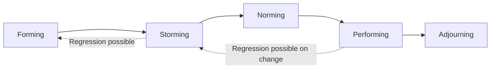

## Team Formation Stages from Forming to Adjourning

### Definition and Origin

The Forming-Storming-Norming-Performing-Adjourning model describes the typical stages a team progresses through as it develops from a collection of individuals into a cohesive, high-performing unit. The original four stages (Forming, Storming, Norming, Performing) were proposed by psychologist Bruce Tuckman in his 1965 paper synthesizing existing small-group development research. Tuckman added the fifth stage, Adjourning, in a 1977 revision co-authored with Mary Ann Jensen. This model is explicitly referenced in the PMBOK Guide as a foundational framework for understanding team development.

### The Five Stages Overview

**Key Points**

- Progression is not strictly linear — teams can regress to earlier stages when membership changes, scope shifts significantly, or major conflict emerges
- Not all teams reach the Performing stage; some plateau in Norming or remain cyclically in Storming
- The model applies to newly formed teams, but also re-applies (fully or partially) whenever team composition or context changes materially

### Stage 1: Forming

Forming is the initial stage where team members come together, typically characterized by politeness, cautious behavior, and dependence on the leader for direction.

**Key Points**

- Team members are getting acquainted, testing boundaries, and seeking clarity on roles, goals, and expected behaviors
- Conflict is typically minimal or suppressed, as members are still establishing social norms
- Productivity is low relative to potential, since the team has not yet established working patterns
- Individuals tend to work somewhat independently rather than collaboratively
- The leader's primary role: provide clear direction, define goals/roles, and facilitate introductions

**Example**

> A newly assembled cross-functional project team holds its kickoff meeting. Members introduce themselves, review the project charter, and ask clarifying questions about scope and reporting lines, but no one yet challenges the proposed approach.

### Stage 2: Storming

Storming is characterized by emerging conflict as team members assert opinions, compete for roles/influence, and push back against structure or each other.

**Key Points**

- Interpersonal friction increases as differing working styles, opinions, and priorities surface
- Team members may challenge the leader's authority or the proposed approach
- Cliques or subgroups can form; some members may become frustrated or disengaged
- Productivity often dips during this stage due to unresolved conflict and ambiguity
- This stage is uncomfortable but necessary — [Inference] research broadly associated with Tuckman's model suggests that avoiding or suppressing Storming (rather than working through it) tends to produce shallow, brittle team cohesion that resurfaces as conflict later, though the specific mechanism and severity vary by team and context
- The leader's primary role: facilitate constructive conflict resolution, coach on communication norms, and avoid over-directing (which can suppress necessary conflict) or under-directing (which can allow dysfunction to fester)

**Example**

> Two senior developers disagree publicly over the technical architecture during a design review, and a team member expresses frustration that their input was overlooked during initial planning.

### Stage 3: Norming

Norming occurs as the team resolves earlier conflicts, establishes shared working agreements, and begins to develop cohesion and mutual respect.

**Key Points**

- Team members develop trust and begin to appreciate each other's strengths and working styles
- Group norms, communication protocols, and informal rules of engagement solidify (often formalized as a team charter or working agreement)
- Collaboration increases; individuals become more willing to give and receive feedback
- Productivity begins to climb as friction decreases
- The leader's primary role: reinforce positive norms, delegate increasing responsibility, and continue facilitating (rather than directing) collaboration

**Example**

> The team agrees on a shared definition of "done," establishes a norm of raising blockers within 24 hours, and begins pairing junior and senior members without prompting from the PM.

### Stage 4: Performing

Performing is the stage where the team operates as a cohesive, high-functioning unit, capable of high autonomy and productivity with minimal direct oversight.

**Key Points**

- The team is competent, autonomous, and confident in its ability to solve problems collaboratively
- Interdependence is high — members understand how their work affects others and coordinate proactively
- Conflict still occurs but is generally resolved constructively and quickly
- The leader's role shifts significantly toward delegation, removing organizational obstacles, and strategic guidance, consistent with servant leadership principles
- Not all teams reach this stage before the project concludes — [Inference] project teams with short durations, frequent membership turnover, or highly distributed/virtual structures may struggle to reach full Performing status, a pattern generally discussed in team development literature though quantified less precisely than the model's qualitative stages

**Example**

> The team self-organizes to reprioritize a sprint after an unexpected dependency delay, without escalating to the PM, and proactively communicates the revised plan to stakeholders.

### Stage 5: Adjourning

Adjourning (sometimes called "Mourning" or "Termination") is the final stage, occurring as the project concludes and the team disbands.

**Key Points**

- Team members shift focus from task completion to closure, reflection, and transition
- Emotional responses vary — some members feel satisfaction and pride, others may feel loss, especially after a long or intense engagement, or anxiety about reassignment
- This stage is particularly relevant to project-based (as opposed to permanent/operational) teams, since project teams are explicitly temporary by definition
- The leader's primary role: facilitate closure activities (retrospectives, celebrations, formal recognition), support transition planning, and ensure knowledge transfer before disbandment

**Example**

> At project closeout, the PM facilitates a final retrospective, documents lessons learned, formally recognizes individual and team contributions, and has one-on-one conversations with team members about their next assignments.

### Team Development Stage Characteristics Summary

| Stage | Conflict Level | Productivity | Leader's Role | Team Autonomy |
| --- | --- | --- | --- | --- |
| Forming | Low (suppressed) | Low | Directive | Low |
| Storming | High | Low-Moderate | Coaching/Facilitative | Low-Moderate |
| Norming | Moderate, constructive | Moderate-Rising | Facilitative | Moderate |
| Performing | Low, resolved quickly | High | Delegating | High |
| Adjourning | Variable (closure-related) | Declining (shifts to closure tasks) | Facilitative/Supportive | Variable |

### Team Development Diagram (svg_diagram)

<svg xmlns="http://www.w3.org/2000/svg" viewBox="0 0 820 400" font-family="Arial, sans-serif">
<rect x="0" y="0" width="820" height="400" fill="#ffffff" />
<text x="410" y="28" text-anchor="middle" font-size="17" font-weight="bold" fill="#1a1a1a">Team Development Curve (svg_diagram)</text>
<line x1="60" y1="340" x2="780" y2="340" stroke="#333" stroke-width="1.5" />
<line x1="60" y1="340" x2="60" y2="50" stroke="#333" stroke-width="1.5" />
<text x="30" y="200" text-anchor="middle" font-size="11" fill="#333" transform="rotate(-90 30 200)">Productivity</text>
<text x="420" y="375" text-anchor="middle" font-size="11" fill="#333">Time / Stage Progression</text>

<path d="M 100 300 Q 180 260 220 300 Q 280 340 340 300 Q 420 220 500 180 Q 600 130 680 110 Q 720 150 750 220" fill="none" stroke="`#2c5f8a`" stroke-width="3" />

<text x="100" y="320" text-anchor="middle" font-size="11" font-weight="bold" fill="`#2c5f8a`">Forming</text>

<text x="260" y="320" text-anchor="middle" font-size="11" font-weight="bold" fill="`#8a2c4a`">Storming</text>

<text x="420" y="320" text-anchor="middle" font-size="11" font-weight="bold" fill="`#8a5a2c`">Norming</text>

<text x="620" y="320" text-anchor="middle" font-size="11" font-weight="bold" fill="`#4a8a2c`">Performing</text>

<text x="750" y="320" text-anchor="middle" font-size="11" font-weight="bold" fill="#555">Adjourning</text>

<line x1="180" y1="60" x2="180" y2="340" stroke="#eee" stroke-width="1" stroke-dasharray="3,3" />
<line x1="340" y1="60" x2="340" y2="340" stroke="#eee" stroke-width="1" stroke-dasharray="3,3" />
<line x1="540" y1="60" x2="540" y2="340" stroke="#eee" stroke-width="1" stroke-dasharray="3,3" />
<line x1="700" y1="60" x2="700" y2="340" stroke="#eee" stroke-width="1" stroke-dasharray="3,3" />
</svg>

### Leadership Actions by Stage

**Key Points**

- **Forming**: Clarify charter, roles, and goals; make introductions; set initial ground rules; be highly available
- **Storming**: Facilitate open conflict resolution; establish communication norms; avoid suppressing disagreement; coach individuals privately when needed
- **Norming**: Reinforce positive behaviors; formalize working agreements; begin delegating meaningful decisions; celebrate early wins
- **Performing**: Delegate broadly; focus on removing external obstacles; provide strategic context; step back from day-to-day direction
- **Adjourning**: Facilitate retrospectives and knowledge transfer; recognize contributions; support transition/reassignment planning; document lessons learned

### Application to Modern Team Structures

**Key Points**

- **Agile teams**: Sprints can trigger repeated mini-cycles through the stages, especially when team composition changes between sprints or major retrospective-driven changes occur
- **Virtual/distributed teams**: Storming can be harder to detect (less visible non-verbal cues) and may manifest as passive disengagement rather than open conflict; deliberate facilitation is often needed to surface it
- **Matrixed teams**: Partial team membership (individuals split across multiple projects) can slow progression through Norming, since full team cohesion is diluted
- **High-turnover teams**: Frequent onboarding/offboarding can effectively reset parts of the team to Forming/Storming even while other members remain in Performing

### Common Pitfalls

**Key Points**

- Assuming the stages are strictly linear and one-directional, missing signs of regression after a disruptive change
- Suppressing Storming-stage conflict to maintain surface harmony, which tends to resurface as passive resistance or later dysfunction
- Failing to recognize that team composition changes (new members, departures) can reset development stages, even mid-project
- Neglecting the Adjourning stage, particularly on long or emotionally significant projects, leading to poor closure and lost lessons learned
- Applying uniform leadership style regardless of stage (e.g., continuing directive leadership into the Performing stage, which can frustrate an autonomous team)
- Misreading Norming-stage calm as full Performing-stage capability, leading to premature reduction of leadership support

### Related Topics

- Servant Leadership and Coaching
- Conflict Resolution and Negotiation Techniques
- Building Trust and Credibility
- Team Charters and Working Agreements
- Virtual and Distributed Team Management
- Retrospectives and Continuous Improvement Practices
- Motivating Project Teams