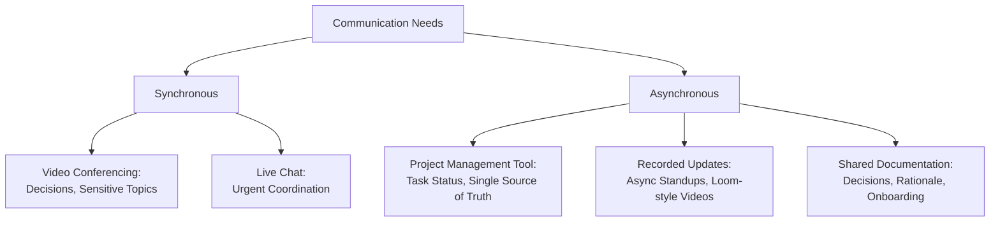

## Virtual and Distributed Team Management

### Definition and Scope

Virtual and distributed team management refers to the practices, tools, and leadership adaptations required to effectively lead project teams whose members are not co-located, and who therefore rely primarily on digital communication channels rather than face-to-face interaction. Distributed teams may span time zones, cultures, organizational boundaries (in matrixed or multi-vendor projects), and levels of connectivity/infrastructure. This is distinct from co-located teams in ways that materially affect communication, trust-building, coordination, and conflict management.

### Types of Distributed Team Configurations

| Configuration | Description | Primary Challenge |
| --- | --- | --- |
| Fully Remote, Same Time Zone | All members remote, minimal time-zone overlap issues | Isolation, lack of informal interaction |
| Fully Remote, Multi-Time-Zone | Members spread across significant time differences | Synchronous coordination, response latency |
| Hybrid | Mix of co-located and remote members | Information asymmetry between in-office and remote members |
| Follow-the-Sun | Deliberately staffed across time zones for continuous coverage | Handoff quality, knowledge continuity |
| Multi-Vendor/Multi-Organization | Team spans organizational and often cultural boundaries | Divergent tools, processes, and incentive structures |

### Core Challenges of Distributed Teams

**Key Points**

- **Reduced non-verbal cues**: Text and even video communication strip away much of the non-verbal context available in person, increasing risk of misunderstanding
- **Asynchronous coordination overhead**: Time-zone gaps delay question-answer cycles, slowing decision velocity
- **Weaker informal trust-building**: Spontaneous hallway conversations and shared physical context don't occur naturally, requiring deliberate substitutes
- **"Out of sight" bias**: Remote team members can be inadvertently excluded from decisions or recognition simply due to reduced visibility
- **Tooling fragmentation**: Multiple overlapping communication/collaboration tools can create confusion about where information "lives"
- **Cultural and linguistic diversity**: Distributed teams often span cultures with different communication norms, working styles, and holiday/availability calendars

### Communication Architecture for Distributed Teams

**Key Points**

- **Synchronous-first temptation**: Teams often default to scheduling more meetings to compensate for distance, which is frequently counterproductive across time zones — asynchronous-first communication generally scales better
- **Single source of truth**: A shared, authoritative system of record (task tracker, wiki, shared drive) prevents information fragmentation across chat threads and emails
- **Documented decisions**: Written decision logs are more important in distributed settings, since informal verbal context isn't equally available to all members

### Time Zone Management Strategies

**Key Points**

- **Overlap windows**: Identify and protect a defined block of overlapping working hours for synchronous coordination, even if brief
- **Rotating meeting times**: When full overlap is impossible, rotate meeting times so the "inconvenience" of off-hours meetings is shared fairly rather than always falling on the same region
- **Meeting recording and async follow-up**: Record synchronous meetings and provide structured summaries for those who couldn't attend live
- **Explicit handoff protocols**: For follow-the-sun models, define clear handoff documentation standards (status, blockers, next steps) between shifts

### Trust-Building in Virtual Teams

Building on general trust principles, distributed settings require deliberate compensation for the loss of informal, co-located trust-building opportunities.

**Key Points**

- Schedule regular 1:1s with video on (where culturally appropriate) to build relational trust
- Create structured "virtual water cooler" opportunities (optional social channels, informal check-ins) rather than relying on spontaneous interaction
- Be more explicit and visible about recognition, since informal praise doesn't propagate naturally in distributed settings
- Default to over-communication early in a distributed team's formation, then calibrate down as trust and shared context develop
- Model vulnerability and transparency on video calls to compensate for reduced non-verbal trust signals

### Tools and Technology Stack

| Category | Purpose | Example Tool Types |
| --- | --- | --- |
| Video Conferencing | Synchronous discussion, relationship building | Zoom, Teams, Google Meet |
| Project/Task Management | Single source of truth for work status | Jira, Asana, Trello, Azure DevOps |
| Persistent Chat | Quick coordination, informal interaction | Slack, Microsoft Teams |
| Shared Documentation | Decisions, onboarding, knowledge base | Confluence, Notion, SharePoint |
| Asynchronous Video | Status updates without live meetings | Loom-style recorded updates |
| Virtual Whiteboarding | Collaborative visual work | Miro, Mural, FigJam |

**Key Points**

- Tool sprawl (too many overlapping tools) is a common failure mode — consolidate around a minimal, clearly-scoped toolset with defined purposes for each
- Access and permissions management becomes more complex across organizational boundaries in multi-vendor distributed teams

### Distributed Team Meeting Cadence Model (svg_diagram)

<svg xmlns="http://www.w3.org/2000/svg" viewBox="0 0 800 380" font-family="Arial, sans-serif">
<rect x="0" y="0" width="800" height="380" fill="#ffffff" />
<text x="400" y="28" text-anchor="middle" font-size="17" font-weight="bold" fill="#1a1a1a">Distributed Team Communication Cadence (svg_diagram)</text>
<rect x="40" y="60" width="220" height="260" rx="8" fill="#e8f0f7" stroke="#2c5f8a" stroke-width="1.5" />
<text x="150" y="85" text-anchor="middle" font-size="13" font-weight="bold" fill="#2c5f8a">Daily</text>
<text x="60" y="115" font-size="11" fill="#333">Async status update</text>
<text x="60" y="135" font-size="11" fill="#333">(written or recorded)</text>
<text x="60" y="165" font-size="11" fill="#333">Team chat monitoring</text>
<text x="60" y="195" font-size="11" fill="#333">Blocker flagging in</text>
<text x="60" y="215" font-size="11" fill="#333">tracker</text>
<rect x="290" y="60" width="220" height="260" rx="8" fill="#eef7e8" stroke="#4a8a2c" stroke-width="1.5" />
<text x="400" y="85" text-anchor="middle" font-size="13" font-weight="bold" fill="#4a8a2c">Weekly</text>
<text x="310" y="115" font-size="11" fill="#333">Synchronous team</text>
<text x="310" y="135" font-size="11" fill="#333">meeting (rotated time)</text>
<text x="310" y="165" font-size="11" fill="#333">1:1 check-ins</text>
<text x="310" y="195" font-size="11" fill="#333">Stakeholder status</text>
<text x="310" y="215" font-size="11" fill="#333">report</text>
<rect x="540" y="60" width="220" height="260" rx="8" fill="#f7efe8" stroke="#8a5a2c" stroke-width="1.5" />
<text x="650" y="85" text-anchor="middle" font-size="13" font-weight="bold" fill="#8a5a2c">Periodic</text>
<text x="560" y="115" font-size="11" fill="#333">Retrospectives</text>
<text x="560" y="145" font-size="11" fill="#333">Informal social/</text>
<text x="560" y="165" font-size="11" fill="#333">virtual team-building</text>
<text x="560" y="195" font-size="11" fill="#333">In-person gathering</text>
<text x="560" y="215" font-size="11" fill="#333">(if feasible)</text>

<text x="400" y="350" text-anchor="middle" font-size="11" font-style="italic" fill="#555">Cadence balances async-first efficiency with periodic synchronous relationship-building</text>

</svg>

### Cultural Considerations

**Key Points**

- Communication directness norms vary significantly across cultures (e.g., high-context vs. low-context communication styles); PMs should calibrate feedback delivery accordingly
- Hierarchy and authority perceptions differ — in some cultures, team members may be less likely to openly disagree with a leader in a group setting, requiring alternative channels for dissent (private feedback, anonymous surveys)
- Holiday calendars, working week structures (e.g., Friday-Saturday weekends in some regions), and religious observances affect availability planning
- [Unverified] as specific cultural dimension frameworks (e.g., Hofstede's cultural dimensions) offer useful heuristics but should not be applied as rigid stereotypes to individuals; treat them as starting hypotheses to validate through direct relationship-building

### Performance Management in Distributed Settings

**Key Points**

- Shift evaluation focus from visible "activity" (time online, immediate response) to outcome-based deliverables, since presence is not directly observable
- Establish clear, documented expectations for availability windows and response times to reduce ambiguity
- Use structured check-ins rather than relying on incidental visibility to detect struggling team members early
- Be alert to signs of isolation or burnout, which can be less visible without in-person cues — proactively check in rather than waiting for self-reporting

### Practical Techniques for PMs

**Key Points**

- **Team charter for distributed norms**: Explicitly document communication channels, response-time expectations, and meeting etiquette (e.g., cameras on/off norms)
- **Overlap-hour protection**: Reserve identified overlap windows exclusively for synchronous, high-value coordination — not routine status updates
- **Rotating "meeting tax"**: Distribute the burden of inconvenient meeting times fairly across time zones
- **Written-first culture**: Default to written documentation for decisions and status, using synchronous meetings for discussion/debate rather than information transfer
- **Deliberate onboarding**: New distributed team members need more structured, explicit onboarding since they can't passively absorb context from ambient office activity
- **Visible recognition rituals**: Build explicit habits (e.g., a recognition channel, structured shout-outs in team meetings) to compensate for reduced informal visibility

### Common Pitfalls

**Key Points**

- Defaulting to excessive synchronous meetings to compensate for distance, creating fatigue and reducing focus time
- Consistently scheduling meetings at times convenient only for one region/time zone, creating perceived inequity
- Under-documenting decisions, assuming shared context that distributed members don't actually have
- Neglecting relationship-building in favor of pure task-focus, weakening long-term trust and collaboration
- Treating hybrid teams' remote members as an afterthought relative to co-located members (information/decision asymmetry)
- Assuming video-call "presence" is an adequate substitute for genuine engagement, without validating actual understanding or alignment

### Related Topics

- Team Formation Stages from Forming to Adjourning
- Servant Leadership and Coaching
- Building Trust and Credibility
- Conflict Resolution and Negotiation Techniques
- Stakeholder Engagement and Communication Planning
- Cross-Cultural Communication in Global Projects
- Motivating Project Teams