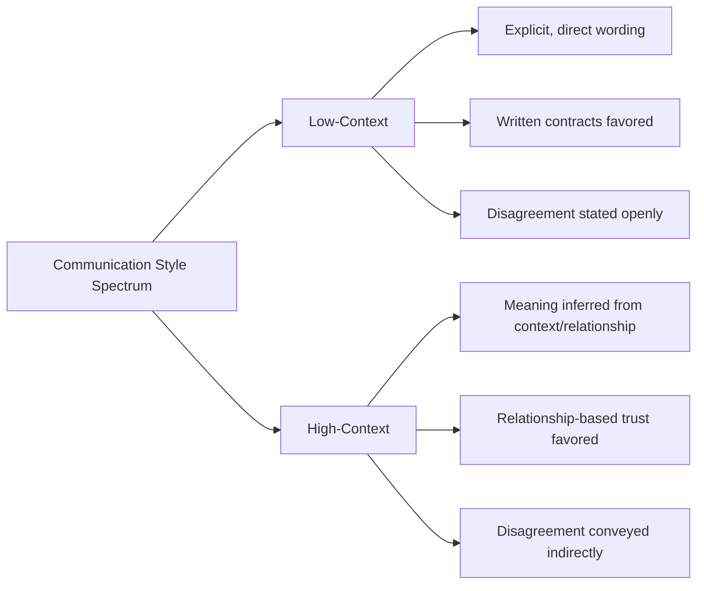

## Cross Cultural Team Dynamics

### Definition and Scope

Cross-cultural team dynamics refers to the patterns of interaction, communication, decision-making, and conflict that emerge when project team members come from different national, organizational, or ethnic cultural backgrounds. As global and multi-vendor projects have become more common, understanding how cultural differences shape team behavior has become a core competency for project managers, distinct from (but overlapping with) general virtual/distributed team management.

### Why Cultural Awareness Matters in Projects

**Key Points**

- Miscommunication rooted in differing cultural norms is a common, under-diagnosed cause of project conflict and delay
- Decision-making speed, escalation behavior, and willingness to voice disagreement vary systematically across cultures
- Ignoring cultural context can lead a PM to misinterpret silence, indirectness, or formality as disengagement or incompetence
- Culturally aware leadership improves psychological safety and inclusion for a genuinely diverse team, supporting better information flow and risk surfacing

### Hofstede's Cultural Dimensions Theory

Geert Hofstede's research, based on large-scale surveys originally conducted within IBM across dozens of countries, identified dimensions along which national cultures systematically differ. This remains one of the most widely referenced frameworks in cross-cultural management, though it is a generalization at the national level and should not be applied rigidly to individuals.

| Dimension | Description | Project Management Implication |
| --- | --- | --- |
| Power Distance | Degree to which hierarchical authority is accepted | High: team defers to PM/sponsor decisions readily. Low: team expects consultation, may challenge authority openly |
| Individualism vs. Collectivism | Priority on individual achievement vs. group harmony | Individualist: personal recognition motivates. Collectivist: team-based recognition and harmony matter more |
| Uncertainty Avoidance | Comfort with ambiguity and unstructured situations | High: prefers detailed plans, documented processes. Low: comfortable with iterative, adaptive approaches |
| Masculinity vs. Femininity | Competitive achievement vs. cooperation/quality of life | Affects reward structure preferences and work-life balance expectations |
| Long-Term vs. Short-Term Orientation | Focus on future planning vs. immediate results | Affects patience with long-horizon initiatives vs. pressure for quick wins |
| Indulgence vs. Restraint | Degree of free gratification of desires allowed | Affects norms around expressing opinions/emotions openly at work |

[Inference] While Hofstede's framework is widely taught and referenced in project management and international business curricula, it has also been critiqued in academic literature for treating national culture as monolithic and for methodological limitations of its original survey base; PMs should treat its dimensions as directional hypotheses to validate through direct observation rather than fixed rules.

### High-Context vs. Low-Context Communication (Edward Hall)

Anthropologist Edward T. Hall's framework distinguishes cultures by how much meaning is carried in explicit words versus implicit context.

**Key Points**

- Low-context cultures (often cited examples include Germany, the US, and the Netherlands) tend to value explicit, unambiguous communication and direct feedback
- High-context cultures (often cited examples include Japan, China, and many Arab cultures) rely more heavily on shared context, relationship history, and non-verbal cues; direct public disagreement is often avoided in favor of indirect signals
- A PM accustomed to low-context communication may misread a high-context team member's polite deferral ("I will consider this") as agreement, when it may actually signal disagreement expressed indirectly
- [Unverified] as national generalizations mask significant individual and regional variation; direct observation of how a specific team member communicates typically outperforms relying on the cultural label alone

### Trompenaars' Cultural Dimensions

Fons Trompenaars' model offers a complementary set of dimensions, several of which are particularly relevant to project work:

- **Universalism vs. Particularism**: Whether rules should be applied consistently to everyone (universalism) or adapted based on relationships/circumstances (particularism)
- **Achievement vs. Ascription**: Whether status is earned through performance (achievement) or attributed based on age, role, or background (ascription)
- **Specific vs. Diffuse**: Whether professional and personal relationships are kept separate (specific) or blended (diffuse)
- **Sequential vs. Synchronic Time**: Whether time is viewed as linear and scheduled (sequential) or as fluid and multi-tasked (synchronic)

**Key Points**

- Universalism/particularism differences can create friction around process compliance (e.g., "we always follow the change control process" vs. "this specific relationship/situation warrants an exception")
- Sequential vs. synchronic time orientation affects perceptions of punctuality, meeting structure, and multitasking norms — what one culture views as disorganized, another may view as normal flexibility

### Common Cross-Cultural Friction Points in Projects

| Friction Point | Typical Manifestation | Mitigation Approach |
| --- | --- | --- |
| Feedback delivery | Direct critique perceived as rude, or indirect critique missed entirely | Calibrate feedback style per individual; confirm understanding explicitly |
| Meeting participation | Silence misread as agreement or disengagement | Use structured round-robin input techniques; follow up privately |
| Escalation behavior | Reluctance to escalate risk/bad news up a hierarchy | Create alternative, less hierarchical escalation channels (anonymous input, peer reporting) |
| Deadline commitment | Different interpretations of "commitment" to a date | Explicitly clarify whether a date is a target or a firm commitment |
| Decision-making pace | Mismatch between consensus-seeking and rapid top-down decisions | Set explicit expectations on decision process and timeline upfront |
| Contract/agreement interpretation | Written contract as complete agreement vs. as a starting relationship framework | Clarify expectations on formal vs. relationship-based commitments early |

### Cross-Cultural Team Development Model (svg_diagram)

<svg xmlns="http://www.w3.org/2000/svg" viewBox="0 0 800 400" font-family="Arial, sans-serif">
<rect x="0" y="0" width="800" height="400" fill="#ffffff" />
<text x="400" y="28" text-anchor="middle" font-size="17" font-weight="bold" fill="#1a1a1a">Building Cross-Cultural Team Cohesion (svg_diagram)</text>
<rect x="40" y="60" width="220" height="120" rx="8" fill="#e8f0f7" stroke="#2c5f8a" stroke-width="1.5" />
<text x="150" y="85" text-anchor="middle" font-size="13" font-weight="bold" fill="#2c5f8a">1. Awareness</text>
<text x="60" y="110" font-size="11" fill="#333">Learn team members'</text>
<text x="60" y="128" font-size="11" fill="#333">cultural contexts without</text>
<text x="60" y="146" font-size="11" fill="#333">stereotyping individuals</text>
<rect x="290" y="60" width="220" height="120" rx="8" fill="#eef7e8" stroke="#4a8a2c" stroke-width="1.5" />
<text x="400" y="85" text-anchor="middle" font-size="13" font-weight="bold" fill="#4a8a2c">2. Explicit Norms</text>
<text x="310" y="110" font-size="11" fill="#333">Co-create team working</text>
<text x="310" y="128" font-size="11" fill="#333">agreements rather than</text>
<text x="310" y="146" font-size="11" fill="#333">assuming shared defaults</text>
<rect x="540" y="60" width="220" height="120" rx="8" fill="#f7efe8" stroke="#8a5a2c" stroke-width="1.5" />
<text x="650" y="85" text-anchor="middle" font-size="13" font-weight="bold" fill="#8a5a2c">3. Adaptive Facilitation</text>
<text x="560" y="110" font-size="11" fill="#333">Vary facilitation style</text>
<text x="560" y="128" font-size="11" fill="#333">(e.g., structured turn-taking)</text>
<text x="560" y="146" font-size="11" fill="#333">to include all voices</text>
<rect x="290" y="240" width="220" height="120" rx="8" fill="#f7e8ec" stroke="#8a2c4a" stroke-width="1.5" />
<text x="400" y="265" text-anchor="middle" font-size="13" font-weight="bold" fill="#8a2c4a">4. Shared Identity</text>
<text x="310" y="290" font-size="11" fill="#333">Build a team-level</text>
<text x="310" y="308" font-size="11" fill="#333">identity/culture that</text>
<text x="310" y="326" font-size="11" fill="#333">complements individual ones</text>
<line x1="150" y1="180" x2="330" y2="240" stroke="#888" stroke-width="1.5" />
<line x1="650" y1="180" x2="470" y2="240" stroke="#888" stroke-width="1.5" />
</svg>

### Practical Techniques for PMs

**Key Points**

- **Establish explicit team working agreements**: Don't assume shared defaults on punctuality, meeting structure, or decision authority — negotiate them openly as a team
- **Use structured input techniques**: Round-robin speaking order, written pre-meeting input, or anonymous polling can surface perspectives that culturally reticent members might not offer verbally in open discussion
- **Confirm understanding explicitly**: Especially across high/low-context divides, restate decisions and confirm agreement rather than assuming silence equals consent
- **Separate the message from the messenger's style**: Coach the team (and yourself) to focus on the substance of input, not the cultural "packaging" it arrives in
- **Build in relationship time**: For collectivist/high-context/particularist team members, invest deliberate time in relationship-building before expecting full openness in task discussions
- **Calibrate feedback delivery per individual**: Learn each team member's preferred feedback style rather than applying a single organizational default uniformly
- **Avoid assuming malice or incompetence**: Attribute unexpected behavior first to possible cultural/communication difference before assuming poor performance or bad faith

### Cultural Intelligence (CQ) as a Leadership Competency

Cultural Intelligence (CQ), a construct developed in cross-cultural management research (notably by Earley and Ang), describes an individual's capability to function effectively in culturally diverse settings, generally broken into four components:

- **CQ Drive**: Motivation to engage with and learn from cultural differences
- **CQ Knowledge**: Understanding of how cultures differ (frameworks like Hofstede's, Hall's)
- **CQ Strategy**: Ability to plan for and make sense of culturally diverse interactions
- **CQ Action**: Ability to adapt verbal and non-verbal behavior appropriately in the moment

[Inference] Developing CQ is generally framed in this literature as a learnable skill rather than a fixed trait, developed through deliberate cross-cultural exposure, reflection, and feedback, though the pace and ceiling of development likely vary by individual and context.

### Common Pitfalls

**Key Points**

- Applying cultural dimension frameworks as rigid stereotypes to individuals rather than as starting hypotheses
- Assuming a single "correct" communication or leadership style and expecting all cultures to adapt to it
- Misreading indirect communication or silence as agreement, disengagement, or incompetence
- Failing to create alternative channels for team members from high-power-distance or high-context backgrounds to safely voice disagreement or escalate concerns
- Over-correcting into performative cultural sensitivity without genuinely adapting behavior
- Neglecting to build explicit team-level norms, instead assuming a dominant subgroup's cultural defaults apply to everyone

### Related Topics

- Virtual and Distributed Team Management
- Servant Leadership and Coaching
- Conflict Resolution and Negotiation Techniques
- Building Trust and Credibility
- Stakeholder Engagement and Communication Planning
- Team Formation Stages from Forming to Adjourning
- Diversity, Equity, and Inclusion in Project Teams