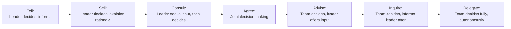

## Delegation and Empowerment

### Definition and Distinction

Delegation is the process of assigning responsibility and authority for specific tasks or decisions to another individual, while retaining ultimate accountability for the outcome. Empowerment is the broader practice of granting team members genuine decision-making authority and the resources/support to act on it, fostering ownership rather than mere task execution. Delegation is a discrete act; empowerment is an ongoing leadership stance that shapes how delegation is exercised across the team.

**Key Points**

- Delegation transfers *tasks and/or decisions*; the delegator remains accountable to their own stakeholders for the outcome
- Empowerment transfers *ownership and confidence*, enabling the individual to act independently within defined boundaries
- Effective delegation is a prerequisite for empowerment, but delegation without empowerment (e.g., assigning a task but micromanaging its execution) fails to build capability or trust

### Why Delegation and Empowerment Matter in Project Management

**Key Points**

- Prevents the PM from becoming a bottleneck as project scope and team size grow
- Builds team member capability and career growth (supports McClelland's need for achievement and SDT's competence need — see Motivating Project Teams)
- Frees PM capacity for higher-value activities: stakeholder management, risk anticipation, strategic planning
- Increases team engagement and psychological ownership of outcomes
- Essential for scaling self-organizing Agile teams, where distributed decision-making is a structural requirement, not just a stylistic preference

### The Delegation Continuum

Delegation is not binary (delegated vs. not delegated) — it exists on a spectrum of authority transfer.

**Key Points**

- This model, popularized as the "Delegation Poker" technique in Management 3.0 (developed by Jurgen Appelo), treats delegation level as a deliberate, explicit choice for each decision type rather than an all-or-nothing default
- Different decisions can sit at different points on the continuum simultaneously (e.g., budget decisions might remain at "Consult" while technical implementation decisions sit at "Delegate")
- The goal over time is generally to shift delegation levels rightward (toward more team autonomy) as trust and competence grow

### The Delegation Process

**Step 1: Task/Decision Selection**

Identify what can be delegated. Favor delegating tasks that develop team capability, free the PM for higher-value work, or are better suited to someone closer to the work.

**Step 2: Match to Competence and Commitment**

Align delegation level with the individual's readiness, consistent with the Situational Leadership Model (see Servant Leadership and Coaching):

| Readiness Level | Recommended Delegation Level | Approach |
| --- | --- | --- |
| Low competence, variable commitment | Tell / Sell | Close guidance, clear instructions |
| Some competence, growing confidence | Sell / Consult | Explain rationale, invite input |
| High competence, variable confidence | Consult / Agree | Collaborative decision-making |
| High competence, high commitment | Advise / Delegate | Full autonomy, PM available if asked |

**Step 3: Define Boundaries and Success Criteria**

Clarify scope, authority limits, resources available, and what "done well" looks like — ambiguity here is a leading cause of delegation failure.

**Step 4: Provide Resources and Access**

Ensure the delegate has the information, tools, and organizational access needed to succeed without needing to return to the PM for basic enablement.

**Step 5: Establish Check-In Cadence**

Agree on how and when progress will be reviewed — frequent enough to catch problems early, infrequent enough to avoid undermining autonomy.

**Step 6: Support Without Reclaiming**

When the delegate encounters difficulty, coach toward a solution rather than reclaiming the task — reclaiming teaches the team that delegation is not genuine.

### Delegation Readiness Matrix (svg_diagram)

<svg xmlns="http://www.w3.org/2000/svg" viewBox="0 0 800 420" font-family="Arial, sans-serif">
<rect x="0" y="0" width="800" height="420" fill="#ffffff" />
<text x="400" y="28" text-anchor="middle" font-size="17" font-weight="bold" fill="#1a1a1a">Delegation Readiness Matrix (svg_diagram)</text>
<line x1="80" y1="360" x2="720" y2="360" stroke="#333" stroke-width="1.5" />
<line x1="80" y1="360" x2="80" y2="60" stroke="#333" stroke-width="1.5" />
<text x="400" y="395" text-anchor="middle" font-size="12" fill="#333">Competence</text>
<text x="40" y="210" text-anchor="middle" font-size="12" fill="#333" transform="rotate(-90 40 210)">Commitment</text>
<rect x="80" y="210" width="320" height="150" fill="#e8f0f7" opacity="0.6" />
<rect x="400" y="210" width="320" height="150" fill="#eef7e8" opacity="0.6" />
<rect x="80" y="60" width="320" height="150" fill="#f7efe8" opacity="0.6" />
<rect x="400" y="60" width="320" height="150" fill="#f7e8ec" opacity="0.6" />

<text x="240" y="290" text-anchor="middle" font-size="13" font-weight="bold" fill="`#2c5f8a`">TELL</text>

<text x="240" y="310" text-anchor="middle" font-size="10" fill="#333">Low competence, high commitment</text>

<text x="560" y="290" text-anchor="middle" font-size="13" font-weight="bold" fill="`#4a8a2c`">DELEGATE</text>

<text x="560" y="310" text-anchor="middle" font-size="10" fill="#333">High competence, high commitment</text>

<text x="240" y="140" text-anchor="middle" font-size="13" font-weight="bold" fill="`#8a5a2c`">SELL</text>

<text x="240" y="160" text-anchor="middle" font-size="10" fill="#333">Low competence, low commitment</text>

<text x="560" y="140" text-anchor="middle" font-size="13" font-weight="bold" fill="`#8a2c4a`">CONSULT/AGREE</text>

<text x="560" y="160" text-anchor="middle" font-size="10" fill="#333">High competence, low commitment</text>

</svg>

### Barriers to Effective Delegation

**Key Points**

- **PM-side barriers**: Perfectionism ("I can do it faster/better myself"), fear of losing control, lack of trust in team capability, unclear own role definition, enjoyment of the delegated task
- **Team-side barriers**: Fear of failure or visible mistakes, lack of confidence, unclear expectations, insufficient resources/authority to actually execute
- **Organizational barriers**: Rigid role definitions, lack of psychological safety for mistakes, reward systems that don't recognize delegated success, unclear accountability structures

[Inference] The "I can do it faster myself" barrier is commonly cited in management literature as the single most persistent obstacle to delegation, since it is often true in the short term even when it undermines long-term team capability and PM capacity — a tension PMs must consciously choose to accept for long-term gain.

### Empowerment Boundaries: Freedom Within a Frame

Genuine empowerment requires clearly defined boundaries — unlimited autonomy without boundaries is not empowerment but abdication, and can create anxiety rather than confidence.

**Key Points**

- Define what decisions are fully delegated (the "freedom") vs. what remains reserved (the "frame") — e.g., budget thresholds, external commitments, safety-critical decisions
- Communicate boundaries explicitly and in writing where possible (e.g., in a team charter or RACI matrix)
- Revisit and expand boundaries over time as trust and demonstrated competence grow
- Ensure boundaries are consistent — shifting the frame unpredictably undermines the sense of genuine autonomy

### Accountability vs. Authority in Delegation

A common failure mode is delegating *responsibility* for a task without delegating the *authority* needed to actually accomplish it.

| Delegated Element | Description | Failure Mode if Missing |
| --- | --- | --- |
| Responsibility | Ownership of completing the task | Task falls through without clear owner |
| Authority | Power to make necessary decisions/resource commitments | Delegate is responsible but must constantly seek permission, defeating the purpose |
| Accountability | Ultimate answerability for the outcome (retained by delegator to their own stakeholders) | Confusion over who bears consequences of failure |

**Example**

> A PM delegates responsibility for vendor coordination to a team lead but does not grant them authority to approve minor change requests under $1,000. The team lead must escalate every small decision back to the PM, creating delay and undermining the intended efficiency gain — and signaling that the delegation was incomplete.

### RACI as a Delegation Clarity Tool

The RACI matrix (Responsible, Accountable, Consulted, Informed) is commonly used to formalize delegation boundaries across a team:

- **Responsible**: Who performs the work
- **Accountable**: Who is ultimately answerable for the outcome (should be a single person per decision)
- **Consulted**: Who provides input before a decision (two-way communication)
- **Informed**: Who is kept updated after a decision (one-way communication)

Using RACI alongside the Delegation Poker continuum allows PMs to clarify both *who does what* and *how much autonomy* they have in doing it.

### Practical Techniques for PMs

**Key Points**

- **Delegate outcomes, not just tasks**: State the desired result and let the individual determine the method, rather than prescribing every step
- **Match stretch to support**: Delegate slightly beyond current comfort level, paired with adequate coaching support (builds competence without overwhelming)
- **Use explicit delegation conversations**: Make the delegation level (Tell through Delegate) explicit rather than assumed, reducing ambiguity
- **Resist reclaiming**: When a delegate struggles, coach through questions rather than taking the task back
- **Celebrate delegated successes publicly**: Reinforces that delegation is genuine and builds the delegate's confidence and credibility
- **Debrief delegated failures constructively**: Treat mistakes within delegated authority as learning opportunities, consistent with psychological safety principles

### Common Pitfalls

**Key Points**

- Delegating tasks but not authority, forcing the delegate to constantly seek approval
- Reclaiming delegated work at the first sign of difficulty, teaching the team that delegation isn't trustworthy
- Delegating only undesirable or low-value tasks, which can be perceived as dumping rather than genuine development
- Failing to match delegation level to actual competence/commitment, leading to either micromanagement (low trust) or unsupported overwhelm (excessive delegation)
- Inconsistent boundaries that shift unpredictably, undermining the sense of stable autonomy
- Confusing empowerment with abandonment — providing no support structure and calling it "trust"

### Related Topics

- Servant Leadership and Coaching
- Motivating Project Teams
- Team Formation Stages from Forming to Adjourning
- Building Trust and Credibility
- RACI Matrix and Roles and Responsibilities Planning
- Decision Making Under Uncertainty