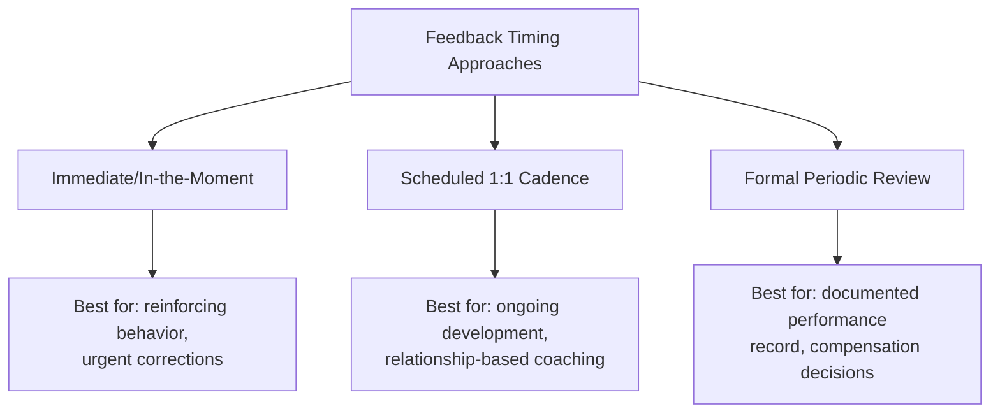

## Performance Feedback and Recognition

### Definition and Scope

Performance feedback is the structured communication of information about an individual's or team's work performance, intended to reinforce effective behaviors and correct ineffective ones. Recognition is the acknowledgment of contributions, effort, or achievement, intended to reinforce motivation and a sense of value. While related, feedback is primarily corrective/developmental in function, and recognition is primarily reinforcing/motivational — both are essential, complementary tools for project team leadership.

### Feedback vs. Recognition: Key Distinctions

| Dimension | Feedback | Recognition |
| --- | --- | --- |
| Primary Purpose | Improve future performance | Reinforce and motivate |
| Timing | Close to the behavior/event | Close to the achievement |
| Direction | Often corrective or developmental | Almost always positive |
| Frequency | Regular, ongoing | Should be frequent, tied to genuine merit |
| Delivery | Often private, especially if corrective | Often public, though should respect individual preference |

### Types of Feedback

**Key Points**

- **Reinforcing/Positive Feedback**: Identifies effective behavior to encourage its continuation
- **Constructive/Developmental Feedback**: Identifies areas for improvement, framed toward growth
- **Corrective Feedback**: Addresses a specific performance or behavior problem requiring change
- **360-Degree Feedback**: Gathered from multiple sources (peers, direct reports, supervisors, sometimes stakeholders) for a fuller performance picture

### The SBI Feedback Model

Situation-Behavior-Impact (SBI), developed by the Center for Creative Leadership, is a widely used structure for delivering specific, actionable feedback while minimizing defensiveness.

- **Situation**: Describe the specific context — when and where
- **Behavior**: Describe the observable behavior — what was said or done, without interpretation or labeling
- **Impact**: Describe the effect of the behavior — on the team, the project, stakeholders, or the individual's own credibility

**Example**

> **Situation**: "In this morning's stakeholder demo..."
>
> **Behavior**: "...you walked through the new feature without mentioning the known limitation we discussed beforehand..."
>
> **Impact**: "...which led the client to expect functionality that isn't ready yet, and now we need to manage that expectation gap."

**Key Points**

- SBI works for both corrective and reinforcing feedback — the structure is equally effective for praise ("...which gave the client confidence in our delivery timeline")
- Avoiding character judgments ("you're careless") in favor of specific behavior descriptions reduces defensiveness and keeps focus on changeable actions

### The SBI-I Extension (Adding Intent/Inquiry)

An extended variant, SBI-I, adds a step before or after Impact:

- **Intent/Inquiry**: Invite the other person's perspective on their intent, before concluding the conversation ("What was going on for you in that moment?")

[Inference] This extension is commonly recommended in coaching-oriented feedback literature because it converts a one-way feedback delivery into a two-way dialogue, reducing the risk of misattributing intent — though its effectiveness depends on the feedback-giver genuinely listening to the response rather than treating it as a formality.

### Feedback Timing and Frequency Models

**Key Points**

- Immediate feedback is most effective for behavior reinforcement, since the connection between action and consequence is clearest when timing is close
- Relying solely on formal periodic reviews (e.g., annual/quarterly) creates long feedback loops that reduce the ability to course-correct in time to matter for the current project
- Best practice generally combines all three: frequent informal feedback, regular 1:1 coaching conversations, and periodic formal documentation

### Delivering Corrective Feedback Effectively

**Key Points**

- **Prepare with specifics**: Vague feedback ("communicate better") is not actionable; specific behavioral examples are
- **Choose private settings for correction**: Public correction damages psychological safety and trust; public recognition builds it
- **Separate the person from the behavior**: Focus language on actions and impact, not character or identity
- **Check timing and readiness**: Avoid delivering significant corrective feedback when the recipient is already under acute stress, if the timing can reasonably be adjusted
- **Focus on future-facing action**: End with a clear, mutually agreed next step rather than leaving the conversation only backward-looking
- **Follow up**: Revisit whether the behavior changed; unaddressed follow-through undermines the credibility of the original feedback

### The Feedback Sandwich: Use With Caution

The "feedback sandwich" (positive-critical-positive) is a commonly taught technique, but is also commonly critiqued.

**Key Points**

- [Inference] Critics in management and coaching literature argue that surrounding critical feedback with praise can dilute the core message, cause recipients to fixate on or distrust the positive framing, and reduce the perceived seriousness of the correction — this critique is widely discussed though not universally agreed upon, and effectiveness likely depends on organizational culture and individual preference
- An alternative approach favored in much current coaching literature is direct, respectful, specific feedback without artificial cushioning, paired with genuine (not compensatory) positive reinforcement given separately and on its own merit

### Types and Structures of Recognition

| Recognition Type | Description | Best Used For |
| --- | --- | --- |
| Public Verbal Recognition | Acknowledgment in team meetings, stand-ups, stakeholder updates | Milestone achievements, exemplary behavior |
| Written Recognition | Email, Slack message, formal commendation | Documentable achievement, distributed teams |
| Peer-to-Peer Recognition | Team members recognizing each other, sometimes via structured programs | Building horizontal team cohesion |
| Formal/Organizational Recognition | Awards, bonuses, promotions, certificates | Significant sustained contribution |
| Private Recognition | One-on-one acknowledgment | Individuals who prefer not to be publicly highlighted |

**Key Points**

- Recognition should match the individual's preference — some team members find public recognition motivating, others find it uncomfortable (relates to McClelland's affiliation/power needs and individual personality differences)
- Recognition tied to specific, observed behavior ("your root-cause analysis on the outage prevented a recurrence") is more credible and reinforcing than generic praise ("great job")
- Timeliness matters for recognition just as it does for feedback — delayed recognition loses much of its reinforcing power

### Recognition and Herzberg's Two-Factor Theory

As covered in motivation theory, recognition functions as a **motivator** (not merely a hygiene factor) in Herzberg's framework — meaning genuine, specific recognition can drive engagement beyond simply preventing dissatisfaction. This distinguishes it from generic praise or perfunctory "good job" comments, which tend to have diminishing reinforcing value over repeated, non-specific use.

### Feedback and Recognition Cycle (svg_diagram)

<svg xmlns="http://www.w3.org/2000/svg" viewBox="0 0 800 400" font-family="Arial, sans-serif">
<rect x="0" y="0" width="800" height="400" fill="#ffffff" />
<text x="400" y="28" text-anchor="middle" font-size="17" font-weight="bold" fill="#1a1a1a">Feedback and Recognition Cycle (svg_diagram)</text>
<circle cx="400" cy="210" r="150" fill="none" stroke="#ccc" stroke-width="1" stroke-dasharray="4,4" />
<circle cx="400" cy="70" r="55" fill="#2c5f8a" />
<text x="400" y="65" text-anchor="middle" font-size="12" fill="#ffffff" font-weight="bold">Observe</text>
<text x="400" y="82" text-anchor="middle" font-size="11" fill="#ffffff">Behavior</text>
<circle cx="540" cy="180" r="55" fill="#4a8a2c" />
<text x="540" y="175" text-anchor="middle" font-size="12" fill="#ffffff" font-weight="bold">Deliver</text>
<text x="540" y="192" text-anchor="middle" font-size="11" fill="#ffffff">SBI Feedback</text>
<circle cx="490" cy="330" r="55" fill="#8a5a2c" />
<text x="490" y="325" text-anchor="middle" font-size="12" fill="#ffffff" font-weight="bold">Agree</text>
<text x="490" y="342" text-anchor="middle" font-size="11" fill="#ffffff">Next Steps</text>
<circle cx="310" cy="330" r="55" fill="#8a2c4a" />
<text x="310" y="325" text-anchor="middle" font-size="12" fill="#ffffff" font-weight="bold">Follow Up</text>
<text x="310" y="342" text-anchor="middle" font-size="11" fill="#ffffff">and Reinforce</text>
<circle cx="260" cy="180" r="55" fill="#5a2c8a" />
<text x="260" y="175" text-anchor="middle" font-size="12" fill="#ffffff" font-weight="bold">Recognize</text>
<text x="260" y="192" text-anchor="middle" font-size="11" fill="#ffffff">If Positive</text>
</svg>

### Feedback and Recognition in Distributed/Virtual Teams

**Key Points**

- Written recognition becomes more important since informal, ambient praise doesn't propagate naturally (see Virtual and Distributed Team Management)
- Corrective feedback delivered over video/text loses some non-verbal nuance; consider synchronous video over async text for sensitive corrective conversations
- Time-zone lag can delay the connection between behavior and feedback — closing that gap as much as feasible preserves reinforcement effectiveness

### Practical Techniques for PMs

**Key Points**

- **Establish a regular 1:1 cadence**: Structured, recurring space for two-way feedback, not just status updates
- **Use SBI consistently**: Build a habit of structuring both corrective and positive feedback around Situation-Behavior-Impact
- **Separate performance conversations from status conversations**: Avoid burying feedback inside routine project status discussions
- **Build peer recognition mechanisms**: Structured peer shout-outs (e.g., a recurring team ritual) distribute recognition beyond just top-down PM praise
- **Calibrate to individual preference**: Ask team members directly how they prefer to receive recognition (public vs. private) and corrective feedback (direct vs. gently framed)
- **Document significant feedback**: Especially for formal performance processes, maintain a factual record of specific behaviors and outcomes discussed

### Common Pitfalls

**Key Points**

- Giving vague, non-actionable feedback ("be more proactive") without specific behavioral examples
- Saving all feedback for formal review cycles, creating long, unhelpful delay between behavior and correction
- Publicly correcting individuals, damaging psychological safety for the whole team
- Over-relying on the feedback sandwich, diluting the seriousness of necessary corrections
- Generic, infrequent recognition that loses reinforcing power through repetition without specificity
- Ignoring individual preferences for how recognition and feedback are delivered
- Failing to follow up on agreed next steps, undermining the credibility of the feedback process

### Related Topics

- Servant Leadership and Coaching
- Motivating Project Teams
- Building Trust and Credibility
- Team Formation Stages from Forming to Adjourning
- Conflict Resolution and Negotiation Techniques
- Delegation and Empowerment