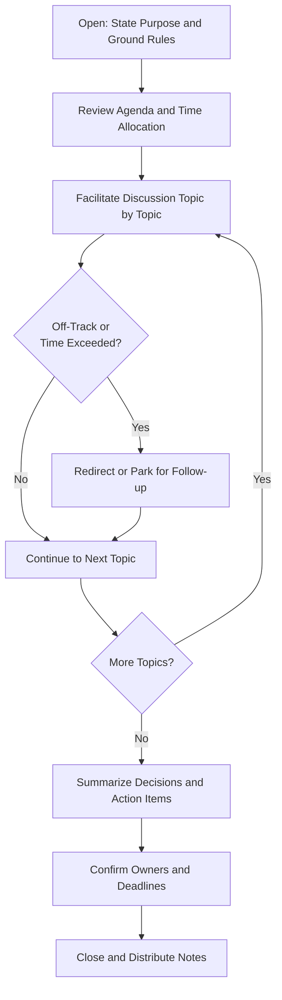

## Facilitating Effective Meetings

### Definition and Scope

Meeting facilitation is the set of skills and practices used to guide a group discussion toward a productive outcome — ensuring participation, maintaining focus, managing time, and driving toward decisions or actionable next steps. In project management, meetings are a primary mechanism for coordination, decision-making, and stakeholder alignment, yet poorly facilitated meetings are consistently cited as one of the largest sources of wasted time and disengagement in organizations. Effective facilitation is therefore a core, high-leverage PM competency rather than a soft or secondary skill.

### Why Meeting Facilitation Matters

**Key Points**

- Poorly run meetings consume disproportionate organizational time relative to the value produced
- Meetings without clear purpose or structure erode team engagement and credibility of the convener
- Well-facilitated meetings accelerate decision-making and surface risks/issues earlier
- Facilitation skill directly supports psychological safety by ensuring balanced participation rather than allowing dominant voices to control discussion

### Meeting Types and Their Purpose

| Meeting Type | Primary Purpose | Typical Structure |
| --- | --- | --- |
| Status/Stand-up | Synchronize on progress and blockers | Short, structured, time-boxed |
| Decision-Making | Reach a specific decision | Framed options, clear decision criteria, defined decision-maker |
| Problem-Solving | Diagnose and resolve an issue | Root-cause exploration, brainstorming, action planning |
| Planning | Define scope, approach, or schedule | Collaborative estimation, sequencing, dependency mapping |
| Retrospective | Reflect and improve process | Structured reflection (e.g., Start-Stop-Continue) |
| Stakeholder Review/Demo | Communicate progress, gather feedback | Presentation plus structured Q&A |
| Brainstorming/Ideation | Generate options broadly before narrowing | Divergent thinking, deferred judgment |

**Key Points**

- Mismatching meeting structure to purpose is a common root cause of poor meetings (e.g., trying to make a decision inside an open-ended brainstorm, or trying to brainstorm inside a rigid status update)
- Every meeting should have one dominant purpose; blending purposes without acknowledging the shift confuses participants about what mode they're in

### Pre-Meeting Preparation

**Key Points**

- **Define a clear objective**: What specific outcome should exist by the meeting's end (decision made, options identified, alignment reached)?
- **Determine if a meeting is actually necessary**: Many coordination needs can be resolved asynchronously (status updates, simple approvals) — reserve synchronous time for genuine discussion/decision needs
- **Build and circulate an agenda in advance**: Include objective, topics, time allocations, and any pre-reading
- **Invite only necessary participants**: Larger groups reduce per-person engagement and slow decision-making; distinguish between required decision-makers and those who can be informed afterward
- **Assign roles in advance**: Facilitator, notetaker, timekeeper — especially important as meeting size or complexity grows

### Meeting Facilitation Process Flow

### Core Facilitation Techniques

**Key Points**

- **Time-boxing**: Allocate and enforce specific time limits per agenda item to maintain pace and prevent single topics from consuming the full meeting
- **Parking lot**: Maintain a visible list of tangential but relevant topics raised mid-discussion, to be addressed separately rather than derailing the current agenda
- **Round-robin input**: Systematically invite each participant's perspective in turn, preventing dominant voices from monopolizing discussion and drawing out quieter members
- **Silent brainstorming**: Have participants write ideas individually before group discussion, reducing anchoring bias and groupthink (related to the Nominal Group Technique)
- **Explicit decision framing**: Clearly state what decision is being made, who has decision authority, and what criteria will be used, before opening discussion
- **Active summarizing**: Periodically restate what's been agreed or discussed to confirm shared understanding and catch misalignment early
- **Visual facilitation**: Use shared whiteboards, decision matrices, or diagrams to externalize discussion and maintain focus on a common artifact rather than pure verbal exchange

### Managing Difficult Meeting Dynamics

| Dynamic | Facilitation Response |
| --- | --- |
| Dominant participant monopolizing discussion | Use round-robin structure; directly and respectfully redirect ("Let's hear from others before continuing") |
| Silent/disengaged participants | Direct, low-pressure invitation ("What's your take on this, [name]?"); consider async pre-input for reticent contributors |
| Off-topic tangents | Acknowledge the point, use the parking lot, redirect to agenda |
| Unresolved conflict between participants | Separate positions from interests; if unresolved live, take offline and follow up 1:1 |
| Meeting running over time | Explicitly flag the time constraint; offer to extend, defer remaining items, or schedule follow-up |
| Decision paralysis / going in circles | Reframe the decision explicitly; introduce a decision-forcing technique (e.g., dot voting, defined deadline for decision) |

### Facilitation Neutrality vs. Active Participation

**Key Points**

- A pure facilitator role maintains neutrality on content, focusing solely on process (how the discussion happens), which works well for cross-functional or politically sensitive discussions
- A PM often must blend facilitation with genuine content contribution, since they typically hold project context others don't — this dual role requires explicit signaling ("I'm going to step out of facilitator mode for a moment to share my view")
- [Inference] Maintaining pure neutrality becomes harder as the facilitator's stake in the outcome increases; in high-stakes or contentious project decisions, considering an external or rotating facilitator can preserve perceived fairness, though this trade-off depends on team size and organizational norms

### Virtual Meeting Facilitation Considerations

**Key Points**

- Non-verbal cues are harder to read remotely — deliberately check in verbally rather than relying on visual signals of confusion or disagreement
- Use structured turn-taking more heavily, since natural conversational rhythm (interruption cues, pauses) is harder to read over video/audio
- Leverage collaborative tools (shared documents, digital whiteboards, chat for parallel input) to maintain engagement
- Keep virtual meetings shorter or with more frequent breaks — sustained video-call attention degrades faster than in-person attention over long sessions [Unverified] as this is a widely discussed phenomenon (sometimes termed "video call fatigue") though its causes and precise magnitude are still debated in research literature
- Explicitly invite chat-based input as an alternative channel for participants less comfortable interrupting verbally

### Facilitation Technique Selection Guide (svg_diagram)

<svg xmlns="http://www.w3.org/2000/svg" viewBox="0 0 800 380" font-family="Arial, sans-serif">
<rect x="0" y="0" width="800" height="380" fill="#ffffff" />
<text x="400" y="28" text-anchor="middle" font-size="17" font-weight="bold" fill="#1a1a1a">Facilitation Technique by Meeting Goal (svg_diagram)</text>
<rect x="30" y="60" width="220" height="130" rx="8" fill="#e8f0f7" stroke="#2c5f8a" stroke-width="1.5" />
<text x="140" y="85" text-anchor="middle" font-size="13" font-weight="bold" fill="#2c5f8a">Generate Ideas</text>
<text x="50" y="110" font-size="11" fill="#333">Silent brainstorming</text>
<text x="50" y="130" font-size="11" fill="#333">Round-robin input</text>
<text x="50" y="150" font-size="11" fill="#333">Defer judgment</text>
<rect x="290" y="60" width="220" height="130" rx="8" fill="#eef7e8" stroke="#4a8a2c" stroke-width="1.5" />
<text x="400" y="85" text-anchor="middle" font-size="13" font-weight="bold" fill="#4a8a2c">Narrow Options</text>
<text x="310" y="110" font-size="11" fill="#333">Dot voting</text>
<text x="310" y="130" font-size="11" fill="#333">Decision matrix</text>
<text x="310" y="150" font-size="11" fill="#333">Criteria-based ranking</text>
<rect x="550" y="60" width="220" height="130" rx="8" fill="#f7efe8" stroke="#8a5a2c" stroke-width="1.5" />
<text x="660" y="85" text-anchor="middle" font-size="13" font-weight="bold" fill="#8a5a2c">Reach Decision</text>
<text x="570" y="110" font-size="11" fill="#333">Explicit decision framing</text>
<text x="570" y="130" font-size="11" fill="#333">Clear decision authority</text>
<text x="570" y="150" font-size="11" fill="#333">Time-boxed close</text>
<rect x="160" y="230" width="220" height="120" rx="8" fill="#f7e8ec" stroke="#8a2c4a" stroke-width="1.5" />
<text x="270" y="255" text-anchor="middle" font-size="13" font-weight="bold" fill="#8a2c4a">Manage Conflict</text>
<text x="180" y="280" font-size="11" fill="#333">Separate position/interest</text>
<text x="180" y="300" font-size="11" fill="#333">Structured turn-taking</text>
<rect x="420" y="230" width="220" height="120" rx="8" fill="#efe8f7" stroke="#5a2c8a" stroke-width="1.5" />
<text x="530" y="255" text-anchor="middle" font-size="13" font-weight="bold" fill="#5a2c8a">Maintain Focus</text>
<text x="440" y="280" font-size="11" fill="#333">Time-boxing</text>
<text x="440" y="300" font-size="11" fill="#333">Parking lot</text>
</svg>

### Post-Meeting Follow-Through

**Key Points**

- Distribute concise meeting notes promptly, focused on decisions made and action items assigned (not a full transcript)
- Confirm each action item has a named owner and a deadline — unowned action items rarely get completed
- Track open action items into subsequent meetings until closed, maintaining accountability
- Solicit brief feedback periodically on meeting effectiveness (e.g., via retrospectives) to continuously improve facilitation practice

### Practical Techniques for PMs

**Key Points**

- **Start and end on time**: Consistently doing so builds credibility and respects participants' calendars
- **State purpose explicitly at the open**: Even a single sentence framing the meeting's goal focuses the group immediately
- **Use visual/shared artifacts**: A shared screen, whiteboard, or document keeps the group anchored to a common reference point
- **Default to shorter meetings**: Time expands to fill the space allotted (Parkinson's Law); intentionally shorter defaults often maintain focus better than padded slots
- **Rotate facilitation**: For recurring team meetings, rotating the facilitator role builds broader facilitation skill and reduces reliance on a single person
- **Close with explicit next steps**: Never end a meeting without confirming what happens next and who owns it

### Common Pitfalls

**Key Points**

- Holding a meeting when async communication would suffice, wasting participant time
- No clear agenda or objective, leading to unfocused, meandering discussion
- Inviting too many participants "just in case," diluting engagement and slowing decisions
- Allowing dominant voices to control discussion while quieter members disengage
- Ending without clear decisions, owners, or next steps, causing the same topic to resurface unresolved
- Consistently running over time, training participants to expect and tolerate poor time discipline
- Blending meeting purposes (e.g., status update plus brainstorm plus decision) without structure, confusing what mode the group should be in

### Related Topics

- Conflict Resolution and Negotiation Techniques
- Stakeholder Engagement and Communication Planning
- Servant Leadership and Coaching
- Decision Making Under Uncertainty
- Retrospectives and Continuous Improvement Practices
- Performance Feedback and Recognition