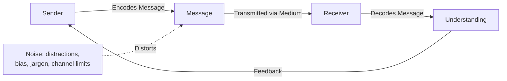

## Active Listening and Clear Communication

### Definition and Scope

Active listening is the practice of fully concentrating on, understanding, responding to, and remembering what is being communicated, rather than passively hearing or preparing a reply while the other person speaks. Clear communication is the complementary skill of encoding one's own message so it is accurately and efficiently understood by the receiver. Together, these form the foundational communication competencies underlying nearly every other project leadership skill — negotiation, conflict resolution, stakeholder management, and team coaching all depend on them.

### The Basic Communication Model

**Key Points**

- Communication is only complete when feedback confirms the receiver's decoded understanding matches the sender's intended meaning
- "Noise" — any distortion between encoding and decoding — includes physical distraction, emotional state, cultural difference, jargon, and channel limitations (e.g., text stripping tone)
- Effective communicators actively manage both encoding (clarity) and the feedback loop (confirmation of understanding), rather than assuming transmission equals comprehension

### Components of Active Listening

**Key Points**

- **Attending**: Giving full physical and mental attention — eye contact, open posture, minimizing distractions
- **Withholding judgment**: Suspending evaluation or rebuttal preparation while the other person is still speaking
- **Reflecting**: Paraphrasing or summarizing what was heard to confirm understanding
- **Clarifying**: Asking open-ended questions to fill gaps or resolve ambiguity
- **Empathizing**: Attending to emotional content and underlying concerns, not just literal words
- **Responding**: Replying in a way that demonstrates the message was genuinely received and considered

### Levels of Listening

A commonly referenced model (echoed across coaching literature, including work associated with Co-Active Coaching) distinguishes listening by focus:

| Level | Focus | Description |
| --- | --- | --- |
| Level 1: Internal Listening | Self | Listener is focused on their own thoughts, reactions, and what they'll say next |
| Level 2: Focused Listening | Other person | Listener is fully attentive to the speaker's words, tone, and meaning |
| Level 3: Global Listening | Whole environment | Listener attends to the speaker plus broader context — energy, group dynamics, non-verbal cues, what's unsaid |

**Key Points**

- Most untrained listening defaults to Level 1, especially under time pressure or stress, since the listener is often simultaneously formulating a response
- Level 2 and 3 listening require deliberate practice, as they run counter to the natural tendency to process information relative to oneself
- [Inference] Level 3 listening is particularly valuable in facilitation and negotiation contexts because it captures group dynamics and unstated concerns that Level 2 alone would miss, though it requires more cognitive bandwidth and is harder to sustain over long conversations

### Barriers to Active Listening

**Key Points**

- **Rehearsing**: Mentally preparing a response instead of continuing to listen
- **Filtering**: Selectively hearing only what confirms existing assumptions
- **Judging**: Evaluating or labeling the speaker rather than absorbing the content
- **Advising**: Jumping to solutions before fully understanding the problem
- **Derailing**: Redirecting the conversation to one's own related experience ("That reminds me of when I...")
- **Placating**: Superficially agreeing to end the conversation quickly rather than genuinely engaging
- **Environmental distraction**: Multitasking, notifications, or physical interruptions during conversation

### Reflective Listening Techniques

| Technique | Description | Example Phrase |
| --- | --- | --- |
| Paraphrasing | Restating the content in different words | "So what I'm hearing is..." |
| Summarizing | Condensing multiple points into a brief recap | "To pull that together, the main issues are X, Y, and Z." |
| Clarifying Questions | Open-ended questions resolving ambiguity | "Can you say more about what you meant by...?" |
| Emotional Labeling | Naming the apparent emotion to validate it | "It sounds like that was frustrating." |
| Silence/Pause | Deliberate pause allowing the speaker to continue or reflect | (non-verbal — resisting the urge to fill silence) |

**Example**

> **Speaker**: "I've raised the resourcing gap three times now and nothing's changed. I don't know why I bother bringing it up."
>
> **Poor response (advising)**: "Have you tried escalating to the sponsor directly?"
>
> **Active listening response**: "It sounds like you're feeling unheard after raising this multiple times — that's frustrating. Can you walk me through what happened each time you raised it?"

### Principles of Clear Communication

**Key Points**

- **Audience calibration**: Adjust vocabulary, detail level, and framing to the receiver's background and needs (a technical deep-dive suits engineers; an executive summary suits sponsors)
- **Structure before detail**: Lead with the key message/conclusion, then provide supporting detail (avoids burying the point)
- **Concrete over abstract**: Use specific examples, numbers, and observable facts rather than vague generalizations
- **One message per unit**: Avoid overloading a single communication with multiple unrelated points, which reduces retention of any of them
- **Explicit over implicit**: State expectations, deadlines, and required actions directly rather than assuming they're inferred
- **Channel matching**: Choose the communication medium appropriate to the message's urgency, sensitivity, and complexity (see table below)

### Channel Selection for Project Communication

| Message Type | Recommended Channel | Rationale |

 

| Urgent, simple | Instant message/call | Speed over documentation |

| Complex, nuanced | Video/in-person meeting | Preserves tone, allows real-time clarification |

| Formal decision/record | Written document/email | Creates auditable record |

| Sensitive/emotional | In-person or video, not text | Preserves non-verbal context, reduces misinterpretation risk |

| Broad status update | Written report/dashboard | Scales to large audiences asynchronously |

### Non-Verbal Communication

**Key Points**

- [Inference] While the often-cited claim that "93% of communication is non-verbal" (derived from Albert Mehrabian's research) is widely repeated, it has also been widely critiqued as an overgeneralization of a narrow original study focused specifically on communicating feelings/attitudes, not communication broadly — non-verbal cues matter significantly but the specific percentage should not be treated as a universal law
- Non-verbal cues (tone, posture, facial expression, eye contact) carry substantial meaning, especially regarding emotional content and sincerity
- In virtual settings, reduced non-verbal bandwidth increases the importance of deliberate verbal confirmation of understanding (see Virtual and Distributed Team Management)

### Active Listening and Communication Flow (svg_diagram)

<svg xmlns="http://www.w3.org/2000/svg" viewBox="0 0 800 380" font-family="Arial, sans-serif">
<rect x="0" y="0" width="800" height="380" fill="#ffffff" />
<text x="400" y="28" text-anchor="middle" font-size="17" font-weight="bold" fill="#1a1a1a">Active Listening Loop (svg_diagram)</text>
<circle cx="400" cy="210" r="160" fill="none" stroke="#ddd" stroke-width="1" stroke-dasharray="4,4" />
<circle cx="400" cy="70" r="55" fill="#2c5f8a" />
<text x="400" y="65" text-anchor="middle" font-size="12" fill="#ffffff" font-weight="bold">Attend</text>
<text x="400" y="82" text-anchor="middle" font-size="10" fill="#ffffff">Full presence</text>
<circle cx="550" cy="180" r="55" fill="#4a8a2c" />
<text x="550" y="175" text-anchor="middle" font-size="12" fill="#ffffff" font-weight="bold">Absorb</text>
<text x="550" y="192" text-anchor="middle" font-size="10" fill="#ffffff">Withhold judgment</text>
<circle cx="500" cy="330" r="55" fill="#8a5a2c" />
<text x="500" y="325" text-anchor="middle" font-size="12" fill="#ffffff" font-weight="bold">Reflect</text>
<text x="500" y="342" text-anchor="middle" font-size="10" fill="#ffffff">Paraphrase back</text>
<circle cx="300" cy="330" r="55" fill="#8a2c4a" />
<text x="300" y="325" text-anchor="middle" font-size="12" fill="#ffffff" font-weight="bold">Clarify</text>
<text x="300" y="342" text-anchor="middle" font-size="10" fill="#ffffff">Ask open questions</text>
<circle cx="250" cy="180" r="55" fill="#5a2c8a" />
<text x="250" y="175" text-anchor="middle" font-size="12" fill="#ffffff" font-weight="bold">Respond</text>
<text x="250" y="192" text-anchor="middle" font-size="10" fill="#ffffff">Demonstrate uptake</text>
</svg>

### Application in Project Management Contexts

| Context | How Active Listening/Clear Communication Applies |
| --- | --- |
| Requirements gathering | Reflective listening surfaces unstated needs and assumptions behind stated requirements |
| Status reporting | Clear, structured, audience-calibrated communication prevents misinterpretation of project health |
| Conflict resolution | Active listening validates each party's perspective before problem-solving begins |
| Coaching conversations | Level 2/3 listening supports the GROW model's Reality and Options stages |
| Stakeholder escalations | Reflective listening de-escalates emotional tension before addressing substance |
| Risk identification | Genuine listening (not filtering for convenient answers) surfaces risks team members might otherwise hesitate to raise |

### Practical Techniques for PMs

**Key Points**

- **Eliminate multitasking during conversations**: Close notifications, put away devices — divided attention is detectable and undermines trust
- **Practice the pause**: Resist filling silence immediately; allow the speaker room to continue or reflect further
- **Confirm before responding**: Paraphrase key points before offering a solution or opinion, ensuring accurate understanding first
- **Ask open-ended over closed questions**: "What concerns do you have about this approach?" surfaces more than "Are you okay with this?"
- **Lead with the headline**: In written and verbal communication, state the key conclusion or ask first, then provide supporting detail
- **Seek explicit confirmation of understanding**: Especially for critical instructions or decisions, ask the receiver to restate their understanding back

### Common Pitfalls

**Key Points**

- Listening only at Level 1 (internal), formulating responses instead of genuinely absorbing what's said
- Jumping to solutions (advising) before fully understanding the underlying concern
- Assuming transmission equals comprehension, skipping the feedback/confirmation loop
- Using jargon or excessive technical detail with an audience that doesn't share that context
- Burying the key message deep within a long communication, causing it to be missed or deprioritized
- Relying on text-based channels for emotionally sensitive or highly nuanced topics where tone and non-verbal cues matter
- Treating "active listening techniques" mechanically (rote paraphrasing) without genuine attentional presence, which reads as performative rather than authentic

### Related Topics

- Conflict Resolution and Negotiation Techniques
- Facilitating Effective Meetings
- Stakeholder Engagement and Communication Planning
- Servant Leadership and Coaching
- Cross Cultural Team Dynamics
- Performance Feedback and Recognition