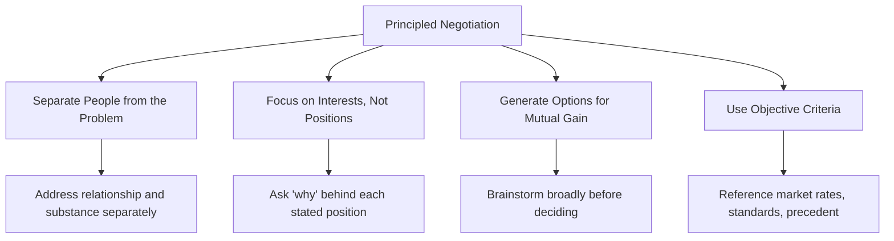
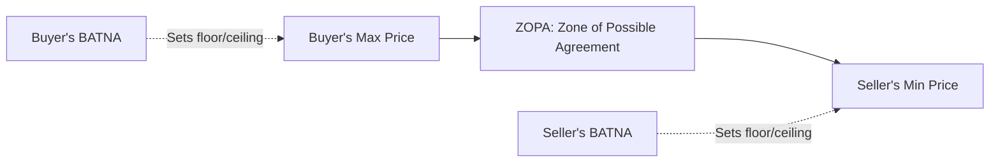

## Negotiation Strategies and Tactics

### Definition and Scope

Negotiation is a communication process between two or more parties with differing interests, aimed at reaching a mutually acceptable agreement. In project management, negotiation occurs continuously and often informally — with vendors over contract terms, with sponsors over scope and budget, with team members over resource allocation, and with other PMs over shared resources or dependencies. Effective negotiation directly affects project constraints (scope, schedule, cost, quality) and long-term stakeholder relationships.

### Positional vs. Interest-Based Negotiation

**Positional Bargaining** involves each party stating a fixed position and moving incrementally toward a compromise, often through concessions. **Interest-Based Negotiation** (also called principled negotiation) focuses on the underlying needs and motivations behind each party's stated position, seeking solutions that satisfy those interests rather than simply splitting the difference.

| Dimension | Positional Bargaining | Interest-Based Negotiation |
| --- | --- | --- |
| Focus | Stated positions | Underlying interests/needs |
| Relationship Impact | Can be adversarial, zero-sum | Collaborative, preserves relationships |
| Outcome Quality | Often a compromise, sometimes suboptimal for both | Can produce mutually beneficial ("win-win") solutions |
| Typical Use | Simple, one-time, low-relationship-stakes transactions | Ongoing relationships, complex trade-offs |

**Example**

> **Positional**: A vendor states "We need $50,000." The PM counters "$35,000." They eventually settle at $42,000 — neither party knows if this is actually optimal.
>
> **Interest-based**: The PM asks why $50,000 is needed. The vendor explains it covers a specialized subcontractor for one component. The PM reveals their real constraint is total budget, not necessarily per-vendor cost, and offers to extend the payment timeline instead of reducing the amount, which better serves the vendor's cash-flow concern while still working within budget phasing.

### The Harvard Principled Negotiation Framework

Developed by Roger Fisher and William Ury (*Getting to Yes*), this widely referenced framework outlines four core principles:

**Key Points**

- **Separate people from the problem**: Address the substantive issue directly without personal attacks or defensiveness; maintain respect for the other party even amid disagreement
- **Focus on interests, not positions**: Multiple positions can satisfy the same underlying interest — uncovering the interest opens more solution space
- **Generate options for mutual gain**: Brainstorm multiple possible solutions before committing to one, ideally before either party locks into a position
- **Use objective criteria**: Ground the agreement in external standards (market rates, industry benchmarks, legal precedent, expert opinion) rather than pure willpower or relative power

### BATNA and Related Concepts

**BATNA (Best Alternative to a Negotiated Agreement)** is the course of action a party will take if the current negotiation fails to reach agreement. It is widely regarded as the single most important source of negotiating power — not because it's revealed, but because it defines the negotiator's true walk-away point.

| Concept | Definition |
| --- | --- |
| BATNA | Best Alternative to a Negotiated Agreement — the fallback if no deal is reached |
| WATNA | Worst Alternative to a Negotiated Agreement — the worst-case fallback |
| ZOPA | Zone of Possible Agreement — the range where both parties' acceptable terms overlap |
| Reservation Price | The point beyond which a party will walk away rather than agree |

**Key Points**

- A strong BATNA increases negotiating leverage — the party with a better alternative can credibly walk away, shifting power in their favor
- Improving one's own BATNA before negotiating (e.g., securing a second vendor quote) is often more effective than any in-negotiation tactic
- Understanding the *other* party's likely BATNA helps calibrate how much room exists for negotiation
- If no ZOPA exists (each party's reservation price doesn't overlap), no mutually acceptable deal is possible regardless of tactics used — the negotiation should end, or one party's constraints must genuinely change

### Common Negotiation Tactics

| Tactic | Description | Appropriate Response |
| --- | --- | --- |
| Anchoring | Making the first offer to set a reference point favorably | Prepare your own anchor in advance; don't let their anchor unconsciously shift your reservation price |
| Good Cop/Bad Cop | One party appears reasonable, another appears difficult, to pressure concessions | Recognize the tactic; negotiate on substance, not emotional pressure |
| Deadline Pressure | Imposing (real or artificial) time urgency to force quick concessions | Verify if the deadline is genuine; avoid rushed decisions without verification |
| Nibbling | Requesting small additional concessions after the main agreement is reached | Hold firm on the agreed terms; treat new requests as a new negotiation |
| Silence | Pausing after an offer to create pressure to fill the silence with a concession | Practice comfort with silence; don't concede simply to end discomfort |
| Limited Authority | Claiming inability to agree without a higher authority's approval | Clarify decision authority upfront; ask to negotiate directly with the actual decision-maker |

**Key Points**

- Recognizing a tactic is being used often neutralizes much of its power — naming it explicitly ("It sounds like there's real time pressure here — can you help me understand why?") can shift the dynamic
- Ethical negotiation practice (see Ethics and Professional Responsibility) means avoiding manipulative tactics oneself, even when facing them from a counterpart

### Negotiation Process Stages

**Key Points**

- **Preparation**: Identify interests (yours and theirs), determine BATNA/reservation price, research objective criteria, define desired outcomes
- **Opening**: Establish rapport, set a collaborative tone, clarify the agenda/scope of the negotiation
- **Exploration**: Surface interests through questions, share information selectively to build mutual understanding
- **Bargaining**: Propose and evaluate options, make and evaluate trade-offs
- **Closing**: Confirm mutual agreement explicitly, document terms clearly, define next steps
- **Implementation**: Follow through on commitments — a negotiated agreement's value depends on execution, not just the agreement itself

### Negotiation Preparation Framework (svg_diagram)

<svg xmlns="http://www.w3.org/2000/svg" viewBox="0 0 800 400" font-family="Arial, sans-serif">
<rect x="0" y="0" width="800" height="400" fill="#ffffff" />
<text x="400" y="28" text-anchor="middle" font-size="17" font-weight="bold" fill="#1a1a1a">Negotiation Preparation Checklist (svg_diagram)</text>
<rect x="40" y="60" width="340" height="290" rx="8" fill="#e8f0f7" stroke="#2c5f8a" stroke-width="1.5" />
<text x="210" y="85" text-anchor="middle" font-size="14" font-weight="bold" fill="#2c5f8a">Know Yourself</text>
<text x="60" y="115" font-size="12" fill="#333">- What are my true interests?</text>
<text x="60" y="140" font-size="12" fill="#333">- What is my BATNA?</text>
<text x="60" y="165" font-size="12" fill="#333">- What is my reservation price?</text>
<text x="60" y="190" font-size="12" fill="#333">- What objective criteria support</text>
<text x="60" y="210" font-size="12" fill="#333"> my position?</text>
<text x="60" y="240" font-size="12" fill="#333">- What trade-offs am I willing</text>
<text x="60" y="260" font-size="12" fill="#333"> to make?</text>
<rect x="420" y="60" width="340" height="290" rx="8" fill="#eef7e8" stroke="#4a8a2c" stroke-width="1.5" />
<text x="590" y="85" text-anchor="middle" font-size="14" font-weight="bold" fill="#4a8a2c">Know the Other Party</text>
<text x="440" y="115" font-size="12" fill="#333">- What are their likely interests?</text>
<text x="440" y="140" font-size="12" fill="#333">- What is their likely BATNA?</text>
<text x="440" y="165" font-size="12" fill="#333">- What constraints do they face?</text>
<text x="440" y="190" font-size="12" fill="#333">- What is their decision authority</text>
<text x="440" y="210" font-size="12" fill="#333"> level?</text>
<text x="440" y="240" font-size="12" fill="#333">- What relationship history</text>
<text x="440" y="260" font-size="12" fill="#333"> exists?</text>
</svg>

### Negotiation in Specific Project Contexts

| Context | Key Considerations |
| --- | --- |
| Vendor/Contract Negotiation | Objective criteria (market rates), clear scope definition, payment terms as a lever beyond price |
| Resource Negotiation (with Functional Managers) | Interest-based approach — understand the functional manager's competing priorities, not just assert project need |
| Scope/Schedule Trade-offs (with Sponsors) | Frame trade-offs explicitly (scope vs. time vs. cost) using objective impact data |
| Cross-Team Dependency Negotiation | Focus on mutual project success as shared interest, avoid purely transactional framing |
| Salary/Role Negotiation (as PM) | Standard principled negotiation applies; research market objective criteria |

### Cultural Considerations in Negotiation

**Key Points**

- Negotiation norms vary significantly across cultures — directness of opening offers, acceptable use of silence, relationship-building expectations before substantive discussion, and decision-making pace all differ (see Cross Cultural Team Dynamics)
- In relationship-oriented/high-context cultures, rushing to substantive bargaining before establishing trust can be counterproductive
- Understanding whether a counterpart's culture favors individual or collective/consensus decision-making affects how much authority to expect in a single conversation

### Practical Techniques for PMs

**Key Points**

- **Always prepare your BATNA before entering a negotiation**: Even an approximate BATNA materially improves negotiating position and confidence
- **Ask "why" behind stated positions**: Understanding interests opens more creative solution space than accepting positions at face value
- **Separate the relationship from the substance**: Disagree on terms without damaging the underlying working relationship, especially for ongoing vendor/stakeholder relationships
- **Use objective criteria proactively**: Bring market data, benchmarks, or precedent to negotiations rather than relying purely on assertion
- **Document agreements immediately**: Confirm terms in writing promptly after reaching verbal agreement to prevent later misalignment
- **Practice silence deliberately**: Resist the urge to fill silence with concessions after making an offer

### Common Pitfalls

**Key Points**

- Entering a negotiation without a clear BATNA, weakening leverage and increasing pressure to accept unfavorable terms
- Focusing exclusively on positions rather than exploring underlying interests, missing mutually beneficial trade-offs
- Treating negotiation as purely adversarial/zero-sum when an ongoing relationship makes collaborative approaches more valuable long-term
- Conceding to tactical pressure (artificial deadlines, good cop/bad cop) without verifying its legitimacy
- Failing to document agreed terms clearly, leading to later disputes over what was actually agreed
- Applying a single cultural negotiation style universally without adapting to the counterpart's context

### Related Topics

- Active Listening and Clear Communication
- Conflict Resolution and Negotiation Techniques
- Cross Cultural Team Dynamics
- Stakeholder Engagement and Communication Planning
- Ethics and Professional Responsibility
- Decision Making Under Uncertainty
- Building Trust and Credibility