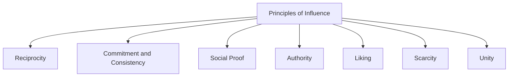

## Influencing Without Authority

### Definition and Scope

Influencing without authority refers to the ability to shape decisions, gain cooperation, and drive action from individuals over whom one has no direct positional or hierarchical control. This is a defining challenge in project management, where PMs frequently coordinate matrixed team members, vendors, functional managers, and senior stakeholders — none of whom report to the PM directly. Effectiveness in this domain relies on interpersonal influence, credibility, and relationship capital rather than command authority.

### Why This Skill Is Central to Project Management

**Key Points**

- Most project team members in matrixed organizations report to functional managers, not the PM, making direct authority largely unavailable
- Senior stakeholders and sponsors sit above the PM in formal hierarchy, requiring upward influence rather than downward direction
- Vendors and external partners operate under separate organizational incentives entirely outside the PM's authority
- Even where formal authority exists (e.g., a direct-report team), sustainable influence built on trust and credibility generally produces better long-term engagement than authority alone

### Sources of Power and Influence (French and Raven's Bases of Power)

John French and Bertram Raven's classic framework identifies distinct sources of interpersonal power, several of which remain available even without positional authority.

| Power Base | Description | Available Without Formal Authority? |
| --- | --- | --- |
| Legitimate Power | Power from formal position/role | No — this is positional authority itself |
| Reward Power | Ability to provide desired outcomes | Limited — PMs often lack direct reward control (pay, promotion) |
| Coercive Power | Ability to impose penalties | Generally no, and ethically discouraged even when available |
| Expert Power | Power from specialized knowledge/skill | Yes — highly available and often a PM's strongest lever |
| Referent Power | Power from being respected/liked, relationship-based | Yes — built through trust and credibility over time |
| Informational Power | Power from control of/access to relevant information | Yes — PMs often hold unique cross-functional visibility |

**Key Points**

- PMs without formal authority rely predominantly on Expert, Referent, and Informational power
- Expert power is built through demonstrated competence and sound judgment over time
- Referent power is built through the trust-building behaviors covered in Building Trust and Credibility
- Informational power stems from the PM's unique cross-project visibility — synthesizing information others don't have full access to — which must be used transparently to avoid appearing manipulative

### Robert Cialdini's Principles of Influence

Cialdini's widely referenced framework (from *Influence: The Psychology of Persuasion*) identifies six (later expanded to seven) principles that systematically affect persuasion, applicable to ethical workplace influence when used transparently.

- **Reciprocity**: People feel obligated to return favors — offering help first builds future goodwill
- **Commitment and Consistency**: People strive to act consistently with prior commitments — securing small early commitments increases follow-through on larger asks
- **Social Proof**: People look to others' behavior to guide their own — demonstrating that peers/similar teams have adopted an approach increases buy-in
- **Authority**: People defer to credible expertise — establishing genuine expert credibility (not false authority) increases persuasive weight
- **Liking**: People are more easily influenced by those they like — genuine rapport-building supports influence
- **Scarcity**: People value what is limited or time-constrained — legitimate scarcity (real deadlines, limited resources) can motivate action, though fabricated scarcity is manipulative and erodes trust
- **Unity**: People are influenced more by those who share a sense of shared identity/group membership — framing a request around shared team/organizational identity increases cooperation

[Inference] While Cialdini's framework is widely taught in negotiation and influence training, its principles carry an important ethical distinction in professional practice: using them to genuinely align interests differs meaningfully from using them manipulatively to override someone's independent judgment — the line generally rests on whether the underlying claim (scarcity, social proof, etc.) is authentic.

### Building an Influence Strategy

**Step 1: Map the Stakeholder Landscape**

Identify who has decision authority over the outcome needed, who influences that decision-maker, and what each party's interests and priorities are (see Stakeholder Engagement and Communication Planning).

**Step 2: Identify the Relevant Power Base**

Determine which source of power is most credible and available for this specific ask — expert power for technical decisions, informational power for cross-functional trade-offs, referent power for relationship-dependent requests.

**Step 3: Frame the Ask Around Their Interests**

Translate the request into terms that connect to the other party's goals and incentives, not just the PM's project needs (echoing interest-based negotiation principles).

**Step 4: Build Credibility Incrementally**

Establish trust through smaller, lower-stakes interactions before requesting significant cooperation on high-stakes matters.

**Step 5: Use Data and Objective Evidence**

Ground requests in demonstrable facts (schedule impact, cost data, risk exposure) rather than pure assertion or urgency alone.

**Step 6: Leverage Coalition and Allies**

Identify others who share the same interest in the outcome and can add social proof or additional informal pressure toward the desired decision.

### Influence Mapping Diagram (svg_diagram)

<svg xmlns="http://www.w3.org/2000/svg" viewBox="0 0 800 420" font-family="Arial, sans-serif">
<rect x="0" y="0" width="800" height="420" fill="#ffffff" />
<text x="400" y="28" text-anchor="middle" font-size="17" font-weight="bold" fill="#1a1a1a">Influence Network Mapping (svg_diagram)</text>
<circle cx="400" cy="220" r="55" fill="#2c5f8a" />
<text x="400" y="215" text-anchor="middle" font-size="12" fill="#ffffff" font-weight="bold">Decision</text>
<text x="400" y="232" text-anchor="middle" font-size="12" fill="#ffffff" font-weight="bold">Maker</text>
<circle cx="180" cy="120" r="45" fill="#4a8a2c" />
<text x="180" y="115" text-anchor="middle" font-size="11" fill="#ffffff" font-weight="bold">PM</text>
<text x="180" y="130" text-anchor="middle" font-size="10" fill="#ffffff">(Expert Power)</text>
<circle cx="620" cy="120" r="45" fill="#8a5a2c" />
<text x="620" y="115" text-anchor="middle" font-size="11" fill="#ffffff" font-weight="bold">Trusted</text>
<text x="620" y="130" text-anchor="middle" font-size="10" fill="#ffffff">Advisor</text>
<circle cx="180" cy="330" r="45" fill="#8a2c4a" />
<text x="180" y="325" text-anchor="middle" font-size="11" fill="#ffffff" font-weight="bold">Peer</text>
<text x="180" y="340" text-anchor="middle" font-size="10" fill="#ffffff">(Social Proof)</text>
<circle cx="620" cy="330" r="45" fill="#5a2c8a" />
<text x="620" y="325" text-anchor="middle" font-size="11" fill="#ffffff" font-weight="bold">Data/</text>
<text x="620" y="340" text-anchor="middle" font-size="10" fill="#ffffff">Evidence</text>
<line x1="220" y1="145" x2="360" y2="200" stroke="#888" stroke-width="1.5" />
<line x1="580" y1="145" x2="440" y2="200" stroke="#888" stroke-width="1.5" />
<line x1="220" y1="305" x2="360" y2="240" stroke="#888" stroke-width="1.5" />
<line x1="580" y1="305" x2="440" y2="240" stroke="#888" stroke-width="1.5" />

<text x="400" y="395" text-anchor="middle" font-size="11" font-style="italic" fill="#555">Multiple simultaneous influence paths increase likelihood of favorable decisions</text>

</svg>

### Influencing Upward vs. Laterally vs. Downward

| Direction | Target | Effective Approach |
| --- | --- | --- |
| Upward (sponsors, executives) | Those with formal authority over the PM | Concise framing tied to business impact, objective data, respect for their time constraints |
| Lateral (peer PMs, functional managers) | Those with equal organizational standing | Reciprocity, shared interest framing, coalition-building |
| Downward (matrixed team without direct authority) | Team members reporting elsewhere | Expert/referent power, clear rationale, servant leadership behaviors |

**Key Points**

- Upward influence typically benefits from brevity and clear business framing — senior stakeholders generally have limited time and numerous competing priorities
- Lateral influence with peer PMs often benefits from explicit reciprocity ("I can support your initiative if you can help with this dependency")
- Downward influence without formal authority depends heavily on the trust and credibility principles covered separately, since command-based tactics are unavailable and, even where partially available, tend to undermine long-term cooperation

### Practical Techniques for PMs

**Key Points**

- **Lead with shared goals**: Frame requests around outcomes the other party already cares about, not just the PM's project needs
- **Invest in relationships before you need them**: Build rapport and credibility proactively, not only when a specific ask arises
- **Use data to depersonalize requests**: Objective evidence ("the critical path shows a 2-week impact") is generally more persuasive and less confrontational than personal appeals alone
- **Make small asks before large ones**: Securing minor commitments builds consistency-driven momentum toward larger cooperation
- **Identify and engage informal influencers**: Some individuals hold outsized informal influence regardless of title; understanding the informal network matters as much as the formal org chart
- **Follow through reliably**: Every kept commitment strengthens referent power for future influence needs

### Ethical Boundaries of Influence

**Key Points**

- Genuine influence aligns the other party's authentic interests with the desired outcome; manipulation exploits cognitive biases to override someone's independent judgment against their actual interests
- Fabricating urgency, scarcity, or social proof that doesn't exist crosses from influence into manipulation and violates the honesty principle discussed in Ethics and Professional Responsibility
- Sustainable influence capital depends on consistently ethical use — a single instance of manipulative influence discovered by a stakeholder can permanently damage referent power

### Common Pitfalls

**Key Points**

- Relying solely on organizational title or project mandate to compel cooperation, which fails when no direct authority exists
- Framing requests entirely around the PM's own project needs without connecting to the other party's interests
- Attempting high-stakes influence asks before establishing baseline credibility and relationship trust
- Using data or facts adversarially ("gotcha" framing) rather than collaboratively, triggering defensiveness
- Over-relying on a single influence tactic (e.g., always appealing to authority) rather than adapting the approach to the specific stakeholder and situation
- Burning relationship capital through manipulative tactics for short-term wins, undermining long-term influence capacity

### Related Topics

- Building Trust and Credibility
- Negotiation Strategies and Tactics
- Stakeholder Engagement and Communication Planning
- Servant Leadership and Coaching
- Decision Making Under Uncertainty
- Ethics and Professional Responsibility