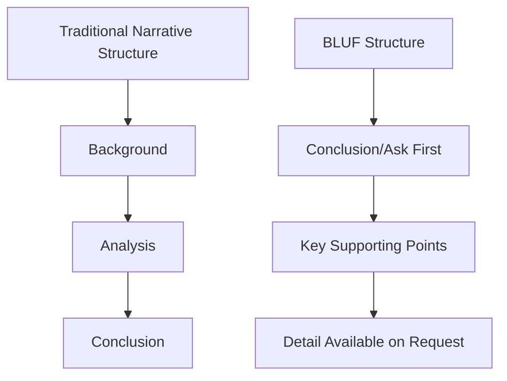

## Presenting to Executives and Sponsors

### Definition and Scope

Presenting to executives and sponsors refers to the specific communication discipline of conveying project information to senior decision-makers in a way that is concise, business-outcome-focused, and structured for rapid decision-making. This differs materially from team-level or peer communication, since executive audiences typically operate under severe time constraints, hold broader organizational context than project detail, and expect information framed around business impact rather than operational process.

### Why Executive Communication Requires a Different Approach

**Key Points**

- Executives typically allocate minutes, not hours, to any single project update — density and prioritization matter more than completeness
- Senior stakeholders are usually evaluating multiple competing initiatives simultaneously, so framing must clarify relative priority and impact
- Executives generally want the conclusion and recommendation first, with supporting detail available on request — not a chronological narrative building to a conclusion
- Miscalibrated technical depth (too much or too little) undermines credibility either by appearing to waste time or by appearing to lack substance

### The "Bottom Line Up Front" (BLUF) Principle

BLUF is a communication structure, originating in military and government communication practice, that places the key conclusion or ask at the very beginning of a communication, followed by supporting rationale.

**Key Points**

- Executive audiences frequently lose attention or need to leave before a narrative structure reaches its conclusion — BLUF front-loads the critical information
- Even when more time is available, leading with the conclusion helps the audience process supporting detail with the right context already established
- A well-formed BLUF typically states: what happened/is needed, what it means for the business, and what decision or action is requested

### Structuring an Executive Project Update

A commonly used structure for executive project status communication:

1. **Headline Status**: Overall health in one line (on track / at risk / off track), often supported by a simple visual indicator (RAG: Red-Amber-Green)
2. **Key Accomplishments**: Brief, outcome-focused — what was delivered, not activity performed
3. **Risks/Issues Requiring Executive Attention**: Only items genuinely requiring sponsor-level awareness or decision, not the full risk register
4. **Decisions Needed**: Explicit asks, framed with options and a recommendation
5. **Upcoming Milestones**: Forward-looking, tied to business outcomes
6. **Appendix/Backup**: Detailed data available if requested, not presented by default

| Section | Typical Length | Purpose |
| --- | --- | --- |
| Headline Status | 1 line | Immediate orientation |
| Key Accomplishments | 2-3 bullets | Demonstrate progress/value |
| Risks/Issues | 1-3 items max | Focus attention on what matters |
| Decisions Needed | Explicit, framed with options | Drive action |
| Upcoming Milestones | 2-3 bullets | Set expectations |
| Appendix | As needed | Support deeper questions without cluttering main narrative |

### Framing Content Around Business Impact

**Key Points**

- Translate technical/operational detail into business consequence language: not "the API integration failed regression testing" but "a technical issue was found that, if unresolved, could delay the client-facing launch by two weeks"
- Quantify impact wherever possible — cost, schedule, risk exposure, revenue, customer impact — since executives generally weigh decisions in those terms
- Avoid unexplained internal jargon, acronyms, or tool-specific terminology unfamiliar to a non-project audience
- Connect project-level detail explicitly back to the strategic objective the project serves, especially for sponsors managing portfolio-level priorities

### Presenting Options and Recommendations

When executive input or a decision is needed, present a small number of clearly framed options rather than open-ended problems.

**Example**

> **Poor framing**: "We're behind schedule and need to figure out what to do."
>
> **Effective framing**: "We're currently 3 weeks behind the original schedule due to a vendor delay. I see three options: (1) add contractor resources at an additional $40,000 to recover the timeline, (2) descope the reporting module to a Phase 2 release and hold the original date, or (3) accept a 3-week delay with no additional cost. My recommendation is Option 2, since the reporting module has the lowest immediate business value per the original prioritization. I'd like your decision by Friday to keep the plan on track."

**Key Points**

- Always include a recommendation, even when the final decision rests with the executive — this demonstrates the PM's judgment and typically accelerates the decision
- State a clear deadline for the decision when one exists, to avoid indefinite deferral
- Present trade-offs explicitly in terms the sponsor already cares about (cost, schedule, scope, risk) rather than internal process detail

### Executive Presentation Structure Diagram (svg_diagram)

<svg xmlns="http://www.w3.org/2000/svg" viewBox="0 0 800 400" font-family="Arial, sans-serif">
<rect x="0" y="0" width="800" height="400" fill="#ffffff" />
<text x="400" y="28" text-anchor="middle" font-size="17" font-weight="bold" fill="#1a1a1a">Executive Update Structure (svg_diagram)</text>
<rect x="60" y="60" width="680" height="55" rx="6" fill="#2c5f8a" />
<text x="400" y="93" text-anchor="middle" font-size="13" fill="#ffffff" font-weight="bold">Headline Status (RAG) — one line</text>
<rect x="60" y="130" width="330" height="70" rx="6" fill="#4a8a2c" />
<text x="225" y="160" text-anchor="middle" font-size="12" fill="#ffffff" font-weight="bold">Key Accomplishments</text>
<text x="225" y="180" text-anchor="middle" font-size="10" fill="#ffffff">Outcome-focused, 2-3 bullets</text>
<rect x="410" y="130" width="330" height="70" rx="6" fill="#8a2c4a" />
<text x="575" y="160" text-anchor="middle" font-size="12" fill="#ffffff" font-weight="bold">Risks Needing Attention</text>
<text x="575" y="180" text-anchor="middle" font-size="10" fill="#ffffff">Only sponsor-level items</text>
<rect x="60" y="215" width="680" height="70" rx="6" fill="#8a5a2c" />
<text x="400" y="245" text-anchor="middle" font-size="13" fill="#ffffff" font-weight="bold">Decisions Needed</text>
<text x="400" y="265" text-anchor="middle" font-size="10" fill="#ffffff">Options framed with a clear recommendation and deadline</text>
<rect x="60" y="300" width="680" height="60" rx="6" fill="#5a2c8a" />
<text x="400" y="335" text-anchor="middle" font-size="13" fill="#ffffff" font-weight="bold">Upcoming Milestones + Appendix (on request)</text>
</svg>

### Handling Questions and Pushback

**Key Points**

- Anticipate likely questions in advance and prepare concise, direct answers — vague or evasive responses under senior scrutiny damage credibility quickly
- When uncertain, state that directly rather than guessing — "I don't have that figure with me, but I'll confirm and follow up by [date]" preserves trust better than an inaccurate answer
- Stay composed under challenging or skeptical questioning; treat pushback as a request for more information, not a personal challenge
- If a question reveals a need for deeper analysis, offer a specific follow-up (with timeline) rather than attempting to improvise a complex answer live

### Visual Communication for Executive Audiences

**Key Points**

- Favor simple, high-contrast visuals (RAG status, simple trend lines, milestone timelines) over dense, data-heavy charts
- Every slide/visual should support a single, clear takeaway — avoid multi-purpose charts requiring extended explanation
- Use consistent visual language (the same status color scheme, the same milestone format) across recurring updates so executives can scan quickly without relearning the format each time
- Remove decorative complexity that doesn't add decision-relevant information — executive attention is a scarce resource

### Delivering the Presentation

**Key Points**

- **Pace deliberately**: Avoid rushing through content out of nervousness; a confident, measured pace signals command of the material
- **Read the room**: Be prepared to skip ahead or compress content if executive time is cut short mid-presentation, prioritizing the BLUF and decision ask
- **Project confidence without overstating certainty**: Distinguish clearly between confirmed facts and estimates/projections
- **Practice concise verbal summaries**: Be able to articulate the core update in under 60 seconds if directly asked, independent of prepared slides

### Common Pitfalls

**Key Points**

- Leading with background/chronology instead of the conclusion, losing time-constrained executives before reaching the key point
- Presenting the full risk register or complete status detail rather than curating to what requires executive attention
- Using unexplained internal jargon or acronyms unfamiliar outside the project team
- Bringing a problem without a recommended option, forcing the executive to do the PM's analytical work
- Overloading slides with dense data that requires lengthy explanation rather than supporting a quick takeaway
- Becoming defensive or evasive under pushback rather than treating questions as legitimate requests for clarity
- Failing to state a clear decision deadline, allowing needed decisions to be indefinitely deferred

### Related Topics

- Stakeholder Engagement and Communication Planning
- Active Listening and Clear Communication
- Influencing Without Authority
- Decision Making Under Uncertainty
- Negotiation Strategies and Tactics
- Building Trust and Credibility