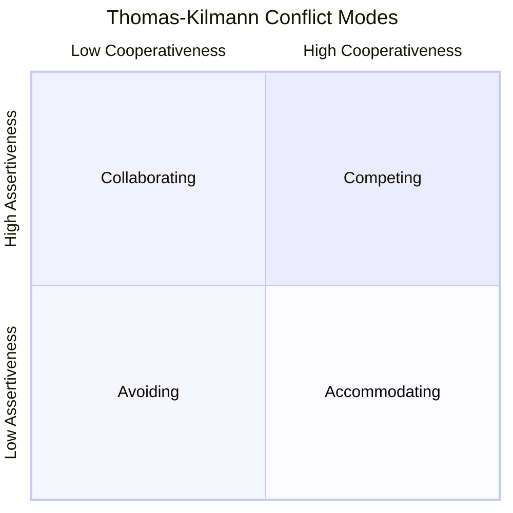

## Conflict Resolution Techniques

### Definition and Scope

Conflict resolution techniques are the structured approaches and interventions used to address and resolve disagreement or tension between individuals or groups on a project, once conflict has been identified (see Sources of Project Conflict). The goal is not necessarily to eliminate conflict — since some task conflict can be constructive — but to manage it toward outcomes that preserve or improve working relationships, decision quality, and project progress.

### The Thomas-Kilmann Conflict Mode Instrument (TKI)

Developed by Kenneth Thomas and Ralph Kilmann, the TKI is the most widely referenced framework in project management for categorizing conflict-handling styles along two dimensions: **assertiveness** (concern for one's own needs) and **cooperativeness** (concern for the other party's needs).

Note: Compromising sits at the intersection of moderate assertiveness and moderate cooperativeness, not shown as a corner in the simplified quadrant view above.

### The Five Conflict-Handling Modes

| Mode | Assertiveness | Cooperativeness | Best Used When |
| --- | --- | --- | --- |
| Competing | High | Low | Quick, decisive action needed; unpopular but necessary decisions; safety-critical issues |
| Collaborating | High | High | Both parties' concerns are too important to compromise; complex issue benefits from combined perspectives |
| Compromising | Moderate | Moderate | Time-constrained; parties have roughly equal power; temporary settlement needed |
| Avoiding | Low | Low | Issue is trivial; more information is needed; emotions need to cool before productive discussion |
| Accommodating | Low | High | The issue matters more to the other party; preserving the relationship outweighs the specific issue; building goodwill for future asks |

**Key Points**

- No single mode is universally "best" — effective conflict management requires matching the mode to the situation, not defaulting to one habitual style
- Most individuals have a natural default mode shaped by personality and experience; developing conflict resolution skill means expanding situational flexibility beyond that default
- Overuse of Avoiding or Accommodating can allow unresolved issues to accumulate into relationship conflict over time
- Overuse of Competing can damage trust and psychological safety, particularly with team members over whom the PM lacks formal authority

### Choosing the Right Conflict Mode

**Example**

> A team member proposes a technical approach the PM believes is suboptimal, but the difference in outcome quality is marginal and the team member has strong conviction.
>
> - **Competing** would overrule the team member's judgment — appropriate only if the stakes are high enough to justify overriding their expertise and autonomy
> - **Accommodating** would let the team member proceed — appropriate here, since the outcome difference is marginal and supporting their ownership builds trust and autonomy
> - **Collaborating** would explore whether a hybrid approach captures both perspectives' strengths — worth attempting first if time allows, since it preserves both outcome quality and ownership

### Interest-Based Conflict Resolution Process

Building on principled negotiation concepts (see Negotiation Strategies and Tactics), a structured process for resolving substantive conflict:

**Step 1: Create a Safe Environment**

Establish psychological safety before addressing substance — private setting for sensitive conflicts, neutral framing, explicit statement of good intent.

**Step 2: Separate People from the Problem**

Address the issue itself without attacking character; use "I" statements to describe impact rather than accusatory "you" statements.

**Step 3: Ensure Each Party Feels Heard**

Use active listening and reflective techniques (see Active Listening and Clear Communication) before moving to problem-solving — skipping this step frequently causes parties to disengage from subsequent resolution attempts.

**Step 4: Identify Underlying Interests**

Move past stated positions to understand what each party actually needs, consistent with interest-based negotiation.

**Step 5: Generate Options Collaboratively**

Brainstorm multiple possible resolutions before evaluating any single option, avoiding premature convergence on the first idea raised.

**Step 6: Evaluate Against Objective Criteria**

Assess options against project goals, data, or agreed standards rather than relative power or persistence.

**Step 7: Agree and Document**

Confirm the resolution explicitly, document it, and define any follow-up needed.

### Conflict Resolution Process Flow (svg_diagram)

<svg xmlns="http://www.w3.org/2000/svg" viewBox="0 0 820 380" font-family="Arial, sans-serif">
<rect x="0" y="0" width="820" height="380" fill="#ffffff" />
<text x="410" y="28" text-anchor="middle" font-size="17" font-weight="bold" fill="#1a1a1a">Interest-Based Conflict Resolution Flow (svg_diagram)</text>
<rect x="30" y="60" width="160" height="80" rx="6" fill="#2c5f8a" />
<text x="110" y="95" text-anchor="middle" font-size="11" fill="#ffffff" font-weight="bold">Create Safe</text>
<text x="110" y="112" text-anchor="middle" font-size="11" fill="#ffffff" font-weight="bold">Environment</text>
<rect x="220" y="60" width="160" height="80" rx="6" fill="#4a8a2c" />
<text x="300" y="95" text-anchor="middle" font-size="11" fill="#ffffff" font-weight="bold">Ensure Each</text>
<text x="300" y="112" text-anchor="middle" font-size="11" fill="#ffffff" font-weight="bold">Party Heard</text>
<rect x="410" y="60" width="160" height="80" rx="6" fill="#8a5a2c" />
<text x="490" y="95" text-anchor="middle" font-size="11" fill="#ffffff" font-weight="bold">Identify</text>
<text x="490" y="112" text-anchor="middle" font-size="11" fill="#ffffff" font-weight="bold">Interests</text>
<rect x="600" y="60" width="190" height="80" rx="6" fill="#8a2c4a" />
<text x="695" y="95" text-anchor="middle" font-size="11" fill="#ffffff" font-weight="bold">Generate Options</text>
<text x="695" y="112" text-anchor="middle" font-size="11" fill="#ffffff" font-weight="bold">Collaboratively</text>
<rect x="220" y="220" width="160" height="80" rx="6" fill="#5a2c8a" />
<text x="300" y="255" text-anchor="middle" font-size="11" fill="#ffffff" font-weight="bold">Evaluate vs.</text>
<text x="300" y="272" text-anchor="middle" font-size="11" fill="#ffffff" font-weight="bold">Objective Criteria</text>
<rect x="410" y="220" width="160" height="80" rx="6" fill="#2c8a7a" />
<text x="490" y="255" text-anchor="middle" font-size="11" fill="#ffffff" font-weight="bold">Agree and</text>
<text x="490" y="272" text-anchor="middle" font-size="11" fill="#ffffff" font-weight="bold">Document</text>
<line x1="190" y1="100" x2="220" y2="100" stroke="#888" stroke-width="2" />
<line x1="380" y1="100" x2="410" y2="100" stroke="#888" stroke-width="2" />
<line x1="570" y1="100" x2="600" y2="100" stroke="#888" stroke-width="2" />
<line x1="695" y1="140" x2="490" y2="220" stroke="#888" stroke-width="2" />
<line x1="380" y1="260" x2="410" y2="260" stroke="#888" stroke-width="2" />
</svg>

### De-escalation Techniques for Heated Conflict

**Key Points**

- **Pause before responding**: Allow strong emotional reactions to settle before continuing discussion, especially if either party is visibly escalated
- **Acknowledge emotion explicitly**: Naming the emotional temperature ("I can see this is frustrating for both of you") can reduce its intensity
- **Reframe from blame to problem**: Shift language from "you did X" to "how do we solve X together"
- **Take a break if needed**: A short recess can prevent escalation from causing lasting relationship damage; resume once emotions have settled
- **Move to a private setting**: Public conflict escalation increases defensiveness and social pressure; private discussion allows more candor

### Mediation and Third-Party Facilitation

When direct resolution between parties stalls, a neutral third party (often the PM, though sometimes an outside facilitator or HR representative for serious interpersonal conflict) can mediate.

**Key Points**

- The mediator's role is process facilitation, not imposing a solution — the mediator should generally avoid taking a side on the substantive issue
- Meet with parties individually first (when appropriate) to understand each perspective before bringing them together
- Establish ground rules for the joint conversation (no interrupting, focus on interests not accusations)
- For conflicts involving power imbalance, harassment, or policy violations, escalate to HR or appropriate organizational channels rather than attempting informal mediation — [Unverified] as the appropriate escalation threshold depends on organizational policy and the specific nature of the conflict, which a PM should not attempt to unilaterally judge in serious cases

### Escalation Pathways

| Conflict Severity | Appropriate Resolution Level |
| --- | --- |
| Minor disagreement, task-focused | Self-resolution between parties, PM facilitation if needed |
| Persistent disagreement affecting team function | PM-led mediated conversation |
| Cross-team/cross-functional conflict | PM engages relevant functional managers or the PMO |
| Conflict involving policy violation, harassment, or serious misconduct | Escalate to HR/appropriate organizational authority immediately |
| Sponsor/stakeholder-level strategic disagreement | Structured negotiation, potentially involving governance/steering committee |

### Preventing Recurring Conflict

**Key Points**

- Address root structural causes identified during diagnosis (see Sources of Project Conflict) rather than only resolving the immediate symptom
- Establish clear team working agreements and decision-rights clarity (e.g., RACI) to reduce ambiguity-driven conflict recurrence
- Build regular retrospective/feedback cadences so minor friction surfaces and is addressed before escalating
- Model constructive conflict-handling behavior consistently, reinforcing that healthy disagreement is safe and expected

### Practical Techniques for PMs

**Key Points**

- **Diagnose before intervening**: Confirm whether the conflict is task, process, or relationship-based before selecting an approach
- **Match conflict mode to stakes and relationship**: Reserve Competing for genuinely high-stakes, time-critical situations; default toward Collaborating when time and stakes allow
- **Use structured processes for substantive conflict**: Apply the interest-based resolution steps rather than improvising in high-stakes disputes
- **Document resolutions**: Particularly for conflicts involving scope, resource, or process disagreements, record what was agreed to prevent recurrence
- **Know your escalation boundaries**: Recognize when a conflict exceeds appropriate PM-led resolution and requires HR or organizational escalation

### Common Pitfalls

**Key Points**

- Defaulting to a single conflict-handling mode (e.g., always Avoiding or always Competing) regardless of situation
- Rushing to solutions before ensuring both parties feel genuinely heard, causing continued disengagement
- Attempting to mediate serious interpersonal conflicts (harassment, policy violations) informally rather than escalating appropriately
- Addressing only the surface symptom of a conflict while leaving the underlying structural cause unresolved, leading to recurrence
- Resolving conflict in a way that satisfies the louder or more senior party rather than the objectively better outcome
- Failing to document agreed resolutions, allowing the same disagreement to resurface without a clear reference point

### Related Topics

- Sources of Project Conflict
- Negotiation Strategies and Tactics
- Active Listening and Clear Communication
- Building Trust and Credibility
- Servant Leadership and Coaching
- Cross Cultural Team Dynamics
- Facilitating Effective Meetings