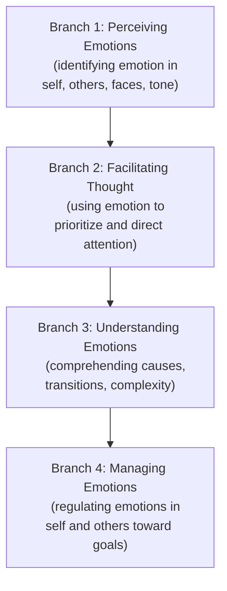

## Emotional Intelligence Fundamentals

### Definition and Scope

Emotional Intelligence (EI), also termed Emotional Quotient (EQ), is the capacity to recognize, understand, regulate, and use emotions—both one's own and those of others—to guide thinking, behavior, and interpersonal interactions. In project management, EI functions as a core competency because projects are executed through people, and a project manager's ability to navigate stress, motivate teams, and resolve interpersonal friction directly affects schedule, cost, and quality outcomes.

The Project Management Institute (PMI) incorporates EI within the "Power Skills" or "Leadership" domain of the PMI Talent Triangle, alongside technical project management and strategic/business management skills.

### Core Models of Emotional Intelligence

**Key Points**

- **Ability Model (Mayer & Salovey)**: Frames EI as a set of cognitive abilities structured in four branches: perceiving emotions, using emotions to facilitate thought, understanding emotions, and managing emotions.
- **Mixed Model (Daniel Goleman)**: Combines cognitive ability with personality traits and behavioral competencies, organized into five components: self-awareness, self-regulation, motivation, empathy, and social skills. This is the most widely referenced model in project management literature.
- **Trait Model (Petrides)**: Treats EI as a constellation of self-perceived personality traits measured through self-report, distinct from cognitive-ability-based models.

### Goleman's Five Components in Project Management Context

#### 1. Self-Awareness

The ability to recognize one's own emotions, triggers, strengths, and limitations in real time.

**Example**

A project manager notices rising frustration during a stakeholder meeting when scope changes are proposed late. Recognizing this in the moment allows the PM to pause before responding defensively, rather than reacting impulsively and damaging the stakeholder relationship.

#### 2. Self-Regulation

The capacity to manage disruptive emotions and impulses, maintaining composure and adaptability under pressure.

**Example**

When a critical vendor misses a delivery deadline, a self-regulated PM addresses the issue through structured escalation and mitigation planning rather than venting anger in a team channel, which would erode team morale.

#### 3. Motivation

An internal drive toward achievement that goes beyond external rewards, characterized by commitment, initiative, and optimism in the face of setbacks.

#### 4. Empathy

The ability to understand others' emotional states and perspectives, including social awareness of team and organizational dynamics.

**Example**

A team member's declining engagement in standups may signal burnout rather than disinterest. An empathetic PM investigates the underlying cause—workload, personal circumstances, unclear expectations—before assuming poor performance.

#### 5. Social Skill

Proficiency in managing relationships, building networks, and guiding people toward desired outcomes—encompassing communication, conflict management, and influence.

### The Four-Branch Ability Model (Mayer & Salovey) in Detail

Branch 1 and 2 are considered "experiential" EI (perceiving and using emotion), while Branch 3 and 4 are "strategic" EI (understanding and managing emotion). The branches build hierarchically, with managing emotions representing the most cognitively complex skill.

### EI Versus IQ and Technical Skill

| Dimension | Cognitive Intelligence (IQ) | Emotional Intelligence (EI) |
| --- | --- | --- |
| Nature | Largely stable, genetically influenced | Developable through practice and feedback |
| Domain | Logical, analytical, technical reasoning | Interpersonal and intrapersonal regulation |
| Predictive value in PM roles | Necessary for technical competence (scheduling, budgeting, risk modeling) | Strong predictor of leadership effectiveness and team performance |
| Measurement | Standardized IQ tests | Self-report inventories, 360-degree assessments, ability-based tests (e.g., MSCEIT) |

[Inference] Research literature generally suggests EI accounts for a substantial portion of leadership effectiveness variance beyond IQ and technical skill, though exact percentages vary by study and methodology and should not be treated as fixed constants.

### Why EI Matters in Project Management

- **Stakeholder Management**: Reading unspoken concerns during status reviews allows a PM to address resistance before it escalates into formal issues.
- **Team Cohesion**: High-EI PMs de-escalate interpersonal conflict rather than allowing it to fester and derail sprint or phase execution.
- **Change Management**: Projects often introduce organizational change; EI helps PMs anticipate and manage resistance rooted in fear or uncertainty.
- **Decision-Making Under Pressure**: Self-regulation prevents stress-driven decisions (e.g., panic-driven scope cuts) that compromise project outcomes.
- **Negotiation**: Understanding counterpart emotions and motivations improves outcomes in vendor and contract negotiations.

### Emotional Intelligence Self-Assessment Framework

A structural representation of how self-assessment feeds into behavioral change:

<svg xmlns="http://www.w3.org/2000/svg" viewBox="0 0 800 320" font-family="Arial, sans-serif">
<text x="400" y="25" text-anchor="middle" font-size="16" font-weight="bold" fill="#1a1a1a">EI Development Cycle (svg_diagram)</text>
<rect x="30" y="60" width="160" height="70" rx="8" fill="#e8f0fe" stroke="#3b6fd6" stroke-width="1.5" />
<text x="110" y="90" text-anchor="middle" font-size="13" fill="#1a1a1a">Self-Assessment</text>
<text x="110" y="108" text-anchor="middle" font-size="11" fill="#444">(inventories, feedback)</text>
<rect x="230" y="60" width="160" height="70" rx="8" fill="#e8f0fe" stroke="#3b6fd6" stroke-width="1.5" />
<text x="310" y="90" text-anchor="middle" font-size="13" fill="#1a1a1a">Awareness</text>
<text x="310" y="108" text-anchor="middle" font-size="11" fill="#444">(identify triggers/patterns)</text>
<rect x="430" y="60" width="160" height="70" rx="8" fill="#e8f0fe" stroke="#3b6fd6" stroke-width="1.5" />
<text x="510" y="90" text-anchor="middle" font-size="13" fill="#1a1a1a">Regulation Practice</text>
<text x="510" y="108" text-anchor="middle" font-size="11" fill="#444">(pause, reframe, respond)</text>
<rect x="630" y="60" width="140" height="70" rx="8" fill="#e8f0fe" stroke="#3b6fd6" stroke-width="1.5" />
<text x="700" y="90" text-anchor="middle" font-size="13" fill="#1a1a1a">Behavioral Change</text>
<text x="700" y="108" text-anchor="middle" font-size="11" fill="#444">(observable habits)</text>
<line x1="190" y1="95" x2="228" y2="95" stroke="#3b6fd6" stroke-width="2" marker-end="url(#arrow1)" />
<line x1="390" y1="95" x2="428" y2="95" stroke="#3b6fd6" stroke-width="2" marker-end="url(#arrow1)" />
<line x1="590" y1="95" x2="628" y2="95" stroke="#3b6fd6" stroke-width="2" marker-end="url(#arrow1)" />
<path d="M 700 130 C 700 220 110 220 110 130" fill="none" stroke="#888" stroke-width="1.5" stroke-dasharray="5,4" marker-end="url(#arrow2)" />
<text x="400" y="245" text-anchor="middle" font-size="11" fill="#666">Feedback loop: outcomes inform renewed self-assessment</text>
</svg>

### Common Assessment Instruments

- **MSCEIT (Mayer-Salovey-Caruso Emotional Intelligence Test)**: Ability-based, performance-measured test aligned with the four-branch model.
- **EQ-i 2.0**: Self-report inventory measuring EI across interpersonal, intrapersonal, stress management, adaptability, and general mood composites.
- **ESCI (Emotional and Social Competency Inventory)**: 360-degree instrument built on Goleman's competency framework, often used in leadership development programs.

[Unverified] Specific licensing terms, costs, and normative data for these instruments change over time and should be confirmed against the current publisher documentation before organizational deployment.

### Practical Techniques for Developing EI as a Project Manager

1. **Emotion labeling**: Explicitly naming an emotion ("I am feeling defensive right now") reduces its intensity and creates cognitive distance before reacting.
2. **Structured reflection**: Post-meeting journaling on emotional triggers and responses builds pattern recognition over time.
3. **Active listening**: Paraphrasing stakeholder statements before responding demonstrates empathy and reduces miscommunication.
4. **Pause-and-respond protocols**: Deliberately inserting a delay (e.g., drafting but not sending an email immediately) prevents impulsive reactions during conflict.
5. **Seeking 360-degree feedback**: Structured feedback from peers, sponsors, and team members surfaces blind spots self-assessment alone cannot reveal.

### Common Pitfalls

- Conflating EI with simply "being nice" or conflict-avoidant, which can undermine necessary accountability conversations.
- Treating EI as fixed rather than developable, discouraging investment in improvement.
- Over-indexing on empathy without pairing it with decisive action, leading to analysis paralysis in conflict situations.
- Assuming self-reported EI scores equal demonstrated behavioral competence; self-report and 360-degree/ability-based measures can diverge. [Inference] This divergence is a recurring finding in EI assessment literature, though the magnitude varies by population and instrument.

### Relationship to Conflict Resolution

EI fundamentals directly underpin conflict resolution competency: self-awareness and self-regulation prevent a PM from escalating disputes, while empathy and social skill enable identification of underlying interests (versus stated positions) in a disagreement—forming the behavioral foundation for structured conflict-resolution techniques covered elsewhere in this chapter.

**Next Steps**

- Emotional Triggers and Trigger Management
- Active Listening Techniques for Project Managers
- Conflict Resolution Styles (Thomas-Kilmann Model)
- Difficult Conversations Framework
- Stakeholder Emotional Mapping
- Building Psychological Safety in Teams
- Stress Management and Resilience for Project Leaders
- Cultural Dimensions of Emotional Expression in Global Teams