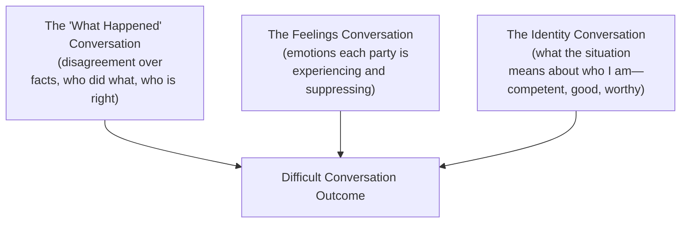

## Navigating Difficult Conversations

### Definition and Scope

A difficult conversation is any interpersonal exchange in which the stakes are high, opinions differ, and emotions run strong—characteristics that make the exchange prone to avoidance, escalation, or poor outcomes if handled without structure. In project management, difficult conversations arise around performance issues, scope disputes, resource conflicts, delivering bad news to sponsors, and interpersonal friction within teams. Navigating them effectively is a direct application of the emotional intelligence fundamentals (self-awareness, self-regulation, empathy) covered earlier in this chapter.

### Why Difficult Conversations Are Avoided

**Key Points**

- **Fear of damaging the relationship**: Concern that direct feedback or disagreement will harm rapport with a stakeholder or team member.
- **Fear of emotional reactions**: Anticipating anger, defensiveness, or distress from the other party.
- **Uncertainty about outcome**: Lack of confidence that the conversation will resolve anything, making avoidance feel lower-risk.
- **Conflict-avoidant organizational culture**: Environments where raising issues is implicitly discouraged.

Avoidance carries compounding costs: unresolved issues typically worsen over time, erode trust when finally surfaced, and can escalate from a manageable one-on-one conversation into a formal grievance or project failure.

### The Three Conversations Framework

A widely referenced structural model (derived from *Difficult Conversations* by Stone, Patton, and Heen) decomposes every difficult conversation into three simultaneous layers:

**Example**

A PM must tell a senior developer that their module is behind schedule and blocking integration testing. The "what happened" layer concerns the actual delay and its causes. The feelings layer includes the PM's frustration and the developer's possible shame or defensiveness. The identity layer may involve the developer questioning their competence, and the PM questioning their own leadership adequacy. Addressing only the facts while ignoring the feelings and identity layers frequently produces a technically correct but relationally damaging conversation.

### Structured Preparation Framework

Before initiating a difficult conversation, a PM should clarify:

1. **Purpose**: What outcome is genuinely needed—information exchange, behavior change, relationship repair, or decision alignment?
2. **Facts versus story**: Separate observable facts (missed deadline, specific email content) from the interpretive story built around them (assumptions about intent or competence).
3. **Own contribution**: Identify how one's own actions or omissions may have contributed to the situation, which reduces one-sided blame framing.
4. **Desired tone**: Decide whether the conversation calls for direct correction, collaborative problem-solving, or supportive coaching.

### The SBI Model (Situation-Behavior-Impact)

A concise structure for delivering feedback that separates observation from judgment.

| Component | Description | Example |
| --- | --- | --- |
| **Situation** | Specific, time-bound context | "In yesterday's sprint review..." |
| **Behavior** | Observable action, not inferred motive | "...you interrupted two team members while they were presenting their updates." |
| **Impact** | Effect on the team, project, or outcome | "This made it harder for the team to finish the review on time and may discourage them from speaking up in future reviews." |

Using SBI keeps the conversation anchored in observable behavior rather than character judgments, which reduces defensiveness.

### Crucial Conversations Model (Patterson, Grenny, McMillan, Switzler)

A complementary framework centered on maintaining "psychological safety" and staying in productive dialogue under high stakes.

**Key Points**

- **Start with Heart**: Clarify one's own genuine motive before entering the conversation—what do I really want for myself, the other person, and the relationship?
- **Learn to Look**: Monitor for signs the conversation is moving toward silence (withdrawal, sarcasm, masking) or violence (controlling, labeling, attacking).
- **Make It Safe**: When safety is threatened, pause and rebuild it—through apologizing, contrasting ("I don't want you to think X, I do want Y"), or clarifying mutual purpose.
- **Master My Stories**: Recognize the interpretive story being told about the other person's motives, and separate it from observable facts.
- **STATE My Path**: Share facts, tell the story, ask for others' paths, talk tentatively, and encourage testing—a structured sequence for voicing a difficult message without triggering defensiveness.

### Nonviolent Communication (NVC) Structure

A four-part framework (Rosenberg) useful for expressing concerns without triggering blame-defensiveness cycles:

$$\text{Observation} \rightarrow \text{Feeling} \rightarrow \text{Need} \rightarrow \text{Request}$$

**Example**

"When the status report was submitted two days late (observation), I felt anxious (feeling) because I need reliable data to update the steering committee (need). Could we agree on a process where you flag delays as soon as you anticipate them (request)?"

### Delivering Difficult News to Stakeholders

For scenarios such as reporting budget overruns, missed milestones, or scope failures to a sponsor or steering committee:

1. **Lead with the headline**: State the core issue plainly and early rather than burying it in context, which preserves credibility.
2. **Provide root cause, not excuses**: Explain contributing factors factually without framing them as justifications.
3. **Present options, not just problems**: Arrive with at least two viable paths forward (e.g., re-baseline schedule, add resources, reduce scope) so the stakeholder retains a sense of control.
4. **Own the PM's accountability**: Acknowledge the PM's role in oversight where relevant, which builds trust rather than eroding it.
5. **Confirm next steps and follow-up cadence**: Close with a concrete plan for monitoring and reporting on the resolution.

### Common Pitfalls in Difficult Conversations

- **Leading with blame**: Framing the conversation around fault rather than shared problem-solving triggers defensiveness immediately.
- **Vague feedback**: Using generalized language ("you're not a team player") instead of specific, observable behavior (SBI model) leaves the recipient unable to act.
- **Conversation dumping**: Combining multiple unrelated grievances into a single confrontation overwhelms the recipient and obscures the primary issue.
- **Ignoring emotional cues**: Proceeding through a scripted talking-points list while ignoring visible distress or anger from the other party.
- **Conflating disagreement with disrespect**: Treating pushback on the PM's assessment as insubordination rather than valid input.
- **Poor timing and setting**: Initiating a sensitive conversation in a public space, immediately before a deadline, or via asynchronous channels (email, chat) when synchronous dialogue is warranted.

[Inference] The relative effectiveness of synchronous versus asynchronous channels for difficult conversations depends heavily on organizational culture, remote/distributed team norms, and the specific relationship involved, and should not be treated as a universal rule.

### Difficult Conversation Preparation Checklist

**Example**

- [ ] Clarified the purpose and desired outcome of the conversation
- [ ] Separated observable facts from interpretive story
- [ ] Identified own potential contribution to the situation
- [ ] Selected an appropriate private setting and adequate time
- [ ] Prepared SBI-structured opening (Situation-Behavior-Impact)
- [ ] Anticipated likely emotional reactions and planned safety-restoring responses
- [ ] Identified at least one concrete next step or request to close with

### Virtual and Distributed Team Considerations

- **Reduced nonverbal cues**: Video calls transmit fewer cues than in-person conversation, increasing the risk of misreading tone; enabling video (where appropriate) helps preserve some of this signal.
- **Time zone sensitivity**: Scheduling difficult conversations outside a participant's normal working hours can compound stress and should be avoided where feasible.
- **Written follow-up**: A brief written summary after a virtual difficult conversation helps confirm mutual understanding and creates a shared record, particularly across language or cultural differences.

### Relationship to Emotional Intelligence Fundamentals

Navigating difficult conversations is the applied practice of the EI competencies introduced earlier: self-awareness surfaces one's own triggers before the conversation begins, self-regulation sustains composure when the exchange becomes tense, and empathy enables accurate reading of the other party's feelings and identity concerns—together forming the behavioral toolkit this chapter builds toward for structured conflict resolution.

**Next Steps**

- Conflict Resolution Styles (Thomas-Kilmann Model)
- Giving and Receiving Constructive Feedback
- Managing Team Conflict in Distributed Environments
- Stakeholder Communication Under Pressure
- De-escalation Techniques for High-Tension Meetings
- Psychological Safety and Team Trust Building
- Negotiation Fundamentals for Project Managers