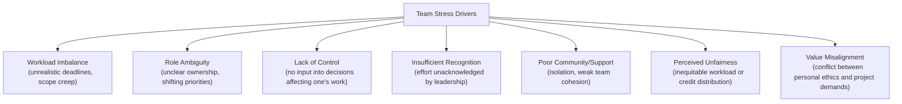
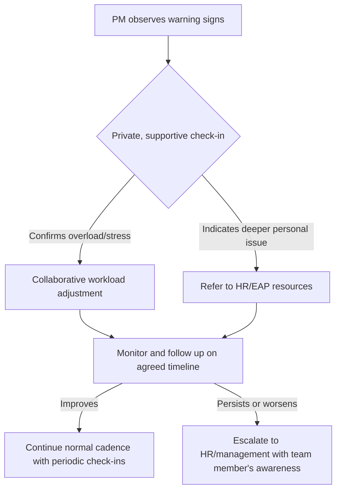

## Managing Team Stress and Burnout

### Definition and Scope

Burnout is a syndrome resulting from chronic workplace stress that has not been successfully managed, characterized by three dimensions per the World Health Organization's ICD-11 classification: feelings of energy depletion or exhaustion, increased mental distance from one's job or feelings of negativism/cynicism, and reduced professional efficacy. Team stress refers to the broader precursor condition—sustained pressure from workload, uncertainty, interpersonal friction, or role ambiguity—that, left unaddressed, progresses toward burnout. In project management, this topic sits within Conflict Resolution and Emotional Intelligence because chronic stress is both a source of interpersonal conflict and a condition requiring the empathy and self-regulation competencies covered earlier in this chapter.

### Distinguishing Stress from Burnout

| Dimension | Acute/Chronic Stress | Burnout |
| --- | --- | --- |
| Core feature | Over-engagement, urgency | Disengagement, cynicism |
| Emotional tone | Anxiety, hyperactivity | Helplessness, numbness |
| Energy state | Depleted physical energy | Depleted motivation and idealism |
| Reversibility | Generally reversible with rest/support | Requires sustained intervention; slower recovery |
| Primary damage | Physical and emotional exhaustion | Detachment, loss of efficacy, depersonalization |

[Inference] The stress-to-burnout progression is generally described as a continuum in occupational health literature rather than a sharp binary, meaning individuals may exhibit overlapping symptoms rather than a clean transition from one state to the other.

### The Maslach Burnout Inventory (MBI) Dimensions

**Key Points**

- **Emotional Exhaustion**: Feeling emotionally overextended and depleted by work demands.
- **Depersonalization / Cynicism**: Developing detached, negative, or callous attitudes toward colleagues, stakeholders, or the work itself.
- **Reduced Personal Accomplishment**: A decline in feelings of competence and productive achievement in one's role.

The MBI remains one of the most widely used instruments for assessing burnout severity across these three dimensions in organizational research.

### Common Drivers of Team Stress in Project Environments

This six-driver structure (with value misalignment as a seventh) reflects Maslach and Leiter's widely cited organizational model of burnout antecedents, commonly referred to as the "Six Areas of Worklife."

### Early Warning Signs for Project Managers to Monitor

**Example**

- Declining quality or increased errors from a previously high-performing team member
- Withdrawal from meetings—camera off, minimal verbal participation, delayed responses
- Increased irritability or uncharacteristic conflict with peers
- Rising absenteeism or unexplained short-notice leave requests
- Cynical or sarcastic comments about project goals, leadership, or the team's work
- Missed deadlines from individuals who previously delivered reliably
- Visible fatigue: reduced energy in calls, delayed replies outside prior norms

[Unverified] Any single indicator listed above can also stem from unrelated personal circumstances; a PM should treat these as prompts for a supportive check-in rather than a diagnostic conclusion.

### Individual-Level Interventions

1. **One-on-one check-ins**: Regular, structured, non-evaluative conversations focused on wellbeing rather than only task status.
2. **Workload rebalancing**: Redistributing tasks when a specific team member is consistently overloaded relative to peers.
3. **Clarifying role boundaries**: Explicitly defining scope of responsibility to reduce ambiguity-driven anxiety.
4. **Encouraging recovery time**: Actively supporting use of PTO and discouraging after-hours work culture, including by modeling this behavior as the PM.
5. **Connecting to support resources**: Directing individuals toward Employee Assistance Programs (EAPs) or HR resources when appropriate, while recognizing the PM's role is not clinical.

### Team-Level and Structural Interventions

**Key Points**

- **Realistic estimation and buffering**: Building schedule and resource buffers during planning to avoid chronic crunch conditions (see also: Critical Chain and reserve analysis techniques).
- **Sustainable pace norms**: Establishing explicit agreements around working hours, meeting-free blocks, and after-hours communication expectations.
- **Transparent prioritization**: Reducing role ambiguity and thrash by maintaining a visible, agreed backlog or priority order rather than shifting demands ad hoc.
- **Recognition systems**: Structured, consistent acknowledgment of team contributions, distinct from one-off praise.
- **Psychological safety**: Creating conditions where team members can raise capacity concerns or flag being overwhelmed without fear of being perceived as underperforming.
- **Retrospectives focused on workload**: Explicitly including capacity and sustainability as a recurring retrospective topic, not only process efficiency.

### A Structural Model: Job Demands-Resources (JD-R)

A widely used occupational health framework positing that burnout arises when job demands chronically exceed available resources:

$$\text{Burnout Risk} \propto \frac{\text{Job Demands}}{\text{Job Resources}}$$

Where **demands** include workload, time pressure, emotional labor, and role conflict, and **resources** include autonomy, social support, feedback, and skill variety. The practical implication for PMs: burnout mitigation is not only about reducing demands but also about actively increasing resources (autonomy, support, clarity) available to the team.

[Inference] This ratio is a conceptual heuristic rather than a precise calculable formula; the JD-R model in occupational psychology describes demands and resources as interacting qualitatively, not through a literal numeric ratio computed from measured inputs.

### Escalation Pathway for Suspected Burnout

A PM should recognize the boundary of their role: workload redistribution, prioritization, and creating psychological safety are within scope; diagnosing or treating clinical conditions is not, and should be referred to appropriate professional resources.

### PM's Own Stress Management

Project managers are themselves susceptible to burnout, often compounded by responsibility for team wellbeing on top of their own workload.

**Example**

- Setting explicit boundaries around availability outside working hours
- Delegating decision authority rather than centralizing all approvals
- Maintaining peer support networks with other PMs for perspective and validation
- Scheduling deliberate reflection time rather than back-to-back meetings
- Monitoring one's own MBI-style indicators (exhaustion, cynicism, reduced sense of accomplishment)

A PM experiencing burnout has reduced capacity to model healthy behavior or accurately perceive team stress, making self-monitoring a prerequisite for effective team-level intervention.

### Metrics and Signals for Ongoing Monitoring

| Signal Category | Example Metrics |
| --- | --- |
| Engagement | Meeting participation rates, survey engagement scores |
| Workload | Overtime hours logged, after-hours commit/message activity |
| Turnover risk | Voluntary attrition rate, exit interview themes |
| Quality | Defect/rework rate trends, missed acceptance criteria |
| Absence | Sick leave frequency, short-notice time-off requests |
| Sentiment | Pulse survey results, retrospective sentiment trends |

[Inference] Interpreting these metrics requires establishing a team-specific baseline; a given value (e.g., overtime hours) that signals risk for one team may reflect normal variation for another, depending on industry, project phase, and prior norms.

### Common Pitfalls

- **Treating burnout as an individual failing**: Framing exhaustion purely as a personal resilience deficit rather than examining structural workload or process causes.
- **Performative wellness initiatives**: Offering surface-level perks (e.g., occasional social events) while underlying demand-resource imbalance persists.
- **Delayed intervention**: Waiting for visible crisis (resignation, medical leave) rather than acting on early warning signs.
- **PM over-functioning**: Absorbing team stress by personally taking on excess work, which is unsustainable and models poor boundary-setting.
- **One-size-fits-all response**: Applying the same intervention to all team members without accounting for individual circumstances and preferences.

### Relationship to Conflict Resolution and Emotional Intelligence

Unmanaged stress is a frequent root cause of interpersonal conflict—exhausted or cynical team members are more prone to friction, withdrawal, or defensive reactions in the difficult conversations covered earlier in this chapter. Applying self-awareness and empathy (Emotional Intelligence Fundamentals) enables a PM to detect early stress signals before they escalate into overt conflict, making stress and burnout management a preventive extension of the chapter's core EI competencies.

**Next Steps**

- Sustainable Pace and Workload Planning
- Psychological Safety and Team Trust Building
- Retrospectives and Continuous Improvement Practices
- Resource Leveling and Capacity Planning
- Building Peer Support Networks for Project Managers
- Organizational Change Management and Resistance