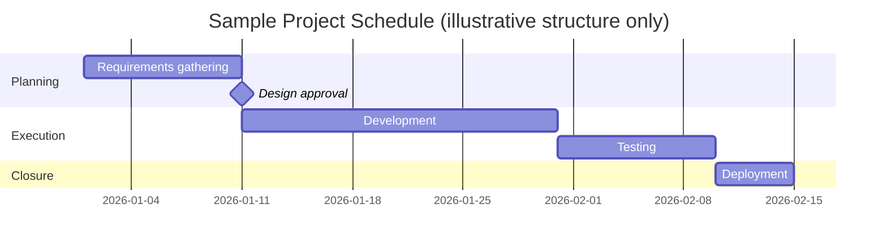

## Gantt Chart and Scheduling Tools

### Definition and Scope

A Gantt chart is a horizontal bar chart representation of a project schedule, plotting tasks against a timeline, showing start dates, durations, end dates, dependencies, and progress. Named after Henry Gantt, who popularized the format in the early 20th century, it remains the dominant visual scheduling artifact in project management practice. Scheduling tools are the software systems—ranging from simple spreadsheet-based charts to enterprise-grade platforms—that generate, maintain, and dynamically update Gantt charts alongside the underlying schedule network.

### Core Anatomy of a Gantt Chart

**Key Points**

- **Task bars**: Horizontal bars representing individual activities, positioned along a time axis, with bar length corresponding to duration.
- **Milestones**: Zero-duration markers (typically diamonds) representing significant events or decision points, distinct from tasks with duration.
- **Dependencies**: Lines connecting task bars indicating logical relationships (see dependency types below).
- **Critical path**: The sequence of dependent tasks determining the shortest possible project duration; often highlighted in red or a distinct color.
- **Progress indicators**: Shading or percentage overlays on task bars showing completion status against the plan.
- **Resource assignments**: Labels or swimlanes indicating which person or team is responsible for each task.
- **Baseline comparison**: A secondary bar or marker showing the originally planned schedule alongside actual/current dates, used to visualize schedule variance.

### Dependency Types (Precedence Relationships)

| Type | Notation | Description | Example |
| --- | --- | --- | --- |
| Finish-to-Start (FS) | Most common | Successor cannot start until predecessor finishes | Foundation must finish before framing starts |
| Start-to-Start (SS) |  | Successor cannot start until predecessor starts | Testing can begin once development begins |
| Finish-to-Finish (FF) |  | Successor cannot finish until predecessor finishes | Documentation finishes when development finishes |
| Start-to-Finish (SF) | Rare | Successor cannot finish until predecessor starts | Outgoing shift ends when incoming shift starts |

Dependencies can also include **lag** (mandatory delay after the relationship trigger, e.g., FS+2 days for curing concrete) and **lead** (overlap allowing the successor to start before the predecessor fully completes, e.g., FS-3 days for fast-tracking).

### Gantt Chart Structure Visualization

### Critical Path Method (CPM) Integration

Scheduling tools compute the critical path algorithmically by calculating early start (ES), early finish (EF), late start (LS), late finish (LF), and float (slack) for each task:

$$\text{Total Float} = LS - ES = LF - EF$$

A task with $\text{Total Float} = 0$ lies on the critical path—any delay to that task directly delays the project end date. Most scheduling software recalculates the critical path dynamically as task durations, dependencies, or constraints change, and visually distinguishes critical-path tasks (commonly in red) from tasks with positive float.

### Common Gantt Chart and Scheduling Software

**Key Points**

- **Microsoft Project**: Enterprise-grade scheduling tool with full CPM engine, resource leveling, baseline tracking, and integration with Project Online/Project for the Web for portfolio management.
- **Smartsheet**: Spreadsheet-native interface with Gantt view, dependency management, and automation rules, popular for its low learning curve.
- **Asana / Monday.com / ClickUp**: Work-management platforms offering Gantt/timeline views as one of several visualization modes (alongside kanban, list, calendar).
- **Primavera P6 (Oracle)**: Industry-standard for large-scale, complex programs (construction, engineering, defense), supporting multi-project resource leveling and advanced what-if scheduling scenarios.
- **GanttProject / TeamGantt**: Lightweight, often free or low-cost tools focused specifically on Gantt-chart creation without broader work-management features.
- **Jira (with Advanced Roadmaps/plugins)**: Adds Gantt-style timeline views on top of agile issue tracking, bridging Scrum/Kanban boards with traditional scheduling visualization.

[Unverified] Specific feature sets, pricing tiers, and licensing models for these tools change frequently; current capabilities should be confirmed against each vendor's official documentation before procurement decisions.

### Selecting a Scheduling Tool: Key Evaluation Criteria

| Criterion | Consideration |
| --- | --- |
| Project methodology fit | Waterfall/predictive projects benefit most from full CPM Gantt tools; agile/hybrid projects may need timeline views layered on iteration-based tracking |
| Scale and complexity | Single-project teams may not need Primavera-level capability; large programs with cross-project resource contention typically do |
| Resource management depth | Whether the tool supports resource leveling, capacity visualization, and over-allocation warnings |
| Collaboration and access | Real-time multi-user editing, stakeholder view-only access, and mobile availability |
| Integration requirements | Compatibility with existing tools (issue trackers, time tracking, financial systems, reporting/BI platforms) |
| Baseline and variance tracking | Ability to snapshot a baseline and report schedule variance over time |
| Reporting and export | Native dashboards, PDF/image export for stakeholder communication, and API access for custom reporting |

### Building a Gantt Chart: Standard Workflow

1. **Decompose scope into a Work Breakdown Structure (WBS)**: Break deliverables into discrete, schedulable activities before entering data into the tool.
2. **Estimate task durations**: Apply estimation techniques (analogous, parametric, three-point/PERT) to each activity.
3. **Define dependencies**: Establish logical task relationships (FS, SS, FF, SF) reflecting real sequencing constraints, not arbitrary ordering.
4. **Assign resources**: Attach responsible individuals or teams to each task, enabling workload and capacity views.
5. **Set constraints**: Apply date constraints (e.g., "must start on," "no earlier than") only where genuinely required by external factors, since over-constraining reduces the schedule engine's ability to optimize.
6. **Calculate and review the critical path**: Let the tool compute CPM output, then validate against domain knowledge for plausibility.
7. **Baseline the schedule**: Save an approved baseline before execution begins, enabling variance tracking.
8. **Update progress iteratively**: Record actual start/finish dates and percent-complete regularly to keep the chart reflective of real status.

### Resource Leveling in Scheduling Tools

Resource leveling is an algorithmic adjustment applied when resource demand exceeds availability at a given time, resolving over-allocation by shifting non-critical tasks within their available float.

**Example**

Two tasks assigned to the same developer are both scheduled to start on the same day, each requiring full-time effort. Resource leveling shifts the task with more float later, or splits effort across the timeline, so that the developer's total daily assignment does not exceed 100% capacity. This typically extends the overall schedule if insufficient float exists to absorb the adjustment.

[Inference] The degree to which automated resource leveling produces a practically usable schedule (versus one requiring significant manual override) varies by tool sophistication and the complexity of the underlying resource pool, and should not be assumed uniformly reliable across all software.

### Gantt Charts in Agile and Hybrid Contexts

Pure Gantt/CPM scheduling assumes relatively stable scope and sequence, which conflicts with agile's iterative, adaptive planning philosophy. In hybrid environments, Gantt views are often used at a higher level (release or program roadmap) while sprint-level execution is tracked through kanban boards or sprint burndown charts—reserving detailed CPM scheduling for cross-team dependencies, fixed external milestones (e.g., regulatory deadlines), or predictive-heavy workstreams within an otherwise agile program.

### Common Pitfalls

- **Over-constraining tasks**: Applying hard date constraints broadly prevents the schedule engine from recalculating realistically when upstream tasks shift.
- **Ignoring float**: Treating all tasks as equally urgent, causing unnecessary stakeholder alarm over delays in non-critical tasks that have available slack.
- **Stale baselines**: Failing to re-baseline after approved scope changes, producing misleading variance reports.
- **Excessive granularity**: Breaking the WBS into tasks so small that maintaining the schedule becomes a greater burden than the value it provides.
- **Dependency omission**: Under-specifying dependencies (or defaulting all relationships to Finish-to-Start) produces an inaccurate critical path calculation.
- **Treating the Gantt chart as the plan itself**: Mistaking the visual artifact for the underlying schedule network model can lead to superficial edits that don't reflect true logical constraints.

### Relationship to Broader Scheduling Techniques

Gantt chart tools are the visualization and management layer built on top of underlying scheduling techniques—Critical Path Method, Critical Chain Method (which adds resource-constrained buffering), and PERT (probabilistic three-point estimation). Understanding these underlying algorithms is necessary to interpret and validate what a scheduling tool's Gantt output is actually representing, rather than treating the software's output as inherently authoritative.

**Next Steps**

- Critical Path Method and Network Diagramming
- Critical Chain Project Management
- Resource Leveling and Capacity Planning
- Work Breakdown Structure (WBS) Development
- Kanban Boards and Agile Tracking Tools
- Portfolio and Program Management Platforms
- Earned Value Management and Schedule Variance Reporting