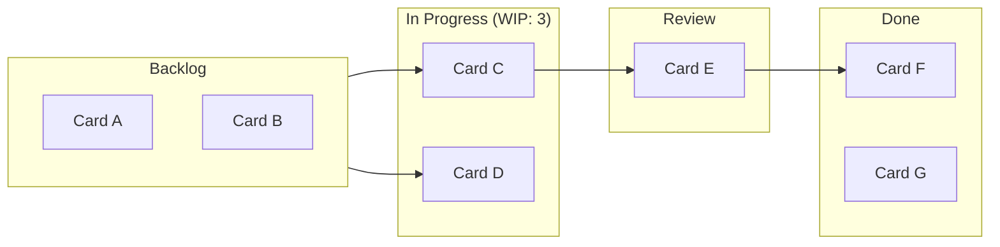

## Agile and Kanban Board Platforms

### Definition and Scope

Agile and Kanban board platforms are software systems that visualize work as cards moving through defined workflow stages (columns), enabling teams to plan, execute, and track iterative or continuous-flow work. These platforms support two related but distinct methodologies: Scrum (time-boxed iterations called sprints) and Kanban (continuous flow with work-in-progress limits), and many modern tools support both simultaneously or in hybrid configurations (Scrumban).

### Kanban Board Core Anatomy

**Key Points**

- **Columns (workflow states)**: Represent stages of work, minimally "To Do," "In Progress," "Done," though real workflows typically include more granular states (e.g., "Backlog," "Ready," "In Development," "In Review," "Testing," "Done").
- **Cards**: Represent individual units of work (user stories, tasks, bugs, tickets), carrying metadata such as assignee, priority, labels, due date, and linked artifacts.
- **Work-in-Progress (WIP) limits**: Constraints on the maximum number of cards allowed in a given column at once, designed to surface bottlenecks and enforce flow discipline.
- **Swimlanes**: Horizontal groupings (by team, priority, work type, or epic) layered across the columns for additional organization.
- **Cumulative Flow Diagram (CFD)**: A derived visualization showing the count of cards in each state over time, used to detect bottlenecks and flow stability.

### Kanban Board Structure Visualization

### Scrum Board Versus Kanban Board

| Dimension | Scrum Board | Kanban Board |
| --- | --- | --- |
| Time structure | Time-boxed sprints (typically 1–4 weeks) | Continuous flow, no fixed iteration |
| Board reset | Board typically resets/clears at sprint start | Board persists continuously |
| Planning unit | Sprint backlog, committed at sprint planning | Pull-based; work pulled as capacity allows |
| Key metric | Velocity (story points completed per sprint), burndown chart | Cycle time, lead time, throughput |
| WIP limits | Implicit via sprint commitment | Explicit, enforced per column |
| Best fit | Teams with predictable, batchable work and defined release cadence | Teams with variable-priority or interrupt-driven work (support, operations, maintenance) |

### Core Kanban Metrics

$$\text{Little's Law: } \quad WIP = \text{Throughput} \times \text{Cycle Time}$$

- **Lead time**: Total elapsed time from when a work item is requested (enters the backlog) to when it is completed.
- **Cycle time**: Elapsed time from when work actively begins on an item to when it is completed—a subset of lead time.
- **Throughput**: Number of items completed per unit of time (e.g., cards per week).

[Inference] Little's Law holds as a long-run average relationship under steady-state flow conditions; short-term measurements on a single team can deviate from it due to variability in batch sizes, blocked work, and non-stationary demand.

### Major Platforms

**Key Points**

- **Jira (Atlassian)**: Widely used in software development organizations; supports both Scrum and Kanban board types, extensive customization of workflows, issue types, and automation rules, plus deep integration with development tooling (Bitbucket, Confluence, CI/CD systems).
- **Trello (Atlassian)**: Lightweight, card-based Kanban tool with a low learning curve, popular for small teams and non-technical use cases; extensible via "Power-Ups" (integrations/plugins).
- **Azure Boards (Microsoft)**: Integrated into Azure DevOps, offering Scrum/Kanban boards tightly coupled with source control, pipelines, and work-item traceability within the Microsoft ecosystem.
- **Asana**: Work-management platform offering board (Kanban), list, timeline, and calendar views over the same underlying task data.
- **Monday.com**: Highly customizable "work OS" with board views supporting Kanban-style columns alongside broader automation and reporting features.
- **ClickUp**: Combines task management, docs, and Kanban/Gantt/list views in a single platform aimed at consolidating multiple tool categories.
- **Linear**: Developer-focused issue tracker emphasizing speed and opinionated workflow states, popular in modern software engineering teams as a lighter alternative to Jira.

[Unverified] Feature availability, pricing tiers, and integration ecosystems for these platforms evolve continuously; current capabilities should be verified against each vendor's official documentation before tool selection.

### Selecting Between Scrum and Kanban Board Configurations

1. **Assess work predictability**: Highly predictable, plannable work (feature development against a roadmap) favors Scrum's sprint commitment model; unpredictable or interrupt-driven work (support tickets, incident response) favors Kanban's pull-based flow.
2. **Evaluate stakeholder reporting needs**: If stakeholders expect fixed-cadence demos and predictable delivery batches, Scrum's sprint structure supports that rhythm more directly.
3. **Consider team maturity**: Teams new to agile practices often benefit from Scrum's explicit ceremonies (planning, standup, review, retrospective) as scaffolding before adopting more flexible Kanban flow.
4. **Account for mixed workloads**: Teams handling both planned feature work and ad hoc support often adopt Scrumban—maintaining sprint cadence for planned work while reserving WIP-limited swim lanes for expedited/interrupt items.

### Workflow Configuration Best Practices

**Example**

- Define workflow states that reflect actual handoff points (e.g., separate "Code Review" from "QA Testing" if different people/teams own each), rather than generic To Do/Doing/Done buckets that hide real bottlenecks.
- Set WIP limits based on team capacity (a common starting heuristic is limiting each "in progress" column to roughly the number of people who can actively work that stage), then adjust based on observed flow data rather than leaving limits arbitrary.
- Use automation rules (e.g., auto-transition a card to "In Review" when a linked pull request is opened) to reduce manual board maintenance overhead and keep the board synchronized with actual work state.
- Establish clear Definition of Ready (criteria for entering the workflow) and Definition of Done (criteria for exiting) at each relevant column boundary to prevent ambiguous status reporting.

### Integration with Broader Delivery Toolchains

Agile board platforms typically integrate with:

| Integration Category | Purpose | Example |
| --- | --- | --- |
| Version control | Link commits/PRs to work items, auto-transition cards on merge | GitHub, GitLab, Bitbucket |
| CI/CD pipelines | Reflect build/deployment status on cards | Jenkins, GitHub Actions, Azure Pipelines |
| Communication | Notify teams of card changes | Slack, Microsoft Teams |
| Documentation | Link specifications and requirements to work items | Confluence, Notion |
| Reporting/BI | Aggregate cross-team flow metrics for portfolio visibility | Power BI, Tableau, native platform dashboards |

### Common Pitfalls

- **Board as status theater**: Cards accumulate stale status because team members update the board infrequently, undermining its value as a real-time source of truth.
- **Ignoring WIP limits**: Allowing columns to grow unbounded defeats Kanban's core bottleneck-surfacing mechanism and leads to excessive context-switching.
- **Over-engineering workflow states**: Excessive granularity in columns creates administrative overhead disproportionate to the visibility gained.
- **Conflating velocity with productivity**: Treating Scrum velocity as a cross-team comparison metric rather than a team-specific planning input, since story point scales are not standardized across teams.
- **Neglecting blocked-item visibility**: Failing to visually flag blocked cards (e.g., via a distinct label or swimlane) allows blockers to silently stall flow without prompting timely escalation.
- **Tool sprawl**: Running multiple overlapping board tools across different teams without integration, fragmenting visibility for cross-team dependencies.

### Relationship to Broader Project Management Toolchain

Agile and Kanban board platforms typically complement rather than replace the predictive scheduling tools covered earlier in this chapter (Gantt charts, CPM-based scheduling); in hybrid program environments, high-level milestones and cross-team dependencies are often tracked in a Gantt/roadmap tool, while day-to-day execution occurs on Kanban or Scrum boards feeding status back up to that higher-level view.

**Next Steps**

- Scrum Ceremonies and Roles in Practice
- Kanban Flow Metrics and Cumulative Flow Diagrams
- Scaling Agile Frameworks (SAFe, LeSS, Scrum of Scrums)
- Portfolio and Program Management Platforms
- Work Item Estimation Techniques (Story Points, T-Shirt Sizing)
- Continuous Integration and Continuous Delivery (CI/CD) Fundamentals