## Enterprise Platforms Including Jira, Asana, Monday, and ClickUp

### Definition and Scope

Enterprise work-management platforms are integrated software systems that combine task tracking, workflow automation, reporting, and collaboration into a single system of record for organizational work. While each platform originated with a distinct focus—Jira in software issue tracking, Asana in structured task/project hierarchies, Monday.com in visual workflow building, and ClickUp in feature consolidation—by 2026 these platforms have broadly converged toward "Work OS" positioning, each adding AI assistance, cross-departmental modules, and native integrations that extend well beyond their original niche. Work management encompasses all the processes teams use to organize their daily work, including task planning, team communication, automation, resource management, and reporting, extending beyond traditional time-limited project management to cover recurring tasks, ad-hoc requests, and cross-departmental collaboration. [Till Freitag](https://till-freitag.com/en/blog/work-management-tools-comparison)

### Platform Overview and Positioning

**Key Points**

- **Jira (Atlassian)**: Positioned as the industry standard for software development tracking and agile workflows. It remains the gold standard for agile development, with Atlassian Intelligence (AI) and deep integration into Confluence and Bitbucket. [Toolradar](https://toolradar.com/blog/project-management-platforms)[Till Freitag](https://till-freitag.com/en/blog/best-project-management-tools)
- **Asana**: Described as clean, goal-oriented, and opinionated about how work should flow. It has added AI Studio and enhanced portfolio features, and remains a reference point for teams needing pure project management without built-in CRM or development modules. [Taskrhino](https://www.taskrhino.ca/blog/asana-vs-monday-vs-clickup/)[Till Freitag](https://till-freitag.com/en/blog/best-project-management-tools)
- **Monday.com**: Has evolved from a project management tool into a "Work OS" with four specialized products spanning Work Management, CRM, Dev, and Service, covering functionality that otherwise requires three to four separate tools. It is characterized as a visual, flexible Work OS that adapts to any workflow. [Till Freitag](https://till-freitag.com/en/blog/best-project-management-tools)[Taskrhino](https://www.taskrhino.ca/blog/asana-vs-monday-vs-clickup/)
- **ClickUp**: Packs a wide range of features into one platform at an aggressive price point, following a philosophy of consolidating multiple tools into one app. It bundles Docs, Whiteboards, Goals, Time Tracking, and Chat into a single platform. [Taskrhino](https://www.taskrhino.ca/blog/asana-vs-monday-vs-clickup/)[Till Freitag](https://till-freitag.com/en/blog/work-management-tools-comparison)

### Comparative Snapshot

| Dimension | Jira | Asana | Monday.com | ClickUp |
| --- | --- | --- | --- | --- |
| Primary origin/strength | Advanced bug and issue-tracking for Agile product development teams | Structured hierarchical task management | Visual workflow building, cross-department Work OS | Feature-dense, all-in-one workspace |
| Structural model | Issues, epics, sprints, boards | Organizations → Teams → Projects → Sections → Tasks → Subtasks | Boards, groups, items with highly customizable columns | Spaces, folders, lists, tasks, custom fields |
| Best-fit team size/type | Software/dev teams of any size | Mid-size teams needing task clarity | Large organizations (100+ people) needing governance, granular permissions, and compliance features | Budget-conscious teams wanting maximum feature depth |
| Notable trade-off | Feature richness creates a learning curve that can overwhelm new users | Less native flexibility outside core PM | Cost scales quickly with heavy automation usage | Feature density is impressive, but the platform can struggle with performance issues and a steep learning curve |

[Unverified] The comparative characterizations above reflect vendor and third-party review commentary current as of 2026 search sources; exact feature availability, performance characteristics, and pricing should be verified against each platform's official documentation at time of evaluation, since these details change frequently.

### Architectural Model Comparison

```mermaid
flowchart TD
    subgraph Jira
    J1[Project] --> J2[Epic]
    J2 --> J3[Story/Task/Bug]
    J3 --> J4[Sprint Assignment]
    end
    subgraph Asana
    A1[Organization] --> A2[Team]
    A2 --> A3[Project]
    A3 --> A4[Section]
    A4 --> A5[Task/Subtask]
    end
    subgraph "Monday.com"
    M1[Workspace] --> M2[Board]
    M2 --> M3[Group]
    M3 --> M4[Item/Column Data]
    end
    subgraph ClickUp
    C1[Workspace] --> C2[Space]
    C2 --> C3[Folder]
    C3 --> C4[List]
    C4 --> C5[Task/Subtask]
    end
```

### Automation Capabilities

Automation has become a baseline differentiator across these platforms rather than a premium feature. Rules follow a "when X happens, do Y" trigger structure, such as automatically assigning a task to a specific person when it moves to an "In Progress" status. Platform automation philosophies diverge in scale and pricing structure: [Taskrhino](https://www.taskrhino.ca/blog/asana-vs-monday-vs-clickup/)

- Asana is positioned for teams that need reliable, simple automations without worrying about monthly action limits. [Taskrhino](https://www.taskrhino.ca/blog/asana-vs-monday-vs-clickup/)
- Monday.com fits teams with moderate automation needs, generally under roughly 25,000 actions per month, who value ease of setup—but cost increases substantially and may require an Enterprise plan for teams exceeding that volume. [Taskrhino](https://www.taskrhino.ca/blog/asana-vs-monday-vs-clickup/)
- ClickUp is positioned for power users needing complex, effectively unlimited automations without per-action fees. [Taskrhino](https://www.taskrhino.ca/blog/asana-vs-monday-vs-clickup/)

### AI Integration Trends (2026)

**Example**

- AI-powered automation increasingly plays a central role across these platforms, spanning intelligent task assignment, automatic status updates, and predictive project forecasting. [Till Freitag](https://till-freitag.com/en/blog/work-management-tools-comparison)
- Monday AI provides features for automatic summaries, writing assistance, forecasting, and intelligent task assignment. [Till Freitag](https://till-freitag.com/en/blog/work-management-tools-comparison)
- Jira's Atlassian Intelligence layer integrates AI capabilities directly into development-focused workflows alongside Confluence and Bitbucket. [Till Freitag](https://till-freitag.com/en/blog/best-project-management-tools)
- Asana has introduced AI Studio alongside enhanced portfolio management capabilities. [Till Freitag](https://till-freitag.com/en/blog/best-project-management-tools)

[Inference] The practical reliability and accuracy of AI-generated summaries, forecasts, and auto-assignments in these platforms likely varies by data quality and workflow complexity; vendor marketing claims about AI capability should be validated against actual team usage before being relied upon for critical planning decisions.

### Enterprise Scaling Considerations

**Key Points**

- Basic project management approaches tend to break down after roughly 100 employees, precisely when organizations need teams to coordinate effectively across departments. [Monday.com](https://monday.com/blog/project-management/clickup-vs-asana-vs-monday-work-management/)
- Hidden platform costs often exceed the direct software subscription price—integration complexity, manual workarounds, and data silos create operational expenses that compound as teams scale beyond simple project execution. [Monday.com](https://monday.com/blog/project-management/clickup-vs-asana-vs-monday-work-management/)
- Work OS-style architecture (as pursued by Monday.com) is designed to handle enterprise complexity by building custom workflows across departments while maintaining unified data, automated handoffs, and strategic visibility from roughly 100 to 10,000+ users. [Till Freitag](https://till-freitag.com/en/blog/work-management-tools-comparison)
- Governance features—granular permissions, audit logs, SSO/SAML integration, and compliance certifications (SOC 2, GDPR)—become decisive selection criteria at enterprise scale, distinct from the feature checklists that dominate small-team comparisons.

### Selecting a Platform: Evaluation Framework

1. **Map primary work type**: Software-centric teams with deep issue-tracking and sprint needs typically gravitate toward Jira; cross-functional business teams needing visual flexibility often prefer Monday.com or Asana; teams wanting maximal feature consolidation across docs, chat, and tasks often evaluate ClickUp.
2. **Assess organizational scale and governance needs**: Large organizations with 100+ people generally require the governance, granular permissions, and compliance features found in Monday.com Enterprise or comparable enterprise-tier offerings. [Till Freitag](https://till-freitag.com/en/blog/work-management-tools-comparison)
3. **Evaluate automation volume and cost model**: High-automation teams should model expected monthly automation-action volume against each platform's pricing tiers before commitment, since costs can scale non-linearly.
4. **Weigh setup investment against flexibility**: Highly configurable platforms suit teams willing to invest time upfront in setting up folders, lists, fields, and task structures, while more opinionated platforms offer faster time-to-value at the cost of customization depth. [Asana](https://asana.com/resources/best-project-management-software)
5. **Pilot before full rollout**: Run a scoped pilot with a representative team and realistic workflow complexity before committing to an organization-wide migration, given the high switching cost of enterprise work-management tools.

### Common Pitfalls

- **Selecting based on feature checklists alone**: Comparative feature-matrix marketing tends to converge across these platforms; actual fit depends more on workflow philosophy (opinionated vs. flexible) than raw feature count.
- **Underestimating automation cost scaling**: Teams that grow automation usage over time can encounter unexpected tier upgrades required to sustain existing workflows.
- **Ignoring governance requirements until scale forces the issue**: Retrofitting permissions, audit trails, and compliance controls onto an established workspace is typically far more disruptive than selecting for these requirements upfront.
- **Tool sprawl from decentralized adoption**: Different departments independently adopting different platforms (e.g., engineering on Jira, marketing on Asana) without integration creates cross-functional visibility gaps at the portfolio level.
- **Treating AI features as a primary selection driver prematurely**: AI capability is evolving rapidly across all these platforms; core workflow fit and governance requirements remain more durable selection criteria than current AI feature parity.

### Relationship to Broader Toolchain

These enterprise platforms function as the execution layer described in the earlier items of this chapter—Gantt/scheduling capabilities (native or via integration) provide the predictive planning view, while native or layered Kanban/Scrum boards provide the agile execution view. Selecting among Jira, Asana, Monday.com, and ClickUp is, in practice, a decision about which underlying data model (issue-centric, task-hierarchy-centric, board-centric, or all-in-one workspace-centric) best matches an organization's dominant work pattern and governance needs.

**Next Steps**

- Portfolio and Program Management Platforms
- Tool Integration and API Ecosystem Strategy
- Change Management for PM Tool Adoption
- Reporting and Dashboard Design for Stakeholders
- Data Governance and Permissions in Enterprise PM Tools
- Scaling Agile Frameworks Across Multiple Teams