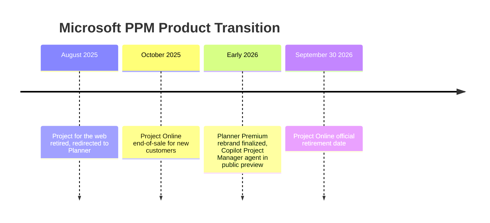

## Microsoft Project and Portfolio Tools

### Definition and Scope

Microsoft's project and portfolio management (PPM) product line spans desktop scheduling software, cloud-based enterprise portfolio tools, and lightweight web-based planning apps, all integrated to varying degrees with the Microsoft 365 and Power Platform ecosystems. This product line underwent a major consolidation through 2025–2026: Microsoft retired Project for the web in August 2025 and is retiring Project Online on September 30, 2026, unifying both into a modernized **Planner** experience with integrated Copilot AI capabilities. Project desktop remains available and is not impacted by this change. A PM evaluating Microsoft's tools in late 2026 needs to understand this transition, since much external documentation and training material still describes the pre-transition architecture. [Microsoft Community Hub](https://techcommunity.microsoft.com/blog/plannerblog/microsoft-project-online-is-retiring-what-you-need-to-know/4450558)

### Current Product Line (as of September 2026)

**Key Points**

- **Microsoft Project Desktop**: The classic Windows application with the full feature set, best suited for complex enterprise projects, requiring a Windows license. This remains the tool of choice for detailed CPM scheduling, resource leveling, and offline/on-premise work, and is unaffected by the Planner transition. [EITT](https://eitt.academy/glossary/ms-project/)
- **Microsoft Planner (with Premium features)**: The unified, modern work- and project-management experience that has absorbed the former Project for the web. Planner brings together the simplicity of To Do, the collaboration of Planner, the power of Project for the web, and the intelligence of Microsoft 365 Copilot into a single experience. Microsoft rebranded Project for the Web to Planner Premium to create a unified work management experience, motivated by reducing confusion between the previously overlapping Planner and Project for the Web products, offering a single unified brand, and pursuing an AI-first strategy where Copilot operates across both personal task management and enterprise project delivery. [Microsoft Community Hub](https://techcommunity.microsoft.com/blog/plannerblog/microsoft-project-online-is-retiring-what-you-need-to-know/4450558)[Wellingtone](https://wellingtone.com/microsoft-planner-premium-licensing-plans-pricing-2026/)
- **Project Server Subscription Edition (PSSE)**: Provides one of the most natural migration paths for organizations that require on-premises enterprise project management integrated with SharePoint Server, particularly for organizations with strict data residency or security requirements. [Wellingtone](https://wellingtone.co.uk/microsoft-project-for-the-web-to-planner/)
- **Dynamics 365 Project Operations**: Positioned by Microsoft as an alternative migration target for organizations needing project financials and operations management integrated with the broader Dynamics 365 suite.
- **Project Online (being retired)**: The retiring cloud PPM platform built around Project Web App and SharePoint, with a September 30, 2026 retirement deadline. [Epicflow](https://www.epicflow.com/blog/ms-project-online-retirement/)[Epicflow](https://www.epicflow.com/blog/ms-project-online-retirement/)

### The 2025–2026 Product Transition Timeline

Project desktop remains available and is not impacted by this change. Planner remains available and brings together Project for the web (premium plans), Planner in Microsoft 365 (basic plans), and To Do. [Windows 10 Forums](https://www.tenforums.com/windows-10-news/221048-microsoft-project-online-retiring-september-30-2026-a.html)

### Why Microsoft Retired Project Online

The primary reasons cited were legacy architecture and a lack of modern cloud AI/Copilot capabilities. This reflects a broader industry pattern of established enterprise PPM platforms being re-architected around AI-assisted workflows rather than being maintained as static feature sets—a consideration for any PM evaluating tool longevity in procurement decisions. [Wellingtone](https://wellingtone.co.uk/microsoft-project-for-the-web-to-planner/)

### Planner Premium Licensing Tiers

| Plan | Capabilities |
| --- | --- |
| Planner Plan 1 | Basic features such as task management and simple scheduling |
| Planner & Project Plan 3 | Advanced capabilities like Gantt charts, resource management, and access to the desktop client |
| Planner & Project Plan 5 | Full enterprise-level features for portfolio and resource management |

[Unverified] Exact pricing figures circulating in third-party sources vary and should be confirmed directly against Microsoft's current licensing documentation, since PPM pricing structures are subject to frequent revision and regional variation.

### Portfolio Management Capabilities

Premium Planner features are designed to replicate core Project Online portfolio functionality: Premium features in Planner deliver portfolios, baselines, dependencies, and Gantt charts, and separately workflow automation via Power App/Accelerator and Power Automate. The former Roadmap feature that allowed viewing Project Online projects alongside other plan types has been replaced: Roadmaps are being replaced with Portfolios in Planner. Previously, the Roadmaps feature allowed users to show Project Online projects alongside premium plans and Azure DevOps projects, whereas the Portfolios feature in Planner only shows premium plans—a functional narrowing that PMOs migrating from Project Online need to account for if they relied on cross-source roadmap visibility. [Microsoft Project Online is retiring: What you need to know | Microsoft Community Hub +2](https://techcommunity.microsoft.com/blog/plannerblog/microsoft-project-online-is-retiring-what-you-need-to-know/4450558)

Traditional Project Online portfolio functions being replaced include:

- **Portfolio analysis**: Analyzing projects to determine which will give the best return on investment of both budget and resources. [Microsoft Learn](https://learn.microsoft.com/en-us/projectonline/project-features-descriptions)
- **Enterprise resource management**: Letting resource managers manage the resource pool, plan resource capacity, and approve, reject, or modify incoming resource engagement requests. [Microsoft Learn](https://learn.microsoft.com/en-us/projectonline/project-features-descriptions)
- **Financial management**: Adopting financial management processes to improve cost and benefit estimates and tracking cost performance to ensure delivery within budget. [Microsoft Learn](https://learn.microsoft.com/en-us/projectonline/project-features-descriptions)
- **Resource leveling**: Automatically adjusting assignments when people are working on too many tasks simultaneously. [Microsoft Learn](https://learn.microsoft.com/en-us/projectonline/project-features-descriptions)

### AI Integration: Copilot and the Project Manager Agent

Planner now includes a Project Manager agent for Microsoft 365 Copilot users—an AI assistant that automates task creation, status reporting, and execution, adapting to the plan, currently in public preview as of the transition period. This assistant helps automate task creation, status reporting, and execution, working across Planner views to help teams stay on track with minimal manual effort, and provides Copilot chat capabilities inside Planner. Note that this AI functionality requires a valid Microsoft 365 Copilot license separate from the base Planner Premium license. [Transitioning to Microsoft Planner and retiring Microsoft Project for the web | Microsoft Community Hub +2](https://techcommunity.microsoft.com/blog/plannerblog/transitioning-to-microsoft-planner-and-retiring-microsoft-project-for-the-web/4410149)

[Inference] As with other vendors' AI-assisted PM features, the practical reliability of automated task creation and status summarization likely depends on data quality and workflow structure within a given organization's Planner instance, and should be validated in a pilot before being relied upon for critical reporting.

### Migration Considerations for Organizations on Project Online

**Example**

- **Simple portfolios**: If an organization manages a few standalone projects, Planner Premium may be sufficient. [Epicflow](https://www.epicflow.com/blog/ms-project-online-retirement/)
- **Complex portfolios**: Organizations managing 50+ concurrent projects, shared specialists, cross-project dependencies, portfolio approvals, and executive reporting should treat the retirement as an opportunity to rethink the operating model behind their project portfolio rather than assuming a like-for-like migration. [Epicflow](https://www.epicflow.com/blog/ms-project-online-retirement/)
- **Industry-specific requirements**: A high-complexity commercial or civil program may have established requirements around cost-loaded schedules, contractual reporting, specialized progress measurement, formal change control, external integrations, or portfolio controls that extend well beyond Planner's premium feature set, meaning some organizations should evaluate Project Server Subscription Edition or Dynamics 365 Project Operations instead of a direct Planner migration. [Windows Forum](https://windowsforum.com/windows-news.4/microsoft-project-online-retires-september-30-2026-migration-guide.439249)
- **Requirements-based decision, not blanket dismissal**: The correct approach is a requirements test rather than assuming Planner is categorically only a lightweight task board—Microsoft's positioning of Planner as the cloud-forward, Copilot-integrated option is vendor framing that should be validated against an organization's specific PPM requirements rather than accepted uncritically. [Windows Forum](https://windowsforum.com/windows-news.4/microsoft-project-online-retires-september-30-2026-migration-guide.439249)

### Fit Within the Broader PM Toolchain

MS Project remains the dominant tool in regulated industries such as pharma, aerospace, construction, and government requiring detailed scheduling, large enterprise projects with complex dependencies, and resource-intensive portfolios, while Agile teams more commonly favor alternatives like Jira, Azure DevOps, or Asana. A common hybrid pattern uses Microsoft's tools for top-level portfolio and waterfall-style scheduling, paired with Jira or Azure DevOps for Agile team-level execution—paralleling the Gantt-versus-Kanban complementary relationship discussed earlier in this chapter. Project for the Web-derived capability within Planner has added Kanban and Agile views, bridging the gap between predictive and agile approaches within the same ecosystem. [EITT](https://eitt.academy/glossary/ms-project/)[EITT](https://eitt.academy/glossary/ms-project/)

### Common Pitfalls

- **Relying on outdated documentation**: Given the rapid 2025–2026 product changes, guidance referencing "Project for the web" or "Project Online" as current, ongoing products may describe retired or retiring functionality; always verify against Microsoft's current documentation.
- **Assuming Planner is a like-for-like Project Online replacement**: Organizations with complex, resource-intensive portfolios risk losing functionality (e.g., the narrowed Roadmap-to-Portfolios transition) if they migrate without a requirements gap analysis.
- **Underestimating the Copilot licensing dependency**: Assuming AI-assisted features are included in base Planner Premium licensing when they require a separate Microsoft 365 Copilot license.
- **Delaying migration planning**: Given the firm September 30, 2026 retirement date for Project Online, organizations that have not begun migration planning face a compressed transition window.
- **Treating vendor positioning as neutral fact**: Microsoft's framing of Planner Premium as strictly superior to Project Online reflects vendor interest; independent validation against organizational requirements remains necessary.

**Next Steps**

- Portfolio Prioritization and Resource Capacity Planning
- Change Management for Enterprise Tool Migrations
- Power Platform Integration for Project Automation
- Comparing PPM Platforms: Governance and Compliance Requirements
- AI-Assisted Project Management: Capabilities and Limitations
- Earned Value Management and Financial Tracking in PPM Tools