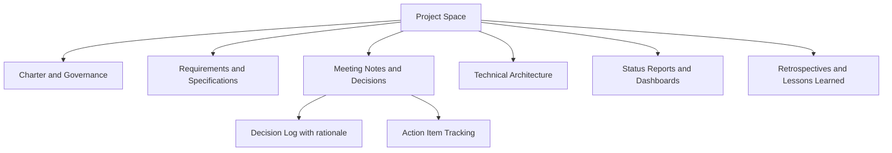
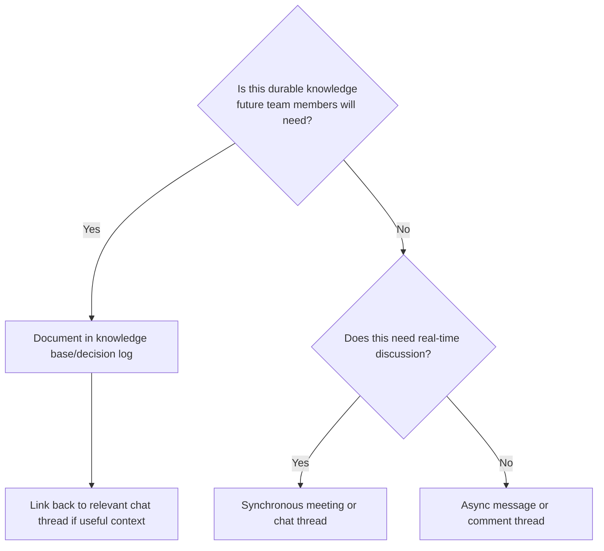

## Collaboration and Documentation Tools

### Definition and Scope

Collaboration and documentation tools are the software systems that support shared knowledge creation, real-time co-authoring, meeting coordination, and asynchronous communication across a project team—distinct from the task/schedule-tracking platforms covered earlier in this chapter, though increasingly integrated with them. These tools serve as the project's institutional memory: requirements documents, meeting notes, decision logs, technical specifications, and status reports that outlive any single task or sprint.

### Core Categories

**Key Points**

- **Document co-authoring platforms**: Real-time collaborative editing of text documents, spreadsheets, and presentations (Google Workspace, Microsoft 365).
- **Knowledge base / wiki tools**: Structured, linkable repositories of durable project knowledge (Confluence, Notion, SharePoint).
- **Synchronous communication platforms**: Chat and video conferencing for real-time discussion (Slack, Microsoft Teams, Zoom).
- **Asynchronous communication tools**: Email and threaded discussion that don't require simultaneous presence.
- **Visual collaboration tools**: Digital whiteboards for brainstorming, diagramming, and workshop facilitation (Miro, Mural, FigJam).
- **File storage and version control**: Centralized repositories with access control and revision history (Google Drive, SharePoint/OneDrive, Dropbox).

### Document Collaboration Platform Comparison

| Platform | Core Strength | Typical Use Case |
| --- | --- | --- |
| Google Workspace (Docs, Sheets, Slides) | Simultaneous multi-user editing with granular real-time presence | Cross-organizational collaboration, external stakeholder sharing |
| Microsoft 365 (Word, Excel, PowerPoint + SharePoint/OneDrive) | Deep integration with Teams, Planner, and enterprise identity/compliance systems | Organizations standardized on the Microsoft ecosystem |
| Notion | Flexible blocks combining docs, databases, and lightweight project tracking | Startups and teams wanting a unified workspace without heavy IT overhead |
| Confluence (Atlassian) | Structured, versioned documentation tightly linked to Jira issues | Software teams needing requirements/specs traceable to development work |

[Unverified] Specific feature parity and integration depth between these platforms shifts frequently as vendors compete on AI-assisted authoring and cross-tool integration; current capabilities should be verified against vendor documentation.

### Knowledge Base and Wiki Structure

A well-organized project knowledge base typically follows a hierarchical structure that mirrors how information is actually retrieved, not how it was created:

### Meeting Documentation Best Practices

1. **Standardize meeting note templates**: Use a consistent structure (attendees, decisions, action items, owner, due date) so notes remain scannable across dozens of meetings over a project lifecycle.
2. **Separate decisions from discussion**: Explicitly tag decisions apart from general discussion points, since decisions are what future readers most urgently need to find.
3. **Assign action items with explicit owners and dates**: An action item without a named owner and due date functions as discussion, not commitment.
4. **Link meeting notes to related artifacts**: Cross-reference notes to relevant tickets, requirements documents, or prior decisions rather than duplicating content.
5. **Distribute and confirm promptly**: Share notes within 24 hours while context is fresh, and explicitly request confirmation of accuracy from key attendees on contested points.

### The Decision Log as a Governance Artifact

**Example**

A decision log entry should typically capture:

- **Decision**: What was decided, stated unambiguously
- **Date and decision-maker(s)**: Who has authority over this decision and when it was made
- **Context/rationale**: Why this option was chosen over alternatives
- **Alternatives considered**: What else was evaluated and why it was rejected
- **Impact**: What this decision affects (scope, schedule, budget, other decisions)

Maintaining a structured decision log prevents a common failure mode in long-running projects: re-litigating decisions because the original rationale was never recorded, forcing the team to either repeat prior analysis or drift from an intentional prior choice without realizing it.

### Digital Whiteboard Tools for Workshops and Brainstorming

**Key Points**

- **Miro / Mural / FigJam**: Infinite-canvas visual collaboration tools supporting sticky notes, diagramming, voting, and templated frameworks (retrospectives, affinity mapping, user journey mapping).
- **Use cases**: Sprint retrospectives, requirements workshops, stakeholder journey mapping, risk brainstorming sessions, and remote-team ice-breakers that require spatial or visual thinking rather than linear text.
- **Facilitation considerations**: Effective use requires deliberate facilitation—pre-built templates, time-boxed activities, and a designated facilitator—since an unstructured open canvas with a distributed team can produce less useful output than a well-run in-person session.

### Synchronous Communication Platform Considerations

| Factor | Consideration |
| --- | --- |
| Channel structure | Topic- or project-specific channels reduce noise compared to a single all-purpose channel, but excessive channel proliferation fragments knowledge and reduces discoverability |
| Notification discipline | Default notification settings that alert on every message create alert fatigue; teams benefit from explicit norms about @-mention usage and urgency signaling |
| Meeting vs. async default | Not every discussion requires a synchronous meeting; establishing team norms for when async written discussion suffices reduces meeting load |
| Searchability | Chat history that isn't structured or tagged becomes effectively unsearchable over time, making it unsuitable as a permanent record for decisions that belong in a knowledge base instead |

### Choosing Chat/Video Versus Documentation for a Given Communication

A common failure mode is defaulting to chat for everything, including decisions and requirements that later need to be found by someone who wasn't present in the original conversation—chat history is generally a poor substitute for structured documentation as a project's system of record.

### Integration Between Collaboration Tools and Execution Tools

Collaboration and documentation tools function most effectively when linked to the task-tracking platforms discussed earlier in this chapter rather than existing in isolation:

- **Requirements-to-task traceability**: Linking Confluence/Notion requirement pages to corresponding Jira/Asana tickets ensures execution work stays traceable to documented intent.
- **Meeting notes-to-action items**: Action items captured in meeting notes should be reflected as trackable tasks in the team's board/scheduling tool, not left to live only in the document.
- **Status reporting**: Dashboards or status documents often pull data from the execution tool (via native integration or API) rather than requiring manual re-entry, reducing the risk of status drift between systems.

### Version Control and Access Governance

**Key Points**

- **Revision history**: Native version history (Google Docs, SharePoint) allows recovery of prior states and attribution of changes, important for regulated or audited project environments.
- **Access control tiers**: Structuring permissions (view-only for broad stakeholders, edit access for the core team, admin access for a small governance group) prevents both accidental edits and information bottlenecks.
- **External sharing controls**: Explicit policies for sharing documents outside the organization (clients, vendors, regulators) reduce inadvertent information leakage, particularly relevant for projects involving sensitive or contractually restricted information.

### Common Pitfalls

- **Documentation sprawl across tools**: Requirements in Confluence, decisions in Slack, and status in a spreadsheet fragments the project's system of record and makes onboarding new team members disproportionately difficult.
- **Stale documentation**: Documents that are created once at project kickoff and never updated become actively misleading rather than merely unhelpful.
- **Over-reliance on tribal knowledge**: Treating chat history or verbal agreements as sufficient documentation, which fails as soon as key individuals leave the project or organization.
- **Template overload**: Introducing so many mandatory documentation templates that team members spend more time maintaining documentation structure than producing useful content.
- **Ungoverned whiteboard output**: Failing to convert Miro/Mural workshop output into structured, searchable documentation afterward, leaving valuable workshop insights trapped in an ephemeral visual format.
- **Notification and channel fragmentation**: Allowing communication channels to proliferate without governance, causing important messages to be missed amid noise.

### Relationship to Broader PM Toolchain

Collaboration and documentation tools form the connective layer between the predictive scheduling and agile execution tools covered earlier in this chapter—translating decisions made in meetings and workshops into the structured requirements, decision records, and status reports that scheduling and task-tracking platforms then operationalize into trackable work. A mature PM toolchain treats these categories as integrated rather than siloed, with clear conventions for what belongs in chat, what belongs in the knowledge base, and what belongs in the execution tool.

**Next Steps**

- Meeting Facilitation Techniques for Project Teams
- Stakeholder Communication Planning
- Knowledge Management and Project Closeout Documentation
- Tool Integration and API Ecosystem Strategy
- Remote and Distributed Team Communication Norms
- Reporting and Dashboard Design for Stakeholders