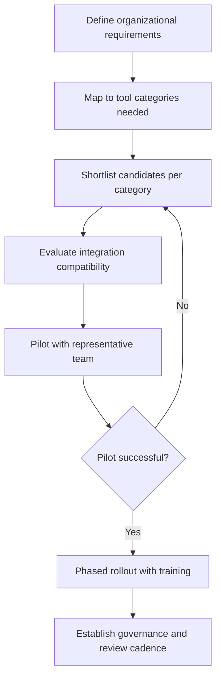

## Choosing and Implementing a Tool Stack

### Definition and Scope

A project management tool stack is the combined set of software systems—scheduling, agile execution, collaboration, documentation, and reporting—that a team or organization uses together to plan and deliver work. Choosing and implementing a tool stack is distinct from evaluating any single tool in isolation: it requires assessing how the tools work together, what data flows between them, and how the organization will adopt and sustain the stack over time. This item synthesizes the individual tool categories covered earlier in this chapter into a structured selection and implementation methodology.

### Why Tool Stack Decisions Matter Beyond Feature Comparison

**Key Points**

- **Integration determines usability more than individual features**: A best-in-class scheduling tool that doesn't integrate with the team's chosen execution platform creates duplicate data entry and status drift.
- **Adoption cost compounds across tools**: Each additional tool in the stack adds training overhead, login fatigue, and a potential point of abandonment; stack breadth should be justified by genuine functional need, not feature novelty.
- **Data fragmentation risk**: Without a coherent stack strategy, requirements live in one tool, tasks in another, and status in a third—undermining the single-source-of-truth principle central to effective project governance.
- **Switching costs are asymmetric**: Migrating away from an entrenched tool (especially one holding historical project data) is typically far more disruptive than the original selection decision, making the initial choice disproportionately consequential.

### Tool Stack Selection Framework

### Step 1: Define Organizational Requirements

Before evaluating any specific product, a PM or PMO should establish requirements across several dimensions:

1. **Methodology fit**: Does the organization run predominantly predictive (waterfall), agile, or hybrid delivery? This determines whether CPM-based scheduling, Kanban/Scrum boards, or both are core requirements (see Gantt Chart and Scheduling Tools and Agile and Kanban Board Platforms earlier in this chapter).
2. **Scale and governance needs**: Team-level tool selection differs substantially from enterprise portfolio tool selection; organizations exceeding roughly 100 people typically require governance features (permissions, audit trails, compliance certifications) that smaller teams can defer.
3. **Existing ecosystem constraints**: Organizations already standardized on Microsoft 365 or Google Workspace face strong integration incentives toward ecosystem-native tools (see Microsoft Project and Portfolio Tools and Collaboration and Documentation Tools earlier in this chapter), independent of feature comparisons with non-native alternatives.
4. **Budget model**: Per-seat licensing costs scale differently across tools and can shift substantially at enterprise volume; total cost of ownership should include implementation, training, and integration costs, not license price alone.
5. **Regulatory and compliance requirements**: Regulated industries (construction, pharma, government, financial services) may mandate specific audit trail, data residency, or certification requirements that eliminate otherwise-suitable tools from consideration.

### Step 2: Map Requirements to Tool Categories

| Category | Core Question | Related Chapter Item |
| --- | --- | --- |
| Scheduling | Does the team need CPM-based predictive scheduling, or is lightweight timeline visualization sufficient? | Gantt Chart and Scheduling Tools |
| Execution tracking | Is work primarily sprint-based, continuous-flow, or a hybrid? | Agile and Kanban Board Platforms |
| Enterprise work management | Does the organization need cross-departmental Work OS capability beyond a single team's execution tracking? | Enterprise Platforms Including Jira, Asana, Monday, and ClickUp |
| Portfolio governance | Is multi-project resource leveling, financial tracking, and executive portfolio reporting required? | Microsoft Project and Portfolio Tools |
| Knowledge and documentation | How will requirements, decisions, and meeting outcomes be captured and retrieved? | Collaboration and Documentation Tools |

### Step 3: Evaluate Integration Compatibility

**Example**

A mid-size software organization evaluating a stack might assess:

- Does the scheduling tool export to or integrate with the execution board (e.g., Jira's Advanced Roadmaps against a Confluence knowledge base)?
- Can status data flow from the execution tool into stakeholder dashboards without manual re-entry?
- Does the collaboration suite (chat, documents) support native linking to tickets and tasks in the execution tool?
- Are single sign-on (SSO) and identity management consistent across the stack, or does each tool require separate credential management?

A stack with strong integration compatibility reduces the "swivel-chair" problem—team members manually copying data between disconnected systems—which is a common source of both wasted effort and status inaccuracy.

### Step 4: Pilot Before Full Rollout

1. **Select a representative pilot team**: Choose a team whose work pattern reflects the broader organization's typical complexity, not an atypically simple or atypically complex project.
2. **Define success criteria in advance**: Establish measurable pilot outcomes (e.g., reduced status-reporting time, improved on-time task completion visibility) rather than relying on subjective impressions alone.
3. **Time-box the pilot**: Run the pilot for a bounded period (commonly one to three months, or two to four sprints in agile contexts) sufficient to observe steady-state usage patterns beyond initial novelty effects.
4. **Gather structured feedback**: Combine quantitative usage data with structured qualitative feedback from pilot participants, including friction points and workarounds they developed.

[Inference] Novelty effects—temporary engagement boosts from adopting a new tool—can distort short pilots; a pilot period shorter than several weeks may not reliably distinguish genuine fit from initial enthusiasm, though the appropriate duration varies by organizational context.

### Step 5: Phased Rollout and Training

**Key Points**

- **Phased rather than "big bang" deployment**: Rolling out to successive teams or departments in waves allows lessons from earlier waves to inform later ones and limits the blast radius of unforeseen issues.
- **Role-based training**: Different stakeholder groups (team members, PMs, executives viewing dashboards) need different training depth; a single generic training session typically under-serves most roles.
- **Champion network**: Identifying and equipping early-adopter "champions" within each team to provide peer support reduces dependency on a central rollout team and improves adoption durability.
- **Legacy data migration plan**: Historical project data (open tasks, documentation, decision logs) needs an explicit migration or archival plan; leaving legacy tools "on" indefinitely as a parallel system undermines adoption of the new stack.

### Step 6: Establish Ongoing Governance

A tool stack is not a one-time decision; it requires ongoing governance to remain effective:

- **Naming and structure conventions**: Standardized project/board naming, field usage, and workflow states across teams prevent the fragmentation that undermines cross-team reporting.
- **Periodic stack review**: Scheduled reviews (e.g., annually) to assess whether the stack still fits organizational needs, informed by usage data and team feedback, rather than allowing tool sprawl to accumulate unchecked.
- **Change control for new tool additions**: Requiring a lightweight justification and integration assessment before adding new tools to the stack prevents ad hoc proliferation that recreates the fragmentation problem the original stack decision was meant to solve.
- **Deprecation process**: A defined process for retiring tools that have fallen out of use, including data export and stakeholder notification, rather than allowing "zombie" tools to persist indefinitely.

### Total Cost of Ownership Considerations

$$\text{TCO} = \text{License Cost} + \text{Implementation Cost} + \text{Training Cost} + \text{Integration/Maintenance Cost} + \text{Switching Cost (amortized)}$$

**Example**

An organization comparing two enterprise platforms with similar per-seat pricing might find substantially different total costs once implementation consulting, custom integration development, and expected training time across hundreds of users are factored in—license price alone is frequently a poor proxy for total cost of ownership at enterprise scale.

### Common Pitfalls

- **Feature-checklist-driven selection**: Selecting tools based on exhaustive feature comparison matrices rather than actual team workflow fit, producing a stack that is feature-rich but poorly adopted.
- **Ignoring integration until after purchase**: Committing to tools individually before assessing how they will work together, discovering integration gaps only during implementation.
- **Skipping the pilot phase**: Moving directly to organization-wide rollout without validating fit at smaller scale, amplifying the cost of any misfit.
- **Underinvesting in training and change management**: Treating tool rollout as a technical deployment rather than an organizational change requiring the change-management discipline covered elsewhere in project management practice.
- **Allowing parallel legacy systems to persist indefinitely**: Failing to fully retire prior tools after migration, resulting in split usage that undermines the single-source-of-truth goal of the new stack.
- **Over-customization**: Excessive configuration of workflow states, custom fields, and automation rules during implementation, creating a stack so bespoke that future upgrades or team onboarding become disproportionately difficult.
- **Neglecting periodic review**: Treating the initial tool stack decision as permanent, allowing genuine organizational needs to outgrow the original selection without a structured re-evaluation process.

### Relationship to This Chapter

Choosing and implementing a tool stack is the synthesis point for the individual tool categories covered throughout this chapter—scheduling tools, agile boards, enterprise platforms, Microsoft's PPM suite, and collaboration/documentation tools are not selected independently but as components of a coherent, integrated system supporting the full project lifecycle from planning through execution, reporting, and knowledge retention.

**Next Steps**

- Change Management for PM Tool Adoption
- Data Governance and Permissions Across Integrated Tools
- Reporting and Dashboard Design for Stakeholders
- Tool Integration and API Ecosystem Strategy
- Measuring Project Management Maturity
- Organizational Change Management Fundamentals