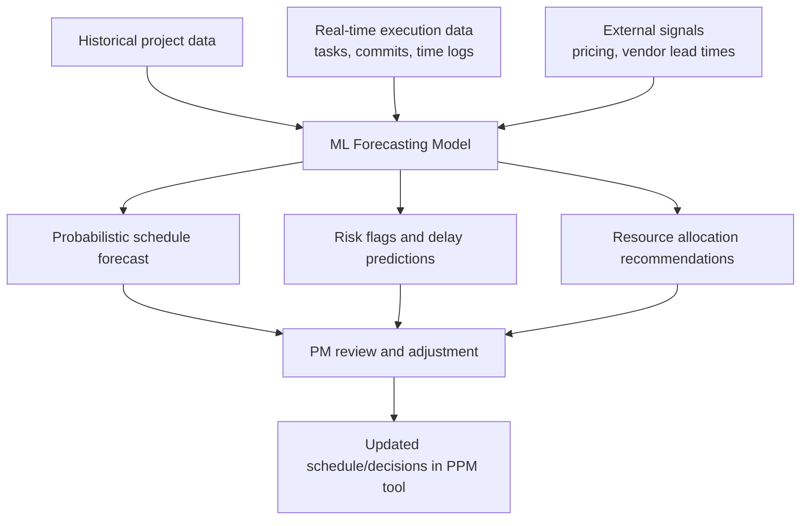

## AI Assisted Scheduling and Forecasting

### Definition and Scope

AI-assisted scheduling and forecasting applies machine learning, predictive analytics, and increasingly agentic automation to project timeline generation, delay prediction, and outcome forecasting. Rather than relying solely on manual estimation and historical averages, these systems ingest historical project data, resource utilization patterns, and real-time delivery signals to generate probabilistic forecasts, surface risks earlier, and in some cases automatically construct or adjust schedules. As of 2026, this capability has shifted from an optional enhancement to a core function embedded in many mainstream project and portfolio tools, rather than remaining a specialized add-on.

### From Deterministic to Probabilistic Scheduling Output

A key conceptual shift AI forecasting introduces is moving from single-point schedule estimates to probability-weighted delivery ranges. Instead of a schedule stating a single fixed completion date, AI-assisted forecasting expresses delivery confidence as a probability distribution—for example, a 70% probability of delivery by one date, an 85% probability by a later date, and a 95% probability by a still-later date, under stated current assumptions. This reframes schedule communication around confidence levels rather than false precision, giving stakeholders a more honest picture of uncertainty than a single deterministic end date.

### Core Capabilities

**Key Points**

- **Automated schedule generation**: Rather than manually creating multiple project schedules, AI can automatically generate and compare alternative scenarios, accelerating what previously required extensive manual what-if analysis.
- **Delay and risk prediction**: Predictive analytics identifies schedule delays, budget risks, and resource shortages early, drawing on patterns from prior projects.
- **Resource optimization**: Machine learning supports workload forecasting, task prioritization, resource planning, and delay prediction, informing more balanced resource allocation than manual capacity planning alone.
- **Scenario/what-if simulation**: AI can simulate multiple project scenarios within minutes, letting teams compare different decisions before committing resources—functionally extending traditional Monte Carlo-based schedule risk analysis with faster, AI-assisted scenario generation.
- **Predictive cost forecasting**: Machine learning analyzes global price trends and historical expense patterns to produce cost forecasting intended to minimize budget overruns and give real-time visibility into portfolio financial health.

### Underlying Technique: Probabilistic Simulation

Traditional schedule risk analysis has long used Monte Carlo simulation to generate probability distributions over completion dates by repeatedly sampling from duration-estimate distributions for each task:

$$P(\text{Completion} \le T) = \frac{\text{Number of simulation runs finishing by } T}{\text{Total simulation runs}}$$

AI-assisted forecasting tools build on this foundation but typically replace or augment manually specified duration distributions with distributions learned from historical project data, and extend the technique with machine learning models that incorporate a broader set of predictive signals (team velocity trends, external dependency risk, resource contention) rather than relying solely on task-level three-point estimates.

### Forecasting Accuracy and Its Limits

[Inference] Reported accuracy figures for AI-driven project risk prediction vary by source and methodology; one industry source describes well-calibrated models typically achieving roughly 65–75% accuracy in flagging at-risk projects two to three months in advance, which should be treated as an illustrative industry figure rather than a guaranteed benchmark for any specific tool or implementation.

Even at that level of accuracy, a majority-correct early-warning model can deliver meaningful value by enabling earlier corrective action than teams would otherwise take—but a PM should treat AI forecast output as decision support requiring human judgment, not as a guaranteed outcome. Predictive analytics amplifies good underlying project management practices rather than substituting for them; organizations with weak requirements discipline, unrealistic baseline scheduling, or inconsistent reporting will not see forecasting accuracy improve until those foundational practices are addressed.

### Architecture Pattern: How AI Scheduling/Forecasting Typically Integrates

### Notable Tools and Platform Categories

**Example**

- **Enterprise AI-PPM platforms**: Tools such as Planisware apply machine learning, predictive analytics, and automation to accelerate scheduling, optimize resources, forecast costs, and surface risks across portfolios, targeted at large-scale, Fortune 500-class program environments.
- **Mainstream work-management platforms with embedded AI**: Asana, ClickUp, Wrike, Trello, and Motion have each incorporated AI capabilities for scheduling assistance, risk prediction, and decision support into their broader platforms (see Enterprise Platforms Including Jira, Asana, Monday, and ClickUp earlier in this chapter for their non-AI baseline capabilities).
- **Dedicated resource forecasting tools**: Platforms such as Tempus Resource focus specifically on AI-powered resource management with predictive capacity modeling, aimed at organizations with complex cross-business-unit resource sharing.
- **Quantitative risk analysis platforms**: Tools like Oracle Crystal Ball and Palisade @Risk apply Monte Carlo simulation combined with AI forecasting to schedule and cost uncertainty, and remain standard in capital-intensive industries such as construction, oil and gas, and infrastructure.
- **AI meeting and documentation assistants**: Tools such as Otter.ai, Fireflies.ai, and Grain generate meeting summaries, action items, and risk flags automatically from recorded meetings, feeding structured data back into scheduling and reporting workflows.

[Unverified] Specific vendor feature sets and competitive positioning in this space are evolving rapidly; capabilities attributed to any named tool here should be verified against current vendor documentation before procurement decisions, since AI feature rollouts in PM software are proceeding on a near-monthly cadence as of 2026.

### Industry Application Examples

**Example**

- Predictive maintenance scheduling: analyzing sensor data from equipment and historical maintenance records to predict equipment failures before they occur, enabling proactive maintenance planning that reduces downtime—an approach reported in offshore drilling operations.
- AI-assisted design and construction coordination: some construction-industry software vendors have integrated AI into project management workflows to assist directly in design and construction planning processes.

### The Emerging "Agentic AI Orchestration" Challenge

A notable emerging complication as of 2026 is coordination conflict between multiple autonomous AI agents operating within the same project. As organizations deploy multiple agentic AI systems for different functions—for example, a dedicated budget-optimization agent and a separate scheduling agent—logic collisions can occur: a budget agent might pause a purchase to save costs while a scheduling agent simultaneously flags that same material as critical for an urgent delivery window. Managing these conflicting autonomous decisions is described as requiring a new coordinating human role, sometimes termed an "AI Orchestrator," responsible for reconciling agent outputs rather than manually performing the underlying scheduling or budgeting work itself.

[Speculation] Whether "AI Orchestrator" becomes a standardized, widely adopted role title (as opposed to a descriptive label for an emerging function currently performed by existing PMO or program-management staff) remains unclear at this stage of the technology's adoption curve, and terminology in this space should be expected to continue evolving.

### Data Readiness as a Prerequisite

A recurring theme across current sources is that AI forecasting effectiveness is now limited primarily by enterprise data readiness rather than model sophistication. Practical implications for implementation:

1. **Historical data quality**: Models trained on inconsistent, incomplete, or poorly labeled historical project data will produce correspondingly unreliable forecasts.
2. **Real-time data integration**: Forecasting accuracy depends on timely data flow from execution tools (see Choosing and Implementing a Tool Stack earlier in this chapter); stale or manually-entered status data undermines model input quality.
3. **Organizational baseline discipline**: Foundational project management practice—clear requirements, realistic scheduling, proactive risk management, consistent reporting—remains a prerequisite; AI forecasting is described as amplifying good practices rather than fixing broken ones.

### Practical Adoption Pattern

A commonly recommended adoption sequence for organizations starting with AI-assisted scheduling and forecasting:

1. Enable native AI risk and schedule prediction features within the PPM/work-management tool already in use, rather than immediately procuring a separate specialized platform.
2. Use AI-generated drafts for routine status reporting, reserving PM time for review and correction rather than manual report creation from scratch.
3. Deploy an AI meeting assistant to capture decisions and action items automatically, feeding structured data into the broader documentation and tracking system.
4. Reinvest time saved on administrative work into stakeholder alignment and risk mitigation—the judgment-intensive work that AI forecasting is not positioned to replace.

### What AI Forecasting Does Not Replace

AI automates reporting, tracking, and prediction, but does not navigate organizational politics, resolve interpersonal conflict, or build the trust that enables teams to deliver—capabilities that remain squarely within the emotional intelligence and conflict resolution competencies covered earlier in this course. The PM role is described as shifting from administrator to decision-maker as routine data-processing work is absorbed by AI tooling, with the freed time redirected toward judgment calls that determine whether a project actually succeeds.

### Common Pitfalls

- **Treating probabilistic forecasts as guarantees**: Communicating an AI-generated delivery probability to stakeholders as a firm commitment rather than a confidence-weighted estimate undermines the honesty the probabilistic framing is meant to provide.
- **Deploying AI forecasting on poor-quality historical data**: Expecting reliable output from models trained on inconsistent or sparse historical project records.
- **Ignoring agentic coordination conflicts**: Deploying multiple autonomous AI agents across scheduling, budgeting, and resourcing functions without an explicit reconciliation process, risking contradictory automated decisions reaching execution.
- **Over-trusting model output without human review**: Treating AI-generated schedules or risk flags as final rather than as decision support requiring PM judgment and domain context the model may lack.
- **Expecting AI to compensate for weak PM fundamentals**: Assuming AI forecasting will correct for unrealistic baseline scheduling or inconsistent reporting practices rather than first addressing those foundational issues.

### Relationship to This Chapter and Course

AI-assisted scheduling and forecasting extends the scheduling and portfolio tools covered earlier in this chapter (Gantt Chart and Scheduling Tools, Microsoft Project and Portfolio Tools) with a predictive, probabilistic layer, while relying on the collaboration and documentation infrastructure (Collaboration and Documentation Tools) to supply the real-time data these models require. It also underscores a recurring theme across this course: technical and analytical capability does not substitute for the human-centered competencies—emotional intelligence, difficult conversations, stress management—covered in the preceding chapter, which remain the parts of project leadership AI does not automate.

**Next Steps**

- AI-Powered Risk Management and Early Warning Systems
- Automated Status Reporting and Meeting Summarization
- Agentic AI Workflows and Orchestration in Project Delivery
- Monte Carlo Simulation and Quantitative Schedule Risk Analysis
- Data Governance for AI-Driven PM Tools
- Ethical Considerations in AI-Assisted Decision-Making