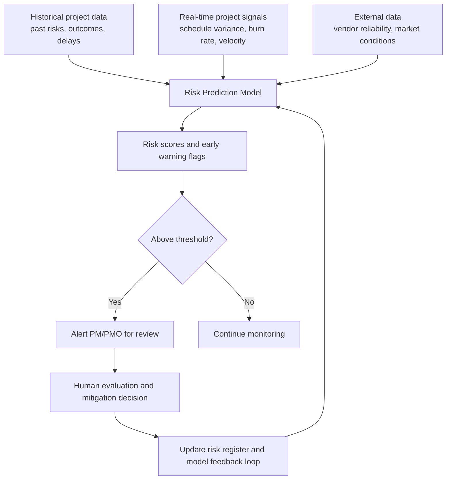

## Predictive Risk Analytics

### Definition and Scope

Predictive risk analytics applies statistical modeling and machine learning to historical and real-time project data to identify, quantify, and prioritize risks before they materialize into schedule delays, cost overruns, or quality failures. It extends traditional risk management—which relies heavily on expert judgment, risk registers, and qualitative probability/impact assessment—by systematically detecting patterns across large volumes of project data that may not be apparent through manual review alone. This item builds directly on the probabilistic forecasting concepts introduced in AI Assisted Scheduling and Forecasting earlier in this chapter, applying similar techniques specifically to risk identification and prioritization rather than schedule/cost prediction broadly.

### From Traditional to Predictive Risk Management

| Dimension | Traditional Risk Management | Predictive Risk Analytics |
| --- | --- | --- |
| Risk identification | Manual brainstorming, expert interviews, risk registers | Pattern detection across historical project data, automated flagging |
| Probability/impact assessment | Qualitative or simple quantitative scoring by the team | Statistically derived probability estimates from historical base rates |
| Timing | Periodic review (e.g., at status meetings, phase gates) | Continuous, real-time monitoring of leading indicators |
| Data scope | Single project's known risks | Cross-project historical patterns, potentially cross-organizational |
| Output | Static risk register with qualitative ratings | Dynamic risk scores that update as new data arrives |

Predictive analytics uses machine learning and statistical models to forecast project risks, resource needs, timelines, and budget variances before they occur, ingesting historical project data, resource logs, and external variables to surface early warning signals and enable proactive intervention.

### Core Predictive Risk Analytics Workflow

### Data Inputs Commonly Used

**Key Points**

- **Historical project outcomes**: Prior projects' realized risks, delays, and cost variances, used as training data to identify predictive patterns.
- **Schedule and cost performance data**: Current schedule variance (SV), cost variance (CV), and earned value metrics, which often serve as leading indicators of emerging risk.
- **Resource utilization data**: Overallocation, turnover, or burnout signals (see Managing Team Stress and Burnout earlier in this course), which correlate with quality and schedule risk.
- **External and market signals**: Vendor reliability history, material pricing trends, and macroeconomic indicators relevant to cost and supply risk.
- **Communication and sentiment data**: Some platforms incorporate analysis of status reports, meeting transcripts, or team sentiment as an input signal for morale- or communication-related risk.

[Inference] The use of communication sentiment analysis as a risk-prediction input raises data privacy and employee-monitoring considerations that organizations should evaluate as part of their AI governance policy, separate from the technical question of whether such signals improve predictive accuracy.

### Forecast Accuracy and Interpreting Model Output

As with AI-assisted scheduling generally, predictive risk models produce probabilistic rather than deterministic output. One industry benchmark describes well-calibrated models typically achieving roughly 65–75% accuracy in flagging at-risk projects two to three months in advance. [Inference] This figure should be treated as an illustrative industry data point rather than a guaranteed benchmark applicable to any specific tool, dataset, or organizational context, since accuracy depends heavily on data quality, model design, and the stability of the project environment being modeled.

Even a moderately accurate early-warning system can deliver substantial value: earlier intervention enables proactive risk mitigation that avoids costly firefighting, rework, and scope cuts, compared to risks that surface only after they have already caused schedule or budget impact.

### Common Categories of Predicted Risk

**Example**

- **Schedule slippage risk**: Flagging tasks or work packages with a high statistical likelihood of missing their planned finish date based on current progress trajectory and historical patterns for similar work.
- **Budget overrun risk**: Forecasting likely final cost based on current burn rate, historical cost-growth patterns for comparable projects, and external cost-driver trends (e.g., material pricing).
- **Resource risk**: Identifying overallocated individuals or teams, skill-gap exposure, or attrition risk based on workload and engagement signals.
- **Vendor/supply chain risk**: Predicting delivery delays or quality issues based on a vendor's historical performance patterns.
- **Quality/defect risk**: Correlating process signals (e.g., compressed testing windows, high change-request volume) with historical defect-rate outcomes to flag elevated quality risk.

### Quantitative Risk Scoring Approaches

A simplified expected-value approach to risk prioritization, extended with model-derived rather than purely expert-judged probability estimates:

$$\text{Risk Exposure} = P(\text{risk event}) \times \text{Impact (cost, schedule, or quality units)}$$

Predictive models typically refine the $P(\text{risk event})$ term using historical base rates and current leading indicators rather than relying solely on expert estimation, while impact estimation may similarly draw on historical impact data for comparable past risk events. Some platforms extend this into full Monte Carlo-style simulation (see AI Assisted Scheduling and Forecasting) to generate a distribution of possible aggregate risk exposure outcomes rather than a single expected value.

### Platform Landscape

**Key Points**

- **Enterprise AI-PPM platforms**: Tools such as Planisware apply machine learning and predictive analytics to surface risks across portfolios, aimed at large-scale program environments with governance and security requirements.
- **Quantitative risk analysis tools**: Platforms such as Oracle Crystal Ball and Palisade @Risk apply Monte Carlo simulation combined with AI forecasting to schedule and cost uncertainty, and remain standard in capital-intensive industries such as construction, oil and gas, and infrastructure.
- **Embedded risk prediction in mainstream PM tools**: Several widely used platforms (see Enterprise Platforms Including Jira, Asana, Monday, and ClickUp earlier in this chapter) have incorporated native AI risk-flagging features into their broader work-management functionality rather than requiring a separate specialized tool.

[Unverified] Specific predictive risk features and their underlying methodologies vary by vendor and are updated frequently; claims about any named platform's specific risk-modeling approach should be verified against current vendor documentation before relying on them for procurement or implementation decisions.

### Industry Application Example

**Example**

Predictive maintenance scheduling in offshore drilling operations has been reported as an application of this pattern: analyzing sensor data from equipment alongside historical maintenance records allows AI algorithms to predict equipment failures before they occur, enabling proactive maintenance planning that reduces operational downtime—illustrating how predictive risk analytics extends beyond project schedule/cost risk into operational and asset-related risk domains adjacent to project delivery.

### Implementation Considerations

1. **Establish a clean historical data foundation**: Predictive risk models require consistent, well-labeled historical project data; organizations with fragmented or inconsistent past project records will see degraded model performance regardless of the sophistication of the modeling approach used.
2. **Define alert thresholds deliberately**: Overly sensitive thresholds generate alert fatigue that causes PMs to disengage from the system; overly conservative thresholds miss risks early enough to act on them. Threshold calibration typically requires iteration based on observed false-positive and false-negative rates.
3. **Maintain a human-in-the-loop review process**: Model-flagged risks should route to human evaluation and mitigation decision-making rather than triggering fully automated responses, particularly for consequential decisions affecting budget, staffing, or stakeholder commitments.
4. **Build a feedback loop**: Capturing actual outcomes against predicted risk scores over time allows the model (or the organization's confidence calibration in a vendor's model) to improve, and surfaces cases where the model's blind spots need to be understood and compensated for manually.
5. **Integrate with the existing risk register**: Predictive analytics should augment, not replace, the structured risk register and qualitative risk management processes already in place, since some risk categories (novel, low-frequency, or highly context-specific risks) are poorly suited to pattern-based prediction from historical data.

### Common Pitfalls

- **Treating model output as certain**: Presenting a probabilistic risk score to stakeholders as a definitive prediction rather than a confidence-weighted estimate misrepresents the actual certainty the model provides.
- **Alert fatigue from poorly calibrated thresholds**: Over-sensitive risk flagging causes PMs to habitually dismiss alerts, undermining the system's value even when it correctly identifies a genuine risk.
- **Insufficient historical data for reliable modeling**: Applying predictive risk analytics in contexts with too few comparable historical projects (common for highly novel or first-of-kind initiatives) produces unreliable pattern-based predictions.
- **Ignoring novel or low-frequency risks**: Over-relying on historical pattern-matching can create blind spots for genuinely novel risk types that have no historical precedent in the training data.
- **Skipping human review of flagged risks**: Allowing automated risk flags to go unreviewed, or routing them to a system without clear ownership for follow-up action, negates the early-warning value the system is meant to provide.
- **Data privacy overreach**: Incorporating communication sentiment or individual performance signals into risk models without clear governance and employee awareness raises both ethical and, in some jurisdictions, legal concerns.

### Relationship to This Chapter and Course

Predictive risk analytics is a specialized application of the broader AI-assisted forecasting capability introduced in AI Assisted Scheduling and Forecasting, focused specifically on risk identification and prioritization rather than schedule or cost prediction generally. It also connects back to the human-centered competencies covered in the Conflict Resolution and Emotional Intelligence chapter: resource-related risk signals (overallocation, burnout indicators) that predictive models surface still require the empathetic, structured intervention approaches covered in that chapter rather than a purely automated response.

**Next Steps**

- Automated Status Reporting and Meeting Summarization
- Agentic AI Workflows and Orchestration in Project Delivery
- Data Governance for AI-Driven PM Tools
- Traditional Qualitative and Quantitative Risk Analysis Techniques
- Monte Carlo Simulation and Quantitative Schedule Risk Analysis
- Ethical Considerations in AI-Assisted Decision-Making