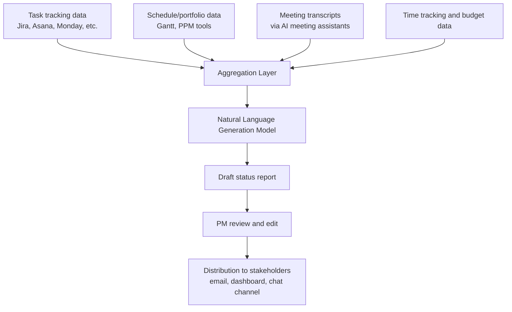

## Automated Status Reporting

### Definition and Scope

Automated status reporting applies AI and workflow automation to the compilation, generation, and distribution of project status information—historically one of the most time-consuming recurring administrative tasks in project management. Rather than a PM manually gathering updates from team members, synthesizing task-tracking data, and writing a narrative summary, automated systems pull data directly from execution tools, generate draft narrative summaries using natural language generation, and route reports to stakeholders on a defined cadence, leaving the PM to review, correct, and add judgment-based context rather than perform the compilation from scratch.

### The Administrative Burden Automated Reporting Targets

Administrative work—timesheet processing, status report compilation, schedule updates, invoice reconciliation—consumes hours that could otherwise go toward higher-value activity. Reported outcomes from organizations implementing this category of automation include meaningful reductions in administrative overhead alongside downstream margin and revenue benefits, though the magnitude of such gains is organization- and implementation-specific. A commonly cited illustrative example: a PM who once spent several hours a week on status reports now spends a much smaller fraction of that time reviewing AI-generated output, redirecting the freed time toward stakeholder alignment and risk mitigation.

[Unverified] Specific productivity figures (hours saved, percentage reductions in administrative time) circulating in vendor and industry sources vary by methodology and should not be treated as guaranteed outcomes for any specific organization's implementation.

### Core Architecture

### Core Capabilities

**Key Points**

- **Automated data aggregation**: Pulling current task status, schedule variance, budget burn, and risk flags directly from connected tools rather than requiring manual status collection from team members.
- **Narrative generation**: Using natural language generation to draft a readable summary from structured data, translating raw metrics into stakeholder-appropriate prose.
- **Meeting-derived status capture**: AI meeting transcription and summarization tools generate meeting summaries, action items, and risk flags automatically from recorded meetings, feeding that structured output into status reports without manual note-taking.
- **Documentation-assisted drafting**: AI-assisted documentation platforms help teams create and maintain project documentation more efficiently, extending to recurring status artifacts as well as one-time documents.
- **Cadence-based distribution**: Automatically generating and distributing reports on a defined schedule (daily, weekly, at milestone completion) rather than requiring manual initiation each cycle.

### Example Tools in This Category

**Example**

- **Otter.ai, Fireflies.ai, Grain**: AI meeting transcription and summarization tools with project management integrations, generating meeting summaries, action items, and risk flags from recorded meetings automatically.
- **Notion AI, Confluence AI**: AI-assisted documentation platforms that help teams create and maintain project documentation, including recurring status pages, more efficiently than fully manual authoring.
- **Native AI reporting features within PPM/work-management platforms**: Many mainstream platforms (see Enterprise Platforms Including Jira, Asana, Monday, and ClickUp earlier in this chapter) have incorporated AI-assisted status drafting directly into their existing tool, reducing the need for a separate reporting-specific product.

[Unverified] The specific feature depth of AI reporting capability embedded in any given platform changes frequently as vendors iterate; current capability should be verified against vendor documentation before an organization relies on a specific feature for its reporting workflow.

### Recommended Adoption Pattern

1. **Start within existing tools**: Enable native AI risk and schedule prediction and reporting features within the PPM/work-management tool already in use, rather than immediately procuring a separate specialized reporting platform.
2. **Let AI draft, not finalize**: Use AI-generated output as a first draft that the PM reviews and edits before distribution, rather than sending automated output directly to stakeholders unreviewed.
3. **Add an AI meeting assistant**: Deploy a meeting transcription/summarization tool to capture decisions and action items automatically, reducing the manual effort of translating meeting discussion into status-report content.
4. **Reinvest freed time deliberately**: Redirect time saved on report compilation toward stakeholder alignment and risk mitigation—the judgment-intensive work automated reporting does not replace.

### What Automated Reporting Changes About the PM Role

The pattern that tends to work well: AI handles the data-heavy, repetitive work, and the PM reinvests the freed hours into stakeholder alignment and risk mitigation. This reflects a broader shift in the PM role from administrator (manually compiling and writing status updates) to decision-maker and reviewer (validating AI-generated output, adding context AI lacks, and focusing attention on judgment calls). AI automates reporting, tracking, and prediction, but does not navigate organizational politics, resolve conflict, or build the trust that makes teams deliver—capabilities that remain squarely within the human-centered competencies covered in the Conflict Resolution and Emotional Intelligence chapter of this course.

### Quality and Accuracy Considerations

**Key Points**

- **Garbage-in, garbage-out risk**: Automated reports are only as accurate as the underlying task-tracking data; teams with poor discipline around updating task status will produce automated reports that look authoritative but reflect stale or incorrect underlying data.
- **Loss of nuance in narrative generation**: AI-generated narrative summaries can miss context a PM would naturally include—political sensitivities, unstated stakeholder concerns, or judgment calls about what to emphasize—making PM review essential rather than optional.
- **Transcription accuracy for meeting-derived content**: AI meeting summarization accuracy varies with audio quality, speaker overlap, and domain-specific terminology; action items and decisions extracted this way warrant a quick accuracy check before being treated as an authoritative record.
- **Over-reliance risk**: A PM who stops personally engaging with underlying project data because reports are automated risks losing the situational awareness that comes from direct engagement with status details, even as review time is reduced.

### Integration with Broader Reporting and Documentation Practice

Automated status reporting depends on the data integration patterns discussed in Choosing and Implementing a Tool Stack earlier in this chapter: reports generated from disconnected or poorly integrated tools require the same manual reconciliation automation is meant to eliminate. It also connects to the documentation practices in Collaboration and Documentation Tools—automated status reports should still be archived and linked into the project's structured knowledge base (decision logs, historical status records) rather than existing only as ephemeral distributed messages.

### Common Pitfalls

- **Distributing unreviewed AI output**: Sending automatically generated status reports directly to stakeholders without PM review risks propagating factual errors, missing context, or tone mismatched to the audience.
- **Automating reporting without underlying data discipline**: Deploying automated reporting on top of inconsistent task-status updating habits produces reports that are fast to generate but unreliable in content.
- **Treating time savings as the only success metric**: Measuring automated reporting success purely by hours saved, without also tracking whether report quality and stakeholder trust are maintained or improved.
- **Neglecting privacy considerations in meeting transcription**: Deploying AI meeting assistants without clear policy and participant awareness about recording, transcription, and data retention.
- **Losing narrative judgment**: Allowing AI-generated prose to flatten genuinely important nuance (a significant risk buried in routine phrasing) that a human author would have deliberately highlighted.

### Relationship to This Chapter and Course

Automated status reporting is a practical, near-term application of the broader AI-assisted forecasting and predictive risk analytics capabilities covered earlier in this chapter, converting model output and aggregated execution data into stakeholder-facing communication. As with those related topics, it illustrates a consistent pattern across this chapter: AI handles data aggregation and pattern detection at scale, while the human-centered judgment, communication, and relationship-management competencies from the Conflict Resolution and Emotional Intelligence chapter remain the parts of the PM's role automation does not replace.

**Next Steps**

- Agentic AI Workflows and Orchestration in Project Delivery
- Data Governance for AI-Driven PM Tools
- Stakeholder Communication Planning
- Reporting and Dashboard Design for Stakeholders
- Ethical Considerations in AI-Assisted Decision-Making
- Meeting Facilitation Techniques for Project Teams