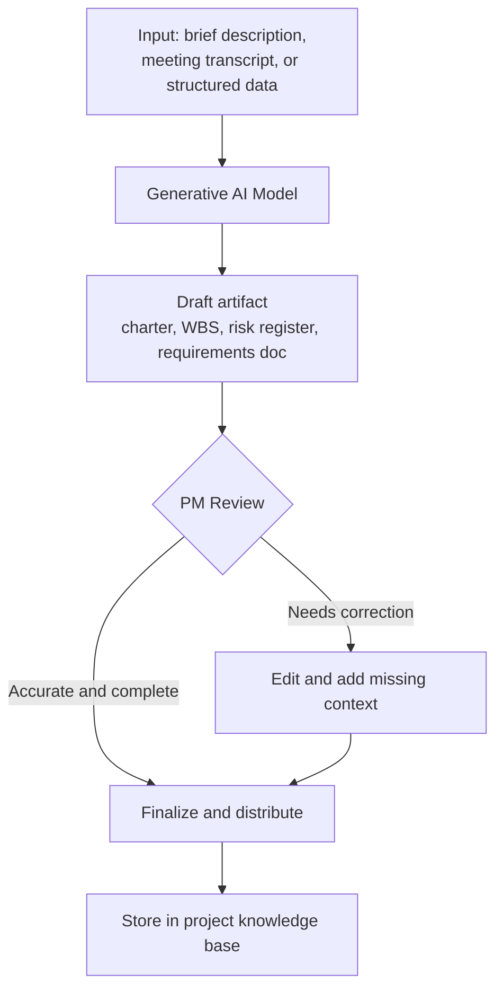

## Generative AI for Planning and Documentation

### Definition and Scope

Generative AI for planning and documentation applies large language models to draft, structure, and refine project artifacts—charters, requirements documents, work breakdown structures, risk registers, meeting notes, and stakeholder communications—accelerating the creation of first drafts that a PM then reviews, edits, and finalizes. This differs from the predictive/analytical AI capabilities covered earlier in this chapter (scheduling forecasts, risk scoring): generative AI's core function here is content creation and structuring rather than numerical prediction, though the two capabilities increasingly appear together within the same platforms.

### Core Application Areas

**Key Points**

- **Project charter and scope drafting**: Generating an initial charter draft from a brief input description, which the PM then refines with stakeholder-specific detail and formal sign-off language.
- **Work breakdown structure (WBS) generation**: Producing a first-pass task decomposition from a high-level scope description, which a PM validates and adjusts against actual delivery constraints.
- **Requirements documentation**: Drafting structured requirements from stakeholder interview notes or meeting transcripts, converting unstructured input into a more consistent documented format.
- **Risk register population**: Generating an initial set of candidate risks based on project type and historical patterns, which the PM and team then validate, prioritize, and supplement with project-specific risks the model would not know to surface.
- **Meeting notes and action item extraction**: Converting meeting transcripts (via AI meeting assistants) into structured notes, decisions, and action items rather than requiring manual note-taking (see also Automated Status Reporting earlier in this chapter).
- **Stakeholder communication drafting**: Generating first-draft status updates, change-request explanations, or escalation communications in a stakeholder-appropriate tone, which the PM then reviews for accuracy and nuance.

### Generative AI Documentation Workflow

### Notable Tools in This Category

**Example**

- **Notion AI, Confluence AI**: AI-assisted documentation platforms that help teams create and maintain project documentation more efficiently, building directly on the knowledge base structures discussed in Collaboration and Documentation Tools earlier in this chapter.
- **Otter.ai, Fireflies.ai, Grain**: While primarily meeting transcription tools, their generative summarization capability functions as a documentation-generation tool, producing structured meeting records and action items from unstructured spoken discussion.
- **General-purpose LLM assistants embedded in PPM platforms**: Many mainstream project and work-management tools have incorporated generative drafting assistance directly into their existing interfaces, reducing the need to copy content between a separate AI tool and the system of record.

[Unverified] Specific generative AI feature sets within named platforms evolve rapidly; current capabilities, including which specific document types a given tool can generate and how well it integrates with existing project data, should be verified against vendor documentation before an organization builds a workflow around a specific feature.

### Why Human Review Remains Essential

Generative AI output for planning documents carries risks distinct from, but related to, the accuracy concerns discussed for automated status reporting:

- **Plausible but incorrect content**: Language models can produce fluent, well-structured text that is factually wrong or based on incorrect assumptions about the specific project, a risk sometimes termed "hallucination," making unreviewed generated content unsuitable for direct stakeholder distribution.
- **Generic rather than project-specific output**: A generated risk register or WBS often reflects common patterns for similar project types rather than the specific constraints, stakeholders, or history of the actual project, requiring substantive PM and team input to become genuinely useful.
- **Loss of team ownership and buy-in**: Documents that are fully AI-generated and merely approved, rather than collaboratively developed, can undermine team ownership of plans they did not meaningfully participate in creating—a particular risk for artifacts like risk registers and WBS, where the process of creation (not just the output) builds shared understanding.

[Inference] The tension between speed gains from generative drafting and the collaborative-ownership value of manually working through planning artifacts as a team likely varies by project type and team culture; highly novel or high-stakes projects may warrant more manual, participatory planning even where generative drafting could technically accelerate the process.

### Practical Guidelines for Using Generative AI in Planning

1. **Use generative output as a starting point, not a final artifact**: Treat AI-drafted charters, WBS, or risk registers as a structured first draft that accelerates blank-page problems, then subject them to the same team review and validation process a manually created draft would receive.
2. **Provide project-specific context in prompts**: Generic prompts produce generic output; supplying actual project constraints, stakeholder names, and historical context (where appropriate and permitted) improves output relevance.
3. **Preserve collaborative planning sessions for high-stakes artifacts**: For charters, risk registers, and WBS on complex or high-visibility projects, consider using generative AI to prepare a discussion draft ahead of a team workshop rather than as a replacement for the workshop itself.
4. **Fact-check generated content against source material**: Particularly for requirements or meeting notes derived from transcripts, verify that the generated summary accurately reflects what was actually said or decided before treating it as the official record.
5. **Maintain version and provenance clarity**: Note within the document or its metadata when content originated from AI drafting versus human authoring, supporting future audit or review needs, particularly in regulated project environments.

### Integration with the Broader Documentation Ecosystem

Generative AI documentation tools are most effective when integrated with the knowledge base and decision-log practices covered in Collaboration and Documentation Tools earlier in this chapter, rather than operating as a standalone drafting tool disconnected from the project's system of record. A generated document that isn't properly filed, linked, and version-controlled within the established knowledge base structure recreates the documentation fragmentation problem that chapter warned against, regardless of how efficiently it was drafted.

### Common Pitfalls

- **Distributing unreviewed generated content to stakeholders**: Sending AI-drafted charters, risk assessments, or communications externally without PM validation risks propagating inaccuracies with an official-looking, confident tone that makes errors harder for readers to detect.
- **Treating generated risk registers as complete**: Assuming an AI-generated candidate risk list is comprehensive rather than a starting point requiring project-specific supplementation from the team's actual domain knowledge.
- **Skipping collaborative planning for expedience**: Replacing valuable team planning workshops entirely with AI-generated documents, losing the shared understanding and buy-in that collaborative planning processes build.
- **Inconsistent documentation provenance**: Failing to track which parts of a document were AI-generated versus human-authored, complicating later review, audit, or correction efforts.
- **Prompt-quality-driven output variance**: Underestimating how much output quality depends on prompt specificity and context, leading to generic or unhelpful drafts attributed to tool limitations rather than input quality.

### Relationship to This Chapter and Course

Generative AI for planning and documentation complements the analytical and predictive AI capabilities covered earlier in this chapter (AI Assisted Scheduling and Forecasting, Predictive Risk Analytics, Automated Status Reporting): where those capabilities focus on prediction and data synthesis, generative AI focuses on content creation and structuring. Across all four items in this chapter, the same underlying principle recurs: AI accelerates data-heavy and drafting-intensive work, while the judgment, validation, and interpersonal competencies from the Conflict Resolution and Emotional Intelligence chapter remain necessary to convert AI output into trustworthy, actionable project artifacts.

**Next Steps**

- Agentic AI Workflows and Orchestration in Project Delivery
- Data Governance for AI-Driven PM Tools
- Ethical Considerations in AI-Assisted Decision-Making
- Work Breakdown Structure (WBS) Development
- Meeting Facilitation Techniques for Project Teams
- Knowledge Management and Project Closeout Documentation