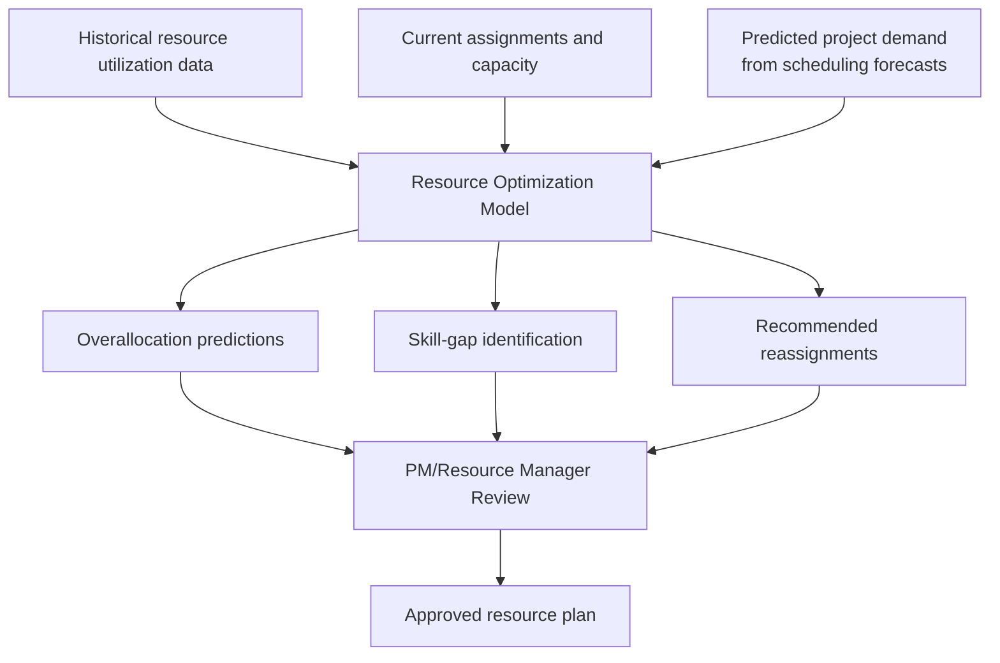

## AI Powered Resource Optimization

### Definition and Scope

AI-powered resource optimization applies machine learning and predictive analytics to the allocation, leveling, and forecasting of project resources—people, equipment, and budget—across tasks, projects, and portfolios. It extends traditional resource leveling (covered under Gantt Chart and Scheduling Tools earlier in this course) from a largely rules-based, single-project scheduling function into a predictive, cross-portfolio capacity management capability that anticipates resource contention and skill gaps before they cause delays.

### From Rule-Based Leveling to Predictive Optimization

| Dimension | Traditional Resource Leveling | AI-Powered Resource Optimization |
| --- | --- | --- |
| Scope | Typically single-project, rules-based reassignment within available float | Cross-project, portfolio-wide capacity modeling |
| Basis for allocation | Current known assignments and stated availability | Historical utilization patterns, predicted demand, skill-matching models |
| Timing | Reactive, applied when over-allocation is detected | Proactive, forecasting contention before it occurs |
| Skill matching | Manual assignment based on PM knowledge of team capabilities | Model-assisted matching based on historical performance and skill data |
| Output | Adjusted schedule resolving conflicts within a single project | Portfolio-level capacity recommendations and predictive workload forecasts |

Machine learning transforms project management by automating scheduling, predicting delays, optimizing resource allocation, and surfacing risks before they escalate, with resource optimization functioning as one of the core application areas alongside scheduling and risk prediction covered earlier in this chapter.

### Core Architecture

### Core Capabilities

**Key Points**

- **Predictive capacity modeling**: Forecasting future resource demand and availability across a portfolio, enabling proactive rebalancing before over-allocation actually occurs rather than reactive leveling after the fact.
- **Cross-project resource contention detection**: Identifying when multiple projects are competing for the same specialized personnel, surfacing conflicts a single-project view would miss.
- **Skill-based matching**: Recommending resource assignments based on historical performance data and skill profiles rather than relying solely on a PM's personal knowledge of team member capabilities.
- **Workload forecasting**: Supporting workload forecasting, task prioritization, and resource planning as part of the broader machine-learning capability set applied to project management.
- **Burnout and attrition risk signals**: Some implementations incorporate workload and utilization trend data to flag resource-level stress risk, connecting to the human-centered stress management practices covered in Managing Team Stress and Burnout earlier in this course.

### Notable Tools in This Category

**Example**

- **Tempus Resource**: AI-powered resource management with predictive capacity modeling, particularly positioned for organizations with complex resource sharing across business units.
- **Enterprise AI-PPM platforms**: Tools such as Planisware apply machine learning and predictive analytics to optimize resources across portfolios, aimed at large-scale, Fortune 500-class program environments requiring cross-project resource visibility.
- **Native resource features within mainstream work-management platforms**: Several widely used platforms (see Enterprise Platforms Including Jira, Asana, Monday, and ClickUp and Microsoft Project and Portfolio Tools earlier in this chapter) have incorporated AI-assisted resource leveling and capacity forecasting directly into their broader toolset.

[Unverified] Specific resource-optimization feature depth and the underlying modeling approach vary by vendor and change frequently; capability claims for any named platform should be verified against current vendor documentation before procurement decisions.

### Reported Organizational Outcomes

Organizations implementing machine learning-driven project management, including resource optimization capabilities, have reported measurable outcomes such as reductions in administrative overhead and improvements in profit margin and resource utilization in industries like architecture, engineering, and construction. [Inference] These figures originate from vendor-adjacent industry sources and specific case studies; the magnitude of benefit for any given organization depends heavily on baseline resource-management maturity, data quality, and implementation quality, and should not be treated as a guaranteed or typical outcome.

### Implementation Considerations

1. **Establish reliable utilization data first**: Predictive resource models depend on accurate historical time-tracking and assignment data; organizations with inconsistent time-tracking discipline will see degraded model reliability regardless of modeling sophistication.
2. **Integrate with scheduling forecasts**: Resource optimization is most effective when connected to the schedule-forecasting capability covered in AI Assisted Scheduling and Forecasting earlier in this chapter, since predicted task timing directly drives predicted resource demand.
3. **Define human override authority clearly**: Resource assignment decisions often carry organizational and interpersonal dimensions (career development, team dynamics, individual preferences) that a model cannot fully capture; establish clear protocols for when and how a resource manager can override model recommendations.
4. **Monitor for skill-matching bias**: Models trained on historical assignment data can perpetuate past patterns (e.g., consistently assigning certain team members to certain project types), potentially limiting skill development opportunities for team members the model hasn't seen succeed in a given role; this warrants periodic human review of assignment diversity, not just efficiency.
5. **Connect utilization signals to wellbeing monitoring**: Since resource utilization data can also serve as an early indicator of overallocation-driven stress, consider how this data feeds into the stress and burnout monitoring practices covered earlier in this course, with appropriate governance around how such data is used.

### The Agentic Coordination Challenge in Resource Optimization

As introduced in AI Assisted Scheduling and Forecasting, deploying multiple autonomous AI agents across different functions can create coordination conflicts. Resource optimization is a common site for this: a scheduling agent might request additional resource capacity to meet an accelerated deadline while a budget agent simultaneously restricts hiring or overtime spend to control costs. Managing these conflicting automated recommendations is described as requiring a coordinating human role—sometimes termed an "AI Orchestrator"—responsible for reconciling agent outputs before resource decisions are finalized, rather than allowing contradictory automated recommendations to reach execution unchecked.

### Common Pitfalls

- **Optimizing for utilization over sustainability**: A model narrowly optimized to maximize resource utilization percentages can recommend allocations that push individuals toward chronic overwork, conflicting with the sustainable-pace principles covered in Managing Team Stress and Burnout.
- **Ignoring the human and career dimensions of resource assignment**: Treating AI-recommended assignments as purely technical optimization problems, disregarding professional development goals, team relationship dynamics, or individual preferences that affect both performance and retention.
- **Deploying without adequate historical data**: Applying predictive resource optimization in organizations with too little clean historical utilization data to support reliable pattern detection.
- **Allowing model-perpetuated assignment patterns**: Failing to periodically audit whether skill-matching recommendations are narrowing rather than broadening opportunity distribution across the team.
- **Unreconciled cross-agent conflicts**: Allowing scheduling, budget, and resource optimization agents to operate independently without a coordination process, risking contradictory recommendations reaching execution simultaneously.
- **Over-trusting automated recommendations for sensitive decisions**: Applying AI-recommended resource reassignments to consequential situations (e.g., removing someone from a role) without the judgment and difficult-conversation skills covered earlier in this course.

### Relationship to This Chapter and Course

AI-powered resource optimization completes the set of predictive and generative AI capabilities covered in this chapter—scheduling and forecasting, risk analytics, automated reporting, generative documentation, and now resource optimization—each automating a data-intensive dimension of project management. Consistent with the chapter's recurring theme, resource optimization surfaces recommendations and predictions that still require human judgment to finalize, particularly where those recommendations intersect with the interpersonal and wellbeing considerations covered in the Conflict Resolution and Emotional Intelligence chapter earlier in this course.

**Next Steps**

- Agentic AI Workflows and Orchestration in Project Delivery
- Data Governance for AI-Driven PM Tools
- Ethical Considerations in AI-Assisted Decision-Making
- Resource Leveling and Capacity Planning Fundamentals
- Team Development and Career Growth Planning
- Measuring Project Management Maturity