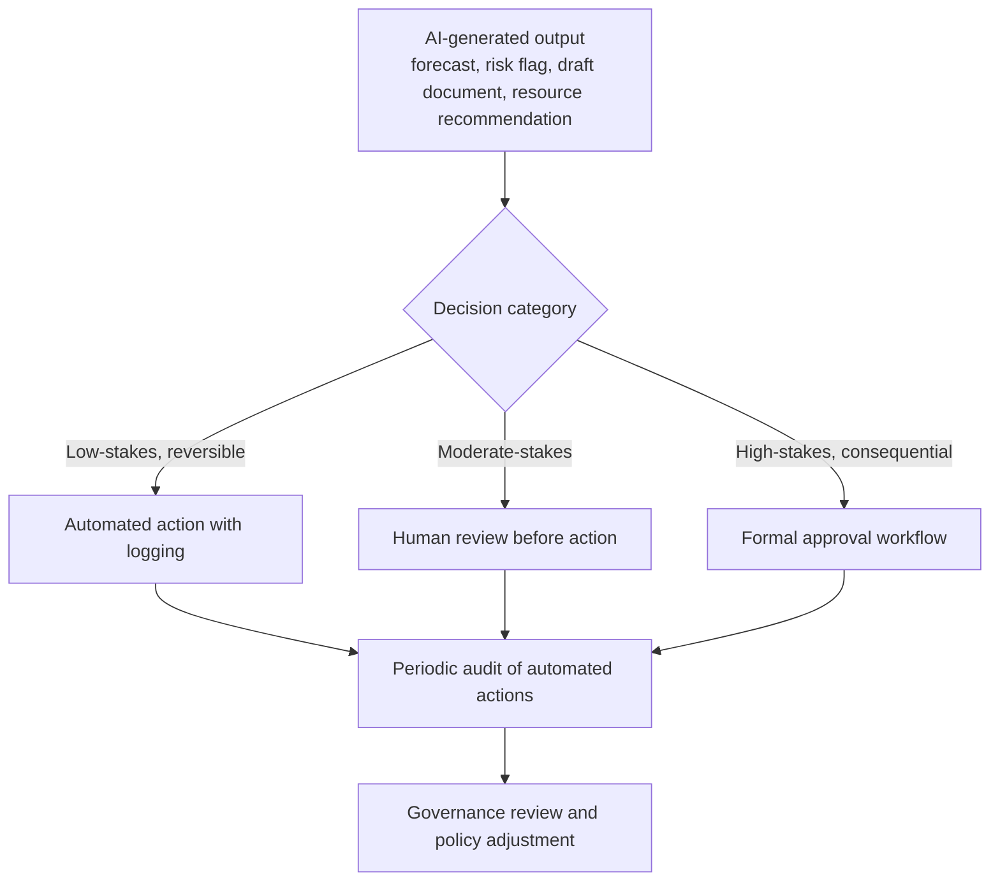

## Governance and Limitations of AI in Projects

### Definition and Scope

Governance and limitations of AI in projects covers the organizational policies, oversight structures, and inherent boundaries that determine how AI capabilities—scheduling forecasts, predictive risk analytics, automated reporting, generative documentation, and resource optimization, all covered earlier in this chapter—can be responsibly deployed within project delivery. As AI capability embeds more deeply into standard PM tooling, governance shifts from an optional consideration to a required discipline: without it, organizations risk over-trusting automated output, exposing sensitive data inappropriately, or allowing conflicting automated decisions to reach execution unchecked.

### Why Governance Has Become Necessary

AI's effectiveness in project management is now limited primarily by enterprise data readiness rather than model sophistication, meaning governance around data quality, access, and usage has become a gating factor for AI value realization rather than a secondary concern. As organizations deploy AI capabilities across multiple project functions simultaneously, the primary challenge is no longer simply "integration" but orchestration—managing how multiple automated systems interact rather than only ensuring each system individually works correctly.

### Core Governance Domains

**Key Points**

- **Data governance**: Policies determining what project data (task details, communications, resource information) can feed into AI models, who can access AI-generated insights, and how sensitive data is protected throughout the AI pipeline.
- **Model oversight and validation**: Processes for periodically validating that AI forecasts, risk scores, and recommendations remain accurate over time, rather than assuming initial validation applies indefinitely as underlying conditions change.
- **Human-in-the-loop requirements**: Defined decision categories that require human review and approval before AI-generated output (schedules, risk assessments, resource reassignments, stakeholder communications) is finalized or acted upon.
- **Agentic AI coordination**: Governance specifically addressing conflicts between multiple autonomous AI agents operating on the same project (see AI Assisted Scheduling and Forecasting and AI Powered Resource Optimization earlier in this chapter), including designated escalation and reconciliation authority.
- **Vendor and tool evaluation standards**: Consistent criteria for assessing AI feature claims, data handling practices, and accuracy benchmarks across the many AI-enabled PM tools in the market, preventing ad hoc adoption based on vendor marketing alone.

### Governance Structure Pattern

### The Agentic AI Orchestration Problem

As multiple AI agents are deployed for different project functions—for example, a dedicated budget-optimization agent and a separate scheduling agent—logic collisions can occur: a budget agent might pause a purchase to save costs while a scheduling agent simultaneously marks the same material as critical for an urgent delivery window. Managing these conflicting autonomous decisions requires a coordinating human role, sometimes termed an "AI Orchestrator," responsible for reconciling agent outputs rather than each agent's decisions reaching execution independently. This represents a governance challenge distinct from single-model validation: it requires explicit protocols for conflict detection and resolution authority across an organization's AI tool ecosystem, not just accuracy oversight for any individual tool.

[Speculation] Whether "AI Orchestrator" becomes a standardized, widely adopted role title, as opposed to a descriptive label for a coordinating function currently absorbed into existing PMO responsibilities, remains unclear at this stage of the technology's adoption curve.

### Fundamental Limitations of AI in Project Management

**Key Points**

- **AI works alongside project managers rather than replacing them**: Current AI capability across scheduling, risk, and reporting functions is consistently framed in industry sources as decision-support, not autonomous decision-making authority over consequential project outcomes.
- **Data quality dependency**: Predictive analytics amplifies good project management practices; it does not fix broken ones. Organizations with weak requirements discipline, unrealistic baseline scheduling, or inconsistent reporting will not see AI forecasting accuracy improve until those foundational issues are addressed directly.
- **Bounded forecasting accuracy**: Even well-calibrated predictive risk and schedule models are described as achieving meaningfully less than perfect accuracy (illustratively, in the range of roughly two-thirds to three-quarters accuracy for early risk flagging in one industry benchmark), meaning AI output should inform rather than dictate decisions.
- **Inability to navigate interpersonal and political dimensions**: AI automates reporting, tracking, and prediction, but cannot navigate organizational politics, resolve conflict, or build the trust that makes teams deliver—capabilities that remain the domain of the human-centered competencies covered in the Conflict Resolution and Emotional Intelligence chapter of this course.
- **Generic versus project-specific output**: As discussed in Generative AI for Planning and Documentation, AI-generated planning artifacts often reflect general patterns for similar project types rather than genuinely project-specific context, requiring substantive human validation.

### Data Privacy and Ethical Considerations

**Example**

- **Communication and sentiment monitoring**: Some predictive risk and resource optimization tools incorporate analysis of status reports, meeting transcripts, or team communication sentiment as input signals. This raises data privacy and employee-monitoring considerations that require explicit organizational policy and, in many jurisdictions, employee disclosure, separate from the technical question of whether such signals improve predictive accuracy.
- **Meeting transcription and recording**: AI meeting assistants (Otter.ai, Fireflies.ai, Grain, and similar tools) require clear policy on recording consent, transcript retention, and access control, particularly for meetings touching sensitive personnel or commercial topics.
- **Assignment bias in resource optimization**: Models trained on historical assignment data can perpetuate past patterns, potentially narrowing rather than broadening opportunity distribution for team members whose skills the model hasn't observed succeeding in a given role, warranting periodic human review of AI-recommended assignment diversity.
- **Algorithmic accountability**: When an AI-generated risk score, forecast, or resource recommendation contributes to a consequential decision, organizations need clarity on who is accountable for that decision—the tool vendor, the PM who acted on it, or the organization's governance body—a question current industry practice has not fully standardized.

[Inference] Regulatory frameworks governing AI use in workplace and project-management contexts are actively evolving as of 2026 in multiple jurisdictions; organizations should treat current governance practices as provisional and expect to adapt them as applicable law and industry standards mature, rather than assuming today's practices will remain sufficient indefinitely.

### Establishing an AI Governance Framework for Projects

1. **Classify AI use cases by stakes and reversibility**: Distinguish low-stakes, easily reversible AI actions (e.g., draft status report generation) from high-stakes, consequential ones (e.g., resource reassignment affecting someone's role, stakeholder-facing risk communication), applying proportionally more human oversight to the latter.
2. **Define explicit human-in-the-loop checkpoints**: Specify which categories of AI output require human review before action, and ensure accountability for that review is clearly assigned rather than diffused.
3. **Establish data handling policy before tool adoption**: Determine what project and personnel data may feed into AI systems, with what access controls, before enabling AI features that consume such data—not retroactively after a privacy concern surfaces.
4. **Create an agentic conflict resolution protocol**: For organizations deploying multiple AI agents across project functions, define who has authority to reconcile conflicting automated recommendations and how such conflicts are logged and reviewed.
5. **Audit AI output against actual outcomes periodically**: Track how AI forecasts, risk flags, and recommendations compared to what actually happened, both to calibrate organizational trust in specific tools and to detect model drift or degraded accuracy over time.
6. **Maintain a vendor evaluation standard**: Apply consistent criteria (data handling practices, accuracy validation, integration transparency) when evaluating new AI-enabled PM tools, rather than adopting based on vendor marketing claims alone.

### Common Pitfalls

- **Adopting AI capability without corresponding governance**: Enabling AI features within existing PM tools because they are available, without establishing review processes, data policies, or accountability structures for their output.
- **Treating vendor accuracy claims as validated fact**: Accepting marketing-stated accuracy or capability claims without independent validation against the organization's own data and outcomes.
- **Uniform oversight regardless of stakes**: Applying the same light-touch review to a routine automated status draft as to a consequential resource reassignment recommendation, rather than calibrating oversight to actual risk.
- **Ungoverned agentic deployment**: Allowing multiple AI agents to operate across scheduling, budget, and resource functions without an explicit coordination and conflict-resolution process.
- **Static governance in a fast-moving domain**: Establishing AI governance policy once and failing to revisit it as tool capabilities, regulatory requirements, and organizational experience evolve.
- **Governance theater**: Creating formal-looking governance documentation that isn't actually operationalized in day-to-day review practices, providing an illusion of oversight without substantively changing how AI output is used.

### Relationship to This Chapter and Course

Governance and limitations of AI in projects serves as the capstone item for this chapter, establishing the oversight framework that should govern how the AI Assisted Scheduling and Forecasting, Predictive Risk Analytics, Automated Status Reporting, Generative AI for Planning and Documentation, and AI Powered Resource Optimization capabilities are actually deployed in practice. Across every item in this chapter, the consistent finding is that AI augments and accelerates data-intensive PM work while leaving the judgment-intensive, interpersonal, and ethical dimensions of project leadership—the domain of the Conflict Resolution and Emotional Intelligence chapter earlier in this course—squarely within human responsibility. Effective governance is what ensures that boundary is respected in practice rather than eroded by convenience or automation momentum.

**Next Steps**

- Data Governance and Permissions Across Integrated Tools
- Ethical Decision-Making Frameworks in Project Management
- Regulatory and Compliance Considerations for AI Adoption
- Organizational Change Management for AI Tool Adoption
- Measuring Project Management Maturity
- The Evolving Role of the Project Manager in an AI-Augmented Workplace