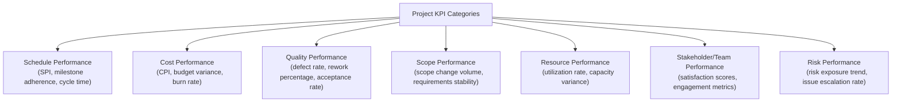
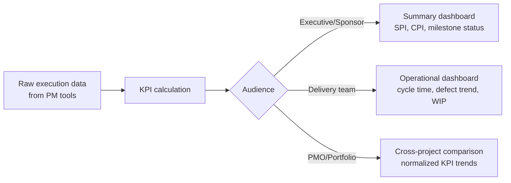

## Key Performance Indicators for Projects

### Definition and Scope

A Key Performance Indicator (KPI) is a quantifiable measure used to evaluate whether a project is achieving its intended objectives against defined targets. Unlike raw status data (a task is "in progress" or "done"), KPIs synthesize underlying data into a small set of meaningful indicators that support decision-making, comparison against baseline expectations, and communication to stakeholders at varying levels of detail. This chapter shifts focus from the tools and AI capabilities covered previously to the measurement discipline that determines what those tools and capabilities should actually be tracking and reporting.

### Categories of Project KPIs

### Schedule Performance KPIs

**Key Points**

- **Schedule Performance Index (SPI)**: A ratio comparing earned value to planned value, indicating whether the project is ahead of, on, or behind schedule.
- **Milestone adherence rate**: Percentage of milestones met on or before their planned date, useful for stakeholder-facing reporting since it is more intuitive than SPI for non-technical audiences.
- **Cycle time / lead time**: For agile and continuous-flow work (see Agile and Kanban Board Platforms earlier in this course), the elapsed time for work items to move through the workflow, tracked as a trend rather than a single value.
- **Schedule variance (SV)**: The absolute or percentage difference between planned and actual progress at a point in time.

$$SPI = \frac{EV}{PV}$$

Where $EV$ (Earned Value) represents the budgeted cost of work actually performed, and $PV$ (Planned Value) represents the budgeted cost of work scheduled to be performed by that point. An $SPI$ value below 1.0 indicates the project is behind schedule; above 1.0 indicates ahead of schedule.

### Cost Performance KPIs

**Key Points**

- **Cost Performance Index (CPI)**: A ratio comparing earned value to actual cost, indicating cost efficiency.
- **Cost variance (CV)**: The difference between earned value and actual cost, expressed in currency terms.
- **Budget burn rate**: The rate at which budget is being consumed relative to the planned consumption rate, useful as an early trend indicator distinct from point-in-time variance.
- **Estimate at Completion (EAC)**: A forecast of total project cost based on current performance trends, extending current CPI forward to project a likely final cost.

$$CPI = \frac{EV}{AC} \qquad EAC = \frac{BAC}{CPI}$$

Where $AC$ is Actual Cost and $BAC$ is Budget at Completion. A $CPI$ below 1.0 indicates the project is over budget for work performed; above 1.0 indicates under budget.

### Quality Performance KPIs

| KPI | Definition | Typical Use |
| --- | --- | --- |
| Defect density | Defects per unit of output (e.g., per 1,000 lines of code, per deliverable) | Software and manufacturing quality tracking |
| Rework percentage | Proportion of completed work requiring correction or redo | Identifying process or requirements-clarity issues |
| First-pass acceptance rate | Percentage of deliverables accepted by stakeholders without requiring revision | Client-facing and regulated-deliverable projects |
| Test/inspection pass rate | Percentage of quality checks passed on first attempt | Construction, manufacturing, and software QA contexts |

### Scope and Change Performance KPIs

**Example**

- **Scope change volume**: The number or cumulative impact of approved change requests over the project lifecycle, useful for identifying scope creep trends.
- **Requirements volatility**: The rate at which previously approved requirements are modified, indicating requirements-gathering maturity or stakeholder alignment issues.
- **Change request cycle time**: How long change requests take to move from submission to decision, indicating governance process efficiency.

### Resource Performance KPIs

**Key Points**

- **Resource utilization rate**: The percentage of available capacity actually allocated to project work, useful for both efficiency assessment and overallocation risk detection (connecting to the resource optimization concepts in AI Powered Resource Optimization earlier in this course).
- **Planned versus actual resource variance**: Comparing forecasted resource needs against actual consumption, informing future estimation accuracy.
- **Bench time / idle capacity**: Time resources spend without assigned project work, relevant for portfolio-level resource planning.

### Stakeholder and Team Performance KPIs

**Key Points**

- **Stakeholder satisfaction score**: Typically gathered via periodic surveys, providing a leading indicator of relationship health that lagging schedule/cost metrics may not capture.
- **Team engagement or pulse survey scores**: Connecting to the stress and burnout monitoring practices covered in Managing Team Stress and Burnout earlier in this course, functioning as both a wellbeing and a performance signal.
- **Net Promoter Score (NPS) variants**: Adapted from customer-experience measurement to gauge stakeholder likelihood to recommend working with the project team again.

### Selecting the Right KPI Set

1. **Align KPIs to project objectives, not generic templates**: A KPI set copied wholesale from a prior project may not reflect what actually matters for the current project's specific goals and constraints.
2. **Balance leading and lagging indicators**: Lagging indicators (cost variance, defect rate) confirm what has already happened; leading indicators (change request velocity, team engagement trend) provide earlier warning, and an effective KPI set includes both.
3. **Limit the KPI set to what drives action**: A large dashboard of tracked metrics that don't inform any actual decision creates reporting overhead without corresponding value; each KPI should have a clear answer to "what decision does this inform."
4. **Tailor KPI detail to audience**: Executive stakeholders typically need a small set of summary indicators (SPI, CPI, milestone status), while the delivery team benefits from more granular operational metrics (cycle time by workflow stage, defect trends by component).
5. **Establish baselines and targets before measuring**: A KPI without a defined target or baseline for comparison provides a number without context for whether that number represents good or poor performance.

### KPI Reporting Cadence and Visualization

Automated dashboards, increasingly AI-assisted as covered in Automated Status Reporting earlier in this course, can pull KPI data directly from execution tools rather than requiring manual calculation, though the underlying KPI definitions and target-setting remain a PM and stakeholder responsibility rather than something a tool determines independently.

### Common Pitfalls

- **Vanity metrics**: Tracking KPIs that look impressive but don't correlate with actual project success or inform any decision (e.g., raw task-completion counts without regard to task importance or complexity).
- **Gaming the metric**: When a KPI becomes a target that individuals are evaluated against, behavior can shift toward optimizing the metric itself rather than the underlying outcome it was meant to represent (a form of Goodhart's Law).
- **Over-reliance on lagging indicators alone**: Tracking only cost and schedule variance without leading indicators means problems are detected only after they have already materialized.
- **Inconsistent KPI definitions across projects**: Different teams calculating the same nominally-titled KPI differently (e.g., varying definitions of "on-time") undermines portfolio-level comparison and trend analysis.
- **KPI proliferation without pruning**: Accumulating tracked metrics over time without periodically removing those that no longer inform decisions, creating reporting burden disproportionate to value.
- **Treating KPIs as fixed for the project lifecycle**: Failing to revisit whether the original KPI set remains appropriate as project phases, risks, and stakeholder priorities evolve.

### Relationship to This Chapter and Course

Key Performance Indicators for Projects establishes the measurement foundation for the remainder of this chapter on data-driven project management, defining what should be measured before addressing how that data is collected, visualized, and used for decision-making in subsequent items. It also connects to the automated reporting and predictive analytics capabilities covered in the AI and Automation in Project Management chapter earlier in this course, since AI-assisted tools ultimately calculate and forecast against the KPI definitions established here.

**Next Steps**

- Earned Value Management in Depth
- Dashboard and Data Visualization Design for Stakeholders
- Benchmarking and Cross-Project Performance Comparison
- Data Collection Methods and Data Quality for PM Metrics
- Balanced Scorecard Approaches to Project Performance
- Portfolio-Level Metrics and PMO Reporting