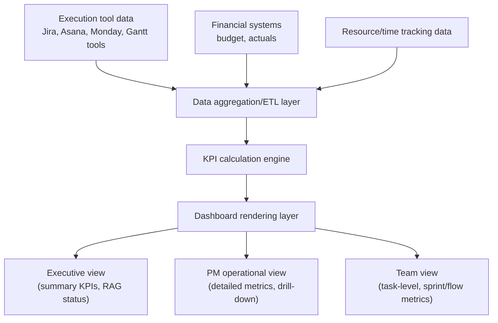

## Dashboards and Real Time Reporting

### Definition and Scope

Dashboards and real-time reporting are the visualization and communication layer that translates the KPIs defined earlier in this chapter into accessible, continuously updated views for different stakeholder audiences. Where Key Performance Indicators for Projects addressed *what* to measure, this item addresses *how* that measurement is surfaced—the visual design, refresh cadence, and audience-tailoring choices that determine whether a dashboard genuinely supports decision-making or merely accumulates unused data on a screen.

### Real-Time Versus Periodic Reporting

| Dimension | Periodic Reporting | Real-Time Dashboards |
| --- | --- | --- |
| Update cadence | Fixed intervals (weekly, monthly status reports) | Continuous or near-continuous, reflecting current tool state |
| Data freshness | Can be stale by the time it's reviewed | Reflects current execution-tool data at time of viewing |
| Preparation effort | Manual compilation, often significant PM time (see Automated Status Reporting earlier in this course) | Automated pull from connected systems, minimal per-instance effort |
| Best suited for | Formal stakeholder communication requiring narrative context | Operational monitoring, day-to-day team and PM decision-making |
| Risk | Information can be outdated at point of stakeholder review | Can create false precision or over-monitoring if not paired with judgment |

Neither model fully replaces the other in practice: most mature PM environments combine real-time operational dashboards for day-to-day monitoring with periodic narrative reports (often AI-assisted, as discussed in Automated Status Reporting) for formal stakeholder communication requiring interpretation and context that a live dashboard alone cannot provide.

### Dashboard Architecture Pattern

### Dashboard Design Principles by Audience

**Key Points**

- **Executive/sponsor dashboards**: Prioritize a small number of high-level indicators (overall RAG status, SPI/CPI, milestone timeline, top risks) with minimal drill-down clutter; executives typically need to answer "is this project healthy" quickly, not explore granular detail.
- **PM operational dashboards**: Include more granular detail supporting day-to-day decision-making—task-level status, resource allocation views, burndown/burnup charts, and detailed variance breakdowns by work package.
- **Team-level dashboards**: Focus on metrics directly actionable by the team itself, such as sprint burndown, cycle time by workflow stage, and current WIP against limits (see Agile and Kanban Board Platforms earlier in this course).
- **Portfolio/PMO dashboards**: Aggregate and normalize KPIs across multiple projects for cross-project comparison, requiring consistent KPI definitions (as emphasized in Key Performance Indicators for Projects) to be meaningful.

### RAG (Red-Amber-Green) Status Indicators

A widely used simplification technique for executive-level dashboards, condensing detailed metrics into a three-state visual indicator:

| Status | Typical Meaning | Example Threshold |
| --- | --- | --- |
| Green | On track, no action needed | SPI/CPI within defined tolerance band (e.g., 0.95–1.05) |
| Amber | At risk, monitoring or intervention warranted | SPI/CPI outside tolerance but not critically so; emerging risk trend |
| Red | Significant issue requiring escalation | SPI/CPI substantially below target; critical risk realized |

[Inference] RAG threshold definitions vary considerably across organizations and industries; the specific numeric boundaries between green, amber, and red should be calibrated to organizational risk tolerance and project context rather than applied as a universal standard, since an identical variance might be routine for one project type and severe for another.

### Common Visualization Types

**Example**

- **Burndown/burnup charts**: Track remaining or completed work against time, standard in agile contexts for sprint and release tracking.
- **Cumulative Flow Diagrams (CFD)**: Visualize work-item counts across workflow stages over time, useful for detecting bottlenecks (see Agile and Kanban Board Platforms earlier in this course).
- **Gantt/timeline views**: Visualize schedule status against baseline, connecting to the scheduling tools covered in Gantt Chart and Scheduling Tools earlier in this course.
- **S-curves**: Plot cumulative planned versus actual cost or progress over time, commonly used in construction and large capital projects for earned value visualization.
- **Heat maps**: Visualize risk exposure, resource utilization, or status across a matrix (e.g., project x risk category), useful for portfolio-level pattern detection.

### Real-Time Data Integration Considerations

1. **Establish reliable source-system data quality first**: A real-time dashboard pulling from execution tools with poor data discipline (stale task statuses, inconsistent field usage) will surface that poor quality in real time rather than compensating for it—automation amplifies rather than corrects underlying data problems.
2. **Define refresh cadence appropriate to the metric**: Not all metrics benefit from true real-time refresh; some (e.g., monthly financial actuals) are inherently periodic regardless of dashboard technology, and forcing a real-time frame onto inherently periodic data can create a false impression of currency.
3. **Balance automation with narrative context**: Real-time dashboards excel at showing current state but are generally poor at conveying the "why" behind a trend; pairing dashboards with periodic narrative commentary (increasingly AI-drafted, per Automated Status Reporting) addresses this gap.
4. **Plan for drill-down without overwhelming the summary view**: Effective dashboard design allows a viewer to start at a high-level indicator and progressively drill into supporting detail, rather than forcing all audiences to view the same level of granularity.
5. **Secure access appropriately**: Not all dashboard audiences should see the same data; sensitive financial or personnel-related metrics may need access restriction distinct from general project status visibility.

### Dashboard Tooling Landscape

**Key Points**

- **Native dashboards within PM/PPM platforms**: Most tools covered earlier in this course (Jira, Asana, Monday.com, ClickUp, Microsoft's Planner/Project suite) include built-in dashboard capability drawing directly on their own execution data.
- **Dedicated business intelligence (BI) tools**: Platforms such as Power BI and Tableau are commonly used for cross-tool aggregation, advanced visualization, and portfolio-level reporting beyond what a single PM tool's native dashboard supports.
- **API-driven custom dashboards**: Organizations with complex, multi-tool environments sometimes build custom dashboards pulling from several systems via API, trading implementation effort for tailored cross-system visibility.

[Unverified] Specific dashboard feature depth and native BI integration capability vary by platform and change frequently as vendors compete on this dimension; current capability should be verified against vendor documentation before committing to a specific tooling approach.

### Common Pitfalls

- **Dashboard sprawl**: Creating numerous overlapping dashboards for slightly different audiences without a coherent information architecture, causing confusion about which view is authoritative.
- **Vanity dashboards**: Displaying visually impressive but low-actionability metrics (echoing the vanity-metric pitfall from Key Performance Indicators for Projects), consuming screen real estate without informing decisions.
- **False precision from automation**: Presenting real-time dashboard figures with an implied certainty the underlying data quality doesn't actually support, misleading viewers about how reliable the displayed numbers are.
- **Ignoring dashboard fatigue**: Assuming stakeholders regularly check dashboards proactively, when many stakeholders in practice need to be actively directed to relevant data via periodic reporting rather than expected to self-serve.
- **Static thresholds that don't reflect context**: Applying uniform RAG thresholds across dissimilar project types without adjusting for differing risk tolerance, leading to either alarm fatigue or dangerously delayed escalation.
- **Neglecting narrative context**: Relying solely on dashboard visuals without accompanying explanation, leaving stakeholders to misinterpret why a metric moved without the context a PM's narrative commentary would provide.

### Relationship to This Chapter and Course

Dashboards and real-time reporting operationalizes the KPI definitions established in Key Performance Indicators for Projects, translating measurement discipline into the visual, audience-tailored communication tools stakeholders actually interact with. It also draws directly on the automated reporting and AI-assisted forecasting capabilities from the AI and Automation in Project Management chapter earlier in this course, since modern dashboards increasingly incorporate AI-generated narrative summaries and predictive trend lines alongside traditional static visualizations.

**Next Steps**

- Earned Value Management in Depth
- Benchmarking and Cross-Project Performance Comparison
- Data Collection Methods and Data Quality for PM Metrics
- Stakeholder Communication Planning
- Business Intelligence Tool Selection for PMOs
- Portfolio-Level Metrics and PMO Reporting