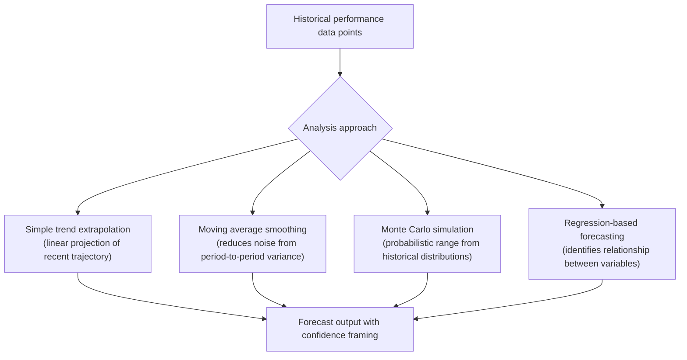

## Forecasting Metrics and Trend Analysis

### Definition and Scope

Forecasting metrics and trend analysis extends the KPI measurement and dashboard visualization discipline covered earlier in this chapter into forward-looking projection: using current and historical performance data to estimate likely future project outcomes, rather than only describing present or past status. This item bridges traditional forecasting techniques (Earned Value Management-based projections, trend extrapolation) with the AI-assisted probabilistic forecasting capabilities introduced in AI Assisted Scheduling and Forecasting earlier in this course, providing the underlying quantitative methodology that both manual and AI-assisted forecasting build upon.

### Core Forecasting Metrics from Earned Value Management

Building on the SPI and CPI indices introduced in Key Performance Indicators for Projects, several derived forecasting metrics project current performance trends forward to completion:

$$EAC = \frac{BAC}{CPI}$$

$$ETC = EAC - AC$$

$$TCPI = \frac{BAC - EV}{BAC - AC}$$

Where $EAC$ (Estimate at Completion) forecasts total project cost based on current cost efficiency, $ETC$ (Estimate to Complete) projects remaining cost from the current point forward, and $TCPI$ (To-Complete Performance Index) indicates the cost efficiency required on remaining work to still meet the original budget ($BAC$, Budget at Completion). A $TCPI$ substantially above 1.0 signals that meeting the original budget would require an efficiency improvement that may not be realistic given current performance trends, functioning as an early warning distinct from a simple point-in-time variance figure.

### Schedule Forecasting Metrics

**Key Points**

- **Estimated Completion Date (ECD)**: Projecting the likely finish date by extending current SPI trends forward, analogous to EAC for cost.
- **Velocity-based forecasting (agile contexts)**: Using a team's historical velocity (story points or items completed per sprint) to project how many sprints remain to complete a known backlog, a simpler but widely used forecasting approach for agile teams.
- **Throughput-based forecasting (Kanban contexts)**: Using historical throughput (items completed per unit time, see Agile and Kanban Board Platforms earlier in this course) combined with Monte Carlo simulation over historical cycle-time distributions to forecast completion date ranges rather than single-point estimates.

### Trend Analysis Techniques

- **Simple trend extrapolation**: Projecting forward based on the most recent trajectory; useful for quick directional assessment but sensitive to short-term noise and outlier data points.
- **Moving average smoothing**: Averaging performance over a rolling window (e.g., trailing 3 sprints) to reduce the influence of any single anomalous period on the forecast.
- **Monte Carlo simulation**: Repeatedly sampling from historical variance distributions to generate a probability-weighted range of outcomes rather than a single projected value, as discussed in AI Assisted Scheduling and Forecasting earlier in this course.
- **Regression-based forecasting**: Identifying statistical relationships between variables (e.g., team size and cycle time, requirement complexity and defect rate) to inform forecasts for new work based on characteristics rather than purely historical time-series trends.

### From Point Estimates to Probabilistic Ranges

A key methodological shift in modern forecasting practice, paralleling the discussion in AI Assisted Scheduling and Forecasting, is presenting forecasts as confidence-weighted ranges rather than single deterministic dates or costs:

$$P(\text{Completion} \le T) = \frac{\text{Simulation runs finishing by } T}{\text{Total simulation runs}}$$

**Example**

Rather than reporting "the project will finish on March 15," a probabilistic forecast might report an 85% confidence of completion by March 15 and a 95% confidence of completion by March 29, giving stakeholders an honest picture of the uncertainty embedded in any forward-looking estimate rather than false precision around a single date.

### Leading Versus Lagging Indicator Trend Analysis

| Indicator Type | Examples | Forecasting Value |
| --- | --- | --- |
| Lagging | Cost variance, completed defect counts, SPI/CPI at a point in time | Confirms what has already happened; limited forward-looking value alone |
| Leading | Change request velocity, team engagement trend, risk exposure trend, requirements volatility | Provides earlier signal of likely future performance shifts before they appear in lagging metrics |

Effective trend analysis combines both: lagging indicators validate whether prior forecasts were accurate, while leading indicators inform the next forecast cycle, creating a continuous feedback loop rather than a one-time projection exercise.

### Forecast Accuracy and Calibration

[Inference] As referenced in AI Assisted Scheduling and Forecasting earlier in this course, industry sources describe well-calibrated predictive models achieving roughly 65–75% accuracy in flagging at-risk projects several months in advance; this figure should be treated as an illustrative benchmark rather than a guarantee, since forecast accuracy depends heavily on data quality, the stability of the underlying project environment, and how much historical comparable data exists for the forecasting model or technique in use.

A critical discipline in trend analysis is periodically validating forecasts against actual outcomes—tracking how past EAC, ECD, or velocity-based projections compared to what actually occurred—both to calibrate organizational confidence in the forecasting method being used and to detect when underlying project conditions have shifted enough that historical trend data no longer reliably predicts future performance.

### Practical Forecasting Workflow

1. **Establish a reliable historical baseline**: Forecasting requires a sufficient window of consistent historical data (sprint velocity history, cost performance history) before trend-based projection becomes statistically meaningful; very early-stage projects or teams have limited forecasting reliability regardless of technique sophistication.
2. **Select the forecasting technique appropriate to project type**: Predictive/waterfall projects typically favor EVM-based forecasting (EAC, ECD); agile projects typically favor velocity or throughput-based forecasting; hybrid environments may need both applied to different work streams.
3. **Present forecasts with appropriate confidence framing**: Communicate ranges and probabilities rather than single-point estimates where feasible, setting stakeholder expectations accurately rather than implying false precision.
4. **Revisit and recalibrate forecasts regularly**: Treat forecasting as a continuous process updated each reporting cycle with fresh data, rather than a one-time projection set at project kickoff and left unchanged.
5. **Investigate significant forecast deviations**: When actual outcomes diverge substantially from prior forecasts, treat this as a signal to investigate underlying causes (scope change, team composition shift, external dependency issues) rather than simply updating the number and moving on.

### Common Pitfalls

- **Extrapolating from insufficient historical data**: Applying trend-based forecasting techniques with too few historical data points produces statistically unreliable projections presented with unwarranted confidence.
- **Ignoring known future changes**: Pure trend extrapolation assumes future conditions resemble historical conditions; failing to account for known upcoming changes (team members leaving, scope additions, seasonal effects) produces forecasts blind to information the forecaster actually has.
- **False precision in communication**: Reporting a forecast as a single confident date or figure when the underlying method only supports a probability range, misleading stakeholders about actual certainty.
- **Forecasting without a feedback loop**: Failing to track forecast accuracy against actual outcomes over time, missing the opportunity to calibrate confidence in specific forecasting techniques or detect when project conditions have changed enough to invalidate historical trends.
- **Treating TCPI or similar efficiency-requirement metrics as achievable by default**: Presenting a required efficiency improvement (e.g., a TCPI well above 1.0) without critically assessing whether that level of improvement is realistically achievable given current team and project conditions.
- **Conflating correlation with causation in regression-based forecasting**: Assuming a statistical relationship identified in historical data implies a causal driver, leading to forecasts that don't hold up when the underlying (non-causal) relationship breaks down under new conditions.

### Relationship to This Chapter and Course

Forecasting metrics and trend analysis provides the quantitative methodology underlying both the traditional EVM-based projections used in predictive project environments and the AI-assisted probabilistic forecasting capabilities covered in AI Assisted Scheduling and Forecasting earlier in this course—the AI tooling largely automates and extends these same underlying techniques (trend extrapolation, Monte Carlo simulation) rather than replacing them with a fundamentally different approach. Combined with the KPI definitions and dashboard visualization practices covered earlier in this chapter, forecasting completes the data-driven project management cycle: measure, visualize, and project forward to support proactive rather than purely reactive project decision-making.

**Next Steps**

- Earned Value Management in Depth
- Monte Carlo Simulation and Quantitative Schedule Risk Analysis
- Benchmarking and Cross-Project Performance Comparison
- Data Collection Methods and Data Quality for PM Metrics
- Portfolio-Level Metrics and PMO Reporting
- Continuous Improvement and Retrospective-Driven Process Refinement