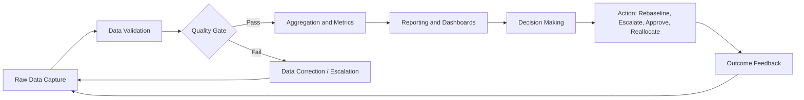
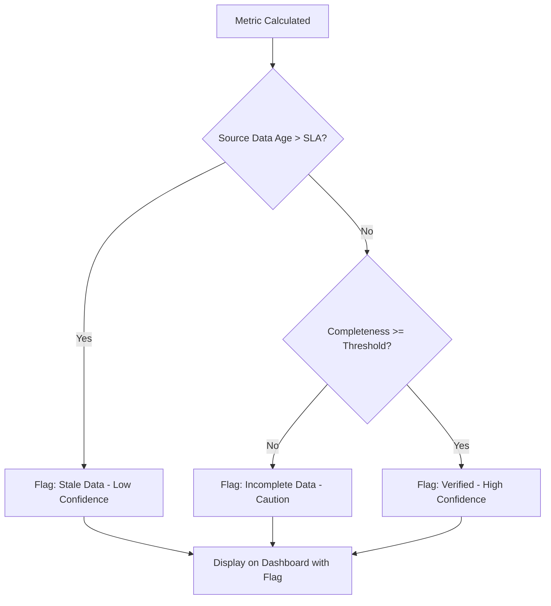

## Data Quality and Decision Making

### Overview

Data quality is the degree to which project data is accurate, complete, consistent, timely, and relevant for its intended use. In data-driven project management, decisions on scope, schedule, cost, and risk are only as reliable as the data feeding them. Poor data quality introduces systematic distortion into forecasts, status reports, and stakeholder communications, often without any visible warning sign until a decision fails.

### Why Data Quality Matters in Project Management

Project decisions — rebaselining a schedule, reallocating budget, escalating a risk, closing a milestone — are typically made using metrics such as earned value, velocity, defect rates, or resource utilization. These metrics are derivative: they are calculated from raw inputs like timesheets, status updates, test results, and financial postings. If the raw inputs are flawed, every downstream metric inherits that flaw, and confidence intervals on any resulting forecast become misleading.

**Key Points**

- Garbage-in-garbage-out applies directly to EVM, burndown charts, and risk registers.
- Data quality failures are often invisible until a decision made on bad data produces a visibly wrong outcome (missed deadline, budget overrun).
- Data quality is a governance responsibility, not solely a tooling problem — it involves people, process, and systems.

### Core Dimensions of Data Quality

#### Accuracy

The degree to which data correctly reflects the real-world state it represents. Example: a task marked "80% complete" that is actually 50% complete introduces inaccurate progress data.

#### Completeness

Whether all required data fields and records are present. Missing actuals for a subset of team members will understate total effort in a status report.

#### Consistency

Whether data is uniform across systems and time. If the finance system and the PM tool report different total spend for the same period, downstream cost variance calculations will conflict.

#### Timeliness

Whether data is current enough to support the decision being made. Weekly-updated status data used to make a daily go/no-go call is stale relative to the decision cadence.

#### Validity

Whether data conforms to defined formats, business rules, or ranges. A percent-complete field showing 120% violates a basic validity rule.

#### Uniqueness

Absence of unwanted duplication. Duplicate task entries in a work breakdown structure can double-count effort or cost.

#### Relevance

Whether the data collected actually supports the decision at hand. Collecting excessive vanity metrics dilutes attention from data that matters.

### Data Quality Dimensions Diagram (svg_diagram)

<svg xmlns="http://www.w3.org/2000/svg" viewBox="0 0 760 460">
<text x="380" y="30" text-anchor="middle" font-size="20" font-weight="bold" fill="#1a1a1a">Data Quality Dimensions (svg_diagram)</text>
<circle cx="380" cy="240" r="70" fill="#2c5aa0" opacity="0.15" stroke="#2c5aa0" stroke-width="2" />
<text x="380" y="235" text-anchor="middle" font-size="15" font-weight="bold" fill="#1a1a1a">Decision</text>
<text x="380" y="255" text-anchor="middle" font-size="15" font-weight="bold" fill="#1a1a1a">Quality</text>
<g font-size="13" fill="#1a1a1a">
<circle cx="380" cy="90" r="55" fill="#4c8bf5" opacity="0.85" />
<text x="380" y="94" text-anchor="middle" fill="#fff">Accuracy</text>



```
<circle cx="560" cy="150" r="55" fill="#5cb85c" opacity="0.85" />
<text x="560" y="154" text-anchor="middle" fill="#fff">Completeness</text>

<circle cx="600" cy="330" r="55" fill="#f0ad4e" opacity="0.85" />
<text x="600" y="334" text-anchor="middle" fill="#fff">Consistency</text>

<circle cx="450" cy="420" r="55" fill="#d9534f" opacity="0.85" />
<text x="450" y="424" text-anchor="middle" fill="#fff">Timeliness</text>

<circle cx="270" cy="420" r="55" fill="#5bc0de" opacity="0.85" />
<text x="270" y="424" text-anchor="middle" fill="#fff">Validity</text>

<circle cx="150" cy="330" r="55" fill="#9370db" opacity="0.85" />
<text x="150" y="334" text-anchor="middle" fill="#fff">Uniqueness</text>

<circle cx="180" cy="150" r="55" fill="#e07bb0" opacity="0.85" />
<text x="180" y="154" text-anchor="middle" fill="#fff">Relevance</text>
```

</g>
<g stroke="#999" stroke-width="1.5" opacity="0.6">
<line x1="380" y1="145" x2="380" y2="170" />
<line x1="520" y1="175" x2="440" y2="210" />
<line x1="555" y1="285" x2="450" y2="255" />
<line x1="440" y1="380" x2="410" y2="290" />
<line x1="320" y1="380" x2="350" y2="290" />
<line x1="200" y1="285" x2="310" y2="255" />
<line x1="230" y1="175" x2="320" y2="210" />
</g>
</svg>

### Data Quality in the Decision Pipeline



### Common Sources of Poor Project Data Quality

- **Manual entry errors**: timesheets, status percentages, and cost codes entered by hand are prone to typos and estimation bias.
- **Inconsistent definitions**: "done" meaning different things across teams (code complete vs. tested vs. deployed).
- **Tool fragmentation**: data scattered across a PM tool, a finance ERP, a ticketing system, and spreadsheets, with no single source of truth.
- **Optimism bias in self-reported status**: team members rounding progress upward.
- **Lagging updates**: status entered days after the actual event occurred.
- **Integration failures**: broken or misconfigured API syncs between systems silently dropping or duplicating records.
- **Lack of validation rules**: fields that accept out-of-range or malformed values (e.g., negative hours, future-dated actuals).

### Impact of Poor Data Quality on Key PM Metrics

| Metric | Data Quality Issue | Resulting Distortion |
| --- | --- | --- |
| Earned Value (EV) | Inaccurate percent-complete | Inflated Cost Performance Index (CPI) |
| Schedule Variance | Missing task-level actuals | Understated schedule slippage |
| Velocity (Agile) | Inconsistent story point estimation | Unreliable sprint forecasting |
| Risk Exposure | Stale risk register entries | Underestimated risk score |
| Resource Utilization | Duplicate timesheet entries | Overstated team capacity used |
| Defect Density | Incomplete test logging | Understated quality risk |

### Data Quality Metrics and Formulas

**Completeness Rate**

$$Completeness = \frac{Number\ of\ Populated\ Required\ Fields}{Total\ Number\ of\ Required\ Fields} \times 100$$

**Accuracy Rate** (requires a validated reference or audit sample)

$$Accuracy = \frac{Number\ of\ Correct\ Records}{Total\ Number\ of\ Records\ Audited} \times 100$$

**Data Timeliness Ratio**

$$Timeliness = \frac{Number\ of\ Records\ Updated\ Within\ SLA}{Total\ Number\ of\ Records} \times 100$$

Organizations commonly set a data quality threshold (e.g., 95% completeness, 98% accuracy) below which dashboards are flagged as unreliable for decision-making. [Inference] — specific threshold values vary widely by organization and are not standardized across the profession.

### Example: Data Quality Failure in Earned Value Management

A project team reports 90% completion on a task that is genuinely 60% complete, due to optimistic self-reporting.

- Planned Value (PV) = $50,000
- Reported Earned Value (EV) = 0.90 × $50,000 = $45,000
- Actual (correct) Earned Value = 0.60 × $50,000 = $30,000
- Reported CPI (using correct AC of $40,000) = $45,000 / $40,000 = 1.125 (appears healthy)
- Actual CPI = $30,000 / $40,000 = 0.75 (indicates real cost overrun)

The inflated percent-complete field masks a genuine cost performance problem, leading a project manager to defer corrective action until the gap becomes unrecoverable.

### Data Quality Framework for Project Management

#### 1. Define Data Standards

Establish clear field definitions, allowed value ranges, update frequency requirements, and ownership for each data element (e.g., "percent complete" must be updated weekly by the task owner using a defined rubric).

#### 2. Establish a Single Source of Truth

Designate authoritative systems for each data domain (e.g., ERP for actual cost, PM tool for schedule status) and enforce integration rather than parallel manual tracking.

#### 3. Implement Validation Rules

Apply automated checks at the point of entry: range checks, mandatory fields, cross-field logic (e.g., percent complete cannot exceed 100%, actual finish date cannot precede actual start date).

#### 4. Conduct Data Audits

Periodically sample records against source evidence (e.g., comparing reported hours against calendar or system logs) to calculate accuracy rates.

#### 5. Monitor Data Quality Metrics on a Dashboard

Track completeness, timeliness, and validity as first-class metrics alongside project performance metrics, not as an afterthought.

#### 6. Build a Data Quality Feedback Loop

When decisions made on flawed data produce poor outcomes, trace the failure back to its data source and correct the root cause (process, training, or system).

### Governance Roles in Data Quality

| Role | Responsibility |
| --- | --- |
| Data Owner | Accountable for accuracy and definition of a specific data domain |
| Data Steward | Day-to-day monitoring, cleansing, and issue resolution |
| Project Manager | Consumer and escalation point; ensures decisions account for known data quality issues |
| PMO / Governance Board | Sets organization-wide data standards and thresholds |

### Techniques for Improving Decision Confidence Despite Imperfect Data

- **Triangulation**: cross-check a metric using two independent data sources (e.g., verify reported progress against actual deliverable review status).
- **Confidence intervals and ranges**: present forecasts as ranges (e.g., "60–75% probability of on-time delivery") rather than false-precision point estimates when underlying data has known variance.
- **Sensitivity analysis**: test how much a decision would change if a suspect data point were materially different, to gauge how much the decision actually depends on questionable data.
- **Data quality flags in dashboards**: visually tag metrics derived from stale or incomplete data so decision-makers can apply appropriate skepticism.
- **Structured status reporting rubrics**: replace subjective percent-complete with objective criteria (e.g., discrete milestones: not started, in progress, in review, done) to reduce estimation bias.

### Example: Data Quality Flag Design Pattern



### Relationship to Agile and Predictive Approaches

In **predictive (waterfall) projects**, data quality issues most commonly surface in EVM inputs (percent complete, actual cost postings) and can propagate through formal baseline variance reporting for months before correction.

In **agile projects**, data quality issues commonly appear in story point estimation consistency and velocity calculation; a team that changes its estimation scale mid-project silently corrupts velocity trend data used for release forecasting.

In **hybrid environments**, reconciling data quality standards across a predictive schedule and an agile backlog (e.g., mapping story points to earned value) is a recurring integration challenge. [Inference] — the specific reconciliation approach depends heavily on organizational tooling and is not standardized.

### Common Pitfalls

- Treating data quality as an IT problem rather than a shared PM/organizational responsibility.
- Over-automating without validation, which can scale bad data faster than manual processes would.
- Chasing 100% data quality at the expense of timeliness — some latency/accuracy tradeoff is often necessary.
- Ignoring "silent" data quality issues (data that is technically present and validly formatted but semantically wrong, such as a correctly formatted but incorrect status).
- Failing to communicate known data quality limitations to stakeholders before they make decisions based on the data.

### Conclusion

Data quality is a foundational, not incidental, concern in data-driven project management. Every metric, forecast, and dashboard used to drive decisions is a function of underlying data integrity. Establishing data standards, validation rules, ownership, and feedback loops directly determines whether a project's data-driven decisions are trustworthy or merely appear precise while being systematically wrong.

**Related Topics**

- Earned Value Management (EVM) Fundamentals
- Key Performance Indicators (KPIs) for Project Management
- Project Dashboards and Reporting Design
- Root Cause Analysis for Metric Anomalies
- Data Governance Frameworks
- Agile Metrics: Velocity, Burndown, and Cumulative Flow
- Risk Register Management and Data Currency
- Statistical Forecasting in Project Management (Monte Carlo Simulation)