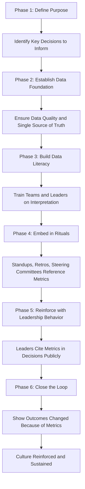

## Building a Metrics Driven Culture


### Overview

A metrics-driven culture is an organizational environment in which teams and leaders routinely use quantitative data — rather than intuition, hierarchy, or anecdote alone — to inform project decisions, evaluate performance, and drive continuous improvement. It is not merely the presence of dashboards; it is a set of shared behaviors, incentives, and norms that determine whether metrics are actually trusted and acted upon.

### Why This Matters

Organizations frequently invest heavily in metrics tooling (dashboards, BI platforms, reporting pipelines) without achieving the underlying behavioral shift. The result is "metrics theater" — data is displayed but not used to change decisions. Building a genuine metrics-driven culture closes the gap between having data and acting on it.

**Key Points**

- Tooling without cultural adoption produces dashboards nobody trusts or uses.
- Metrics-driven culture requires psychological safety; people must be able to report bad news in the data without fear of punitive consequences.
- Leadership behavior — specifically, whether leaders visibly use metrics in their own decisions — is the strongest predictor of whether teams adopt metrics-driven habits. [Inference] — this is a widely cited organizational-change observation rather than a universally quantified law.

### Core Pillars of a Metrics Driven Culture

#### 1. Clear Purpose and Alignment

Metrics must be tied to explicit organizational or project objectives (e.g., OKRs, strategic goals). Metrics collected without a clear decision they inform tend to be ignored or seen as busywork.

#### 2. Data Literacy

Team members and leaders need sufficient understanding to interpret metrics correctly — including their limitations — rather than over-trusting or misreading them (e.g., correlation vs. causation, sample size effects, lagging vs. leading indicators).

#### 3. Trust in Data Quality

As established in data quality practice, metrics must be reliable for people to act on them. Repeated exposure to inaccurate metrics erodes trust and causes reversion to gut-feel decision-making.

#### 4. Psychological Safety

People must feel safe reporting unfavorable metrics (schedule slippage, low velocity, high defect counts) without fear of blame, so that data reflects reality rather than a sanitized narrative.

#### 5. Accessibility and Transparency

Metrics should be visible to the people who need them, in a format they can interpret, at a cadence that matches the decision being made.

#### 6. Actionability

Every regularly reviewed metric should be tied to a decision or action pathway; metrics with no associated action tend to be deprioritized over time.

#### 7. Leadership Modeling

Leaders must visibly reference and use metrics in their own decision-making and communications to reinforce that the organization genuinely values data over anecdote.

### Metrics Driven Culture Model (svg_diagram)

<svg xmlns="http://www.w3.org/2000/svg" viewBox="0 0 760 420">
<text x="380" y="30" text-anchor="middle" font-size="20" font-weight="bold" fill="#1a1a1a">Pillars of a Metrics-Driven Culture (svg_diagram)</text>
<rect x="300" y="330" width="160" height="50" rx="8" fill="#2c5aa0" />
<text x="380" y="360" text-anchor="middle" font-size="14" fill="#fff" font-weight="bold">Foundation: Trust</text>
<g font-size="12" fill="#fff">
<rect x="40" y="240" width="150" height="60" rx="8" fill="#4c8bf5" />
<text x="115" y="265" text-anchor="middle">Clear Purpose</text>
<text x="115" y="283" text-anchor="middle">and Alignment</text>



```
<rect x="210" y="240" width="150" height="60" rx="8" fill="#5cb85c" />
<text x="285" y="265" text-anchor="middle">Data</text>
<text x="285" y="283" text-anchor="middle">Literacy</text>

<rect x="400" y="240" width="150" height="60" rx="8" fill="#f0ad4e" />
<text x="475" y="265" text-anchor="middle">Psychological</text>
<text x="475" y="283" text-anchor="middle">Safety</text>

<rect x="570" y="240" width="150" height="60" rx="8" fill="#d9534f" />
<text x="645" y="265" text-anchor="middle">Transparency</text>
<text x="645" y="283" text-anchor="middle">and Access</text>
```

</g>
<rect x="220" y="140" width="330" height="60" rx="8" fill="#9370db" />
<text x="385" y="165" text-anchor="middle" font-size="13" fill="#fff" font-weight="bold">Actionability: Every Metric Tied to a Decision</text>
<text x="385" y="183" text-anchor="middle" font-size="13" fill="#fff" font-weight="bold">or Action Pathway</text>
<rect x="240" y="60" width="290" height="55" rx="8" fill="#e07bb0" />
<text x="385" y="90" text-anchor="middle" font-size="14" fill="#fff" font-weight="bold">Leadership Modeling</text>
<text x="385" y="108" text-anchor="middle" font-size="13" fill="#fff">(Visible Data-Driven Behavior)</text>
<g stroke="#999" stroke-width="1.5" opacity="0.6">
<line x1="380" y1="330" x2="380" y2="300" />
<line x1="115" y1="240" x2="200" y2="210" />
<line x1="285" y1="240" x2="300" y2="210" />
<line x1="475" y1="240" x2="460" y2="210" />
<line x1="645" y1="240" x2="560" y2="210" />
<line x1="385" y1="140" x2="385" y2="115" />
</g>
</svg>

### Building the Culture: A Phased Approach



### Practical Techniques for Embedding Metrics into Team Rituals

- **Daily standups**: reference burndown or flow metrics briefly rather than only status narratives.
- **Sprint/iteration reviews**: present velocity trends, cycle time, and defect escape rate alongside demo content.
- **Retrospectives**: use metrics (e.g., cycle time distribution, rework rate) as a discussion starting point rather than relying solely on subjective recall.
- **Steering committee / governance reviews**: require EVM or KPI data as the basis for status reporting, not narrative-only updates.
- **One-on-ones**: managers reference relevant individual or team metrics (with care to avoid weaponizing them) to guide coaching conversations.

### Example: Embedding a Metric into a Team Ritual

A software delivery team introduces **cycle time** (time from work-start to done) as a standing agenda item in its bi-weekly retrospective.

- Week 1–4: Cycle time displayed but not discussed in depth; team treats it as background information.
- Week 5: Facilitator asks the team to identify the single longest-cycle-time item from the past two weeks and discuss the bottleneck.
- Week 6 onward: Team proactively flags items at risk of long cycle time during standups, referencing the same metric.
- Result: Cycle time becomes a shared vocabulary term the team uses to self-manage flow, rather than a number reported upward only.

This illustrates the shift from **passive metric exposure** to **active metric use** — the defining marker of cultural adoption. [Inference] — outcome magnitude and adoption speed vary by team maturity and are not guaranteed.

### Anti-Patterns That Undermine Metrics Driven Culture

| Anti-Pattern | Description | Consequence |
| --- | --- | --- |
| Vanity metrics | Tracking numbers that look good but don't inform decisions (e.g., lines of code) | Erodes credibility of the metrics program |
| Metric weaponization | Using individual-level metrics punitively (e.g., ranking developers by commit count) | Drives gaming of data and fear-based reporting |
| Dashboard sprawl | Too many uncurated dashboards with no clear owner or purpose | Metric fatigue; nobody checks any of them |
| Vanity reporting upward only | Metrics only flow to leadership, never back to the team | Team disengagement from data collection |
| One-time rollout | Metrics program launched once with no reinforcement | Adoption decays within a few months |
| Ignoring data quality | Rolling out metrics before establishing trustworthy inputs | Immediate erosion of trust; hard to recover |

### Leading vs. Lagging Indicators in Culture Building

Effective metrics-driven cultures balance both:

- **Lagging indicators** (e.g., on-time delivery rate, budget variance) confirm outcomes after the fact — useful for accountability and retrospective learning.
- **Leading indicators** (e.g., code review turnaround time, blocked-task count, risk trend) predict future outcomes and are more actionable in-flight, since they allow intervention before an outcome is locked in.

A culture overly reliant on lagging indicators tends to become reactive; incorporating leading indicators enables proactive management.

### Governance and Incentive Alignment

- Align performance reviews and team incentives with metrics that reflect genuinely desired outcomes (e.g., customer-facing quality, delivery predictability) rather than easily gamed proxies (e.g., raw ticket count).
- Establish a clear escalation path when metrics reveal a problem, so that visibility translates into organizational response rather than silent tolerance.
- Rotate ownership of metric definitions periodically to prevent stagnation and ensure continued relevance as project context evolves.

### Measuring the Culture Itself

Organizations can assess metrics-driven maturity using indicators such as:

- Percentage of key decisions with a documented metrics-based rationale.
- Frequency of metric references in retrospectives, standups, and steering reviews.
- Time lag between a metric signaling a problem and a corrective action being taken.
- Employee survey responses on trust in reported data and willingness to report unfavorable metrics.

$$Metric\ Adoption\ Rate = \frac{Decisions\ Citing\ Metrics}{Total\ Decisions\ Reviewed} \times 100$$

### Common Pitfalls

- Assuming a BI tool rollout alone constitutes a "metrics-driven culture."
- Overloading teams with too many metrics simultaneously, causing fatigue and disengagement.
- Failing to address data quality before promoting broad metric usage, causing early credibility loss.
- Allowing metrics to become punitive, which incentivizes gaming rather than genuine improvement.
- Not revisiting or retiring metrics that are no longer relevant to current objectives.
- Treating culture-building as a one-time initiative rather than a sustained leadership practice.

### Conclusion

Building a metrics-driven culture is fundamentally a change-management effort layered on top of a technical measurement capability. It requires trustworthy data, clear purpose, psychological safety, embedded rituals, and — most critically — visible leadership behavior that demonstrates metrics genuinely inform decisions. Absent these elements, even the most sophisticated dashboard infrastructure fails to shift how an organization actually makes decisions.

**Related Topics**

- Data Quality and Decision Making
- Key Performance Indicators (KPIs) for Project Management
- OKRs (Objectives and Key Results) in Project Governance
- Psychological Safety in High-Performing Teams
- Agile Metrics: Velocity, Cycle Time, and Flow
- Change Management for Organizational Adoption
- Dashboard and Reporting Design Best Practices
- Performance Management and Incentive Alignment