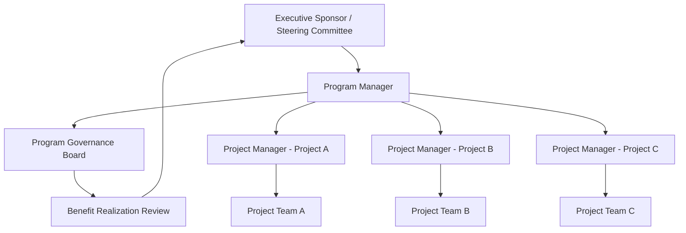

## Program versus Project Management

### Overview

Program management and project management are related but distinct disciplines within organizational delivery. A project is a temporary endeavor with a defined scope, timeline, and deliverable, while a program is a group of related projects, subprograms, and program activities managed in a coordinated way to obtain benefits not available from managing them individually. Understanding the distinction is essential for correctly structuring governance, roles, and success criteria.

### Core Definitions

**Project**: A temporary endeavor undertaken to create a unique product, service, or result, with a defined beginning and end, and specific scope and resources.

**Program**: A group of related projects, subsidiary programs, and program activities managed in a coordinated manner to obtain benefits not available from managing them individually.

**Portfolio** (for contrast): A collection of projects, programs, subsidiary portfolios, and operations managed as a group to achieve strategic objectives; portfolios are typically broader in scope than programs and are not necessarily related to one another.

### Key Points

- Projects focus on delivering specific outputs (deliverables); programs focus on delivering strategic outcomes and benefits.
- A program's success is measured by realized benefits, not solely by on-time/on-budget delivery of individual components.
- Program management requires managing interdependencies between projects, which is not typically a concern within a single project's scope.
- Program managers operate at a higher level of ambiguity and longer time horizon than project managers.

### Comparative Framework

| Dimension | Project Management | Program Management |
| --- | --- | --- |
| Scope | Defined, bounded deliverable(s) | Broader, evolving set of related deliverables |
| Time Horizon | Fixed start and end date | Often longer, sometimes open-ended until benefits are realized |
| Success Measure | On-time, on-budget, meets specifications | Realized strategic benefits and value |
| Focus | Producing outputs (deliverables) | Delivering outcomes (benefits) |
| Change Tolerance | Managed via formal change control to protect baseline | Expected and often embraced to maximize benefit realization |
| Interdependency Management | Limited to within-project tasks | Actively manages dependencies across multiple projects |
| Stakeholder Complexity | Moderate, project-specific stakeholders | High, spans multiple business units and sponsors |
| Governance | Project steering committee or sponsor | Program governance board, often multi-tiered |
| Risk Focus | Risks to project deliverables | Risks to overall benefit realization and cross-project impacts |
| Metrics | Schedule variance, cost variance, quality metrics | Benefit realization rate, strategic alignment score, cross-project risk exposure |

### Structural Relationship Diagram (svg_diagram)

<svg xmlns="http://www.w3.org/2000/svg" viewBox="0 0 760 420">
<text x="380" y="30" text-anchor="middle" font-size="20" font-weight="bold" fill="#1a1a1a">Portfolio, Program, and Project Relationship (svg_diagram)</text>
<rect x="180" y="60" width="400" height="70" rx="8" fill="#2c5aa0" />
<text x="380" y="90" text-anchor="middle" font-size="15" fill="#fff" font-weight="bold">Portfolio</text>
<text x="380" y="110" text-anchor="middle" font-size="12" fill="#fff">Strategic Alignment Across Programs/Projects</text>
<rect x="220" y="170" width="320" height="70" rx="8" fill="#4c8bf5" />
<text x="380" y="200" text-anchor="middle" font-size="15" fill="#fff" font-weight="bold">Program</text>
<text x="380" y="220" text-anchor="middle" font-size="12" fill="#fff">Coordinated Benefit Realization</text>
<g font-size="12" fill="#fff">
<rect x="60" y="300" width="150" height="70" rx="8" fill="#5cb85c" />
<text x="135" y="330" text-anchor="middle" font-weight="bold">Project A</text>
<text x="135" y="348" text-anchor="middle">Deliverable Output</text>



```
<rect x="230" y="300" width="150" height="70" rx="8" fill="#5cb85c" />
<text x="305" y="330" text-anchor="middle" font-weight="bold">Project B</text>
<text x="305" y="348" text-anchor="middle">Deliverable Output</text>

<rect x="400" y="300" width="150" height="70" rx="8" fill="#5cb85c" />
<text x="475" y="330" text-anchor="middle" font-weight="bold">Project C</text>
<text x="475" y="348" text-anchor="middle">Deliverable Output</text>

<rect x="570" y="300" width="150" height="70" rx="8" fill="#f0ad4e" />
<text x="645" y="330" text-anchor="middle" font-weight="bold">Subprogram</text>
<text x="645" y="348" text-anchor="middle">Related Projects</text>
```

</g>
<g stroke="#999" stroke-width="1.5" opacity="0.6">
<line x1="380" y1="130" x2="380" y2="170" />
<line x1="135" y1="300" x2="300" y2="240" />
<line x1="305" y1="300" x2="350" y2="240" />
<line x1="475" y1="300" x2="420" y2="240" />
<line x1="645" y1="300" x2="460" y2="230" />
</g>
</svg>

### Governance and Organizational Structure



### Role Comparison

#### Project Manager Responsibilities

- Defines and manages project scope, schedule, budget, and quality baseline.
- Manages day-to-day execution, task assignments, and team performance.
- Controls change through a formal change control process to protect the approved baseline.
- Reports status against the triple constraint (scope, time, cost) plus quality.
- Escalates risks and issues that exceed project-level authority.

#### Program Manager Responsibilities

- Defines and tracks the program's benefit realization plan.
- Manages interdependencies, shared resources, and conflicts across constituent projects.
- Aligns program objectives with organizational strategy, often engaging directly with executive sponsors.
- Manages program-level risk that spans multiple projects (e.g., a delay in Project A cascading into Project B's start date).
- Makes trade-off decisions across projects to maximize overall program benefit, sometimes at the expense of an individual project's local optimum.
- Governs program-level change requests that affect multiple projects or the overall benefit case.

### Example: Distinguishing Project vs. Program Scope

**Scenario**: A retail company wants to modernize its customer experience.

- **Project-level view**: "Build and launch a new mobile app" is a project — it has a defined scope, a deliverable (the app), a timeline, and a budget.
- **Program-level view**: "Digital Customer Experience Transformation" is a program — it includes the mobile app project, a website redesign project, a loyalty platform integration project, and a customer data platform project. The program manager coordinates these projects because they share dependencies (e.g., all rely on the same customer data platform) and because the organization's real objective — improved customer retention and lifetime value — can only be measured across all of them together, not from any single project's completion.

This illustrates the core distinction: the mobile app project succeeds when it ships on time, on budget, meeting specifications. The program succeeds only when customer retention metrics improve, which may require months of operation after all constituent projects are technically complete.

### When to Use Program Management vs. Project Management

**Use project management when:**

- The work has a single, well-defined deliverable.
- Success can be measured by the triple constraint alone.
- There are minimal dependencies on other concurrent initiatives.

**Use program management when:**

- Multiple related projects must be coordinated to achieve a shared strategic outcome.
- Benefits only materialize after multiple projects are combined or sequenced.
- Significant interdependencies, shared resources, or cross-project risks exist.
- The initiative spans multiple business units or requires sustained executive sponsorship over an extended period.

### Metrics Distinction

**Project Metrics** (deliverable-focused):

- Schedule Variance (SV), Cost Variance (CV)
- Percent complete against baseline
- Defect/quality metrics
- Scope change count

**Program Metrics** (benefit-focused):

- Benefit Realization Rate: $\frac{Benefits\ Realized}{Benefits\ Planned} \times 100$
- Strategic alignment score (qualitative or weighted scorecard)
- Cross-project risk exposure index
- Resource contention rate across constituent projects
- Time-to-benefit (duration from program initiation to first measurable benefit)

### Common Pitfalls

- Treating a program as "one large project," leading to a single monolithic schedule that cannot accommodate independent project-level changes.
- Assigning a project manager to run a program without adjusting authority, scope of governance, or success metrics.
- Measuring program success purely by whether constituent projects finished on time, ignoring whether benefits were actually realized.
- Failing to establish program-level governance for cross-project trade-off decisions, leaving conflicts unresolved between project managers.
- Underestimating the ongoing nature of program benefit tracking, which frequently continues after constituent projects close.

### Conclusion

Project management is oriented toward the disciplined delivery of a specific, bounded output, while program management is oriented toward coordinating multiple related efforts to realize a broader strategic benefit. The two disciplines require different governance structures, metrics, time horizons, and skill emphases — recognizing which one an initiative requires is foundational to structuring it correctly and setting appropriate success criteria.

**Related Topics**

- Portfolio Management Fundamentals
- Benefit Realization Management
- Program Governance Structures
- Managing Interdependencies Across Projects
- Stakeholder Management at the Program Level
- Organizational Project Management Maturity (OPM3)
- Program Risk Management
- Strategic Alignment and Business Case Development